## C语言学习课程


> 指趣学院  从零玩转C语言+项目实战 http://www.it666.com/course/2
>
> 浙江大学C语言程序设计 https://www.bilibili.com/video/av39519145 
>
> C语言程序设计CAP https://www.icourse163.org/course/ZJU-1001614008
>
> 轻松掌握C语言视频教程 C语言提高深入浅出 itheima


## 运算符优先级


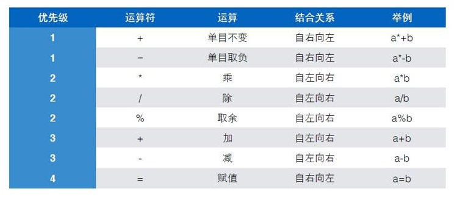

### 单目运算符

只有一个算子的运算符

```c
int a = 10;
int b = -20;
printf("%d", a * -b);
```

### 赋值运算符

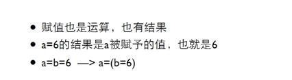

```c
int a = 10;
int b = -20;
printf("%d", a = -b);
```

### 递增递减运算符

前缀后缀


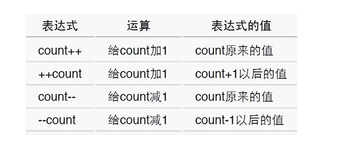

### 关系运算符

所有的关系运算符的优先级比算术运算的低，但是比赋值运算的高。

```c
7 >= 3 + 4
```

判断是否相等的==和!＝的优先级比其他的低，而连续的关系运算是从左到右进行的。

```c
5 > 3 == 6 > 4
6 > 5 > 4
```

### 强制类型转换

强制类型转换的优先级高于四则运算。

### sizeof

是一个运算符，给出某个类型或变量在内存中所占据的字节数。

是静态运算符，它的结果在编译时刻就决定了。

不要在sizeof的括号里做运算，这些运算不会做的。

### -1的补码

```
-1的补码：最高位不变，其它位取反加1
负数，最高位是1，原码就是：1000 0000 0000 0001
补码：1111 1111 1111 1110 再加上1 = 1111 1111 1111 1111 即16进制的FFFF
```

### 整数范围

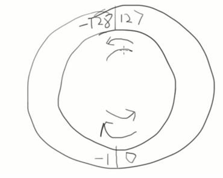

```
对于一个字节（8位），可以表达的是：00000000 - 11111111
其中 00000000 —> 0  
11111111 ~ 10000000 —> -1 ~ -128 
00000001 ~ 01111111 —> 1 ~ 127
```

### unsigned

在整形类型前加上unsigned使得它们成为无符号的整数。内部的二进制表达没变，变的是如何看待它们。

### 浮点的输入输出

| 类型   | 输入 | 输出   |
| ------ | ---- | ------ |
| float  | %f   | %f, %e |
| double | %lf  | %f, %e |

### 浮点数的内部表达

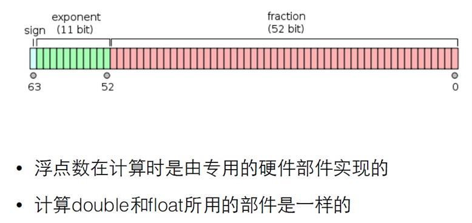

### 字符

计算

```
一个字符加一个数字得到ASCII码表中那个数之后的字符
两个字符的减，得到它们在表中的距离
```

字母在ASCII表中是顺序排列的，大写字母和小写字母是分开排列的，并不在一起‘a’-‘A’可以得到两段之间的距离。

于是 a+’a’-‘A”可以把一个大写字母变成小写字母，而a+’A’-‘a’可以把一个小写字母变成大写字母。

### 逻辑运算符

```
! > && > ||
```

### 逗号运算符

逗号用来连接两个表达式，并以其右边的表达式的值作为它的结果。逗号的优先级是所有的运算符中最低的，所以它两边的表达式会先计算；逗号的组合关系是自左向右，所以左边的表达式会先计算，而右边的表达式的值就留下来作为逗号运算的结果。

### 猜数字

```c
#include <stdio.h>
#include <stdlib.h>
#include <time.h>

int main() {
	srand(time(0));
	int number = rand()%100+1;
	int count = 0;
	int a = 0;
	printf("我已经想好了一个1到100之间的数\n");
	do {
		printf("请猜这个1到100之间数\n");
		scanf("%d", &a);
		count ++;
		if ( a > number ) 
		{
			printf("你猜的数大了\n");
		} 
		else if ( a < number ) 
		{
			printf("你猜的数小了\n");
		}

	} while (a != number);
	printf("太好了，你猜了%d次猜到了答案%d\n", count,number);
	return 0;
}
```

### 整数逆序

```c
#include <stdio.h>

int main() {
	int x;
	scanf("%d", &x);
	int digit;

	while ( x > 0 ) {
		digit = x%10;
		printf("%d", digit);
		x /= 10;
	}

	return 0;
}
```

```c
#include <stdio.h>

int main() {
	int x;
	scanf("%d", &x);
	int digit;
	int ret = 0;

	while ( x > 0 ) {
		digit = x%10;
		ret = ret*10 + digit;
		//printf("x=%d,digit=%d,ret=%d\n", x, digit, ret);
		x /= 10;
	}
	printf("%d", ret);

	return 0;
}
```

### 阶乘

```c
#include <stdio.h>

int main() {
	int x;
	scanf("%d", &x);
	int fact = 1;
	int i;
	for (i=x; i>1; i--) {
		fact *= i;
	}
	printf("%d的阶乘=%d",x,fact);
	return 0;
}
```

```c
#include <stdio.h>

int main() {
	int x;
	scanf("%d", &x);
	int fact = 1;
	int i=1;
	while(i<=x) {
		fact*=i;
		i++;
	}
	printf("%d的阶乘=%d",x,fact);
	return 0;
}
```

### 素数

```c
#include <stdio.h>

int main() 
{
	int x;

	scanf("%d", &x);

	int i;
	
	int isPrime = 1;

	for (i=2; i<x; i++) 
	{
		if (x % i == 0) 
		{
			isPrime = 0;
			break;
		}
	}
	if (isPrime==1) 
	{
		printf("是素数\n");
	} 
	else 
	{
		printf("不是素数\n");
	}
	return 0;
}
```

```c
#include <stdio.h>

int main() 
{
    int x;
    
	int cnt = 0; 
	
    for (x=1; cnt<50; x++)

	{
    	int i;
    	
    	int isPrime = 1;

        for (i=2; i<x; i++)
        {
            if (x % i == 0)
            {
                isPrime = 0;
                
                break;
            }
        }

        if (isPrime==1)
        {
            printf("%d\t",x);

            cnt++;
            
			if (cnt%5==0)
			{
				printf("\n");
			} 
        }
    }

	return 0;

}
```

```c
#include <stdio.h>
#include <math.h>

int isPrime(int x);

int main()
{
    int x;

    scanf("%d", &x);

    if (isPrime(x))
    {
        printf("%d是素数\n",x);
    }
    else
    {
        printf("%d不是素数\n",x);
    }

    return 0;
}


int isPrime(int x)
{
    int ret = 1;

    int i;

    if (x==1 || (x%2==0 && x!=2))
    {
        ret = 0;
    }
    else
    {
        double tmp = x;
        
        for (i=3; i<=sqrt(tmp); i++)
        {
            if( x%i==0 )
            {
                ret = 0;

                break;
            }
        }
    }


    return ret;
}
```


### 数硬币

```c
#include <stdio.h>

int main()
{
	int x;
	int one, two, five;
	int exit = 0;
	
	scanf("%d", &x);
	for ( one = 1; one < x*10; one++ ) {
		for ( two = 1; two < x*10/2; two++ ) {
			for ( five = 1; five < x*10/5; five++ ) {
				if ( one + two*2 + five*5 == x*10 ) {
					printf("可以用%d个1角加%d个2角加%d个5角得到%d元\n", 
						one, two, five, x);
//					exit = 1;
//					break;
				}
			}
//			if ( exit ) break;
		}
//		if ( exit ) break;
	}
	
	return 0;
}
```


```c
#include <stdio.h>

int main()
{
	int x;
	int one, two, five;
	int exit = 0;
	
	scanf("%d", &x);
	for ( one = 1; one < x*10; one++ ) {
		for ( two = 1; two < x*10/2; two++ ) {
			for ( five = 1; five < x*10/5; five++ ) {
				if ( one + two*2 + five*5 == x*10 ) {
					printf("可以用%d个1角加%d个2角加%d个5角得到%d元\n", 
						one, two, five, x);
					goto out;
				}
			}
		}
	}
	out: 
		return 0;
}
```

### 前n项之和


```c
#include <stdio.h>

int main()
{
    int n;
    int i;
    double sum = 0.0;
    double sign = 1.0;

    scanf("%d",&n);

    for(i=1; i<=n; i++){

        sum += sign/i;
//        sign = -sign;
    }

    printf("f(%d)=%f\n",n,sum);

    return 0;
}
```

### 整数分解

```c
#include <stdio.h>

int main()
{
    int x;

    scanf("%d", &x);

    int mask = 1;

    int tmp = x;

    while (tmp>9)
    {
       tmp /= 10;

       mask *= 10;
    }

//    printf("x=%d,mask=%d\n",x,mask);

    do
    {
        int d = x / mask;
        printf("%d",d);
        if (mask>9)
        {
            printf(" ");
        }
        x %= mask;
        mask /= 10;
    }   while (mask>0);
    printf("\n");

    return 0;
}
```

### 最大公约数

枚举

```c
#include <stdio.h>

int main()
{
    int a, b;

    scanf("%d %d", &a,&b);

    int min =  a < b ? a : b ;

    int ret = 0;

    for(int i=1; i<=min; i++)
    {
        if (a%i==0 && b%i==0)
        {
            ret = i;
        }
    }
    
    printf("%d 和%d 最大公约数 %d",a,b,ret);

    return 0;
}
```

辗转相除

```c
#include <stdio.h>

int main()
{
    int a, b, t;

    scanf("%d %d", &a,&b);

    while (b != 0)
    {
        t = a % b;
        
        a = b;
        
        b = t;

    }

    printf("最大公约数 %d\n", a);

    return 0;
}
```

### 整数集

```c
#include <stdio.h>

int main()
{
    int a;
    
    int cnt = 0;
    
    scanf("%d", &a);

    for(int i=a; i<=a+3; i++)
    {
        for (int j=a; j<=a+3; j++)
        {
            for(int k=a; k<=a+3; k++)
            {
                if (i!=j && i!=k && j!=k)
                {
                    cnt++;
                    
                    printf("%d%d%d", i, j, k);
                    
                    if (cnt %6 == 0)
                    {
                        printf("\n");

                    }
                    else 
                    {
                        printf(" ");
                    }

                }

            }

        }

    }

    return 0;
}
```

### 水仙花数

```c
#include <stdio.h>
#include <math.h>

int main()
{
    int n;

    int first = 1;

    scanf("%d", &n);

    for (int i=1; i<n; i++)
    {
        first *= 10;
    }

    for (int j = first; j < first*10; j++)
    {
        int sum = 0;

        int tmp = j;

        do
        {
            int d = tmp % 10;

            tmp /= 10;

            int res = pow(d, n);

            sum += res;

        } while (tmp>0);

        if (sum == j)
        {
            printf("%d\n", j);
        }

    }

    return 0;
}
```

### 九九乘法表

```c
#include <stdio.h>
#include <math.h>

int main()
{
    int i = 1;

    while (i<=9)
    {

        int j = 1;

        while (j<=i)
        {

            printf("%d*%d=%d", j, i, j*i);
            if (i*j<10)
            {
                printf("   ");
            }
            else
            {
                printf("  ");
            }
            j++;
        }

        printf("\n");

        i++;
    }
    return 0;
}
```

### 统计素数求和

```c
#include <stdio.h>

int main()
{
    int m, n, i;
    int cnt = 0;
    int sum = 0;

    scanf("%d %d", &m, &n);

    if (m==1)
    {
        m = 2;
    }

    for (i=m; i<=n; i++){

        int isPrime = 1;
        int j;

        for(j=2; j<i; j++)
        {

            if (i%j==0)
            {
                isPrime = 0;
                break;
            }
        }
        if (isPrime)
        {
            cnt++;
            sum += i;
            printf("Prime Number %d\n",i);
        }

    }
    
    printf("%d %d ", cnt, sum);
    
    return 0;
}
```

### n项求和

```c
#include <stdio.h>

int main()
{
   int n;

   scanf("%d",&n);

   double dividend,divisor;
   double temp;
   double sum = 0.0;

   dividend = 2;
   divisor = 1;

   int i;
   
   for(i=1; i<=n; i++)
   {
       sum += dividend/divisor;
       //printf("%f/%f=%f\n",dividend,divisor,dividend/divisor);
       temp = dividend;
       dividend += divisor;
       divisor = temp;

   }
   printf("%.2f\n", sum);

   return 0;
}
```

### 念数字

```c
#include <stdio.h>

int main()
{
    int x;

    scanf("%d",&x);

    if (x<0)
    {
        printf("fu");
        x = -x;
    }

    int mask = 1;

    int temp = x;

    while (temp>9)
    {
      temp /= 10;
      mask *= 10;
    }

    do
    {
        int d = x / mask;
        
        switch (d) {
        case 0:printf("ling");break;
        case 1:printf("yi");break;
        case 2:printf("er");break;
        case 3:printf("san");break;
        case 4:printf("si");break;
        case 5:printf("wu");break;
        case 6:printf("liu");break;
        case 7:printf("qi");break;
        case 8:printf("ba");break;
        case 9:printf("jiu");break;
        }
        
    if (mask>9) printf(" ");
    
    x %= mask;
    
    mask /= 10;
    
    } while(mask>0);

    printf("\n");
    
    return 0;
}
```

### 求a得连续和

```c
#include <stdio.h>

int main()
{
    int a,n;
    scanf("%d %d",&a,&n);

    int sum = 0;
    int t = 0;
    int i;

    for (i=1; i<=n; i++)
    {
        t = t*10+a;
        sum += t;
        
        if (i==n)
        {
            printf("%d=",t);
        }
        else
        {
            printf("%d+",t);
        }
    }
    printf("%d\n",sum);
    
    return 0;
}
```
### 数组


```c
#include <stdio.h>


int main()
{
    int x;
    double sum = 0.0;
    int cnt = 0;
    int number[100];

    scanf("%d",&x);

    while (x != -1)
    {
        number[cnt] = x;
        /*
        printf("%d\t", cnt);

        for (int i=0; i<=cnt; i++)
        {
            printf("%d\t", number[i]);
        }
        */
        sum += x;
        cnt ++;
        scanf("%d",&x);
    }

    if ( cnt>0 )
    {
        int i;
        double average = sum/cnt;
        //printf("sum=%f\n", sum);
        //printf("cnt=%d\n", cnt);
        //printf("average=%f\n", average);
        for (i=0; i<cnt; i++)
        {
            if (number[i]>average)
            {
                printf("%d ", number[i]);
            }
        }
        printf("\n");
    }
    return 0;
}
```

```c
#include <stdio.h>


int main()
{
    const int number = 10;

    int x;

    int count[number];

    for (int i=0; i<number; i++)
    {
        count[i] = 0;
    }

    scanf("%d", &x);

    while (x != -1) {
        if (x>=0 && x<=9)
        {
            count[x]++;
        }
        scanf("%d", &x);
    }

    for (int i=0;i<number;i++)
    {
        printf("%d:%d\n",i,count[i]);
    }
    return 0;
}
```

### 查找

找出key在数组中的位置

```c
#include <stdio.h>

int search(int num, int a[], int length);

int main()
{
    int a[] = {0,1,2,9,8,7,4,5,6,3,10};

    int x;

    printf("entering the number you want to search(0-10)\n");

    scanf("%d",&x);

    int index = search(x, a, sizeof(a)/sizeof(a[0]));

    if (index != -1)
    {
        printf("found %d in %d index \n",x,index);
    }
    else
    {
      printf("%d not found\n",x);
    }

    return 0;
}

int search(int num, int a[], int length)
{
    int ret = -1;

    for (int i=0; i<length; i++)
    {
        if (a[i] == num)
        {
            ret = i;
            break;
        }
    }
    return ret;
}
```

### 素数表

```c
#include <stdio.h>


int main()
{
    const int number = 100;
    int prime[100] = {2};
    int count = 1;
    int i = 3;

    while (count<number)
    {
        if (isPrime(i, prime, count))
        {
            prime[count++] = i;
        }
        i++;
    }

    for (i=0; i<number; i++)
    {
        printf("%d", prime[i]);
        if((i+1)%5)
        {
            printf("\t");
        }
        else
        {
            printf("\n");
        }
    }
    return 0;
}

int isPrime(int x, int KnownPrimes[], int numberOfKnownPrimes)
{
    int ret = 1;
    int i;

    for (i=0; i<numberOfKnownPrimes; i++)
    {
        if (x%KnownPrimes[i]==0)
        {
            ret = 0;
            break;
        }
    }
    return ret;
}
```

```c
#include <stdio.h>


int main()
{
    const int maxNumber = 25;
    int isPrime[maxNumber];

    int i;
    int x;

    for (i=0; i<maxNumber; i++)
    {
        isPrime[i] = 1;
    }

    for (x=2; x<maxNumber; x++)
    {
        if (isPrime[x])
        {
            for (i=2; i*x<maxNumber; i++)
            {
                isPrime[i*x] = 0;
            }
        }
    }

    for (i=2; i<maxNumber; i++)
    {
        if (isPrime[i])
        {
         printf("%d\t",i);
        }
    }
    
    printf("\n");
    
    return 0;
}
```

### 指针

```c
#include <stdio.h>


void swap(int* a,int* b);

int main()
{
    int a = 555;
    int b = 666;
    
    swap(&a, &b);

    printf("%d,%d\n",a,b);
    
    return 0;
}

void swap(int* a,int* b)
{
    int tmp = *a;
    *a = *b;
    *b = tmp;
}
```

### const

指针是const

```c
// 表示一旦得到了某个变量的地址，不能再指向其他变量。
int i = 199;
int j = 299;

int* const p = &i;

printf("%d\n", i);

//    p = &j; // error
*p = 399; // ok

printf("%d\n", i);

return 0;
```

所指是const

```c
// 表示不能通过这个指针去修改那个变量
int i = 199;

int j = 299;

const int* p = &i;

printf("%d\n", *p);

p = &j; // ok
//*p = 26; //error
printf("%d\n",*p);
```

```
数组变量是const的指针，所以不能被赋值
int a[] <==> int * const a=…
```


### 指针应用

```c
#include <stdio.h>


void minmax(int a[], int len, int *min, int *max);

int main()
{
    int a[] ={100,90,80,70,0,1,2,3,789};

    int min, max;

    minmax(a, sizeof(a)/sizeof(a[0]), &min, &max);

    printf("min=%d,max=%d\n", min, max);

    return 0;
}

void minmax(int a[], int len, int *min, int *max)
{
    int i;

    *min = *max = a[0];

    for (i=1; i<len; i++)
    {
        if (a[i]< *min)
        {
            *min = a[i];
        }
        if (a[i]> *max)
        {
            *max = a[i];
        }
    }
}
```

### 动态申请内存


```c
#include <stdio.h>
#include <stdlib.h>

int main()
{
    int number;
    int *a;
    int i;

    printf("请输入数量\n");

    scanf("%d", &number);

    a = (int*)malloc(number*(sizeof(int)));

    for (i=0; i<number; i++)
    {
        scanf("%d", &a[i]);
    }

    for (i=number-1; i>=0; i--)
    {
        printf("%d ", a[i]);
    }

    free(a);

    return 0;
}
```

```C
#include <stdio.h>
#include <stdlib.h>

int main()
{
    void *p;
    int cnt = 0;

    while ((p=malloc(100*1024*1024)))
    {
        cnt++;
    }
    printf("分配了%d00MB的空间", cnt);
    return 0;
}
```

### putchar getchar

```c
#include <stdio.h>
#include <stdlib.h>

int main()
{
   int ch;

   while ((ch=getchar())!= EOF)
   {
       putchar(ch);
   }

   printf("EOF\n");

   return 0;
}

```

### strlen

```c
size_t mylen(const char*s)
{
    int index = 0;
    while (s[index])
    {
        index++;
    }
    return index;
}
```

### strcmp

```c
int mycmp(const char*s1,const char*s2)
{
    
    /*
    int index = 0;
    while (s1[index]==s2[index] && s1[index])
    {
        index++;
    }
    
    return s1[index]-s2[index];
    */
    
    while (*s1==*s2 && *s1)
    {
        s1++;
        s2++;
    }
    return *s1-*s2;
}
```

### strcpy

```c
#include <stdio.h>
#include <string.h>
#include <stdlib.h>

char* mycpy (char* dst, const char* src)
{
    int index = 0;

    while (src[index])
    {
        dst[index] = src[index];
        index++;
    }

    dst[index] = 0;

    return dst;
}

int main()
{
   char *src = "hello world";
   char *dst = (char*)malloc((strlen(src)+1)*sizeof(char));
   mycpy(dst, src);
   printf("%s\n", dst);
   return 0;
}
```

```c
char* mycpy (char* dst, const char* src)
{
    char *ret = dst;
    
    while (*dst++=*src++);
    
    *dst = 0;

    return ret;
}
```

### strchr

```c
#include <stdio.h>
#include <string.h>
#include <stdlib.h>


int main()
{
   char s[] = "helloworld";
   char *p = strchr(s,'w');
   //printf("%s\n",p);
   char tmp = *p;
   //printf("%c\n",tmp);
   *p = 0;
   char *cp = (char*)malloc((strlen(s)+1)*sizeof(char));
   strcpy(cp,s);
   *p = tmp;
   printf("%s\n", cp);
   printf("%s\n", s);
   free(cp);
   return 0;
}
```

### 安全版本

strncpy strncat strncmp


### 字符串中找字符/串

strchr strrchr strstr strcasestr

### 枚举

枚举类型的定义

```c
enum 枚举类型名字 {名字0, …, 名字n} ;
enum colors { red, yellow, green } ;
```

枚举变量的定义

```c
// 先定义枚举类型，再定义枚举变量
enum Season {spring, summer, autumn, winter};

enum Season s;

// 定义枚举类型的同时定义枚举变量
enum Season {spring, summer, autumn, winter} s;

// 省略枚举名称，直接定义枚举变量
enum {spring, summer, autumn, winter} s;
```

```c
enum Season {spring, summer, autumn, winter} s;

// 遍历枚举元素
for (s = spring; s <= winter; s++) {
    printf("枚举元素：%d \n", s);
}
```

### 结构体

```c
#include <stdio.h>
#include <stdlib.h>

struct date
{
    int month;
    int day;
    int year;
};


int main()
{
    struct date today = {05,10,2019};
    struct date thismonth = {.month=05,.year=2019};
    
    printf("Today's date is %i-%i-%i.\n",
           today.year,today.month,today.day);
    
    printf("thismonth's date is %i-%i-%i.\n",
           thismonth.year,thismonth.month,thismonth.day);
    
    struct date d1,d2;
    
    d1 = (struct date){02, 10, 2017};
    
    d2 = d1;
    
    d2.year = 2015;
    
    printf("d1's date is %i-%i-%i.\n",
           d1.year,d1.month,d1.day);
    
    printf("d2's date is %i-%i-%i.\n",
           d2.year,d2.month,d2.day);
    
    
    printf("%p\n", &today);
    
    return 0;
}
```

### 结构体与函数

```c
#include <stdio.h>
#include <stdbool.h>

struct date
{
    int month;
    int day;
    int year;
};

bool isLeap(struct date d);
int numberOfDays(struct date d);

int main()
{
    struct date today, tomorrow;

    printf("Enter today's date (mm dd yyyy)\n");

    scanf("%i %i %i", &today.month, &today.day, &today.year);

    if (today.day != numberOfDays(today))
    {
        tomorrow.day = today.day+1;
        tomorrow.month = today.month;
        tomorrow.year = today.year;
    }
    else if(today.month == 12)
    {
        tomorrow.day =1;
        tomorrow.month = 1;
        tomorrow.year = today.year+1;
    }
    else
    {
        tomorrow.day = 1;
        tomorrow.month = today.month + 1;
        tomorrow.year = today.year;
    }

    printf("Tomorrow's date is %i-%i-%i\n",
           tomorrow.year,tomorrow.month,tomorrow.day);

    return 0;
}

int numberOfDays(struct date d)
{
    int days;

    const int daysPerMonth[12] = {31,28,31,30,31,30,31,31,30,31,30,31};

    if (d.month ==2 && isLeap(d))
    {
        days = 29;
    }

    else
    {
        days = daysPerMonth[d.month-1];
    }

    return days;
}

bool isLeap(struct date d)
{
    bool leap = false;
    if ((d.year %4 == 0 && d.year % 100 !=0)|| d.year%400 == 0)
    {
        leap = true;
    }

    return leap;
}
```

```c
#include <stdio.h>


struct point
{
    int x;
    int y;

};

struct point getStruct(void);
void output (struct point p);

int main()
{
    struct point y = {0, 0};

    y = getStruct();

    output(y);

    return 0;
}

struct point getStruct(void)
{
    struct point p;
    scanf("%d",&p.x);
    scanf("%d",&p.y);
    printf("%d,%d\n",p.x,p.y);
    return p;
}

void output (struct point p)
{
    printf("%d,%d\n",p.x,p.y);
}
```

```c
#include <stdio.h>


struct point
{
    int x;
    int y;

};

struct point* getStruct(struct point*);
void output (struct point p);
void print (const struct point* p);

int main()
{
    struct point y = {0, 0};

    //getStruct(&y);

    //output(y);
    //output(*getStruct(&y));
    print(getStruct(&y));
    return 0;
}

struct point* getStruct(struct point* p)
{
    scanf("%d",&p->x);
    scanf("%d",&p->y);
    printf("%d,%d\n",p->x,p->y);
    return p;
}

void output (struct point p)
{
    printf("%d,%d\n",p.x,p.y);
}

void print (const struct point* p)
{
    printf("%d,%d\n",p->x,p->y);
}
```

```c
struct date
{
    int month;
    int day;
    int year;

} myday;

struct date *p = &myday;

//(*p).month = 12;
//printf("%d\n",(*p).month);

p->month = 12;
printf("%d\n",p->month);

```

### 结构数组

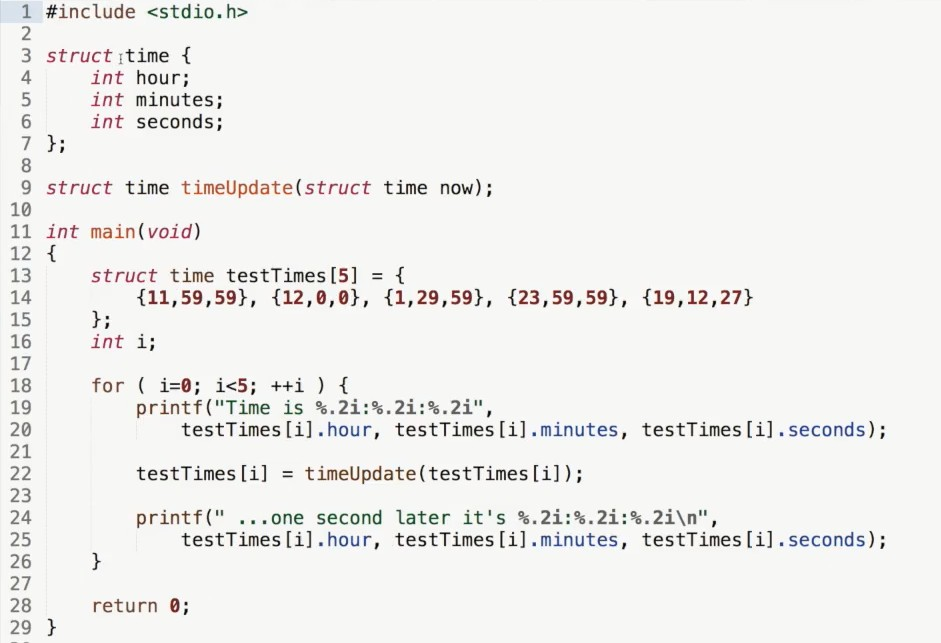


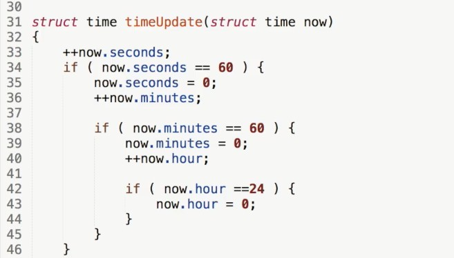


### 结构中的结构的数组

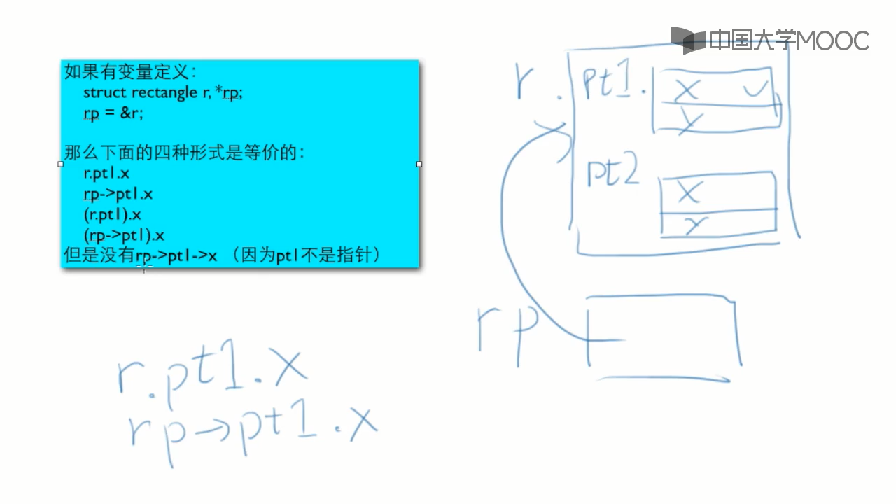


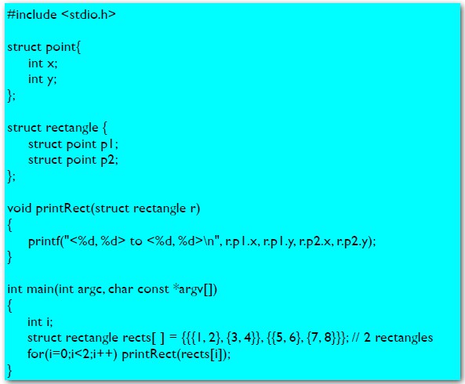

### 联合


```c
#include <stdio.h>

typedef union {
    int i;
    char ch[sizeof(int)];
} CHI;

int main()
{
    CHI chi;
    int i = 1234;
    for (i=0;i<sizeof(int);i++)
    {
        printf("%02hhX",chi.ch[i]);
    }

    printf("\n");
    return 0;
}
```

### static

```c
#include <stdio.h>

int f(void);

int main()
{
   int i;
   for (i=0;i<3;i++)
   {
      f();
   }

   return 0;
}

int f(void)
{
    static int n = 100;
    printf("in %s all = %d\n",__func__,n);
    n += 100;
    printf("agn in %s all = %d\n",__func__,n);
    return n;
}
```

```c
#include <stdio.h>

int f(void);

int gAll = 3;

int main()
{

   f();

   return 0;
}

int f(void)
{
    int localN = 4;
    static int staticN = 5;
    printf("&gAll=%p\n", &gAll);
    printf("&localN=%p\n", &localN);
    printf("&staticN=%p\n", &staticN);

    return 0;
}

```

### 宏

```
#开头的是编译预处理指令
#define <名字> <值>
```

预定义的宏

```
__LINE__
 __FILE__
__DATE__
__TIME__
__STDC__
```

```c
#include <stdio.h>

#define PI 3.1415926 //单行注释
#define PI2 PI*100
#define PRT printf("%f ",PI);\
            printf("%f ",PI2)

int main()
{

   printf("in main %lf\n", PI*2);

   PRT;

   return 0;
}
```

带参数的宏

```
#define cube(x) ((x)*(x)*(x))

#define RADTODEG(x) ((x) * 57.29578)
```

带多个参数

```
#define MIN(a,b) ((a)>(b)?(b):(a))
```

```c
#include <stdio.h>
#define PRETTY_PRINT(msg) printf(msg)

int main()
{
    int n;

    scanf("%d",&n);

    if (n < 10)
        PRETTY_PRINT("n is less than 10");
    else
        PRETTY_PRINT("n is at least 10");

   return 0;
}
```

```
#define _DEBUG
```

### 大程序

头文件

```
一般的做法就是任何.c都有对应的同名的.h，把所有对外公开的函数的原型和全局变量的声明都放进去。
```

不对外公开的函数

```
在函数前面加上static就使得它成为只能在所在的编译单元中被使用的函数。
在全局变量前面加上static就使得它成为只能在所在的编译单元中被使用的全局变量。
```

声明

```
int i;是变量的定义
extern int i;是变量的声明
只有声明可以被放在头文件中
```

weak修饰符

标准头文件结构 


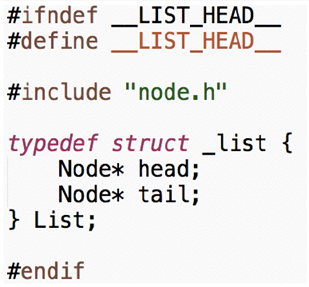

前向声明

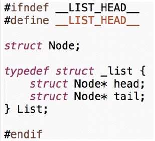

### 格式化输入输出

```c
#include <stdio.h>

int main()
{
   int num;

   printf("%09d\n",123);

   printf("%+-9d\n",-123);

   printf("%9.3f\n",123.0);

   printf("%*d\n",6,123);

   printf("%hhd\n",(char)12345);

   //printf("%d%n\n",1234,&num);

   //printf("%d\n",num);

   return 0;
}
```

```c
#include <stdio.h>

int main()
{
   int num;

   //scanf("%*d%d",&num);
   //printf("%d\n",num);

   //scanf("%i",&num);
   //printf("%d\n",num);

   int i1 = scanf("%i",&num);
   int i2 = printf("%d\n",num);

   printf("%d:%d\n",i1,i2);
   return 0;
}
```

### 文件

```c
#include <stdio.h>

int main()
{
   FILE *fp = fopen("12.txt", "r");
   if (fp)
   {
       int num;
       fscanf(fp,"%d",&num);
       printf("%d\n",num);
       fclose(fp);
   }
   else {
       printf("无法打开文件");
   }
   return 0;
}
```

### 位运算

输出一个整数的二进制形式

```c
#include <stdio.h>

int main()
{
   int number;

   scanf("%d", &number);

   unsigned mask = 1u<<31;

   for (;mask;mask>>=1)
   {
       printf("%d", number&mask?1:0);
   }

   printf("\n");
   
   return 0;
}
```

