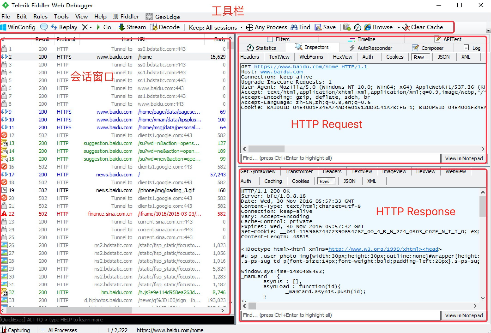
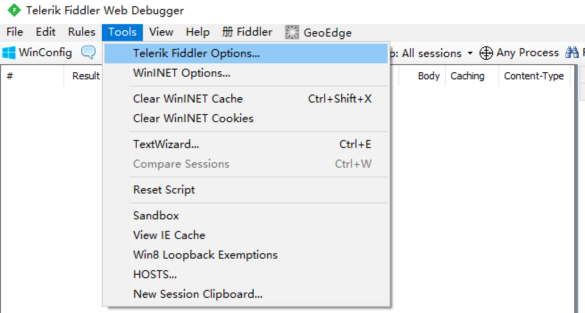
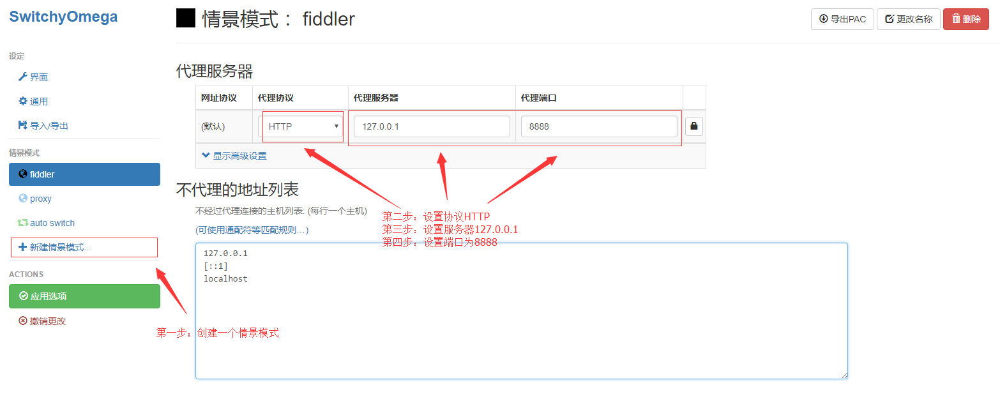

###  fiddler的使用
#### 1.1 操作界面

#### 1.2 界面含义
请求 (Request) 部分详解
名称|含义
---|---
Headers | 显示客户端发送到服务器的 HTTP 请求的，header 显示为一个分级视图，包含了 Web 客户端信息、Cookie、传输状态等 
Textview | 显示 POST 请求的 body 部分为文本
WebForms | 显示请求的 GET 参数 和 POST body 内容
HexView | 用十六进制数据显示请求
Auth | 显示响应 header 中的 Proxy-Authorization(代理身份验证) 和 Authorization(授权) 信息
Raw  | 将整个请求显示为纯文本
JSON | 显示JSON格式文件
XML | 如果请求的 body 是 XML格式，就是用分级的 XML 树来显示它

响应 (Response) 部分详解
名称|含义
---|---
Transformer | 显示响应的编码信息
Headers | 用分级视图显示响应的 header
TextView | 使用文本显示相应的 body
ImageVies | 如果请求是图片资源，显示响应的图片
HexView | 用十六进制数据显示响应
WebView | 响应在 Web 浏览器中的预览效果
Auth | 显示响应 header 中的 Proxy-Authorization(代理身份验证) 和 Authorization(授权) 信息
Caching | 显示此请求的缓存信息
Privacy | 显示此请求的私密 (P3P) 信息
Raw | 将整个响应显示为纯文本
JSON | 显示JSON格式文件
XML | 如果响应的 body 是 XML 格式，就是用分级的 XML 树来显示它

#### 1.3 设置
##### 1.3.1 如何打开
> 启动Fiddler，打开菜单栏中的 Tools >Options，打开“Fiddler Options”对话框

##### 1.3.2 设置

- Capture HTTPS CONNECTs 捕捉HTTPS连接
- Decrypt HTTPS traffic 解密HTTPS通信
- Ignore server certificate errors 忽略服务器证书错误
- all processes 所有进程
- browsers onlye 仅浏览器
- nono- browsers only 仅非浏览器
- remote clients only 仅远程链接

- Trust Root Certificate(受信任的根证书) 配置Windows信任这个根证书解决安全警告

- Allow remote computers to connect 允许远程连接
- Act as system proxy on startup 作为系统启动代理
- resuse client connections 重用客户端链接

#### 1.4 捕获链接(抓包)
1. 安装SwitchyOmega 代理管理 Chrome 浏览器插件
2. 设置代理
