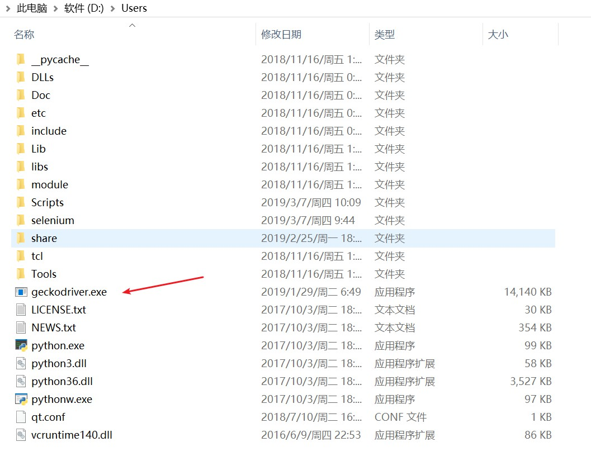
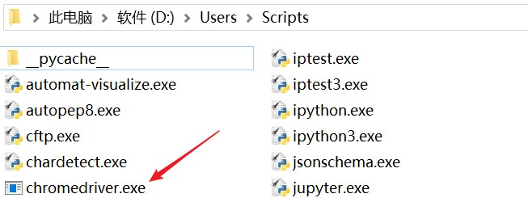

### 1. Selenium

PyPI网站下载 Selenium库 https://pypi.python.org/simple/selenium 

pip用命令安装：`pip install selenium`

Selenium 官方参考文档：http://selenium-python.readthedocs.io/index.html

### 2. PhantomJS

PhantomJS官网 http://phantomjs.org/download.html

PhantomJS官方文档 http://phantomjs.org/documentation/

Selenium+PhantomJS使用时报错

```python
UserWarning: Selenium support for PhantomJS has been deprecated, please use headless versions of Chrome or Firefox instead
  warnings.warn('Selenium support for PhantomJS has been deprecated, please use headless '
```

解决方案：**selenium版本降级**

```
#显示安装版本等信息
pip show selenium
#卸载
pip uninstall selenium
#指定版本号安装
pip install selenium==2.48.0
```

### 3. 安装Firefox geckodriver

安装Firefox最新版本，添加Firefox可执行程序到系统环境变量，关闭Firefox的自动更新。

geckodriver下载地址：https://github.com/mozilla/geckodriver/releases

文件解压




### 4. 安装ChromeDriver

chromedriver下载 http://chromedriver.storage.googleapis.com/index.html

chromedriver版本与chrome版本要对应

文件解压




```python
#chrome59版本以后可以变成无头的浏览器
options = webdriver.ChromeOptions()
options.add_argument('--headless')
chrome = webdriver.Chrome(chrome_options=options)
```
```python
#firefox headless模式
options = webdriver.FirefoxOptions()
options.add_argument('-headless')
#禁用GPU加速
options.add_argument('--disable-gpu')
driver = webdriver.Firefox(firefox_options=options)
```

相关博客 https://blog.csdn.net/u010358168/article/details/79749149

### 5. 简单例子

```python
# 导入 webdriver
from selenium import webdriver

# 要想调用键盘按键操作需要引入keys包
from selenium.webdriver.common.keys import Keys

# chrome59版本以后可以变成无头的浏览器
options = webdriver.ChromeOptions()
options.add_argument('--headless')
driver = webdriver.Chrome(chrome_options=options)

# get方法会一直等到页面被完全加载，然后才会继续程序
driver.get("http://www.baidu.com/")

# 获取页面名为wrapper的id标签的文本内容
data = driver.find_element_by_id("wrapper").text

# 打印数据内容
print(data)

# 打印页面标题
print(driver.title)

# 生成当前页面快照并保存
driver.save_screenshot("baidu.png")

# id="kw"是百度搜索输入框
driver.find_element_by_id("kw").send_keys("尚学堂")

# click() 是模拟点击
driver.find_element_by_id("su").click()

# 获取新的页面快照
driver.save_screenshot("尚学堂.png")

# 打印网页渲染后的源代码
print(driver.page_source)

# 获取当前页面Cookie
print(driver.get_cookies())

# ctrl+a 全选输入框内容
driver.find_element_by_id("kw").send_keys(Keys.CONTROL,'a')

# ctrl+x 剪切输入框内容
driver.find_element_by_id("kw").send_keys(Keys.CONTROL,'x')

# 输入框重新输入内容
driver.find_element_by_id("kw").send_keys("python爬虫")

# 模拟Enter回车键
driver.find_element_by_id("su").send_keys(Keys.RETURN)

# 清除输入框内容
driver.find_element_by_id("kw").clear()

# 生成新的页面快照
driver.save_screenshot("python爬虫.png")

# 获取当前url
print(driver.current_url)

# 关闭当前页面，如果只有一个页面，会关闭浏览器
# driver.close()

# 关闭浏览器
driver.quit()
```

### 6. 页面操作
页面交互

找到页面中的元素，WebDriver提供了各种方法来寻找元素。

```html
<input type="text" name="passwd" id="passwd-id" />
```
获取

```python
element = driver.find_element_by_id("passwd-id")
element = driver.find_element_by_name("passwd")
element = driver.find_elements_by_tag_name("input")
element = driver.find_element_by_xpath("//input[@id='passwd-id']")
```
注意：

- 文本必须完全匹配才可以，所以这并不是一个很好的匹配方式。

- 在用 xpath 的时候还需要注意的如果有多个元素匹配了 xpath，它只会返回第一个匹配的元素。如果没有找到，那么会抛出 NoSuchElementException 的异常。

输入内容

```python
element.send_keys("some text")
```
模拟点击某个按键

```python
element.send_keys("and some", Keys.ARROW_DOWN)
```
清空文本

```python
element.clear()
```

元素拖拽

要完成元素的拖拽，首先需要指定被拖动的元素和拖动目标元素，然后利用 ActionChains 类来实现。

```python
#实现元素从 source 拖动到 target 的操作
element = driver.find_element_by_name("source")
target = driver.find_element_by_name("target")
 
from selenium.webdriver import ActionChains
action_chains = ActionChains(driver)
action_chains.drag_and_drop(element, target).perform()
```
历史记录

```python
#操作页面的前进和后退功能
driver.forward()
driver.back()
```

### 7. API
#### 7.1 元素选取
##### 7.1.1 单个元素选取
- find_element_by_id
- find_element_by_name
- find_element_by_xpath
- find_element_by_link_text
- find_element_by_partial_link_text
- find_element_by_tag_name
- find_element_by_class_name
- find_element_by_css_selector

##### 7.1.2 多个元素选取
- find_elements_by_name
- find_elements_by_xpath
- find_elements_by_link_text
- find_elements_by_partial_link_text
- find_elements_by_tag_name
- find_elements_by_class_name
- find_elements_by_css_selector

##### 7.1.3 利用 By 类来确定哪种选择方式
```python
from selenium.webdriver.common.by import By
 
driver.find_element(By.XPATH, '//button[text()="Some text"]')
driver.find_elements(By.XPATH, '//button')
```
By 类的一些属性如下
- ID = "id"
- XPATH = "xpath"
- LINK_TEXT = "link text"
- PARTIAL_LINK_TEXT = "partial link text"
- NAME = "name"
- TAG_NAME = "tag name"
- CLASS_NAME = "class name"
- CSS_SELECTOR = "css selector"

### 8 等待
#### 8.1 隐式等待
到了一定的时间发现元素还没有加载，则继续等待我们指定的时间，如果超过了我们指定的时间还没有加载就会抛出异常，如果没有需要等待的时候就已经加载完毕就会立即执行。

```python
from selenium import webdriver
url = 'https://www.guazi.com/nj/buy/'
driver = webdriver.Chrome()
driver.get(url)
driver.implicitly_wait(100)
print(driver.find_element_by_class_name('next'))
print(driver.page_source)
```

#### 8.2 显示等待
指定一个等待条件，并且指定一个最长等待时间，会在这个时间内进行判断是否满足等待条件，如果成立就会立即返回，如果不成立，就会一直等待，直到等待你指定的最长等待时间，如果还是不满足，就会抛出异常，如果满足了就会正常返回。

```python
from selenium import webdriver
from selenium.webdriver.support.ui import WebDriverWait
from selenium.webdriver.common.by import By
from selenium.webdriver.support import expected_conditions as EC

url = 'https://www.guazi.com/nj/buy/'
driver = webdriver.Chrome()
driver.get(url)
wait = WebDriverWait(driver, 10)
wait.until(EC.presence_of_element_located((By.CLASS_NAME, 'next')))
print(driver.page_source)
```

- presence_of_element_located   
    - 元素加载出，传入定位元组，如(By.ID, 'p')
- presence_of_all_elements_located 
    - 所有元素加载出
- element_to_be_clickable
    - 元素可点击
- element_located_to_be_selected
    - 元素可选择，传入定位元组 
#### 8.3 强制等待

Python 的 time 包提供了休眠方法 sleep() ， 导入 time 包后就可以使用 sleep()，进行脚本的执行过程休眠。