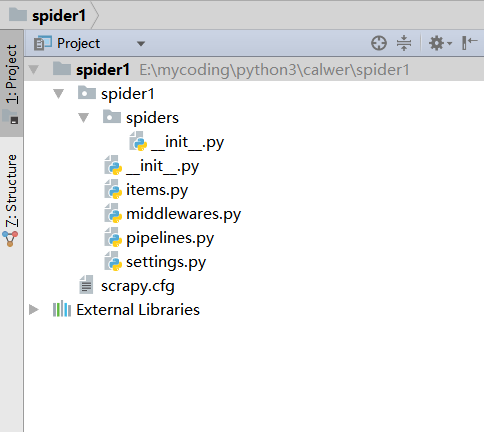

### 1 基本使用
#### 1.1 创建项目
运行命令:
`scrapy startproject myfrist（your_project_name）`




文件说明：
名称 | 作用
--|--
scrapy.cfg | 项目的配置信息，主要为Scrapy命令行工具提供一个基础的配置信息。（真正爬虫相关的配置信息在settings.py文件中）
items.py | 设置数据存储模板，用于结构化数据，如：Django的Model
pipelines | 数据处理行为，如：一般结构化的数据持久化
settings.py | 配置文件，如：递归的层数、并发数，延迟下载等
spiders |  爬虫目录，如：创建文件，编写爬虫规则

一般创建爬虫文件时，以网站域名命名。


#### 2 编写 spdier
在spiders目录中新建 baidu_spider.py 文件

##### 2.1 注意

1. 爬虫文件需要定义一个类，并继承scrapy.spiders.Spider。
2. 必须定义name，即爬虫名，如果没有name，会报错。（源码规定）

##### 2.2 编写内容
- name: 它定义了蜘蛛的唯一名称；
- allowed_domains: 它包含了蜘蛛抓取的基本URL；
- start-urls: 蜘蛛开始爬取的URL列表；
- parse(): 这是提取并解析刮下数据的方法；

下面的代码演示了蜘蛛代码的样子：
```python
import scrapy


class DoubanSpider(scrapy.Spider):
    name = 'douban'
    allwed_url = 'douban.com'
    start_urls = [
        'https://movie.douban.com/top250/'
    ]

    def parse(self, response):
        movie_name = response.xpath("//div[@class='item']//a/span[1]/text()").extract()
        movie_core = response.xpath("//div[@class='star']/span[2]/text()").extract()
        yield {
            'movie_name':movie_name,
            'movie_core':movie_core
        }
```

### 其他命令：
- 创建爬虫
    ```
    scrapy genspider 爬虫名 爬虫的地址
    ```
- 运行爬虫
    ```
    scrapy crawl 爬虫名
    ```

