```python
import matplotlib.pyplot as plt
%matplotlib inline

plt.figure()
plt.plot([1, 0, 9], [4, 5, 6])
plt.show()
```


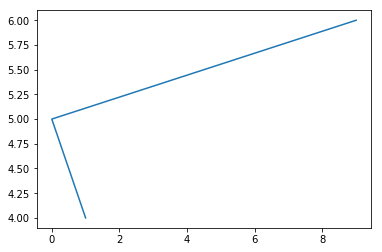


### 折线图绘制与显示


```python
# 展现上海一周的天气,比如从星期一到星期日的天气温度如下
# 1、创建画布
plt.figure(figsize=(20, 8), dpi=80)

# 2、绘制图像
plt.plot([1, 2, 3, 4, 5, 6, 7], [17, 17, 18, 15, 11, 11, 13])

# 保存图像
plt.savefig("test78.png")

# 3、显示图像
plt.show()
```


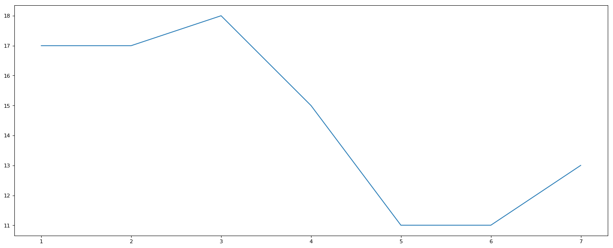


### 2.2.2 完善原始折线图1(辅助显示层)


```python
# 需求：画出某城市11点到12点1小时内每分钟的温度变化折线图，温度范围在15度~18度
import random
# 中文显示乱码的问题解决 https://blog.csdn.net/mudooo/article/details/80047074
plt.rcParams['font.sans-serif'] = ['SimHei']
plt.rcParams['axes.unicode_minus'] = False
# 1、准备数据 x y
x = range(60)
y_shanghai = [random.uniform(15, 18) for i in x]

# 2、创建画布
plt.figure(figsize=(20, 8), dpi=80)

# 3、绘制图像
plt.plot(x, y_shanghai)

# 修改x、y刻度
# 准备x的刻度说明
x_label = ["11点{}分".format(i) for i in x]
plt.xticks(x[::5], x_label[::5])
plt.yticks(range(0, 40, 5))

# 添加网格显示
plt.grid(linestyle="--", alpha=0.5)

# 添加描述信息
plt.xlabel("时间变化")
plt.ylabel("温度变化")
plt.title("某城市11点到12点每分钟的温度变化状况")

# 4、显示图
plt.show()
```


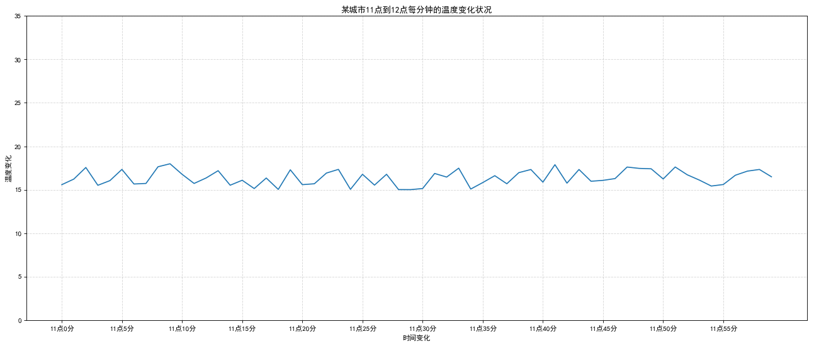


### 2.2.3 完善原始折线图2(图像层)


```python
# 需求：再添加一个城市的温度变化
# 收集到北京当天温度变化情况，温度在1度到3度。 

# 1、准备数据 x y
x = range(60)
y_shanghai = [random.uniform(15, 18) for i in x]
y_beijing = [random.uniform(1, 3) for i in x]

# 2、创建画布
plt.figure(figsize=(20, 8), dpi=80)

# 3、绘制图像
plt.plot(x, y_shanghai, color="r", linestyle="-.", label="上海")
plt.plot(x, y_beijing, color="b", label="北京")

# 显示图例
plt.legend()

# 修改x、y刻度
# 准备x的刻度说明
x_label = ["11点{}分".format(i) for i in x]
plt.xticks(x[::5], x_label[::5])
plt.yticks(range(0, 40, 5))

# 添加网格显示
plt.grid(linestyle="--", alpha=0.5)

# 添加描述信息
plt.xlabel("时间变化")
plt.ylabel("温度变化")
plt.title("上海、北京11点到12点每分钟的温度变化状况")

# 4、显示图
plt.show()
```


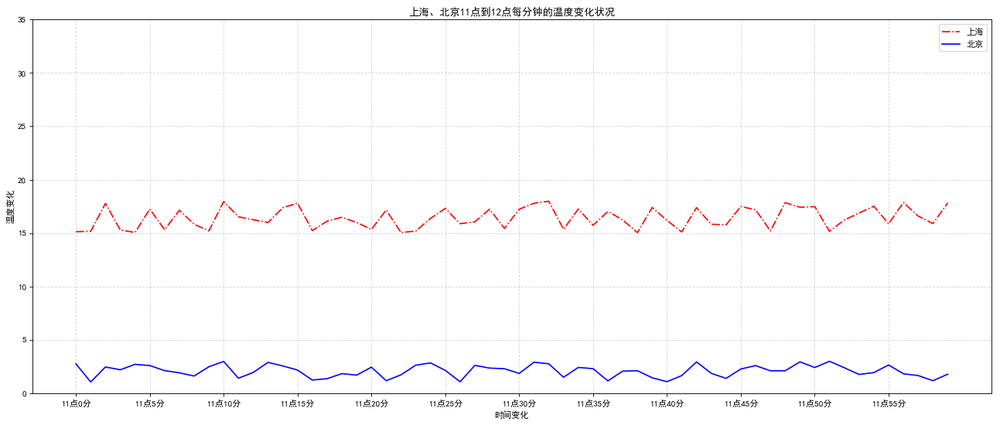


### 2.2.4 多个坐标系显示-plt.subplots(面向对象的画图方法)


```python
# 需求：再添加一个城市的温度变化
# 收集到北京当天温度变化情况，温度在1度到3度。 

# 1、准备数据 x y
x = range(60)
y_shanghai = [random.uniform(15, 18) for i in x]
y_beijing = [random.uniform(1, 3) for i in x]

# 2、创建画布
# plt.figure(figsize=(20, 8), dpi=80)
figure, axes = plt.subplots(nrows=1, ncols=2, figsize=(20, 8), dpi=80)

# 3、绘制图像
axes[0].plot(x, y_shanghai, color="r", linestyle="-.", label="上海")
axes[1].plot(x, y_beijing, color="b", label="北京")

# 显示图例
axes[0].legend()
axes[1].legend()

# 修改x、y刻度
# 准备x的刻度说明
x_label = ["11点{}分".format(i) for i in x]

axes[0].set_xticks(x[::5])
axes[0].set_xticklabels(x_label[::5])
axes[0].set_yticks(range(0, 40, 5))

axes[1].set_xticks(x[::5])
axes[1].set_xticklabels(x_label[::5])
axes[1].set_yticks(range(0, 40, 5))

# 添加网格显示
axes[0].grid(linestyle="--", alpha=0.5)
axes[1].grid(linestyle="--", alpha=0.5)

# 添加描述信息
axes[0].set_xlabel("时间变化")
axes[0].set_ylabel("温度变化")
axes[0].set_title("上海11点到12点每分钟的温度变化状况")
axes[1].set_xlabel("时间变化")
axes[1].set_ylabel("温度变化")
axes[1].set_title("北京11点到12点每分钟的温度变化状况")

# 4、显示图
plt.show()
```


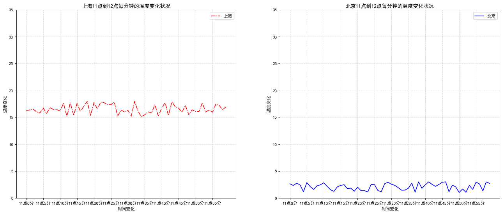


### 绘制数学函数图像


```python
import numpy as np
# 1、准备x，y数据
x = np.linspace(-1, 1, 1000)
y = 2 * x * x

# 2、创建画布
plt.figure(figsize=(20, 8), dpi=80)

# 3、绘制图像
plt.plot(x, y)

# 添加网格显示
plt.grid(linestyle="--", alpha=0.5)

# 4、显示图像
plt.show()
```


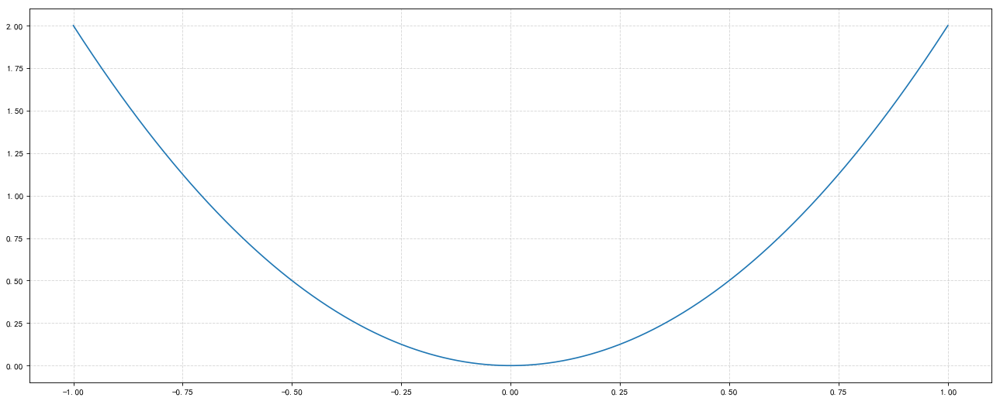


### 2.3.2 散点图绘制


```python
# 需求：探究房屋面积和房屋价格的关系

# 1、准备数据
x = [225.98, 247.07, 253.14, 457.85, 241.58, 301.01,  20.67, 288.64,
       163.56, 120.06, 207.83, 342.75, 147.9 ,  53.06, 224.72,  29.51,
        21.61, 483.21, 245.25, 399.25, 343.35]

y = [196.63, 203.88, 210.75, 372.74, 202.41, 247.61,  24.9 , 239.34,
       140.32, 104.15, 176.84, 288.23, 128.79,  49.64, 191.74,  33.1 ,
        30.74, 400.02, 205.35, 330.64, 283.45]

# 2、创建画布
plt.figure(figsize=(20, 8), dpi=80)

# 3、绘制图像
plt.scatter(x, y)

# 4、显示图像
plt.show()
```


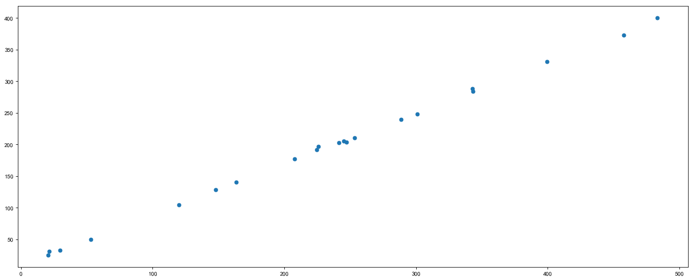


### 需求1-对比每部电影的票房收入


```python
# 1、准备数据
movie_names = ['雷神3：诸神黄昏','正义联盟','东方快车谋杀案','寻梦环游记',
               '全球风暴', '降魔传','追捕','七十七天','密战','狂兽','其它']
tickets = [73853,57767,22354,15969,14839,8725,8716,8318,7916,6764,52222]

# 2、创建画布
plt.figure(figsize=(20, 8), dpi=80)

# 3、绘制柱状图
x_ticks = range(len(movie_names))
plt.bar(x_ticks, tickets, color=['b','r','g','y','c','m','y','k','c','g','b'])

# 修改x刻度
plt.xticks(x_ticks, movie_names)

# 添加标题
plt.title("电影票房收入对比")

# 添加网格显示
plt.grid(linestyle="--", alpha=0.5)

# 4、显示图像
plt.show()
```


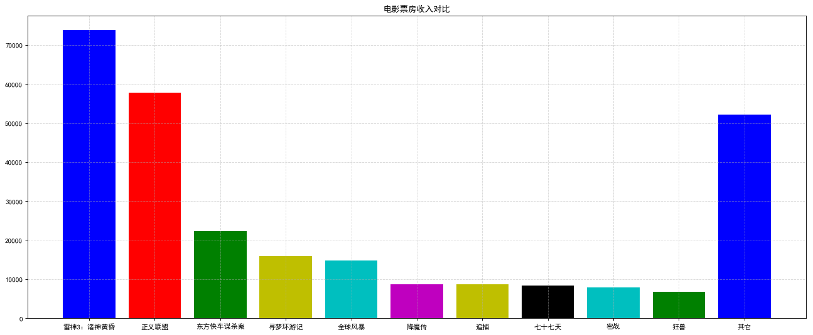


### 需求2-如何对比电影票房收入才更能加有说服力？


```python
# 1、准备数据
movie_name = ['雷神3：诸神黄昏','正义联盟','寻梦环游记']

first_day = [10587.6,10062.5,1275.7]
first_weekend=[36224.9,34479.6,11830]

# 2、创建画布
plt.figure(figsize=(20, 8), dpi=80)

# 3、绘制柱状图
plt.bar(range(3), first_day, width=0.2, label="首日票房")
plt.bar([0.2, 1.2, 2.2], first_weekend, width=0.2, label="首周票房")

# 显示图例
plt.legend()

# 修改刻度
plt.xticks([0.1, 1.1, 2.1], movie_name)

# 4、显示图像
plt.show()
```


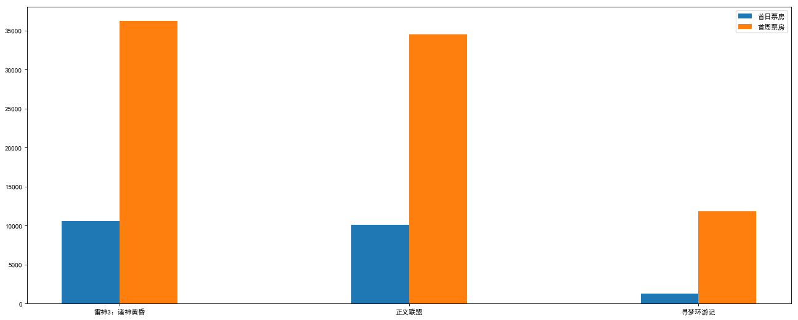


### 2.5.3 直方图绘制


```python
# 需求：电影时长分布状况
# 1、准备数据
time = [131,  98, 125, 131, 124, 139, 131, 117, 128, 108, 135, 138, 
        131, 102, 107, 114, 119, 128, 121, 142, 127, 130, 124, 101, 
        110, 116, 117, 110, 128, 128, 115,  99, 136, 126, 134,  95, 
        138, 117, 111,78, 132, 124, 113, 150, 110, 117,  86,  95, 
        144, 105, 126, 130,126, 130, 126, 116, 123, 106, 112, 138, 
        123,  86, 101,  99, 136,123, 117, 119, 105, 137, 123, 128, 
        125, 104, 109, 134, 125, 127,105, 120, 107, 129, 116, 108, 
        132, 103, 136, 118, 102, 120, 114,105, 115, 132, 145, 119, 
        121, 112, 139, 125, 138, 109, 132, 134,156, 106, 117, 127, 
        144, 139, 139, 119, 140,  83, 110, 102,123,107, 143, 115, 
        136, 118, 139, 123, 112, 118, 125, 109, 119, 133,112, 114, 
        122, 109, 106, 123, 116, 131, 127, 115, 118, 112, 135,115, 
        146, 137, 116, 103, 144,  83, 123, 111, 110, 111, 100, 154,
        136, 100, 118, 119, 133, 134, 106, 129, 126, 110, 111, 109, 
        141,120, 117, 106, 149, 122, 122, 110, 118, 127, 121, 114, 
        125, 126,114, 140, 103, 130, 141, 117, 106, 114, 121, 114, 
        133, 137,  92,121, 112, 146,  97, 137, 105,  98, 117, 112, 
        81,  97, 139, 113,134, 106, 144, 110, 137, 137, 111, 104, 
        117, 100, 111, 101, 110,105, 129, 137, 112, 120, 113, 133, 
        112,  83,  94, 146, 133, 101,131, 116, 111,  84, 137, 115, 
        122, 106, 144, 109, 123, 116, 111,111, 133, 150]

# 2、创建画布
plt.figure(figsize=(20, 8), dpi=80)

# 3、绘制直方图
distance = 2
group_num = max(time) - min(time) // distance

plt.hist(time, bins=group_num, density=True)

# 修改x轴刻度
plt.xticks(range(min(time), max(time) + 2, distance))

# 添加网格
plt.grid(linestyle="--", alpha=0.5)

# 4、显示图像
plt.show()
```


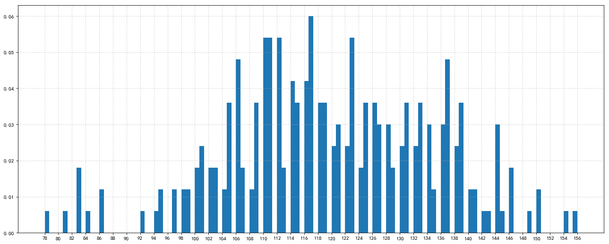


### 2.6.2 饼图绘制


```python
# 1、准备数据
movie_name = ['雷神3：诸神黄昏','正义联盟','东方快车谋杀案','寻梦环游记',
              '全球风暴','降魔传','追捕','七十七天','密战','狂兽','其它']

place_count = [60605,54546,45819,28243,13270,9945,7679,6799,6101,4621,20105]

# 2、创建画布
plt.figure(figsize=(20, 8), dpi=80)

# 3、绘制饼图
plt.pie(place_count, labels=movie_name, colors=['b','r','g','y','c','m','y','k','c','g','y'], autopct="%1.2f%%")

# 显示图例
plt.legend()

plt.axis('equal')

# 4、显示图像
plt.show()
```


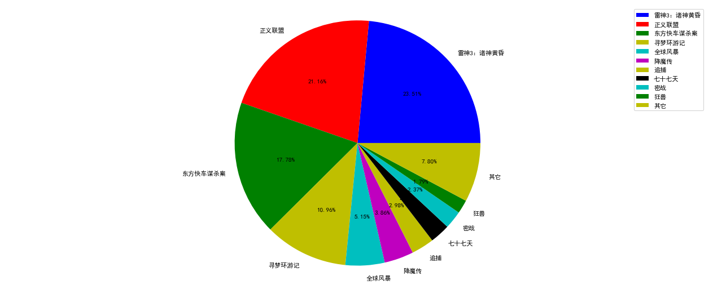

