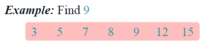
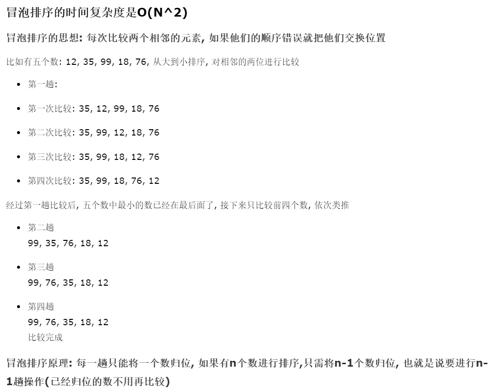
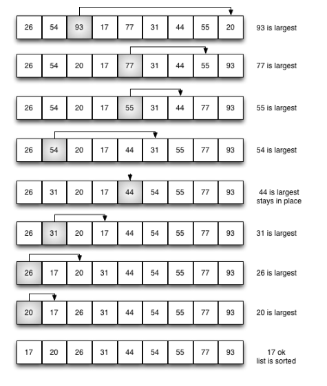
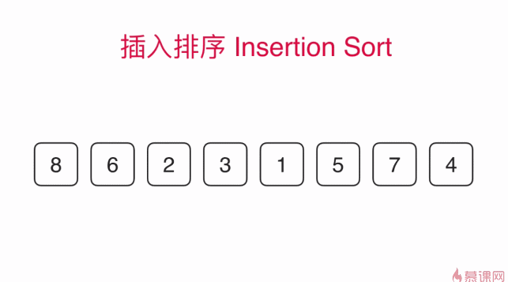
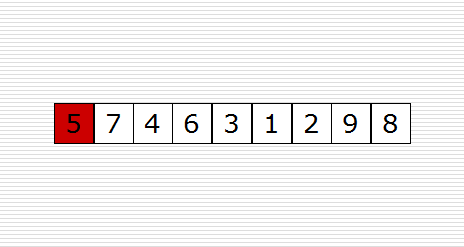
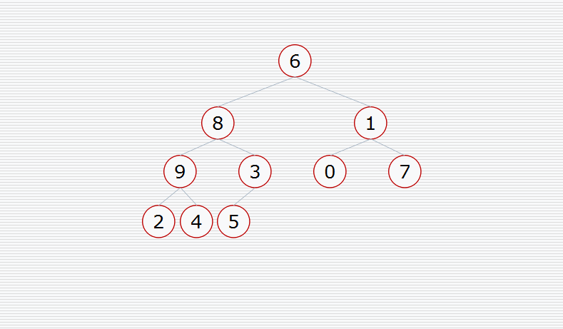
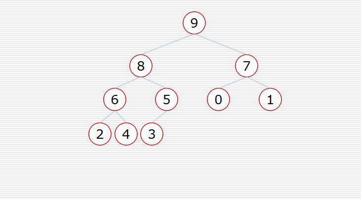
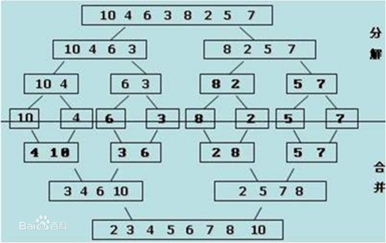

# 算法

https://www.youtube.com/playlist?list=PL2rWx9cCzU84eBz9Xfp9Rah5Fexq5yrh8

https://ke.qq.com/course/list/%E9%A9%AC%E5%93%A5

https://github.com/PegasusWang/python_data_structures_and_algorithms/tree/master/docs

https://python-data-structures-and-algorithms.readthedocs.io/zh/latest/

## 递归

```python
def fun3(x):
    if x > 0:
        print(x)
        fun3(x - 1)


def fun4(x):
    if x > 0:
        fun4(x - 1)
        print(x)


fun3(3)
print('-'*30)
fun4(3)
```

```python
def text(n):
    if n > 0:
        print('抱着', end='')
        text(n - 1)
        print('的我', end='')
    else:
        print('我的小鲤鱼', end='')


text(5)
```

## 汉诺塔

```python
def hanoi(n, A, B, C):
    if n > 0:
        hanoi(n - 1, A, C, B)
        print('%s --> %s' % (A, C))
        hanoi(n - 1, B, A, C)
        
        
hanoi(3, 'A', 'B', 'C')
```

```python
# 如果有n个圆盘,所需移动的步数为 2^n-1
i = 0


# 定义一个函数给4个参数n是圆盘的个数,a代表A柱子,b,c 函数里面的是形式参数
def move(n, a, b, c):
    # 把变量i全局化,如果不全局化,只可访问读取不能进行操作修改
    global i
    if n == 1:
        i += 1
        print('移动第', i, '次', a, '-->', c)
    else:
        # 1.把A柱上n-1个圆盘移动到B柱上
        move(n - 1, a, c, b)  # 传的才是实际参数
        # 2.把A柱上最大的移动到C柱子上
        move(1, a, b, c)
        # 3.把B柱子上n-1个圆盘移动到C柱子上
        move(n - 1, b, a, c)


move(4, 'A', 'B', 'C')
```

## 二分查找



```python
def bin_search(li, val):
    left = 0
    right = len(li) - 1
    while left <= right:
        mid = (left + right) // 2
        if li[mid] == val:
            return mid
        elif li[mid] < val:
            left = mid + 1
        else:
            right = mid - 1
```

## 冒泡排序

<a href="https://www.cnblogs.com/qlshine/p/6017957.html">cnblogs</a>




```python
def bubble_sort(li):
    for i in range(len(li) - 1):
        exchange = False
        for j in range(len(li) - i - 1):
            if li[j] > li[j + 1]:
                li[j], li[j + 1] = li[j + 1], li[j]
                exchange = True
        if not exchange:
            break
```

## 选择排序

选择排序改进了冒泡排序，每次遍历列表只做一次交换。为了做到这一点，一个选择排序在
他遍历时寻找最大的值，并在完成遍历后，将其放置在正确的位置。与冒泡排序一样，在第
一次遍历后，最大的项在正确的地方。 第二遍后，下一个最大的就位。遍历 n-1 次排序 n 个
项，因为最终项必须在第（n-1）次遍历之后。

下图展示了整个排序过程。在每次遍历时，选择最大的剩余项，然后放置在其适当位
置。第一遍放置 93，第二遍放置 77，第三遍放置 55 等。




```python
def selection_sort(alist):
    n = len(alist)
    for i in range(n - 1):
        min_index = i
        for j in range(i + 1, n):
            if alist[j] < alist[min_index]:
                min_index = j
        if min_index != i:
            alist[i], alist[min_index] = alist[min_index], alist[i]
```

## 插入排序




```python
def insert_sort(li):
    n = len(li)
    for i in range(1, n):
        for j in range(i, 0, -1):
            if li[j] < li[j - 1]:
                li[j], li[j - 1] = li[j - 1], li[j]
        #print(li)
```

```python
def insert_sort(li):
    for i in range(1, len(li)):
        tmp = li[i]
        j = i - 1
        while j >= 0 and li[j] > tmp: 
            li[j + 1] = li[j]
            j = j - 1
        li[j + 1] = tmp
```

```
# [1, 5, 6, 8, 4, 3, 0, 9, 2, 7]
# i = 1, tmp = 5, j = 0
# [1, 5, 6, 8, 4, 3, 0, 9, 2, 7]
        
# [1, 5, 6, 8, 4, 3, 0, 9, 2, 7]
# i = 4, tmp = 4, j = 3
# [1, 5, 6, 8, 8, 3, 0, 9, 2, 7]
# [1, 5, 6, 6, 8, 3, 0, 9, 2, 7]
# [1, 5, 5, 6, 8, 3, 0, 9, 2, 7]
# [1, 4, 5, 6, 8, 3, 0, 9, 2, 7]
```


## 快速排序

快速排序（Quicksort）是对冒泡排序的一种改进。它的基本思想是：通过一趟排序将要排序的数据分割成独立的两部分，其中一部分的所有数据都比另外一部分的所有数据都要小，然后再按此方法对这两部分数据分别进行快速排序，整个排序过程可以递归进行，以此达到整个数据变成有序序列。




```python
def partition(data, left, right):
    tmp = data[left]
    while left < right:
        while left < right and data[right] >= tmp:
            right -= 1
        data[left] = data[right]
        while left < right and data[left] <= tmp:
            left += 1
        data[right] = data[left]
    data[left] = tmp
    return left


def quick_sort_x(data, left, right):
    if left < right:
        mid = partition(data, left, right)
        quick_sort_x(data, left, mid - 1)
        quick_sort_x(data, mid + 1, right)


def quick_sort(data):
    return quick_sort_x(data, 0, len(data) - 1)
```

## 堆排序

堆排序过程

- 建立堆。
- 得到堆顶元素，为最大元素。
- 去掉堆顶，将堆最后一个元素放到堆顶，此时可通过一次调整重新使堆有序。
- 堆顶元素为第二大元素。重复步骤3，直到堆变空。

构造堆



挨个出数



```python
def sift(li, low, high):
    """
    构造堆的过程
    :param li: 列表
    :param low: 堆根节点的位置
    :param high: 堆最后一个节点的位置
    :return:
    """
    i = low  # 父亲的位置
    j = 2 * i + 1  # 孩子的位置
    tmp = li[low]  # 最原来的根的值
    while j <= high:
        if j + 1 <= high and li[j + 1] > li[j]:  # 如果右孩子存在并且右孩子更大
            j += 1
        if tmp < li[j]:  # 如果最原来的根的值比孩子小
            li[i] = li[j]  # 把孩子向上移动一层
            i = j
            j = 2 * i + 1
        else:
            break
    li[i] = tmp  # 最原来的根的值放到对应的位置上(叶子节点)


def heap_sort(li):
    n = len(li)
    # 1. 建堆
    for i in range(n // 2 - 1, -1, -1):
        sift(li, i, n - 1)
    # 2. 挨个出数
    for j in range(n - 1, -1, -1):  # j表示堆最后一个元素的位置
        li[0], li[j] = li[j], li[0]
        # 堆的大小少了一个元素 （j-1）
        sift(li, 0, j - 1)
```

## 归并排序

归并排序是采用分治法的一个非常典型的应用。归并排序的思想就是先递归分解数组，再合并数组。

将数组分解最小之后，然后合并两个有序数组，基本思路是比较两个数组的最前面的数，谁小就先取谁，取了后相应的指针就往后移一位。然后再比较，直至一个数组为空，最后把另一个数组的剩余部分复制过来即可。





```python
def merge(li, low, mid, high):
    i = low
    j = mid + 1
    ltmp = []
    while i <= mid and j <= high:
        if li[i] < li[j]:
            ltmp.append(li[i])
            i += 1
        else:
            ltmp.append(li[j])
            j += 1
    while i <= mid:
        ltmp.append(li[i])
        i += 1
    while j <= high:
        ltmp.append(li[j])
        j += 1
    li[low:high + 1] = ltmp


def _mergesort(li, low, high):
    if low < high:
        mid = (low + high) // 2
        _mergesort(li, low, mid)
        _mergesort(li, mid + 1, high)
        merge(li, low, mid, high)
        
        
def merge_sort(li):
    _mergesort(li, 0, len(li) - 1)
```

## 希尔排序

希尔排序(Shell Sort)是插入排序的一种。也称缩小增量排序，是直接插入排序算法的一种更高效的改进版本。

```python3
def shell_sort(alist):
    n = len(alist)
    # 初始步长
    gap = n // 2
    while gap > 0:
        # 按步长进行插入排序
        for i in range(gap, n):
            j = i
            # 插入排序
            while j >= gap and alist[j - gap] > alist[j]:
                alist[j - gap], alist[j] = alist[j], alist[j - gap]
                j -= gap
        # 得到新的步长
        gap = gap // 2
        gap //= 2
```

