# **Django**

## 软件框架

一个公司是由公司中的各部部门来组成的，每一个部门拥有特定的职能，部门与部门之间通过相互的配合来完成让公司运转起来。一个软件框架是由其中各个软件模块组成的，每一个模块都有特定的功能，模块与模块之间通过相互配合来完成软件的开发。软件框架是针对某一类软件设计问题而产生的。

## MVC框架

MVC的产生理念： 分工。让专门的人去做专门的事。MVC的核心思想： 解耦。

MVC的思想被应用在的web开发的方面，产生了web MVC框架。

## Web MVC框架模块功能

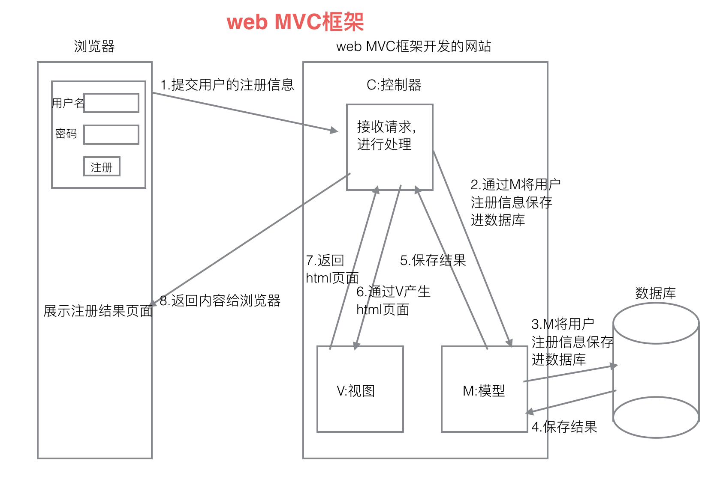

M：Model(模型) 和数据库进行交互。

V： View(视图) 产生html页面。

C： Controller(控制器) 接收请求，进行处理，与M和V进行交互，返回应答。

## Django框架

Django是劳伦斯出版集团的开发人员为开发新闻内容网站而设计出来的一个软件，它遵循MVC思想，但是有自己的一个名词，叫做MVT。Django遵循快速开发和DRY原则(Do not repeat yourself)。

## MVT各部分功能

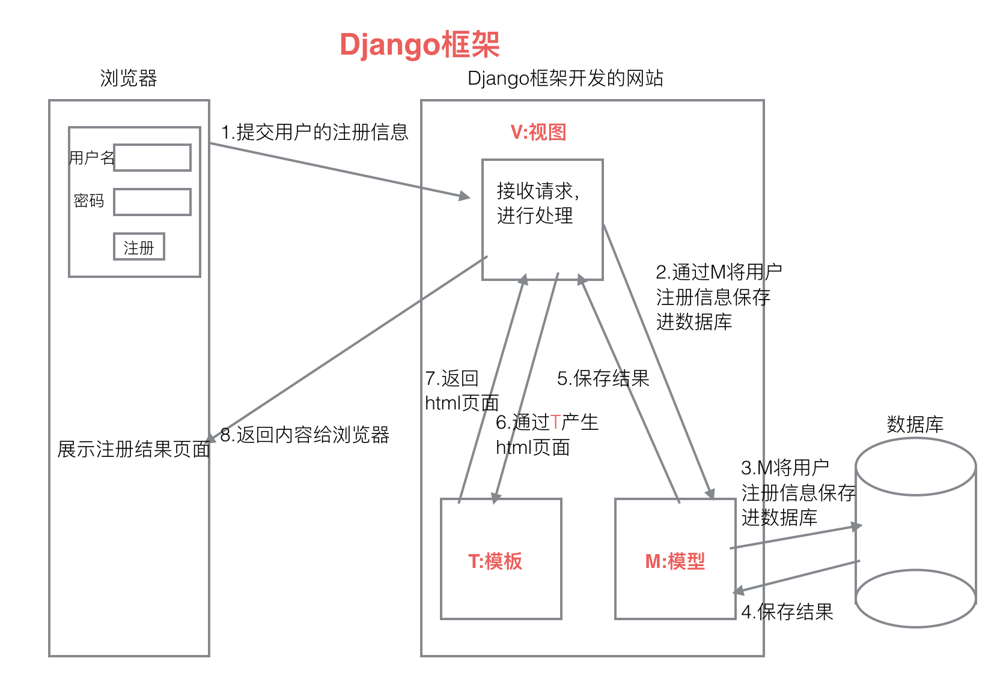

M：Model(模型)和MVC中M功能相同，和数据库进行交互。
V： View(视图)和MVC中C功能相同，接收请求，进行处理，与M和T进行交互，返回应答。
T： Template(模板)和MVC中V功能相同，产生html页面。

## 虚拟环境

安装虚拟环境的命令

```
sudo pip install virtualenv #安装虚拟环境
sudo pip install virtualenvwrapper #安装虚拟环境扩展包
```

编辑家目录下面的.bashrc文件（隐藏文件），添加下面两行。

```
export WORKON_HOME=$HOME/.virtualenvs
source /usr/local/bin/virtualenvwrapper.sh
```

使其生效

```
source .bashrc
```

创建虚拟环境命令

```
mkvirtualenv 虚拟环境名
```

创建python3虚拟环境

```
mkvirtualenv -p python3 虚拟环境名
```

进入虚拟环境工作

```
workon 虚拟环境名
```

退出虚拟环境

```
deactivate
```

删除虚拟环境

```
rmvirtualenv 虚拟环境名
```

虚拟环境下安装包的命令

```
pip install 包名
```

不能使用sudo pip install 包名，这个命令会把包安装到真实的主机环境上而不是安装到虚拟环境中。

查看虚拟环境中安装了哪些python包

```
pip list
pip freeze
```

安装django环境

```
pip install django==1.8.2
```

拓展

```
apt-get install 软件
pip install python包名
```

## 项目创建

```
django-admin startproject 项目名
```

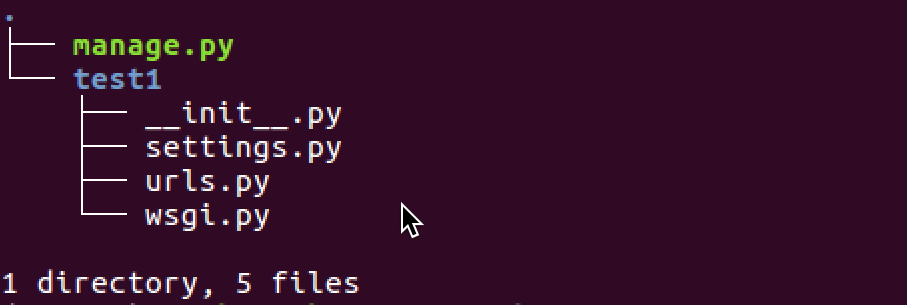

```
__init__.py: 说明是一个python包。
settings.py: 项目的配置文件。
urls.py: 进行url路由的配置。
wsgi.py: web服务器和Django交互的入口。
manage.py:  项目的管理文件。
```

创建Django应用

1. 创建应用需要先进入项目目录。
2. 创建应用必须先进入虚拟环境。

```
python manage.py startapp 应用名
```

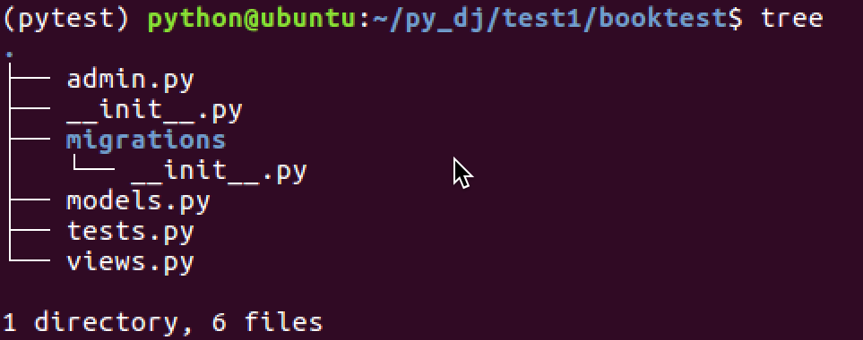

```
__init__.py: 说明目录是一个Python模块。
models.py: 写和数据库项目的内容, 设计模型类。
views.py: 接收请求，进行处理，与M和T进行交互，返回应答。定义处理函数，视图函数。
tests.py: 写测试代码的文件。
admin.py: 网站后台管理相关的文件。
```

应用注册

建立应用和项目之间的联系，需要对应用进行注册。修改settings.py中的INSTALLED_APPS配置项。

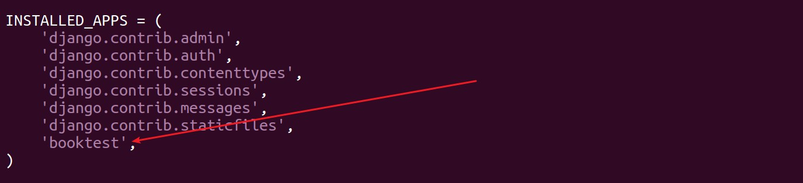

启动项目

运行开发web服务器命令

```
python manage.py runserver
```

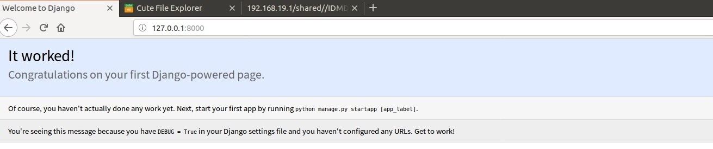

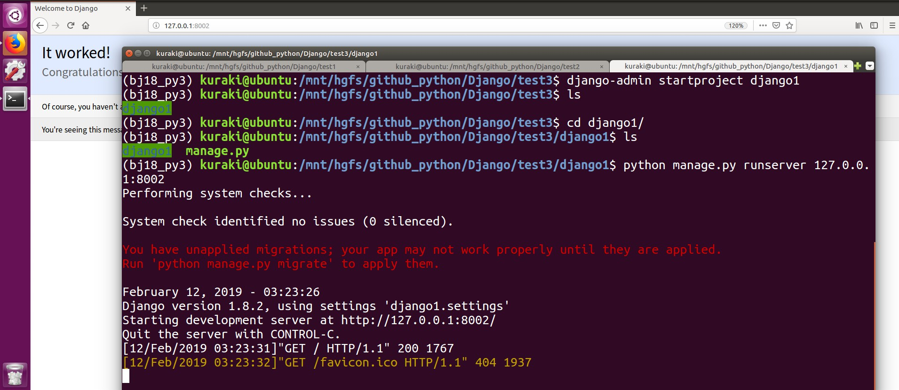


## ORM

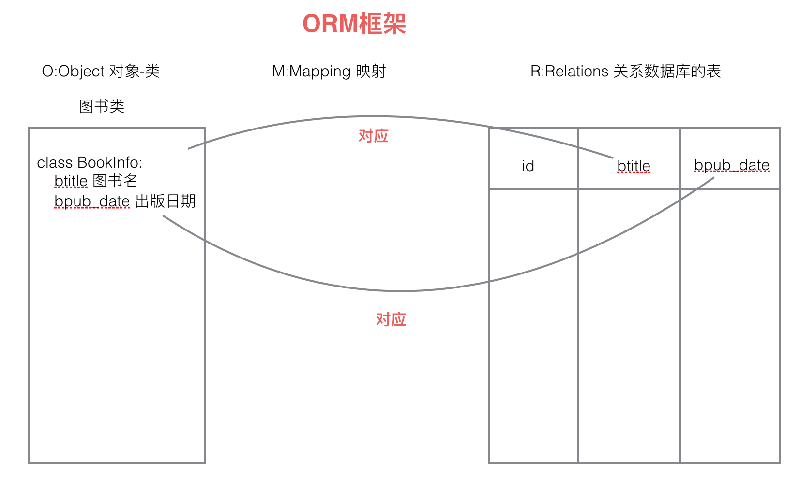

Django中内嵌了ORM框架，ORM框架可以将类和数据表进行对应起来，只需要通过类和对象就可以对数据表进行操作。在Django中主要是设计类：模型类。ORM另外一个作用：根据设计的类生成数据库中的表。

## 模型类设计

在应用models.py中设计模型类。必须继承与models.Model类。Models.ForeignKey可以建立两个模型类之间一对多的关系，Django在生成表的时候，就会在多端的表中创建一列作为外键，建立两个表之间一对多的关系。

models.py

```python
from django.db import models


# 设计和表对应的类，模型类
# Create your models here.

# 一类
# 图书类
class BookInfo(models.Model):
    '''图书模型类'''
    # 图书名称，CharField说明是一个字符串，max_length指定字符串的最大长度
    btitle = models.CharField(max_length=20)
    # 出版日期，DateField说明是一个日期类型
    bpub_date = models.DateField()

    def __str__(self):
        # 返回书名
        return self.btitle


# 多类
# 英雄人物类
# 英雄名 hname
# 性别 hgender
# 年龄　hage
# 备注　hcomment
# 关系属性　hbook，建立图书类和英雄人物类之间的一对多关系
class HeroInfo(models.Model):
    '''英雄人物模型类'''
    hname = models.CharField(max_length=20)  # 英雄名称
    # 性别，BooleanField说明是bool类型，default指定默认值，False代表男
    hgender = models.BooleanField(default=False)
    # 备注
    hcomment = models.CharField(max_length=128)
    # 关系属性　hbook，建立图书类和英雄人物类之间的一对多关系
    # 关系属性对应的表的字段名格式: 关系属性名_id
    hbook = models.ForeignKey('BookInfo')

    def __str__(self):
        # 返回英雄名
        return self.hname
```

## 模型类生成表

1.生成迁移文件

```
python manage.py makemigrations
```

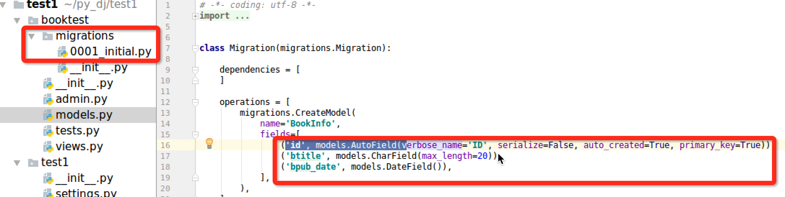

迁移文件是根据模型类生成的。

2.执行迁移生成表

```
python manage.py migrate
```

根据迁移文件生成表。生成表名的默认格式：应用名_模型类名小写

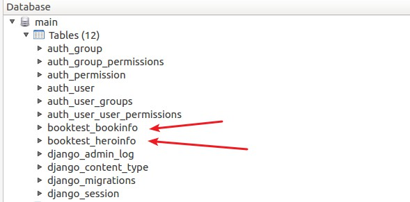

## 通过模型类操作数据表

进入项目shell的命令

```
python manage.py shell
```

以下为在相互shell终端中演示的例子

```python
# 首先导入模型类
from booktest.models import BookInfo, HeroInfo
from datetime import date

# 1)向booktest_bookinfo表中插入一条数据。
b = BookInfo()  # 定义一个BookInfo类的对象
b.btitle = '天龙八部'  # 定义b对象的属性并赋值
b.bpub_date = date(1990, 10, 11)
b.save()  # 才会将数据保存进数据库

b = BookInfo()
b.btitle = '射雕英雄传'
b.bpub_date = date(2000, 10, 11)
b.save()

# 2) 查询出booktest_bookinfo表中id为1的数据。
b = BookInfo.objects.get(id=1)

# 3) 在上一步的基础上改变b对应图书的出版日期。
b.bpub_date = date(1989, 10, 21)
b.save()  # 才会更新表格中的数据

# 4) 紧接上一步，删除b对应的图书的数据。
# b.delete()  # 才会删除

# 5) 向booktest_heroInfo表中插入一条数据。
h = HeroInfo()
h.hname = '郭靖'
h.hgender = False
h.hcomment = "降龙十八掌"
b2 = BookInfo.objects.get(id=2)
h.hbook = b2  # 给关系属性赋值，英雄对象所属的图书对象
h.save()

# 6) 查询图书表里面的所有内容。
BookInfo.objects.all()
HeroInfo.objects.all()
```

## sqlite

```
sudo apt-get install sqliteman
```

## 关联操作

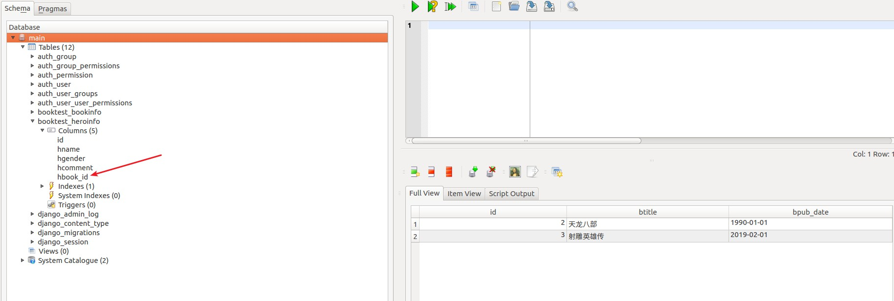


```python
b = BookInfo.objects.get(id=2) #查询出id为2的图书中所有英雄人物的信息
b.heroinfo_set.all() #查询出b图书中所有英雄人物的信息
```

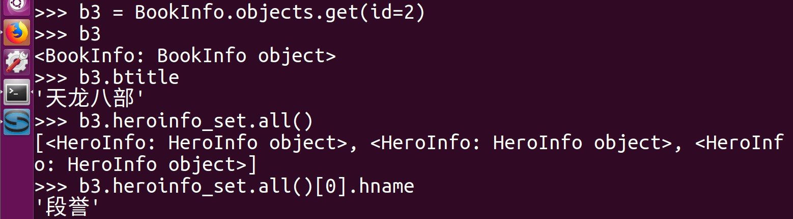

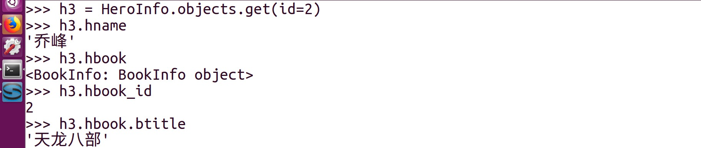

## 后台管理

1.本地化

语言和时区的本地化。修改settings.py文件。

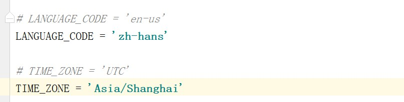

2.创建管理员

```
python manage.py createsuperuser
```

3.注册模型类

在应用下的admin.py中注册模型类。告诉Django框架根据注册的模型类来生成对应表管理页面。

```python
from django.contrib import admin
from booktest.models import BookInfo, HeroInfo


# 后台管理相关文件
# Register your models here.
# 自定义模型管理类
class BookInfoAdmin(admin.ModelAdmin):
    '''图书模型管理类'''
    list_display = ['id', 'btitle', 'bpub_date']


class HeroInfoAdmin(admin.ModelAdmin):
    '''英雄人物模型管理类'''
    list_display = ['id', 'hname', 'hcomment']


# 注册模型类
# admin.site.register(BookInfo)
admin.site.register(BookInfo, BookInfoAdmin)
admin.site.register(HeroInfo, HeroInfoAdmin)
```

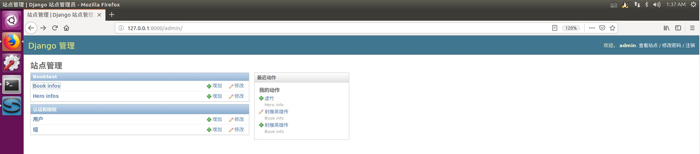

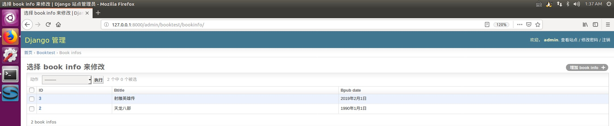

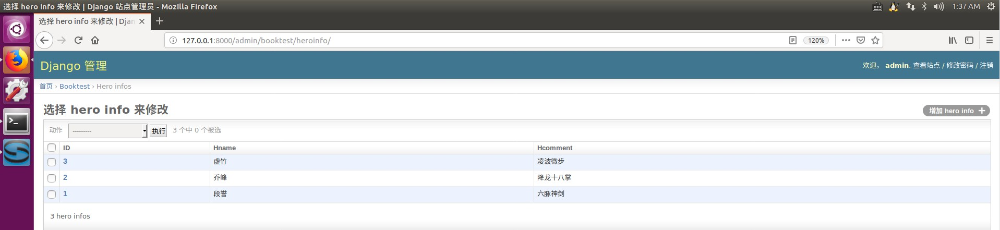

## 视图

在Django中，通过浏览器去请求一个页面时，使用视图函数来处理这个请求的，视图函数处理之后，要给浏览器返回页面内容。

## 视图函数

1.定义视图函数

视图函数定义在views.py中。

```python
from django.shortcuts import render
from django.http import HttpResponse


def index(request):
    # 进行处理
    return HttpResponse('hello python')
```

视图函数必须有一个参数request，进行处理之后，需要返回一个HttpResponse的类对象，hello python就是返回给浏览器显示的内容。

2.进行url配置

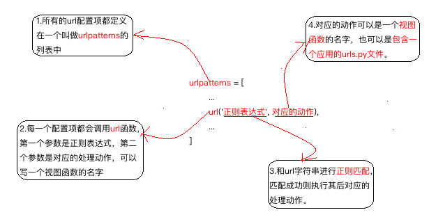

url配置的目的是让建立url和视图函数的对应关系。url配置项定义在urlpatterns的列表中，每一个配置项都调用url函数。url函数有两个参数，第一个参数是一个正则表达式，第二个是对应的处理动作。配置url时，有两种语法格式：a) url(正则表达式，视图函数名) b) url(正则表达式，include(应用中的urls文件))

工作中在配置url时，首先在项目的urls.py文件中添加配置项时，并不写具体的url和视图函数之间的对应关系，而是包含具体应用的urls.py文件，在应用的urls.py文件中写url和视图函数的对应关系。

## url匹配的过程

在项目的urls.py文件中包含具体应用的urls.py文件，应用的urls.py文件中写url和视图函数的对应关系。

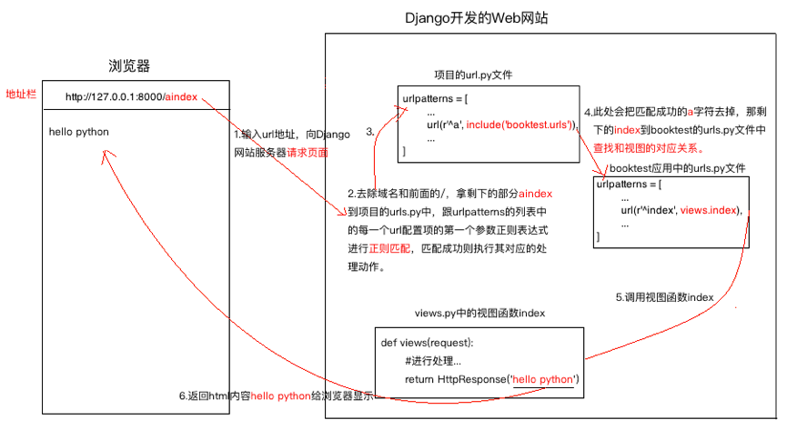

当用户输入如http://127.0.0.1:8000/aindex时，去除域名和最前面的/，剩下aindex，拿aindex字符串到项目的urls文件中进行匹配，配置成功之后，去除匹配的a字符，那剩下的index字符串继续到应用的urls文件中进行正则匹配，匹配成功之后执行视图函数index，index视图函数返回内容hello python给浏览器来显示。

## 模板

模板可以不仅仅是一个html文件。

## 模板文件的使用

1.创建模板文件夹

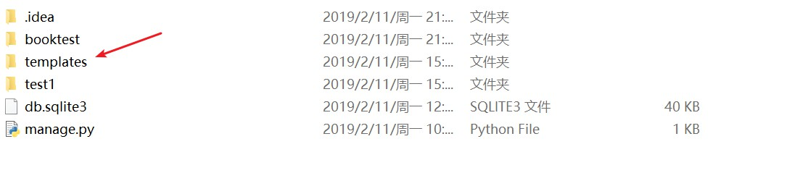

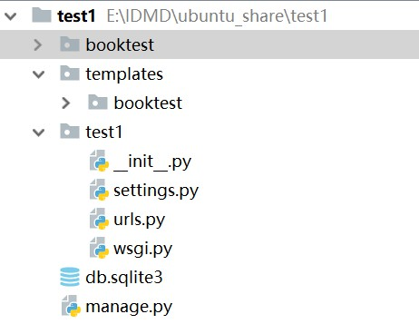

2.配置模板目录


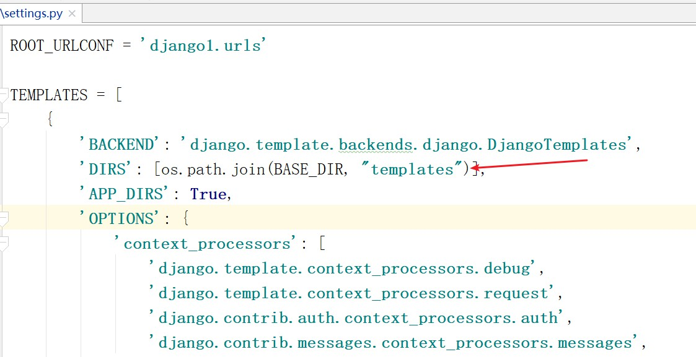


加载模板文件：去模板目录下面获取html文件的内容，得到一个模板对象。

定义模板上下文：向模板文件传递数据。

模板渲染：得到一个标准的html内容。

## 给模板文件传递数据

模板变量使用

```
{{ 模板变量名 }}
```

模板代码段

```

```

for循环

```

	list不为空时执行的逻辑

	list为空时执行的逻辑

```

## MVT综合案例

编码之前的准备工作

1) 设计出访问页面的url和对应的视图函数的名字，确定视图函数的功能。

2) 设计模板文件的名字。

以下为案例中的简单设计过程

1) 完成图书信息的展示

- 设计url，通过浏览器访问 http://127.0.0.1:8000/books 时显示图书信息页面
- 设计url对应的视图函数show_books。查询出所有图书的信息，将这些信息传递给模板文件。
- 编写模板文件show_books.html。遍历显示出每一本图书的信息。

2) 完成点击某本图书时，显示出图书里所有英雄信息的页面。

- 设计url，通过访问http://127.0.0.1:8000/books/数字时显示对应的英雄信息页面。这里数字指点击的图书的id。
- 设计对应的视图函数detail。接收图书的id,根据id查询出相应的图书信息，然后查询出图书中的所有英雄信息。
- 编写模板文件detail.html。

视图views

```python
from django.shortcuts import render
from django.http import HttpResponse
from booktest.models import BookInfo  # 导入图书模型类
from django.template import loader, RequestContext


def my_render(request, template_path, context_dict={}):
    '''使用模板文件'''
    # 使用模板文件
    # 1.加载模板文件, 模板对象
    temp = loader.get_template(template_path)
    # 2.定义模板上下文:给模板文件传递数据
    context = RequestContext(request, context_dict)
    # 3.模板渲染:产生标准的html内容
    res_html = temp.render(context)
    # 4.返回给浏览器
    return HttpResponse(res_html)


# Create your views here.
# 1.定义视图函数,HttpRequest
# 2.进行url配置，建立url地址和视图的对应关系
# http://127.0.0.1:8000/index
def index(request):
    # 进行处理，和M和T进行交互。。。
    # return HttpResponse('ok，got it')
    # return my_render(request, 'booktest/index.html')
    return render(request, 'booktest/index.html', {'content': 'hello world', 'list': list(range(1, 10))})


# http://127.0.0.1:8000/index2
def index2(request):
    return HttpResponse('hello python')


def show_books(request):
    '''显示图书的信息'''
    # 1.通过M查找图书表中的数据
    books = BookInfo.objects.all()
    # 2.使用模板
    return render(request, 'booktest/show_books.html', {'books': books})


def detail(request, bid):
    '''查询图书关联英雄信息'''
    # 1.根据bid查询图书信息
    book = BookInfo.objects.get(id=bid)
    # 2.查询和book关联的英雄信息
    heros = book.heroinfo_set.all()
    # 3.使用模板
    return render(request, 'booktest/detail.html', {'book': book, 'heros': heros})
```

项目的urls文件

```python
from django.conf.urls import include, url
from django.contrib import admin

# 项目的urls文件
# index
# index2
urlpatterns = [
    url(r'^admin/', include(admin.site.urls)),  # 配置项目
    url(r'^', include('booktest.urls')),  # 包含booktest应用中的urls文件
]
```

应用的urls文件

```python
from django.conf.urls import url
from booktest import views

# index
# index2
# 在应用的urls文件中进行url配置的时候:
# 1.严格匹配开头和结尾
urlpatterns = [
    # 通过url函数设置url路由配置项
    url(r'^index$', views.index),  # 建立/index和视图index之间的关系
    url(r'^index2$', views.index2),
    url(r'^books$', views.show_books),  # 显示图书信息
    url(r'^books/(\d+)$', views.detail),  # 显示英雄信息
]
```

模板文件

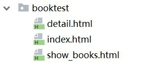

index

```html
<!DOCTYPE html>
<html lang="zh-CN">
<head>
    <meta charset="UTF-8">
    <title>模板文件</title>
</head>
<body>
<h1>这是一个模板文件</h1>
使用模板变量:<br/>
{{ content }}<br/>
使用列表:<br/>
{{ list }}<br/>
for循环:<br/>
<ul>
    
        <li>{{ i }}</li>
    
</ul>
</body>
</html>
```

show_books

```html
<!DOCTYPE html>
<html lang="zh-CN">
<head>
    <meta charset="UTF-8">
    <title>显示图书信息</title>
</head>
<body>
图书信息如下：
<ul>
    
        <li><a href="/books/{{ book.id }}">{{ book.btitle }}</a></li>
    
</ul>
</body>
</html>
```

detail

```html
<!DOCTYPE html>
<html lang="zh-CN">
<head>
    <meta charset="UTF-8">
    <title>显示图书关联的英雄信息</title>
</head>
<body>
<h1>{{ book.btitle }}</h1>
英雄信息如下:<br/>
<ul>
    
        <li>{{ hero.hname }}--{{ hero.hcomment }}</li>
    
        <li>没有英雄信息</li>
    
</ul>
</body>
</html>
```

## 模型

Django ORM

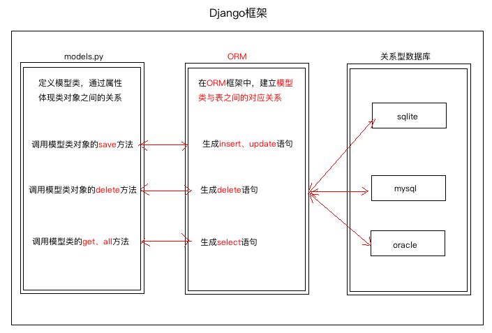

O(objects):类和对象。R(Relation):关系，关系数据库中的表格。M(Mapping):映射。

Django ORM框架的功能：

- 建立模型类和表之间的对应关系，允许我们通过面向对象的方式来操作数据库。
- 根据设计的模型类生成数据库中的表格。
- 通过方便的配置就可以进行数据库的切换。

## Django数据库配置

修改settings.py中的DATABASES

```python
DATABASES = {
    'default': {
        # 'ENGINE': 'django.db.backends.sqlite3',
        'ENGINE': 'django.db.backends.mysql',  # 使用mysql数据库
        # 'NAME': os.path.join(BASE_DIR, 'db.sqlite3'
        'NAME': 'bj18',  # 使用的数据库的名字
        'USER': 'root',  # 链接mysql的用户名
        'PASSWORD': '123456',  # 用户对应的密码
        'HOST': 'localhost',  # 指定mysql数据库所在电脑ip
        'PORT': 3306,  # mysql服务的端口号
    }
}
```

Django框架不会自动帮我们生成mysql数据库，所以我们需要自己去创建。

python2需要安装mysql-python

```python
pip install mysql-python
```

python3需要安装pymysql

```
pip install pymysql
```

python3中安装好pymysql

```python
# 修改项目目录下__init__文件
import pymysql
pymysql.install_as_MySQLdb()
```

