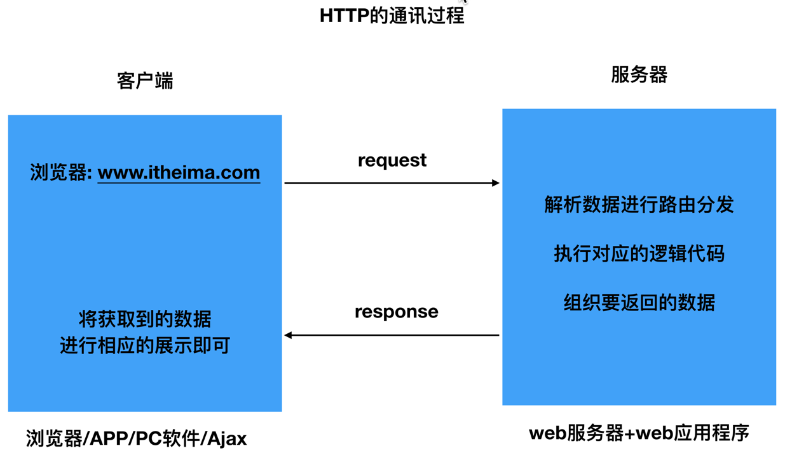

# Flask快速入门

<a href="http://flask.pocoo.org/extensions/">扩展列表</a>

<a href="http://docs.jinkan.org/docs/flask/">Flask 0.10.1文档 </a>

<a href="http://flask.pocoo.org/docs/0.12/">Flask 0.12.4 documentation </a>

## Web应用程序的本质

Web(World Wide Web)诞生最初的目的，是为了利用互联网交流工作文档。


## 使用WEB框架的优点

- 稳定性和可扩展性。

- ## 可以降低开发难度，提高开发效率。

总结一句话：避免重复造轮子




## Flask简介

Flask诞生于2010年，是用Python语言基于Werkzeug工具箱编写的轻量级Web开发框架。Flask本身相当于一个内核，其他几乎所有的功能都要用到扩展（邮件扩展Flask-Mail，用户认证Flask-Login），都需要用第三方的扩展来实现。其 WSGI 工具箱采用 Werkzeug（路由模块），模板引擎则使用 Jinja2。这两个也是Flask框架的核心。

Flask常用扩展包：

- Flask-SQLalchemy：操作数据库；
- Flask-migrate：管理迁移数据库；
- Flask-Mail:邮件；
- Flask-WTF：表单；
- Flask-Bable：提供国际化和本地化支持，翻译；
- Flask-script：插入脚本；
- Flask-Login：认证用户状态；
- Flask-OpenID：认证；
- Flask-RESTful：开发REST API的工具；
- Flask-Bootstrap：集成前端Twitter Bootstrap框架；
- Flask-Moment：本地化日期和时间；
- Flask-Admin：简单而可扩展的管理接口的框架；

扩展列表 http://flask.pocoo.org/extensions/

中文文档 http://docs.jinkan.org/docs/flask/

英文文档 http://flask.pocoo.org/docs/0.12/

## Flask与Django对比

- Django功能大而全，Flask只包含基本的配置。

- > Django的一站式解决的思路，能让开发者不用在开发之前就在选择应用的基础设施上花费大量时间。Django有模板，表单，路由，认证，基本的数据库管理等等内建功能。与之相反，Flask只是一个内核，默认依赖于两个外部库： Jinja2 模板引擎和 Werkzeug WSGI 工具集，其他很多功能都是以扩展的形式进行嵌入使用。

- Flask 比 Django 更灵活。

- Flask 在 Django 之后发布，现阶段有大量的插件和扩展满足不同需要。Django发布于2005年，Flask创始于2010年年中。


## Flask 安装环境

安装完虚拟环境后，如果提示找不到mkvirtualenv命令，须配置环境变量：

```
# 1、创建目录用来存放虚拟环境
mkdir $HOME/.virtualenvs

# 2、打开~/.bashrc文件，并添加如下：
export WORKON_HOME=$HOME/.virtualenvs
source /usr/local/bin/virtualenvwrapper.sh

# 3、运行
source ~/.bashrc
```

安装Flask

```
# 指定Flask版本安装
pip install flask==0.10.1
```

Mac系统

```
easy_install flask==0.10.1
```

## requirements 文件

Python 项目中必须包含一个 requirements.txt 文件，用于记录所有依赖包及其精确的版本号，以便在新环境中进行部署操作。在虚拟环境使用以下命令将当前虚拟环境中的依赖包以版本号生成至文件中：

```
pip freeze >requirements.txt
```

需求文件的内容示例如下：

```
alembic==0.9.2
blinker==1.4
click==6.7
dominate==2.3.1
Flask==0.10.1
Flask-Bootstrap==3.3.7.1
Flask-Login==0.4.0
Flask-Mail==0.9.1
Flask-Migrate==2.0.4
Flask-Redis==0.3.0
Flask-Script==2.0.5
Flask-SQLAlchemy==2.2
Flask-Testing==0.6.2
Flask-WTF==0.14.2
gunicorn==19.7.1
itsdangerous==0.24
Jinja2==2.9.6
Mako==1.0.6
MarkupSafe==1.0
MySQL-python==1.2.5
mysqlclient==1.3.10
PyMySQL==0.7.11
python-dateutil==2.6.0
python-editor==1.0.3
redis==2.10.5
six==1.10.0
SQLAlchemy==1.1.10
uWSGI==2.0.15
visitor==0.1.3
Werkzeug==0.12.2
WTForms==2.1
xmltodict==0.11.0
```

当需要创建这个虚拟环境的完全副本，可以创建一个新的虚拟环境，并在其上运行以下命令：

```
 pip install -r requirements.txt
```

## 从 Hello World 开始

- 当客户端想要获取资源时，一般会通过浏览器发起HTTP请求。
- 此时，Web服务器会把来自客户端的所有请求都交给Flask程序实例。
- 程序实例使用Werkzeug来做路由分发（URL请求和视图函数之间的对应关系）。
- 根据每个URL请求，找到具体的视图函数并进行调用。在Flask程序中，路由的实现一般是通过程序实例的装饰器实现。
- Flask调用视图函数后，可以返回两种内容。字符串内容：将视图函数的返回值作为响应的内容，返回给客户端(浏览器)。HTML模版内容：获取到数据后，把数据传入HTML模板文件中，模板引擎负责渲染HTTP响应数据，然后返回响应数据给客户端(浏览器)。

**示例**

新建Flask项目

```python
# 导入Flask类
from flask import Flask
# Flask函数接收一个参数name，它会指向程序所在的模块
app = Flask(__name__)
# 装饰器的作用是将路由映射到视图函数index
@app.route('/')
def index():
    return 'Hello World'
# Flask应用程序实例的run方法启动WEB服务器
if __name__ == '__main__':
    app.run()
```

## 路由定义的基本方式

请求方式限定

```python
# 使用 methods 参数指定可接受的请求方式，可以是多种
@app.route('/',methods=['GET', 'POST'])
def hello():
    return 'hello world'
```

给路由传参示例

有时我们需要将同一类URL映射到同一个视图函数处理，比如：使用同一个视图函数来显示不同用户的订单信息。

```python
# 路由传递的参数默认当做string处理
@app.route('/orders/<order_id>')
def hello_itheima(order_id):
    # 此处的逻辑: 去查询数据库改用户的订单信息, 并返回
    print type(order_id) # 类型为unicode
    return 'hello itcast %d' % order_id
```

这里指定int，会调用系统的路由转换器进行匹配和转换。大致原理是将参数强转为int，如果成功，则可以进行路由匹配。如果参数无法转换成功，就无法匹配该路由。

```python
@app.route('/orders/<int:order_id>')
def hello_itheima(order_id):
    print type(order_id) # 类型为int
    return 'hello itcast %d' % order_id
```

## 模板

## Jinja2

- Jinja2：是 Python 下一个被广泛应用的模板引擎，是由Python实现的模板语言，他的设计思想来源于 Django 的模板引擎，并扩展了其语法和一系列强大的功能，其是Flask内置的模板语言。
- 模板语言：是一种被设计来自动生成文档的简单文本格式，在模板语言中，一般都会把一些变量传给模板，替换模板的特定位置上预先定义好的占位变量名。

渲染模版函数

- Flask提供的 render_template 函数封装了该模板引擎。
- render_template 函数的第一个参数是模板的文件名，后面的参数都是键值对，表示模板中变量对应的真实值。

**使用**

注释 

```
{# 这是注释 #}
```

变量代码块

```
{{ post.title }}
```

Jinja2 模版中的变量代码块可以是任意Python类型或者对象，只要它能够被Python的str()方法转换为一个字符串就可以，比如，可以通过下面的方式显示一个字典或者列表中的某个元素:

```
{{your_dict['key']}}
{{your_list[0]}}
```

控制代码块

```

    {{ user }}

    hello!


    {{ index }} 

```

## 过滤器

过滤器的本质就是函数。有时候我们不仅仅只是需要输出变量的值，我们还需要修改变量的显示，甚至格式化、运算等等，而在模板中是不能直接调用 Python 中的某些方法，那么这就用到了过滤器。

过滤器的使用方式为：变量名 | 过滤器。

```
{{variable | filter_name(*args)}}
```

如果没有任何参数传给过滤器，则可以把括号省略掉。

```
{{variable | filter_name}}
```

在 jinja2 中，过滤器是可以支持链式调用的。

```
{{ "hello world" | reverse | upper }}
```

## 常见内建过滤器

字符串操作

- safe：禁用转义
- capitalize：把变量值的首字母转成大写，其余字母转小写
- lower：把值转成小写
- upper：把值转成大写
- title：把值中的每个单词的首字母都转成大写
- reverse：字符串反转
- format：格式化输出
- striptags：渲染之前把值中所有的HTML标签都删掉
- truncate: 字符串截断

```
<p>{{ '<em>hello</em>' | safe }}</p>
<p>{{ 'hello' | capitalize }}</p>
<p>{{ 'HELLO' | lower }}</p>
<p>{{ 'hello' | upper }}</p>
<p>{{ 'hello' | title }}</p>
<p>{{ 'olleh' | reverse }}</p>
<p>{{ '%s is %d' | format('name',17) }}</p>
<p>{{ '<em>hello</em>' | striptags }}</p>
<p>{{ 'hello every one' | truncate(9)}}</p>
```

列表操作

- first：取第一个元素
- last：取最后一个元素
- length：获取列表长度
- sum：列表求和
- sort：列表排序

```
<p>{{ [1,2,3,4,5,6] | first }}</p>
<p>{{ [1,2,3,4,5,6] | last }}</p>
<p>{{ [1,2,3,4,5,6] | length }}</p>
<p>{{ [1,2,3,4,5,6] | sum }}</p>
<p>{{ [6,2,3,1,5,4] | sort }}</p>
```

语句块过滤

```

    一大堆文字

```

