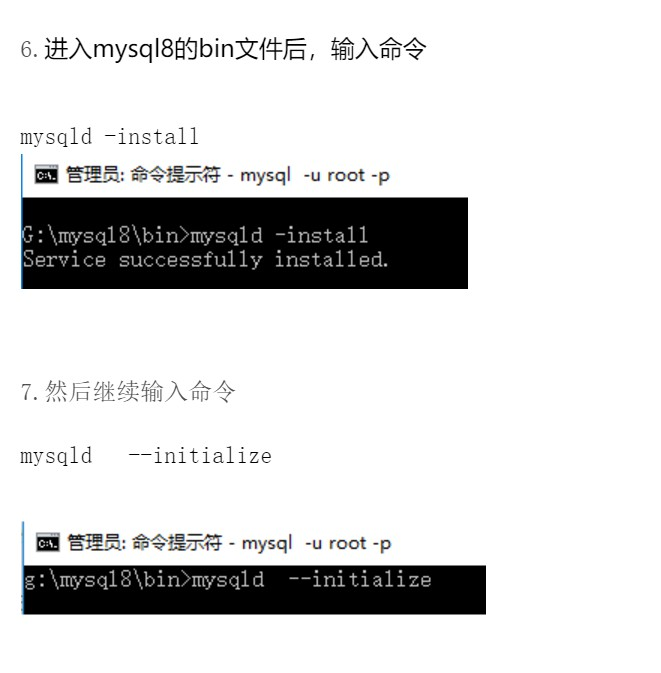
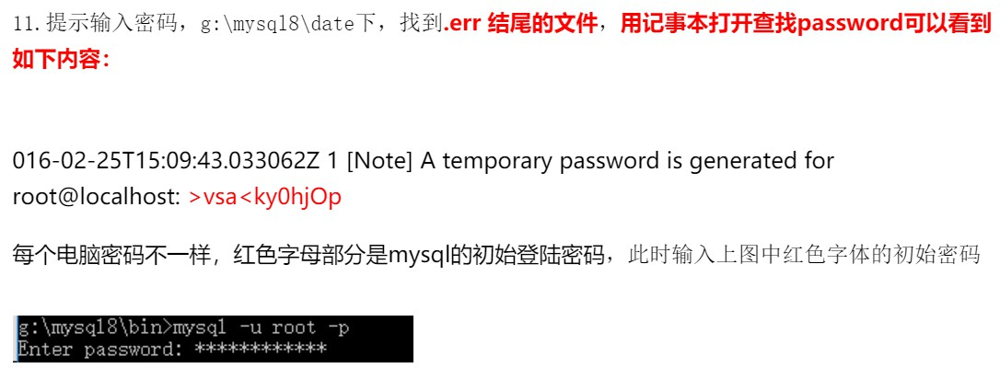

### 一、概述

1、什么是数据库（DataBase，简称DB） ？

数据库即存放数据的仓库，只不过这个仓库是在计算机存储设备上，而且数据是按一定的格式存放的。

过去人们将数据存放在文件柜里，现在数据量庞大，已经不再适用。

数据库是长期存放在计算机内、有组织、可共享的数据集合。

数据库中的数据按一定的数据模型组织、描述和储存，具有较小的冗余度、较高的数据独立性和易扩展性，并可为各种用户共享。

2、什么是数据库管理系统（DataBase Management System 简称DBMS）

在了解了数据与数据库的概念后，如何科学地组织和存储数据，如何高效获取和维护数据成了关键。

这就用到了一个系统软件——数据库管理系统，如MySQL、Oracle、SQLite、Access、MS SQL Server。

mysql主要用于大型门户，例如搜狗、新浪等，它主要的优势就是开放源代码，因为开放源代码这个数据库是免费的，他现在是甲骨文公司的产品。
oracle主要用于银行、铁路、飞机场等。该数据库功能强大，软件费用高。也是甲骨文公司的产品。
sql server是微软公司的产品，主要应用于大中型企业，如联想、方正等。

 **数据库服务器、数据管理系统、数据库、表与记录的关系（重点）**

 数据库服务器：运行数据库管理软件

 数据库管理软件：管理-数据库

 数据库：即文件夹，用来组织文件/表

 表：即文件，用来存放多行内容/多条记录

3、数据库管理软件分类

管理数据的工具有很多种，不止mysql一个。关于分类其实可以从各个纬度来进行划分，但是我们最常使用的分类

还是根据他们存取数据的特点来划分的，主要分为关系型和非关系型。可以简单的理解为，关系型数据库需要有表

结构，非关系型数据库是key-value存储的，没有表结构。

关系型：如sqllite，db2，oracle，access，sql server，MySQL，注意：sql语句通用

非关系型：mongodb，redis，memcache

4、mysql

MySQL是一个关系型数据库管理系统，由瑞典MySQL AB 公司开发，目前属于 Oracle 旗下公司。MySQL 最流行

的关系型数据库管理系统，在 WEB 应用方面MySQL是最好的 RDBMS (Relational Database Management System，关系数据库管理系统) 应用软件之一。

5、什么是SQL（Structured Query Language） ？

SQL，是结构化查询语言（Structured Query Language）的缩写，SQL是一种专门用来与数据库通信的语言。


*总结一句话：其实mysql就是用于管理我们的文件的一个软件。*

*对于mysql这个软件来说有两个软件：服务器软件、客户端软件*


### 二、下载安装

<a href="https://blog.csdn.net/iyayaqiqi/article/details/80536110">8.0.11版本Mysql初次安装过程中遇到MySQL 服务无法启动的解决方法</a>

 


**Window版本**

1.官网去下载

[官网下载](https://dev.mysql.com/downloads/mysql/)

2.针对操作系统的不同下载不同的版本

3.解压

4.添加环境变量

5.初始化

打开cmd窗口，必须以管理员身份运行，输入以下命令

```
mysqld --initialize-insecure
```

6.启动mysql服务

```
mysqld 
```

7.启动mysql客户端并连接mysql服务端

新开一个cmd窗口

```
mysql -u root -p
```

初始化时使用的【mysqld --initialize-insecure】命令，其默认未给root账户设置密码

8.MySQL服务制作成windows服务

在终端执行命令

```
mysqld --install
```

移除MySQL的Windows服务，在终端执行此命令

```
mysqld --remove
```

启动MySQL服务

```
net start mysql
```

关闭MySQL服务

```
net stop mysql
```

### **三、windows下登录设置密码**

终端执行命令

```
mysqladmin -uroot -p password "123123"
```

或者**以root身份登录mysql修改密码**

查询用户密码

```
 select host,user,authentication_string from mysql.user;
```

host: 允许用户登录的ip‘位置'%表示可以远程；

user:当前数据库的用户名；

authentication_string: 用户密码；

mysql 5.7.9以后废弃了password字段和password()函数；authentication_string:字段表示用户密码。

设置（或修改）root用户密码

一、如果当前root用户authentication_string字段下有内容，先将其设置为空，否则直接进行二步骤。

```
use mysql; 
update user set authentication_string='' where user='root';
```

二、使用ALTER修改root用户密码,方法为 ALTER user ['root'@'localhost'](mailto:'root'@'localhost') IDENTIFIED BY '新密码'。

```
ALTER user 'root'@'localhost' IDENTIFIED BY 'Cliu123#';
```

**MySQL 8下忘密码后重置密码的办法**

参考 [MySQL 8下忘密码后重置密码的办法](https://blog.csdn.net/gupao123456/article/details/80766154)

方法一:利用--init-file参数解决

该参数指定服务启动时先执行一个包含sql命令文件，因此，只需要将重置密码的命令写在该文件中，以此参数指定启动时执行该命令，启动完成即可重置系统密码了。

第一步，关掉系统服务

```
net stop mysql
```

第二步，创建一个文本文件，内含一条密码修改命令

```
ALTER USER 'root'@'localhost' IDENTIFIED BY '';
```

第三步：命令行方式启动服务器，指定启动时执行上述的密码修改命令文件

```
mysqld --init-file=d:mysqlc.txt --console
```


方法二

同方法一，先关掉系统服务

进入bin目录无密码启动服务

```
mysqld --console --skip-grant-tables --shared-memory
```


服务启动后，以空密码登入系统

然后执行sql命令将root用户密码设置为空

```
UPDATE mysql.user SET authentication_string='' WHERE user='root' and host='localhost';
```

补充：

查看当前mysql的进程

```
tasklist |findstr mysql  
```

杀死当前的进程，执行如下命令

```
taskkill /F /PID 6052
```

查看本机端口

```
netstat -nao
```


### 四、数据库操作

1、显示所有数据库

```
SHOW DATABASES;
```

2、创建数据库

```
create database db1 charset utf8;
```

3、使用数据库

```
USE db1;
```

4、查

查看当前使用的是哪个数据库

```
select database();
```

查看创建数据库的语句

```
show create database db1;
```

5、改

```
alter database db1 charset gbk;
```

6、删

```
drop database db1;
```

### 五、用户管理

创建用户：create user '用户名'@'地址' identified by '密码';

```
create user 'test'@'localhost' identified by '123123';
```

删除用户：drop user '用户名'@'地址'

```
drop user 'test'@'localhost';
```

修改用户：rename user '用户名'@'地址' to '新用户名'@'地址';

```
rename user 'test'@'localhost' to 'test2'@'localhost';
```

授权管理

show grants for '用户'@'地址'                                    -- 查看权限
grant  权限 on 数据库.表 to   '用户'@'地址'               -- 授权
revoke 权限 on 数据库.表 from '用户'@'地址'           -- 取消权限 

```
show grants for 'test'@'localhost';
grant select on *.* to 'test'@'localhost';
revoke select on *.* from 'test'@'localhost';
```

```
 数据库名.*           数据库中的所有
 数据库名.表          指定数据库中的某张表
 *.*                所有数据库
```

```
用户名@IP地址         用户只能在该IP下才能访问
用户名@192.168.1.%   用户只能在改该IP段下才能访问(通配符%表示任意)
用户名@%             用户可以再任意IP下访问(默认IP地址为%)
```

特殊的

```
flush privileges # 将数据读取到内存中，从而立即生效
```

### 六、数据表基本

1、创建表

```
create table 表名(
    列名  类型  约束，
    列名  类型  约束
)ENGINE=InnoDB DEFAULT CHARSET=utf8;
```

```
not null 不可空，null 可空

default，默认值，创建列时可以指定默认值，当插入数据时如果未主动设置，则自动添加默认值
```

```
auto_increment，自增，如果为某列设置自增列，插入数据时无需设置此列，默认将自增（表中只能有一个自增列）

注意：1、对于自增列，必须是索引（含主键）2、对于自增可以设置步长和起始值

在mysql中如果要查看自增字段的自增量和初始值，可以用如下sql语句:
SHOW VARIABLES LIKE 'auto_inc%';
auto_increment_offset 表示自增长字段从那个数开始，他的取值范围是1 .. 65535 
auto_increment_increment 表示自增长字段每次递增的量，其默认值是1，取值范围是1 .. 65535

查询表名为tableName的auto_increment值：
SELECT AUTO_INCREMENT FROM information_schema.tables WHERE table_name="tableName";

修改表名为tableName的auto_increment值：
ALTER TABLE tableName auto_increment=number ;

每一张表的auto_increment值是独立的，都是从1开始，不会相互影响

set global auto_increment_increment=1;
set global auto_increment_offset=1;
```

```
主键

create table tb1(
    nid int not null auto_increment primary key,
    num int null
    );

create table tb1(
    nid int not null,
    num int not null,
    primary key(nid,num)
    );
```

```
外键

先创建主表，后创建从表
create table color(
    nid int not null primary key,
    name char(16) not null
	);

create table fruit(
    nid int not null primary key,
    smt char(32) null ,
    color_id int not null,
    constraint fk_cc foreign key(color_id) references color(nid)
	);		
create table fruit2(
    nid int not null primary key,
    smt char(32) null ,
    color_id int not null,
    foreign key(color_id) references color(nid)
	);	

```

2、删除表

```
drop table 表名;
```

3、修改表

```
添加列：alter table 表名 add 列名 类型;
删除列：alter table 表名 drop column 列名;/alter table 表名 drop 列名;
修改列：
        alter table 表名 modify column 列名 类型;    
        alter table 表名 change 原列名 新列名 类型;   
  
添加主键：
        alter table 表名 add primary key(列名);
删除主键：
        alter table 表名 drop primary key;
        alter table 表名 modify 列名 int, drop primary key;
  
添加外键：
alter table 表名 add constraint FK_ID foreign key(你的外键字段名) REFERENCES 外表表名(对应的表的主键字段名);
alter table 从表 add foreign key(外键字段) references 主表(主键字段);
删除外键：alter table 表名 drop foreign key 外键名称
  
修改默认值：ALTER TABLE testalter_tbl ALTER i SET DEFAULT 1000;
删除默认值：ALTER TABLE testalter_tbl ALTER i DROP DEFAULT;
```

4、 查看表

```
查看表结构
desc 数据表的名字;
查看表的创建语句
show create table 表名字;
```

### 七、操作文件内容

1、增

```
insert 表 values (值,值,值...);
insert into 表 values(值,值,值...);
insert into 表(列名,列名...) values(值,值,值...);
insert into 表(列名,列名...) values(值,值,值...),(值,值,值...);
insert into 表(列名,列名...) select (列名,列名...) from 表;
使用set
insert into 表 set 字段=值,字段=值;
```

2、删

```
清空表
delete from 表;
truncate table 表;

delete from 表 where id＝1 and name＝'alex';
```

3、改

```
update 表 set 字段 ＝ 值;
update 表 set 字段 ＝ 值, 字段2 ＝ 值 where id>6;
```

4、查

```
select * from 表;
select * from 表 where 条件;
select 字段,字段,字段 as 别名 from 表 where 条件;
select 字段,字段,常量 from 表;
select * from 数据库名.表名;
```

5、其他

```
a、条件
select * from 表 where id > 1 and name != 'alex' and num = 12;
select * from 表 where id between 5 and 16;
select * from 表 where id in (11,22,33);
select * from 表 where id not in (11,22,33);
select * from 表 where id in (select nid from 表);

b、通配符
select * from 表 where name like 'ale%';  - ale开头的所有（多个字符串）
select * from 表 where name like 'ale_' ; - ale开头的所有（一个字符）

c、分页
LIMIT基本语法：
SELECT * FROM table  LIMIT [offset,] rows | rows OFFSET offset;

如果只给定一个参数，表示记录数
SELECT * FROM orange LIMIT 5;     //检索前5条记录(1-5)
相当于
SELECT * from orange LIMIT 0,5;

两个参数，第一个参数表示offset, 第二个参数为记录数
SELECT * FROM orange LIMIT 10,15;  // 检索记录11-25

再如，另一种用法：
SELECT * FROM orange LIMIT 2 OFFSET 3; //查询4-5两条记录
等价于
SELECT * FROM orange  LIMIT 3,2;


select * from 表 order by id desc limit 5; //id倒序排列查找最后5条记录

d、排序
select * from 表 order by 列 asc;              - 根据 “列” 从小到大排列
select * from 表 order by 列 desc;             - 根据 “列” 从大到小排列
select * from 表 order by 列1 desc,列2 asc;    - 根据 “列1” 从大到小排列，如果相同则按列2从小到大排序

e、分组
select cate_id,count(id),max(price) from goods group by cate_id;
select cate_id,count(id),max(price) from goods where id < 11 group by cate_id;
select cate_id,count(id),max(price),sum(price) from goods where id < 11 group by cate_id;
select cate_id,count(id),max(price),sum(price) from goods where id < 11 group by cate_id having max(price) > 4000;
select cate_id,count(id),max(price),sum(price) from goods where id < 11 group by cate_id having max(price) > 4000 order by sum(price) desc;

对于聚合函数结果进行二次筛选时必须使用having
聚合函数有count，max，min，sum，avg
group by 必须在where之后，order by之前

f、连表
select * from 表1,表2;

无对应关系则不显示
select * from goods_cates, goods where goods_cates.id = goods.cate_id;
select * from goods_cates inner join goods on goods_cates.id = goods.cate_id;

goods_cates表所有显示，如果goods表中无对应关系，则值为null
select goods_cates.name as 商品分类, goods.name as 商品名,goods.price as 商品价格 from goods_cates left join goods on goods_cates.id = goods.cate_id;

goods_cates表所有显示，如果goods表中无对应关系，则值为null
select goods_cates.name as 商品分类, goods.name as 商品名,goods.price as 商品价格 from goods right join goods_cates on goods_cates.id = goods.cate_id;

g、组合
组合，自动处理重合
select nickname from A union select name from B;
组合，不处理重合
select nickname from A union all select name from B;
```


### 八、基本数据类型

```
bit[(M)]
二进制位（101001），m表示二进制位的长度（1-64），默认m＝1

tinyint[(m)] [unsigned] [zerofill]
小整数，数据类型用于保存一些范围的整数数值范围
有符号：-128 ～ 127 无符号：0 ～ 255

int[(m)][unsigned][zerofill]
整数，数据类型用于保存一些范围的整数数值范围
有符号： -2147483648 ～ 2147483647 无符号：0 ～ 4294967295

bigint[(m)][unsigned][zerofill]
大整数，数据类型用于保存一些范围的整数数值范围
有符号：-9223372036854775808 ～ 9223372036854775807
无符号： 0  ～  18446744073709551615

decimal[(m[,d])] [unsigned] [zerofill]
准确的小数值，m是数字总个数（负号不算），d是小数点后个数。 m最大值为65，d最大值为30
对于精确数值计算时需要用此类型，decaimal能够存储精确值的原因在于其内部按照字符串存储

FLOAT[(M,D)] [UNSIGNED] [ZEROFILL]
单精度浮点数（非准确小数值），m是数字总个数，d是小数点后个数
数值越大，越不准确

DOUBLE[(M,D)] [UNSIGNED] [ZEROFILL]
双精度浮点数（非准确小数值），m是数字总个数，d是小数点后个数
数值越大，越不准确

char(m)
char数据类型用于表示固定长度的字符串，可以包含最多达255个字符。其中m代表字符串的长度
即使数据小于m长度，也会占用m长度

varchar(m)
varchars数据类型用于变长的字符串，可以包含最多达255个字符。其中m代表该数据类型所允许保存的字符串的最大长度，只要长度小于该最大值的字符串都可以被保存在该数据类型中

虽然varchar使用起来较为灵活，但是从整个系统的性能角度来说，char数据类型的处理速度更快，有时甚至可以超出varchar处理速度的50%。因此，用户在设计数据库时应当综合考虑各方面的因素，以求达到最佳的平衡

text
text数据类型用于保存变长的大字符串，可以组多到65535 (2**16 − 1)个字符

mediumtext
A TEXT column with a maximum length of 16,777,215 (2**24 − 1) characters

longtext
A TEXT column with a maximum length of 4,294,967,295 or 4GB (2**32 − 1) characters

enum
枚举类型
An ENUM column can have a maximum of 65,535 distinct elements. (The practical limit is less than 3000)
示例：
CREATE TABLE shirts (
    name VARCHAR(40),
    size ENUM('x-small', 'small', 'medium', 'large', 'x-large')
    );
INSERT INTO shirts (name, size) VALUES ('dress shirt','large'), ('t-shirt','medium'),('polo shirt','small');

set
集合类型
A SET column can have a maximum of 64 distinct members
示例：
CREATE TABLE myset (col SET('a', 'b', 'c', 'd'));
INSERT INTO myset (col) VALUES ('a,d'), ('d,a'), ('a,d,a'), ('a,d,d'), ('d,a,d');

```


**日期和时间类型**

| 类型      | 大小(字节) | 范围                                                         | 格式                | 用途                     |
| --------- | ---------- | ------------------------------------------------------------ | ------------------- | ------------------------ |
| DATE      | 3          | 1000-01-01/9999-12-31                                        | YYYY-MM-DD          | 日期值                   |
| TIME      | 3          | '-838:59:59'/'838:59:59'                                     | HH:MM:SS            | 时间值或持续时间         |
| YEAR      | 1          | 1901/2155                                                    | YYYY                | 年份值                   |
| DATETIME  | 8          | 1000-01-01 00:00:00/9999-12-31 23:59:59                      | YYYY-MM-DD HH:MM:SS | 混合日期和时间值         |
| TIMESTAMP | 4          | 1970-01-01 00:00:00/2038                                                           结束时间是第 **2147483647** 秒，北京时间 **2038-1-19 11:14:07**，格林尼治时间 2038年1月19日 凌晨 03:14:07 | YYYYMMDD HHMMSS     | 混合日期和时间值，时间戳 |

**补充**

主键

一个表只能有一个主键，主键可以由多列组成

外键

CONSTRAINT后面的名字不可以重复

```
CREATE TABLE t5 (
    nid int(11) NOT NULL AUTO_INCREMENT,
    pid int(11) not NULL,
    num int(11),
    primary key(nid,pid)
    ) ENGINE=InnoDB DEFAULT CHARSET=utf8;

create table t6(
    id int auto_increment primary key,
    name char(10),
    id1 int,
    id2 int,
    CONSTRAINT fk_t5_t6 foreign key (id1,id2) REFERENCES t5(nid,pid)
    )engine=innodb default charset=utf8;
    
create table t7(
    id int auto_increment primary key,
    name char(10),
    id1 int,
    id2 int,
    foreign key (id1,id2) REFERENCES t5(nid,pid)
    )engine=innodb default charset=utf8;
```

**自增列**

```mysql
-- 修改自增列之初始值
create table t10(id int auto_increment primary key,
	name char(10))engine=innodb default charset=utf8;
alter table t10 AUTO_INCREMENT=20;

-- 自增步长
-- 基于会话级别：
show session variables like 'auto_inc%';
set session auto_increment_increment=2;
set session auto_increment_offset=10;

-- 基于全局级别
show global variables like 'auto_inc%';
set global auto_increment_increment=2;
set global auto_increment_offset=10;
```

**唯一索引**

```
单列唯一
create table t1(
			id int auto_increment primary key,
			num int,
			xx int,
			unique 唯一索引名称 (列名)			
		);

联合唯一
create table t2(
			id int auto_increment primary key,
			num int,
			xx int,
			unique 唯一索引名称 (列名，列名，...)			
		);
		
唯一索引：约束，不能重复，可以为空
主键：不能重复，不能为空

加速查找
```

**导出现有数据库数据**

```

mysqldump -u用户名 数据库名称 > 导出文件路径 -p密码        //数据结构+数据
mysqldump -u用户名 -d 数据库名称 > 导出文件路径 -p密码    //数据结构

```

**导入现有数据库数据**

```
use 数据库名称;
source 文件路径;

或者终端执行
mysql -u用户名 –p 新数据库名 < python.sql
```
