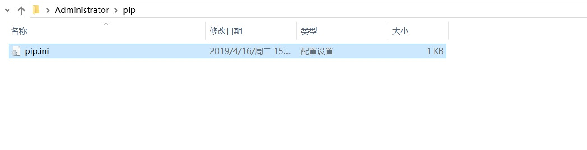
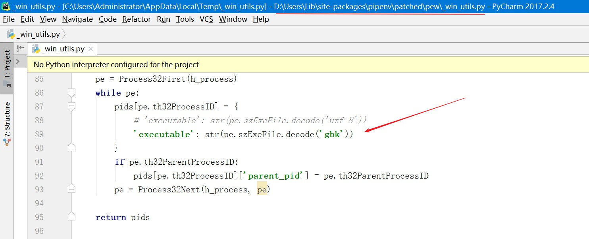

https://pypi.org/

http://pypi.douban.com/simple/



```
[global]
index-url = https://pypi.doubanio.com/simple/
[install]
trusted-host = pypi.doubanio.com
```

```
python3-m pip install wheel
```

https://zh-sphinx-doc.readthedocs.io/en/latest/contents.html

```
python3 setup.py --help-commands
```

https://virtualenv.pypa.io/en/latest/userguide/

https://pypi.python.org/pypi/virtualenvwrapper-win

https://docs.pipenv.org/

```
pip install pipenv==11.9.0
```

https://blog.csdn.net/weixin_34378045/article/details/86929810

```
str(pe.szExeFile.decode('utf-8')
#改为
str(pe.szExeFile.decode('gbk')
```



