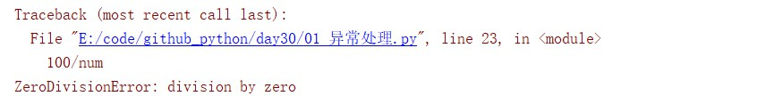
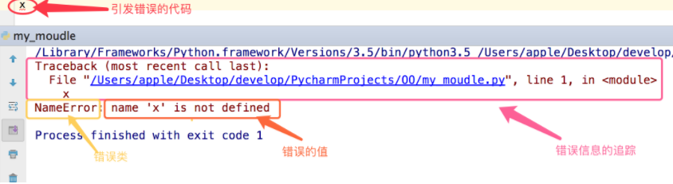

<a href="https://www.cnblogs.com/xiao987334176/p/8964282.html">python 全栈开发，Day30</a>

# 回顾

1.import一个模块相当于执行这个py文件

2.模块不会被重复导入

3.导入的模块存到sys.modules里

4.导入模块的之后发生了什么：先看看模块在不在sys.modules里，如果不在：生成一个属于模块的命名空间执行py文件，创建一个与py文件同名的变量来引用这个空间中的名字把导入的这个模块放到sys.modules里。

# 异常和错误

程序中难免出现错误，而错误分成两种。

1.语法错误（这种错误，根本过不了python解释器的语法检测，必须在程序执行前就改正）

2.逻辑错误

```python
num = 0
100 / num
```



异常就是程序运行时发生错误的信号，在python中，错误触发的异常如下。




# python中的异常种类

在python中不同的异常可以用不同的类型（python中统一了类与类型，类型即类）去标识，不同的类对象标识不

同的异常，一个异常标识一种错误。

触发IndexError

```python
l = ['egon', 'aa']
l[3]
# IndexError: list index out of range
```

触发KeyError

```python
dic = {'name': 'egon'}
dic['age']
# KeyError: 'age'
```

触发ValueError

```python
s = 'hello'
int(s)
# ValueError: invalid literal for int() with base 10: 'hello'
```

触发TypeError

```python
g = '1234567890'
print('maximum in g is %d ' % max(g))
# TypeError: %d format: a number is required, not str
```

常见异常

- AttributeError 试图访问一个对象没有的属性，比如foo.x，但是foo没有属性x

- IOError 输入/输出异常；基本上是无法打开文件

- ImportError 无法引入模块或包；基本上是路径问题或名称错误

- IndentationError 语法错误（的子类） ；代码没有正确对齐

- IndexError 下标索引超出序列边界，比如当x只有三个元素，却试图访问x[5]

- KeyError 试图访问字典里不存在的键

- KeyboardInterrupt Ctrl+C被按下

- NameError 使用一个还未被赋予对象的变量

- SyntaxError Python代码非法，代码不能编译(个人认为这是语法错误，写错了）

- TypeError 传入对象类型与要求的不符合

- UnboundLocalError 试图访问一个还未被设置的局部变量，基本上是由于另有一个同名的全局变量，导致你

  以为正在访问它

- ValueError 传入一个调用者不期望的值，即使值的类型是正确的

更多异常

```
ArithmeticError
AssertionError
AttributeError
BaseException
BufferError
BytesWarning
DeprecationWarning
EnvironmentError
EOFError
Exception
FloatingPointError
FutureWarning
GeneratorExit
ImportError
ImportWarning
IndentationError
IndexError
IOError
KeyboardInterrupt
KeyError
LookupError
MemoryError
NameError
NotImplementedError
OSError
OverflowError
PendingDeprecationWarning
ReferenceError
RuntimeError
RuntimeWarning
StandardError
StopIteration
SyntaxError
SyntaxWarning
SystemError
SystemExit
TabError
TypeError
UnboundLocalError
UnicodeDecodeError
UnicodeEncodeError
UnicodeError
UnicodeTranslateError
UnicodeWarning
UserWarning
ValueError
Warning
ZeroDivisionError
```


# 使用if判断式

使用if判断，进行异常处理

```python
num1 = input('>> ')  # 输入一个字符串试试
if num1.isdigit():
    int(num1)  # 我们的正统程序放到了这里,其余的都属于异常处理范畴
elif num1.isspace():
    print('输入的是空格,就执行我这里的逻辑')
elif len(num1) == 0:
    print('输入的是空,就执行我这里的逻辑')
else:
    print('其他情情况,执行我这里的逻辑')
```

问题一
使用if的方式我们只为第一段代码加上了异常处理，但这些if，跟你的代码逻辑并无关系，这样你的代码会因为可读性差而不容易被看懂。
问题二
这只是我们代码中的一个小逻辑，如果类似的逻辑多，那么每一次都需要判断这些内容，就会导致我们的代码特别冗长。

总结

1.if判断式的异常处理只能针对某一段代码，对于不同的代码段的相同类型的错误你需要写重复的if来进行处理。
2.在你的程序中频繁的写与程序本身无关，与异常处理有关的if，会使得你的代码可读性极其的差。
3.if是可以解决异常的，只是存在1,2的问题，所以，千万不要妄下定论if不能用来异常处理。

```python
def test():
    print('test running')


choice_dic = {
    '1': test
}
while True:
    choice = input('>> ').strip()
    if not choice or choice not in choice_dic: continue  # 这便是一种异常处理机制
    choice_dic[choice]()
```

# 异常处理

python为每一种异常定制了一个类型，然后提供了一种特定的语法结构用来进行异常处理。

# 基本语法

```
try:
     被检测的代码块
except 异常类型：
     try中一旦检测到异常，就执行这个位置的逻辑
```

```python
f = open('a.txt')
g = (line.strip() for line in f)
for line in g:
    print(line)
else:
    f.close()
    
# 文件不存在，提示报错
# FileNotFoundError: [Errno 2] No such file or directory: 'a.txt'
```

异常类只能用来处理指定的异常情况，如果非指定异常则无法处理。

```python
s1 = 'hello'
try:
    int(s1)
except IndexError as e:
    print(e)
# 执行输出：
# ValueError: invalid literal for int() with base 10: 'hello'
```

# 多分支

```python
s1 = 'hello'
try:
    int(s1)
except IndexError as e:
    print(e)
except KeyError as e:
    print(e)
except ValueError as e:
    print(e)
# invalid literal for int() with base 10: 'hello'
```

# 万能异常 

Exception，他可以捕获任意异常。

```python
s1 = 'hello'
try:
    int(s1)
except Exception as e:
    print(e)
# invalid literal for int() with base 10: 'hello'
```

如果你想要的效果是，无论出现什么异常，我们统一丢弃，或者使用同一段代码逻辑去处理他们，那么一个

Exception就足够了。如果你想要的效果是，对于不同的异常我们需要定制不同的处理逻辑，那就需要用到多分支

了。

# 多分支+Exception

```python
s1 = 'hello'
try:
    int(s1)
except IndexError as e:
    print(e)
except KeyError as e:
    print(e)
except ValueError as e:
    print(e)
except Exception as e:
    print(e)
```

万能异常，必须在单分支异常的后面。

# 多分支+else

```python
try:
    name = 10
except NameError:
    print('触发了NameError')
else:
    print('执行了else里的语句')
```

这个else的意思就是，没有捕获到异常，就执行else的语句。但凡用到else，必须要有except。用到except，不一

定有else。

# finally

```python
try:
    name
except NameError as n:
    print(n)
else:
    print('try内代码块没有异常则执行我')
finally:
    print('无论异常与否,都会执行该模块,通常是进行清理工作')
```

不管是否触发了错误，都会执行finally中的代码，finally必须在最下面。

```python
try:
    name
finally:
    print('出错了')
# 出错了
# NameError: name 'name' is not defined
```

它是先执行finally，再执行报错。

```python
f = open('a.txt') # 测试时需路径下有a.txt文件
try:
    print('操作f')
    name
finally:
    f.close()
    print('关闭文件了!')
    
# Traceback (most recent call last):
# 操作f
# 关闭文件了!
# NameError: name 'name' is not defined
```

虽然出现异常了，但是关闭了文件句柄。

```python
def func():
    try:
        return 1
    finally:
        print('关闭文件了!')

func()
# 关闭文件了!
```

在函数里面，遇到return，下面的代码就不会执行了。但是在这里，finally也依然会执行。

装饰器函数

```python
import time


def wrapper(func):
    def inner(*args, **kwargs):
        start = time.time()
        ret = func(*args, **kwargs)
        end = time.time()
        print(end - start)
        return ret

    return inner


@wrapper
def func():
    time.sleep(1)


func()
```

改造成finally

```python
import time


def wrapper(func):
    def inner(*args, **kwargs):
        try:
            start = time.time()
            ret = func(*args, **kwargs)
            return ret
        finally:
            end = time.time()
            print(end - start)

    return inner


@wrapper
def func():
    time.sleep(1)
    return 1


res = func()
print(res)

# 1.000303030014038
# 1
```

在return之前，会执行finally的代码，等finanlly代码执行之后，再return。finally一般用来做一些收尾工作，比如

f.close() 或者关闭网络连接，比如mysql。

# 4种情景

```
try except
try中的代码遇到异常，就执行except中的代码。
try except else 
try中的代码遇到异常，就执行except中的代码，没遇到异常就执行else中的代码。
trt except else finally
try中的代码遇到异常，就执行except中的代码，没遇到异常就执行else中的代码，无论如何都执行finally中的代码。
try finally
不能处理异常了，但是无论是否发生异常，都会执行finally中的代码。
这些异常，顺序不能变，比如try else except，这样就会报错。
```

# 主动触发异常

```python
raise TypeError
# 执行输出：
# TypeError
```

支付场景

```python
class Payment:
    def pay(self, money):
        raise NotImplementedError('没有实现pay方法')


class Alipay(Payment):
    def pay(self, money):
        print('支付宝支付%s元' % money)


class WechatPay(Payment):
    def fuqian(self, money):
        print('微信支付%s元' % money)


def pay(obj, money):
    obj.pay(money)


we = WechatPay()
pay(we, 10)
# NotImplementedError: 没有实现pay方法
```

# 自定义异常

BaseException 是异常祖宗的祖宗

```python
class EvaException(BaseException):
    def __init__(self, msg):
        self.msg = msg

    def __str__(self):
        return self.msg


try:
    raise EvaException('类型错误')
except EvaException as e:
    print(e)

# 类型错误
```

# 断言

语法

```
assert 条件
```

```python
assert 1 == 2
print('123')
# AssertionError
```

程序没有满足条件，下面的代码都不执行。这个时候，就可以用到断言。

它和if的功能类似，但是if它不会报错，断言会报错。

如果if判断的条件过多时，写if判断，太麻烦了。

这个时候，就需要用到断言。断言是用到一个非常果决的场景，如果不满足，后面的代码都不执行。

捕获断言

```python
try:
    assert 1 == 2
except AssertionError:
    pass
print(123)
# 123
```


