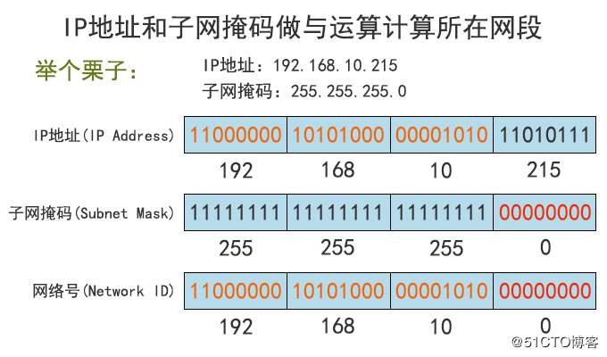

# 网络编程

<a href="https://www.cnblogs.com/xiao987334176/p/8980453.html">python 全栈开发，Day32(知识回顾,网络编程基础)</a>

## 软件开发的架构

我们了解的涉及到两个程序之间通讯的应用大致可以分为两种：
第一种是应用类：qq、微信、网盘、优酷这一类是属于需要安装的桌面应用。
第二种是web类：比如百度、知乎、博客园等使用浏览器访问就可以直接使用的应用。
这些应用的本质其实都是两个程序之间的通讯，而这两个分类又对应了两个软件开发的架构～。

1.C/S架构
C/S即：Client与Server ，中文意思：客户端与服务器端架构，这种架构是从用户层面（也可以是物理层面）来划分的。这里的客户端一般泛指客户端应用程序EXE，程序需要先安装后，才能运行在用户的电脑上，对用户的电脑操作系统环境依赖较大。

2.B/S架构
B/S即：Browser与Server，中文意思：浏览器端与服务器端架构，这种架构是从用户层面来划分的。Browser浏览器，其实也是一种Client客户端，只是这个客户端不需要大家去安装什么应用程序，只需在浏览器上通过HTTP请求服务器端相关的资源（网页资源），客户端Browser浏览器就能进行增删改查。

## 网络基础

## ip地址与ip协议

规定网络地址的协议叫ip协议，它定义的地址称之为ip地址，广泛采用的v4版本即ipv4，它规定网络地址由32位2进制表示。范围0.0.0.0-255.255.255.255，一个ip地址通常写成四段十进制数，例：172.16.10.1。

## mac地址

head中包含的源和目标地址由来：ethernet规定接入internet的设备都必须具备网卡，发送端和接收端的地址便是指网卡的地址，即mac地址。

mac地址：每块网卡出厂时都被烧制上一个世界唯一的mac地址，长度为48位2进制，通常由12位16进制数表示。（前六位是厂商编号，后六位是流水线号）

## arp协议 

查询IP地址和MAC地址的对应关系

地址解析协议，即ARP（Address Resolution Protocol），是根据IP地址获取物理地址的一个TCP/IP协议。主机发送信息时将包含目标IP地址的ARP请求广播到网络上的所有主机，并接收返回消息，以此确定目标的物理地址。收到返回消息后将该IP地址和物理地址存入本机ARP缓存中并保留一定时间，下次请求时直接查询ARP缓存以节约资源。

地址解析协议是建立在网络中各个主机互相信任的基础上的，网络上的主机可以自主发送ARP应答消息，其他主机收到应答报文时不会检测该报文的真实性就会将其记入本机ARP缓存；由此攻击者就可以向某一主机发送伪ARP应答报文，使其发送的信息无法到达预期的主机或到达错误的主机，这就构成了一个ARP欺骗。

ARP命令可用于查询本机ARP缓存中IP地址和MAC地址的对应关系、添加或删除静态对应关系等。相关协议有RARP、代理ARP。NDP用于在IPv6中代替地址解析协议。在IPv6中邻居发现协议（NDP）用于代替地址解析协议。<a href="https://zh.wikipedia.org/wiki/%E5%9C%B0%E5%9D%80%E8%A7%A3%E6%9E%90%E5%8D%8F%E8%AE%AE">地址解析协议</a>

## 路由器

路由器（Router），是连接因特网中各局域网、广域网的设备，它会根据信道的情况自动选择和设定路由，以最佳路径，按前后顺序发送信号。路由器是互联网络的枢纽，"交通警察"。目前路由器已经广泛应用于各行各业，各种不同档次的产品已成为实现各种骨干网内部连接、骨干网间互联和骨干网与互联网互联互通业务的主力军。路由和交换机之间的主要区别就是交换机发生在OSI参考模型第二层（数据链路层），而路由发生在第三层，即网络层。这一区别决定了路由和交换机在移动信息的过程中需使用不同的控制信息，所以说两者实现各自功能的方式是不同的。

路由器（Router）又称网关设备（Gateway）是用于连接多个逻辑上分开的网络，所谓逻辑网络是代表一个单独的网络或者一个子网。当数据从一个子网传输到另一个子网时，可通过路由器的路由功能来完成。因此，路由器具有判断网络地址和选择IP路径的功能，它能在多网络互联环境中，建立灵活的连接，可用完全不同的数据分组和介质访问方法连接各种子网，路由器只接受源站或其他路由器的信息，属网络层的一种互联设备。

## 局域网

局域网（Local Area Network，LAN）是指在某一区域内由多台计算机互联成的计算机组。一般是方圆几千米以内。局域网可以实现文件管理、应用软件共享、打印机共享、工作组内的日程安排、电子邮件和传真通信服务等功能。局域网是封闭型的，可以由办公室内的两台计算机组成，也可以由一个公司内的上千台计算机组成。　　

## 子网掩码　

所谓“子网掩码”，就是表示子网络特征的一个参数。它在形式上等同于IP地址，也是一个32位二进制数字，它的网络部分全部为1，主机部分全部为0。比如，IP地址172.16.10.1，如果已知网络部分是前24位，主机部分是后8位，那么子网络掩码就是11111111.11111111.11111111.00000000，写成十进制就是255.255.255.0。

知道”子网掩码”，我们就能判断，任意两个IP地址是否处在同一个子网络。方法是将两个IP地址与子网掩码分别进行AND运算（两个数位都为1，运算结果为1，否则为0），然后比较结果是否相同，如果相同，就表明它们在同一个子网络中，否则就不是。

已知IP地址172.16.10.1和172.16.10.2的子网掩码都是255.255.255.0。两者与子网掩码分别进行AND运算，结果都是172.16.10.0，因此它们在同一个子网络。

IP协议的作用主要有两个，一个是为每一台计算机分配IP地址，另一个是确定哪些地址在同一个子网络。

## 总结

B/S 有什么好处？统一了所有应用的入口。

交换机，同一个局域网内的机器之间的交流。

路由器，跨局域网机器之间的交流。

网关ip，跨局域网的机器之间不能直接通信，只能通过网关ip通信。

为什有局域网？因为IP地址不够用，全球的IP地址为0.0.0.0-255.255.255.255,它是有限的。

子网掩码，网络地址ip和子网掩码ip做按位与运算，如果结果相同，那么说明在同一个网段内。

应用层，对应协议：HTTP,SMTP,POP3，对应设备：无。

传输层，对应协议：TCP与UDP协议，对应设备：四层交换机，四层的路由器。

网络层，对应协议：IP协议，对应设备：路由器，三层交换机。

数据链路层，对应协议：arp协议，对应设备：网桥，以太网交换机，网卡。

物理层，对象协议：无，对应设备：中继器，集线器，双绞线。