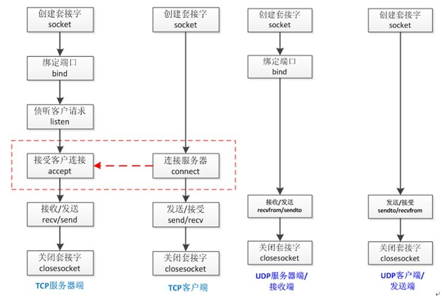

# 网络编程

<a href="https://www.cnblogs.com/xiao987334176/p/8985465.html">python 全栈开发，Day33(tcp协议和udp协议,互联网协议与osi模型,socket概念,套接字(socket)初使用)</a>

## 回顾

ip地址：表示了一台电脑在网络中的位置

子网掩码：ip和子网掩码按位与得到网段

网关ip：内置在路由器中的

交换机：能够保证在一个局域网内的机器之间通信

路由器：跨局域网之间的通信

全国的网络地址范围为0.0.0.0 - 255.255.255.255。其中有几个保留IP地址，是给内网使用的。

> a类网：10.0.0.0~10.255.255.255
> b类网：172.16.0.0~172.31.255.255
> c类网：192.168.0.0~192.168.255.255


透过局域网，我们之所以可以访问外网，是因为路由器中有一个网关ip，这个ip是整个局域网中所有机器与外界通讯的媒介，不能让我们的机器对外提供服务。

外网ip：我们在任何地方都能访问到的地址就是外网地址，全世界唯一。

```
192.168.*.* 是不能对外提供服务的
第一 你的ip是一个局域网地址
第二 你没有一个外网的ip，网关ip

交换机只能看懂mac地址，ip地址是看不懂的，路由器是能看懂ip地址的。
```

## tcp协议和udp协议

用于应用程序之间的通信。如果说ip地址和mac地址帮我们确定唯一的一台机器。那么我们怎么找到一台机器上的一个软件呢？

## 端口

我们知道，一台拥有IP地址的主机可以提供许多服务，比如Web服务、FTP服务、SMTP服务等，这些服务完全可以通过1个IP地址来实现。那么，主机是怎样区分不同的网络服务呢？显然不能只靠IP地址，因为IP地址与网络服务的关系是一对多的关系。实际上是通过“IP地址+端口号”来区分不同的服务的。

端口的概念是虚拟的，端口的范围是 0 - 65535。

在同一台机器上，同一时刻，每一个端口只能为一个运行中的程序提供服务。只有用到联网通信的程序才会用到端口的概念。ip + 端口就可以找到全世界唯一的一台电脑上的一个程序，比如112.34.112.40:80。

网络访问必须经过的一条路 —— 端口。

## TCP协议

当应用程序希望通过 TCP 与另一个应用程序通信时，它会发送一个通信请求。这个请求必须被送到一个确切的地址。在双方“握手”之后，TCP 将在两个应用程序之间建立一个全双工的通信。这个全双工的通信将占用两个计算机之间的通信线路，直到它被一方或双方关闭为止。

三次握手


四次挥手

官方的图


**为什么TCP连接需要3次，而断开需要四次？**

在Client发送出最后的ACK回复，但该ACK可能丢失。Server如果没有收到ACK，将不断重复发送FIN片段。所以Client不能立即关闭，它必须确认Server接收到了该ACK。Client会在发送出ACK之后进入到TIME_WAIT状态。Client会设置一个计时器，等待2MSL的时间。如果在该时间内再次收到FIN，那么Client会重发ACK并再次等待2MSL。所谓的2MSL是两倍的MSL(Maximum Segment Lifetime)。MSL指一个片段在网络中最大的存活时间，2MSL就是一个发送和一个回复所需的最大时间。如果直到2MSL，Client都没有再次收到FIN，那么Client推断ACK已经被成功接收，则结束TCP连接。

<a href="https://blog.csdn.net/xifeijian/article/details/12777187">TCP为什么需要3次握手与4次挥手</a>

为什么需要“三次握手”？
假设不采用“三次握手”，那么只要server发出确认，新的连接就建立了。由于现在client并没有发出建立连接的请求，因此不会理睬server的确认，也不会向server发送数据。但server却以为新的运输连接已经建立，并一直等待client发来数据。这样，server的很多资源就白白浪费掉了。采用“三次握手”的办法可以防止上述现象发生。例如刚才那种情况，client不会向server的确认发出确认。server由于收不到确认，就知道client并没有要求建立连接。”。主要目的防止server端一直等待，浪费资源。

为什么需要“四次挥手”？
原因是因为tcp是全双工模式，接收到FIN时意味将没有数据再发来，但是还是可以继续发送数据。

## 三次握手

TCP是因特网中的传输层协议，使用三次握手协议建立连接。当主动方发出SYN连接请求后，等待对方回答SYN+ACK，并最终对对方的 SYN 执行 ACK 确认。这种建立连接的方法可以防止产生错误的连接。

TCP三次握手的过程如下
客户端发送SYN（SEQ=x）报文给服务器端，进入SYN_SEND状态。服务器端收到SYN报文，回应一个SYN （SEQ=y）ACK(ACK=x+1）报文，进入SYN_RECV状态。客户端收到服务器端的SYN报文，回应一个ACK(ACK=y+1）报文，进入Established状态。三次握手完成，TCP客户端和服务器端成功地建立连接，可以开始传输数据了。

## 四次挥手

建立一个连接需要三次握手，而终止一个连接要经过四次握手，这是由TCP的半关闭造成的。

(1) 某个应用进程首先调用close，称该端执行“主动关闭”（active close）。该端的TCP于是发送一个FIN分节，表示数据发送完毕。

(2) 接收到这个FIN的对端执行 “被动关闭”（passive close），这个FIN由TCP确认。注意：FIN的接收也作为一个文件结束符（end-of-file）传递给接收端应用进程，放在已排队等候该应用进程接收的任何其他数据之后，因为，FIN的接收意味着接收端应用进程在相应连接上再无额外数据可接收。

(3) 一段时间后，接收到这个文件结束符的应用进程将调用close关闭它的套接字。这导致它的TCP也发送一个FIN。

(4) 接收这个最终FIN的原发送端TCP（即执行主动关闭的那一端）确认这个FIN。

既然每个方向都需要一个FIN和一个ACK，因此通常需要4个分节。

注意：
(1) “通常”是指，某些情况下，步骤1的FIN随数据一起发送，另外，步骤2和步骤3发送的分节都出自执行被动关闭那一端，有可能被合并成一个分节。
(2) 在步骤2与步骤3之间，从执行被动关闭一端到执行主动关闭一端流动数据是可能的，这称为“半关闭”。
(3) 当一个Unix进程无论自愿地（调用exit或从main函数返回）还是非自愿地（收到一个终止本进程的信号）终止时，所有打开的描述符都被关闭，这也导致仍然打开的任何TCP连接上也发出一个FIN。

无论是客户还是服务器，任何一端都可以执行主动关闭。通常情况是，客户执行主动关闭，但是某些协议，例如，HTTP/1.0却由服务器执行主动关闭。


对于一个tcp连接，客户端和server是一直占用的。其他所有客户端，全都不能占用。因为连接是阻塞的。

tcp协议适用于文件的上传和下载、发送邮件、 发送重要的文件。每和一个客户端建立链接，都会在自己的操作系统上占用一个资源，同一时间只能 和一个客户端通信。

## UDP协议

当应用程序希望通过UDP与一个应用程序通信时，传输数据之前源端和终端不建立连接。当它想传送时就简单地去抓取来自应用程序的数据，并尽可能快地把它扔到网络上。

## tcp和udp的对比

TCP---传输控制协议，提供的是面向连接、可靠的字节流服务。当客户和服务器彼此交换数据前，必须先在双方之间建立一个TCP连接，之后才能传输数据。TCP提供超时重发，丢弃重复数据，检验数据，流量控制等功能，保证数据能从一端传到另一端。
UDP---用户数据报协议，是一个简单的面向数据报的运输层协议。UDP不提供可靠性，它只是把应用程序传给IP层的数据报发送出去，但是并不能保证它们能到达目的地。由于UDP在传输数据报前不用在客户和服务器之间建立一个连接，且没有超时重发等机制，故而传输速度很快。

TCP是面向连接的，有比较高的可靠性，一些要求比较高的服务一般使用这个协议，如FTP、Telnet、SMTP、HTTP、POP3等。而UDP是面向无连接的，使用这个协议的常见服务有DNS、SNMP、QQ等。




udp是无链接的，启动服务之后可以直接接受消息，不需要提前建立链接。在udp中，数据必须是server端先接收。

## 互联网协议与osi模型

互联网协议按照功能不同分为osi七层或tcp/ip五层或tcp/ip四层


每层运行常见物理设备


每层运行常见的协议


相关解释


数据发送是从上向下进行的

数据都是二进制的


上层设备，能解析下层的数据，比如三层交换机能解析MAC。


## socket概念


## 理解socket

Socket是应用层与TCP/IP协议族通信的中间软件抽象层，它是一组接口。在设计模式中，Socket其实就是一个门面模式，它把复杂的TCP/IP协议族隐藏在Socket接口后面，对用户来说，一组简单的接口就是全部，让Socket去组织数据，以符合指定的协议。

其实站在你的角度上看，socket就是一个模块。我们通过调用模块中已经实现的方法建立两个进程之间的连接和通信。也有人将socket说成ip+port，因为ip是用来标识互联网中的一台主机的位置，而port是用来标识这台机器上的一个应用程序。所以我们只要确立了ip和port就能找到一个应用程序，并且使用socket模块来与之通信。

socket仍然是底层，写代码做网络通信的基础，都是基于socket的。socket隐藏了上层(应用层)和下层(传输层，网络层，链路层)，基于这2层之间，做数据交互。

## 套接字的发展史

套接字起源于 20 世纪 70 年代加利福尼亚大学伯克利分校版本的 Unix，即人们所说的 BSD Unix。因此，有时人们也把套接字称为“伯克利套接字”或“BSD 套接字”。一开始，套接字被设计用在同一台主机上多个应用程序之间的通讯。这也被称进程间通讯，或 IPC。套接字有两种（或者称为有两个种族），分别是基于文件型的和基于网络型的。

基于文件类型的套接字家族
套接字家族的名字：AF_UNIX
unix一切皆文件，基于文件的套接字调用的就是底层的文件系统来取数据，两个套接字进程运行在同一机器，可以通过访问同一个文件系统间接完成通信。

基于网络类型的套接字家族
套接字家族的名字：AF_INET
(还有AF_INET6被用于ipv6，还有一些其他的地址家族，不过，他们要么是只用于某个平台，要么就是已经被废弃，或者是很少被使用，或者是根本没有实现，所有地址家族中，AF_INET是使用最广泛的一个，python支持很多种地址家族，但是由于我们只关心网络编程，所以大部分时候我们只使用AF_INET)

**tcp协议和udp协议**
TCP（Transmission Control Protocol）可靠的、面向连接的协议（eg:打电话）、传输效率低全双工通信
（发送缓存&接收缓存）、面向字节流。使用TCP的应用：Web浏览器；电子邮件、文件传输程序。

UDP（User Datagram Protocol）不可靠的、无连接的服务，传输效率高（发送前时延小），一对一、一对多、多对一、多对多、面向报文，尽最大努力服务，无拥塞控制。使用UDP的应用：域名系统 (DNS)；视频流；IP语音(VoIP)。

## 套接字初使用

基于TCP协议的socket，tcp是基于链接的，必须先启动服务端，然后再启动客户端去链接服务端。

server端

```python
import socket

sk = socket.socket()
sk.bind(('127.0.0.1', 8898))  # 把地址绑定到套接字
sk.listen()  # 监听链接
conn, addr = sk.accept()  # 接受客户端链接
ret = conn.recv(1024)  # 接收客户端信息
print(ret)  # 打印客户端信息
conn.send(b'hi')  # 向客户端发送信息
conn.close()  # 关闭客户端套接字
sk.close()  # 关闭服务器套接字(可选)
```

client端

```python
import socket
# 加入一条socket配置，重用ip和端口
# from socket import SOL_SOCKET, SO_REUSEADDR

# sk.setsockopt(SOL_SOCKET, SO_REUSEADDR, 1)  # 就是它，在bind前加

sk = socket.socket()  # 创建客户套接字
sk.connect(('127.0.0.1', 8898))  # 尝试连接服务器
sk.send(b'hello!')
ret = sk.recv(1024)  # 对话(发送/接收)
print(ret)
sk.close()  # 关闭客户套接字
```

```
server.py参数解释：
sk.bind() 里面的数据，必须是一个元组，分别是IP地址和端口。
IP地址可以写成本机回环地址127.0.0.1，它只能在本机通信。不需要通过交换机。
如果需要网络通信，要写成真实的IP地址。

从端口的分配来看，端口被分为固定端口和动态端口两大类
固定端口（0－1023）：使用集中式管理机制，即服从一个管理机构对端口的指派，这个机构负责发布这些指派。
比如HTTP用的是80端口。

动态端口（1024－49151）
这些端口并不被固定捆绑某一服务，操作系统将这些端口动态的分配给各个进程，同一进程两次分配有可能分配到不同的端口。所以写程序的时候，开端口一般是8000~10000之间的端口，基本上是比较安全的，一般不会占用。

conn.send() 参数必须是bytes类型的
conn.recv() 参数必须是数字类型，表示最大接收多少字节

socket.socket() 默认是tcp
type类型为SOCK_STREAM，表示TCP（默认）
sk.accept() 执行这句，表示建立了3次握手
conn.close() 执行这句，表示经历了4次挥手
sk.close() 关闭套接字，不在接收客户端请求
```

数据交互是从上至下，然后再从下至上


<a href="https://www.cnblogs.com/xiao987334176/p/8990821.html">python 全栈开发，Day34(基于UDP协议的socket)</a>

## utf-8转码

现在有一个需求，utf-8转码很麻烦，能不能自动转换呢？

是可以的，写一个类，这个类继承了socket，它能满足定制需求。新建一个文件mysocket.py，内容如下：

```python
from socket import *  # 导入socket模块


class MySocket(socket):  # 继承socket
    def __init__(self, coding='utf-8'):  # 默认编码为utf-8
        self.coding = coding
        super().__init__(type=SOCK_DGRAM)  # 设定为udp协议

    def my_recv(self, num):  # num表示最大字节，比如1024
        msg, addr = self.recvfrom(num)
        return msg.decode(self.coding), addr  # 返回解码后的接收信息

    def my_send(self, msg, addr):  # msg和addr分别表示发送信息和连接ip:端口
        return self.sendto(msg.encode(self.coding), addr)  # 发送编码后的信息
```

## 时间同步服务

服务端

```python
import time
import socket

sk = socket.socket(type=socket.SOCK_DGRAM)
sk.bind(('127.0.0.1', 9090))
while True:
    msg, addr = sk.recvfrom(1024)
    sk.sendto(time.strftime(msg.decode('utf-8')).encode('utf-8'), addr)
sk.close()
```

客户端

```python
import time
import socket

sk = socket.socket(type=socket.SOCK_DGRAM)
while True:
    sk.sendto('%Y/%m/%d %H:%M:%S'.encode('utf-8'), ('127.0.0.1', 9090))  # 执行时间格式
    ret, addr = sk.recvfrom(1024)
    print(ret.decode('utf-8'))
    time.sleep(1)  # 暂停1秒执行
sk.close()
```

