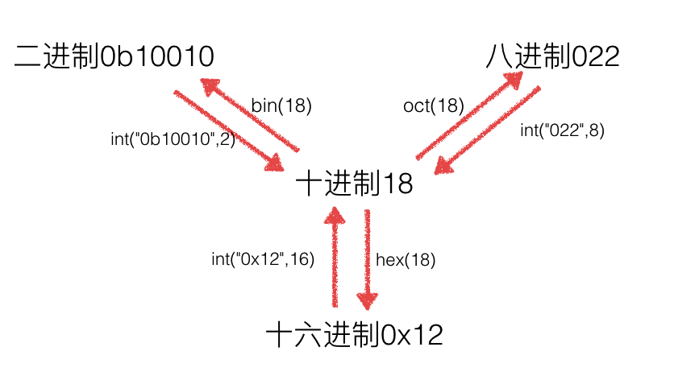

# 进制、位运算

## 什么是进制

1）**理解X进制的概念**

> 每一位只允许出现0~X-1这几个数字，逢X进一，基是X，每一位有一个权值大小是X的幂次，其表示的数值可
>
> 以写成按位权展开的多项式之和。

十进制: 每一位只允许出现0~9这十个数字，逢十进1，基是十，每一位数字有一个权值大小是十的幂次。

二进制: 每一位只允许出现0~1这二个数字，逢二进1，基是二，每一位数字有一个权值大小是二的幂次。

假如用两个字节表示一个整数，如下：

> 十进制数字1的二进制表现形式            0000 0000 0000 0001
>
> 十进制数字2的二进制表现形式            0000 0000 0000 0010

2）**有符号数和无符号数的概念**

把二进制数中的最高位（最左边的那位）用作符号位。对于有符号数，最高位被计算机系统规定为符号位 (0为正，1为负)。对于无符号数，最高位被计算机系统规定为数据位。

按照这种说法，比如有符号数 +2， -2 的原码形式：

```
+2 = 0000 0000 0000 0010
-2 = 1000 0000 0000 0010
真值      机器数
```

```
+1 = 0000 0000 0000 0001

-1 = 1000 0000 0000 0001

	 1000 0000 0000 0010

-1+1 = 1000 0000 0000 0010 ----> -2

```

数字在计算机中，是用二进制补码的形式来保存的，因此-1+1需要按照补码进行相加才是正确的结果。

## 原码、反码、补码

1）如何计算补码

正数：原码 = 反码 = 补码，负数：反码 = 符号位不变，其他位取反，补码 = 反码+1。

```
1的原码： 0000 0000 0000 0001
-1的原码：1000 0000 0000 0001
-1的反码：1111 1111 1111 1110
-1的补码：1111 1111 1111 1111

重新计算 -1+1
1111 1111 1111 1111
0000 0000 0000 0001
0000 0000 0000 0000
```

2）从补码转回原码

负数补码转换原码的规则，原码 = 补码的符号位不变 -->数据位取反--> 尾+1。

```
-1的补码:    1111 1111 1111 1111，取反:    1000 0000 0000 0000，-1的原码:   1000 0000 0000 0001
```

减法用加法来算，运算的时候都是用补码去运算的。

```
2-1 = 2+(-1)= 0000 0000 0000 0010 + 1111 1111 1111 1111 = 0000 0000 0000 0001
```


## 进制间转换




```python
# 10进制转为2进制
print(bin(10))
# 0b1010

# 2进制转为10进制
print(int('1001', 2))
# 9

# 10进制转为16进制
print(hex(10))
# 0xa

# 16进制到10进制
print(int('ff', 16))
# 255

# 逻辑：15*16**1+15*16**0 ===> 15+15*16

print(int('0xab', 16))
# 171

# 逻辑：10*16**1+11*16**0 即 11+10*16

# 16进制到2进制
print(bin(0xa))
# 0b1010

# 10进制到8进制
print(oct(8))
# 0o10

# 逻辑：1*8**1

# 2进制到16进制
print(hex(0b1001))
# 0x9
```

## 位运算

位运算的介绍

```
& 按位与
| 按位或
^ 按位异或
~ 按位取反
<< 按位左移
>> 按位右移
```

直接操作二进制，省内存，效率高。

## **按位左移**

各二进位全部左移n位，高位丢弃，低位补0。

x << n ，左移 x 的所有二进制位，向左移动n位，移出位删掉，移进的位补零。

a.左移1位相当于乘以2，用途：快速计算一个数乘以2的n次方 (8<<3 等同于8*2^3)

b.左移可能会改变一个数的正负性。

```python
num = 0b00001000
print(num, bin(num))  # 8 0b1000
num = num << 1
print(num, bin(num))  # 16 0b10000
```

## **右移**

各二进位全部右移n位，保持符号位不变。

x >> n，x的所有二进制位向右移动n位，移出的位删掉，移进的位补符号位，右移不会改变一个数的符号。

右移1位相当于除以2，x右移n位就相当于除以2的n次方。

用途：快速计算一个数除以2的n次方 (8>>3 等同于8/2^3)。

```python
num = 0b00001000
print(num, bin(num))    # 8 0b1000
num = num >> 3
print(num, bin(num))    # 1 0b1
```

## 按位与

只有对应的两个二进位均为1时，结果位才为1，否则为0。

```python
num = 0b00001000
print(num, bin(num))  # 8 0b1000
num = num & 0b00000001
print(num, bin(num))  # 0 0b0
```

## 按位或

只要对应的二个二进位有一个为1时，结果位就为1，否则为0。

```python
num = 0b00001000
num = num | 0b00000001
print(num, bin(num))
# 9 0b1001
```

## 按位异或

当对应的二进位相异(不相同)时，结果为1，否则为0。

```python
num = 0b00001000
num = num ^ 0b00000100
print(num, bin(num))
# 12 0b1100
```

## 取反

```python
num = 9
num = ~num
print(num, bin(num))
# -10 -0b1010
```

为什么9取反变成了-10？
9的原码 ---> 0000 1001，因为正数的原码=反码=补码，所以在真正存储的时候就是0000 1001。接下来进行对9的补码进行取反操作，进行取反---> 1111 0110，这就是对9进行了取反之后的补码，既然已经知道了补码，把这个1111 0110 这个补码转换为原码即可，符号位不变，其它位取反---> 1000 1001，然后+1 ，得到原码1000 1010 这就是 -10。