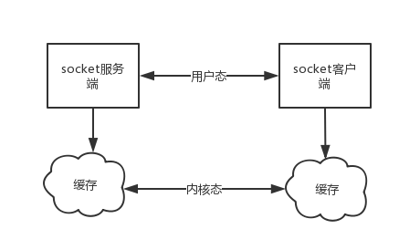

# 网络编程

<a href="https://www.cnblogs.com/xiao987334176/p/9002737.html">python 全栈开发，Day35(TCP协议 粘包现象 和解决方案)</a>

## 黏包现象

让我们基于tcp先制作一个远程执行命令的程序

需要用到模块subprocess

subprocess通过子进程来执行外部指令，并通过input/output/error管道，获取子进程的执行的返回信息。

```python
import os
import subprocess

ret = os.popen('dir').read()
print(ret)
print('*' * 50)
ret = subprocess.Popen('dir', shell=True, stdout=subprocess.PIPE,
                       stderr=subprocess.PIPE)
print('out:', ret.stdout.read().decode('gbk'))
print('err:', ret.stderr.read().decode('gbk'))
# shell = True  # 可以执行一个普通系统命令
# stdout # 表示一个容器，返回正常的信息
# stderr # 存放错误信息的容器
```

```
驱动器 E 中的卷是 文档
 卷的序列号是 0009-C461

 E:\code\github_python\day34 的目录

2018/10/20/周六  20:24    <DIR>          .
2018/10/20/周六  20:24    <DIR>          ..
2018/10/20/周六  20:24               844 01 异常处理.py
               1 个文件            844 字节
               2 个目录 50,970,501,120 可用字节

**************************************************
out:  驱动器 E 中的卷是 文档
 卷的序列号是 0009-C461

 E:\code\github_python\day34\script 的目录

2019/01/23/周三  10:37    <DIR>          .
2019/01/23/周三  10:37    <DIR>          ..
2019/01/23/周三  10:37               278 glu.py
2019/01/22/周二  16:53    <DIR>          基于tcp协议实现的黏包
2019/01/22/周二  16:59    <DIR>          基于udp协议实现的黏包
               1 个文件            278 字节
               4 个目录 53,546,704,896 可用字节

err: 
```

执行一个错误的命令

```python
import os
import subprocess

ret = os.popen('ls').read()
print(ret)
print('*' * 50)
ret = subprocess.Popen('ls', shell=True, stdout=subprocess.PIPE,
                       stderr=subprocess.PIPE)
print('out:', ret.stdout.read().decode('gbk'))
print('err:', ret.stderr.read().decode('gbk'))
```

```
'ls' �����ڲ����ⲿ���Ҳ���ǿ����еij���
���������ļ���

**************************************************
out:
err: 'ls' 不是内部或外部命令，也不是可运行的程序
或批处理文件。
```

os.popen执行一个错误的命令显示乱码，而subprocess则不会

## 基于tcp协议实现的黏包

服务端

```python
import socket

sk = socket.socket()
sk.bind(('127.0.0.1', 9000))
sk.listen()

conn, adr = sk.accept()

while True:
    cmd = input('>>>').strip()
    conn.send(cmd.encode('utf-8'))  # 先把cmd发送过去 不可直接break
    if cmd == 'q': break
    ret1 = conn.recv(1024)
    print(ret1.decode('gbk'))
    ret2 = conn.recv(1024)
    print(ret2.decode('gbk'))
conn.close()
sk.close()
```

客户端

```python
import socket
import subprocess

sk = socket.socket()
sk.connect(('127.0.0.1', 9000))
while True:
    cmd = sk.recv(1024).decode('utf-8')
    print(cmd)
    if cmd == 'q':
        break
    ret = subprocess.Popen(cmd, shell=True,
                           stdout=subprocess.PIPE,
                           stderr=subprocess.PIPE)
    out = ret.stdout.read()
    err = ret.stderr.read()
    print(out.decode('gbk'), '************\n',
          err.decode('gbk'))
    sk.send(b'out :' + out)
    sk.send(b'error :' + err)
sk.close()
```

同时执行多条命令之后，得到的结果很可能只有一部分，在执行其他命令的时候又接收到之前执行的另外一部分结果，这种显现就是黏包。发送过来的一整条信息由于server端没有及时接受，后来发送的数据和之前没有接收完的数据黏在了一起，这就是黏包现象。

## 基于udp协议实现的黏包

服务端

```python
import socket
import subprocess

ip_port = ('127.0.0.1', 9000)
udp_server = socket.socket(type=socket.SOCK_DGRAM)
udp_server.setsockopt(socket.SOL_SOCKET, socket.SO_REUSEADDR, 1)
udp_server.bind(ip_port)

while True:
    cli_msg, cli_adr = udp_server.recvfrom(1024)
    cmd = cli_msg.decode('utf-8')
    print('用户命令----->', cmd)

    ret = subprocess.Popen(cmd, shell=True,
                           stdout=subprocess.PIPE,
                           stderr=subprocess.PIPE)
    stdout = ret.stdout.read()
    stderr = ret.stderr.read()

    udp_server.sendto(stdout, cli_adr)
    udp_server.sendto(stderr, cli_adr)
    
udp_server.close()
```

客户端

```python
import socket

udp_client = socket.socket(type=socket.SOCK_DGRAM)
ip_port = ('127.0.0.1', 9000)

while True:
    cmd = input('>>>').strip()
    udp_client.sendto(cmd.encode('utf-8'), ip_port)
    out, server_adr = udp_client.recvfrom(1024)
    err, server_adr = udp_client.recvfrom(1024)
    if err:
        print('error : %s' % err.decode('gbk'), end='')
    if out:
        print(out.decode('gbk'), end='')
```

在客户端执行ipconfig，就报错了，提示缓冲区过大。所以说udp不会出现黏包。只有TCP有粘包现象，UDP永远不会粘包。subprocess不能运行windows help命令，不是因为udp问题，而是subprocess问题。

## 黏包成因

## TCP协议中的数据传递

## tcp协议的拆包机制

当发送端缓冲区的长度大于网卡的MTU时，tcp会将这次发送的数据拆成几个数据包发送出去。MTU是Maximum Transmission Unit的缩写。意思是网络上传送的最大数据包。MTU的单位是字节。 大部分网络设备的MTU都是1500。如果本机的MTU比网关的MTU大，大的数据包就会被拆开来传送，这样会产生很多数据包碎片，增加丢包率，降低网络速度。

## 面向流的通信特点和Nagle算法

TCP是面向连接的，面向流的，提供高可靠性服务。收发两端（客户端和服务器端）都要有一一成对的socket，因此，发送端为了将多个发往接收端的包，更有效的发到对方，使用了优化方法。（Nagle算法）将多次间隔较小且数据量小的数据，合并成一个大的数据块，然后进行封包。这样，接收端，就难于分辨出来了，必须提供科学的拆包机制。即面向流的通信是无消息保护边界的。

对于空消息：tcp是基于数据流的，于是收发的消息不能为空，这就需要在客户端和服务端都添加空消息的处理机制，防止程序卡住，而udp是基于数据报的，即便是你输入的是空内容（直接回车）也可以被发送，udp协议会帮你封装上消息头发送过去。

可靠黏包的tcp协议：tcp的协议数据不会丢，没有收完包，下次接收，会继续上次继续接收，己端总是在收到ack时才会清除缓冲区内容。数据是可靠的，但是会粘包。

## 基于tcp协议特点的黏包现象成因



发送端可以是一K一K地发送数据，而接收端的应用程序可以两K两K地提走数据，当然也有可能一次提走3K或6K数据，或者一次只提走几个字节的数据。也就是说，应用程序所看到的数据是一个整体，或说是一个流，一条消息有多少字节对应用程序是不可见的，因此TCP协议是面向流的协议，这也是容易出现粘包问题的原因。

而UDP是面向消息的协议，每个UDP段都是一条消息，应用程序必须以消息为单位提取数据，不能一次提取任意字节的数据 这一点和TCP是很不同的。

怎样定义消息呢？可以认为对方一次性write/send的数据为一个消息，需要明白的是当对方send一条信息的时候，无论底层怎样分段分片，TCP协议层会把构成整条消息的数据段排序完成后才呈现在内核缓冲区。

例如基于tcp的套接字客户端往服务端上传文件，发送时文件内容是按照一段一段的字节流发送的，在接收方看了，根本不知道该文件的字节流从何处开始，在何处结束。

此外，发送方引起的粘包是由TCP协议本身造成的，TCP为提高传输效率，发送方往往要收集到足够多的数据后才发送一个TCP段。若连续几次需要send的数据都很少，通常TCP会根据优化算法把这些数据合成一个TCP段后一次发送出去，这样接收方就收到了粘包数据。

## UDP不会发生黏包

UDP是无连接的，面向消息的，提供高效率服务。不会使用块的合并优化算法，, 由于UDP支持的是一对多的模式
所以接收端的skbuff(套接字缓冲区）采用了链式结构来记录每一个到达的UDP包，在每个UDP包中就有了消息头。（消息来源地址，端口等信息）这样，对于接收端来说，就容易进行区分处理了。即面向消息的通信是有消息保护边界的。

不可靠不黏包的udp协议：udp的recvfrom是阻塞的，一个recvfrom(x)必须对唯一一个sendinto(y)，收完了x个字节的数据就算完成，若是y;x数据就丢失，这意味着udp根本不会粘包，但是会丢数据，不可靠。


udp和tcp一次发送数据长度的限制

用UDP协议发送时，用sendto函数最大能发送数据的长度为65535- IP头(20) – UDP头(8)＝65507字节。用sendto函数发送数据时，如果发送数据长度大于该值，则函数会返回错误。（丢弃这个包，不进行发送）

用TCP协议发送时，由于TCP是数据流协议，因此不存在包大小的限制（暂不考虑缓冲区的大小），这是指在用send函数时，数据长度参数不受限制。而实际上，所指定的这段数据并不一定会一次性发送出去。如果这段数据比较长，会被分段发送，如果比较短，可能会等待和下一次数据一起发送。

## 会发生黏包的两种情况

## 情况一 发送方的缓存机制

发送端需要等缓冲区满才发送出去，造成粘包。（发送数据时间间隔很短，数据了很小，会合到一起，产生粘包）

发送端内核态
如果数据包过小，不会立即发送。先缓存了一小下，通过优化算法，将2次或者多次数据包，一次发送。

如果数据包过大，分配发送。如果这个时候，再来一个大的数据包，也会拆分包。那么就发生黏包了。

server.py

```python
from socket import *

ip_port = ('127.0.0.1', 8080)

tcp_socket_server = socket(AF_INET, SOCK_STREAM)
tcp_socket_server.bind(ip_port)
tcp_socket_server.listen(5)

conn, addr = tcp_socket_server.accept()

data1 = conn.recv(10)
data2 = conn.recv(10)

print('----->', data1.decode('utf-8'))
print('----->', data2.decode('utf-8'))
```

client.py

```python
import socket

BUFSIZE = 1024
ip_port = ('127.0.0.1', 8080)

s = socket.socket(socket.AF_INET, socket.SOCK_STREAM)
res = s.connect(ip_port)

s.send('hello'.encode('utf-8'))
s.send('egg'.encode('utf-8'))
```

## 情况二 接收方的缓存机制

接收方不及时接收缓冲区的包，造成多个包接收。（客户端发送了一段数据，服务端只收了一小部分，服务端下次再收的时候还是从缓冲区拿上次遗留的数据，产生粘包）

server.py

```python
from socket import *

ip_port = ('127.0.0.1', 8080)

tcp_socket_server = socket(AF_INET, SOCK_STREAM)
tcp_socket_server.bind(ip_port)
tcp_socket_server.listen(5)

conn, addr = tcp_socket_server.accept()

data1 = conn.recv(2)  # 一次没有收完整
data2 = conn.recv(10)  # 下次收的时候,会先取旧的数据,然后取新的

print('----->', data1.decode('utf-8'))
print('----->', data2.decode('utf-8'))

conn.close()

```

client.py

```python
import socket

BUFSIZE = 1024
ip_port = ('127.0.0.1', 8080)

s = socket.socket(socket.AF_INET, socket.SOCK_STREAM)
res = s.connect_ex(ip_port)

s.send('hello egg'.encode('utf-8'))

```

```
-----> he
-----> llo egg
```

黏包现象只发生在tcp协议中：
1.从表面上看，黏包问题主要是因为发送方和接收方的缓存机制、tcp协议面向流通信的特点。
2.实际上，主要还是因为接收方不知道消息之间的界限，不知道一次性提取多少字节的数据所造成的。

## 黏包的解决方案

## 解决方案一

问题的根源在于，接收端不知道发送端将要传送的字节流的长度，所以解决粘包的方法就是围绕，如何让发送端在发送数据前，把自己将要发送的字节流总大小让接收端知晓，然后接收端来一个死循环接收完所有数据。

server.py

```python
# _*_coding:utf-8_*_
from socket import *

ip_port = ('127.0.0.1', 8080)

tcp_socket_server = socket()
tcp_socket_server.bind(ip_port)
tcp_socket_server.listen(5)

conn, addr = tcp_socket_server.accept()
lenth = conn.recv(1)  # 接收1个字节，返回 b'5'
# print(lenth)
lenth = int(lenth.decode('utf-8'))  # 转化字符串,返回5

data1 = conn.recv(lenth)  # 接收5字节，返回 b'hello'
lenth2 = conn.recv(1)  # 接收1个字节
lenth2 = int(lenth2.decode('utf-8'))  # 转化字符串,返回3
data2 = conn.recv(lenth2)  # 接收3个字节,返回b'egg'

print('----->', data1.decode('utf-8'))
print('----->', data2.decode('utf-8'))

conn.close()
tcp_socket_server.close()

```

client.py

```python
import socket

BUFSIZE = 1024
ip_port = ('127.0.0.1', 8080)

s = socket.socket()
res = s.connect(ip_port)  # 功能与connect(address)相同，但是成功返回0，失败返回errno的值
lenth = str(len('hello')).encode('utf-8')  # 获取hello的字符的长度,并转化为str,最后编码
s.send(lenth)  # 发送数字5
s.send('hello'.encode('utf-8'))  # 发送hello
lenth = str(len('egg')).encode('utf-8')  # 获取长度，结果为3
s.send(lenth)  # 发送3
s.send('egg'.encode('utf-8'))  # 发送egg

s.close()
```

存在的问题：
程序的运行速度远快于网络传输速度，所以在发送一段字节前，先用send去发送该字节流长度，这种方式会放大网络延迟带来的性能损耗。

## 解决方案进阶

我们可以借助一个模块，这个模块可以把要发送的数据长度转换成固定长度的字节。这样客户端每次接收消息之前只要先接受这个固定长度字节的内容看一看接下来要接收的信息大小，那么最终接受的数据只要达到这个值就停止，就能刚好不多不少的接收完整的数据了。

## struct模块

该模块可以把一个类型，如数字，转成固定长度的bytes

简单介绍下用法

```python
import struct

ret = struct.pack('i', 1000000)  # i表示int类型
print(ret)
print(len(ret))
ret1 = struct.unpack('i', ret)  # 按照给定的格式(fmt)解析字节流string，返回解析出来的tuple
print(ret1)  # 返回一个元组
# b'@B\x0f\x00'
# 4
# (1000000,)
```

能够把范围内一个任意的整数转换成一个固定长度的字节(int为4字节)，范围是-2147483648~2147483647，还能转换回来，使用unpack方法。

## 使用struct解决黏包

借助struct模块，我们知道长度数字可以被转换成一个标准大小的4字节数字。因此可以利用这个特点来预先发送数据长度。

| 发送时                 | 接收时                                                       |
| ---------------------- | ------------------------------------------------------------ |
| 先发报头长度           | 先收报头长度，用struct取出来                                 |
| 再编码报头内容然后发送 | 根据取出的长度收取报头内容，然后解码，反序列化               |
| 最后发真实内容         | 从反序列化的结果中取出待取数据的详细信息，然后去取真实的数据内容 |

server.py

```python
import struct
import socket

sk = socket.socket()
sk.bind(('127.0.0.1', 9999))
sk.listen()

conn, addr = sk.accept()
count = 0
while True:
    count += 1
    ret = conn.recv(4)  # int类型的struct长度固定为4字节
    # print(ret)
    length = struct.unpack('i', ret)[0]  # 反解struct数据,取元组第一个值
    msg = conn.recv(length)  # 接收指定字节
    print(msg.decode('utf-8'))  # 打印接收信息
    if count == 3:  # 防止死循环
        break
conn.close()
```

client.py

```python
import socket
import struct

sk = socket.socket()
sk.connect(('127.0.0.1', 9999))
count = 0
while True:
    count += 1
    msg = 'hello world'
    length = struct.pack('i', len(msg))  # 获取msg的长度，并转化为struct
    sk.send(length)  # 发送struct数据
    sk.send(msg.encode('utf-8'))  # 发送msg
    if count == 3:  # 防止死循环
        break
sk.close()
```

我们还可以把报头做成字典，字典里包含将要发送的真实数据的详细信息，然后json序列化，然后用struck将序列化后的数据长度打包成4个字节。（4个字节足够用了）

| 发送时                 | 接收时                                                       |
| ---------------------- | ------------------------------------------------------------ |
| 先发报头长度           | 先收报头长度，用struct取出来                                 |
| 再编码报头内容然后发送 | 根据取出的长度收取报头内容，然后解码，反序列化               |
| 最后发真实内容         | 从反序列化的结果中取出待取数据的详细信息，然后去取真实的数据内容 |

## 上传下载视频

server

```python
"""
文件上传和下载 服务端
"""
# 导入模块
import socket
import struct
import os
import hashlib
import json

# 创建套接字
sk = socket.socket()
ip_port = ("127.0.0.1", 9999)
# 绑定套接字本地ip和端口
sk.bind(ip_port)
# 监听
sk.listen()
# 接受连接
conn, addr = sk.accept()
# 打印连接方信息
print(addr)
# 文件名称
file_name = "天使与龙的轮舞05.mp4"
# 文件路径
file_path = "D:\Program files\JiJiDown\Download\CROSSANGE 天使与龙的轮舞"
# 通过os模块拼成文件路径详细信息
abs_path = os.path.join(file_path, file_name)
# 一次读取的大小
buff = 1024 * 1024
# 创建一个md5对象
md5 = hashlib.md5()
# 以二进制读的方式打开文件
with open(abs_path, mode="rb") as f:
    while True:
        data = f.read(buff)
        # 把读到的数据给md5对象
        if data:
            md5.update(data)
        # 读不到数据则退出循环
        else:
            break

# 组成文件信息字典
file_dic = {
    # 文件名
    "file_name": file_name,
    # md5值
    "md5_value": str(md5.hexdigest()),
    # 一次发送的字节数值
    "buff": buff,
    # 文件大小
    "file_size": os.path.getsize(abs_path)
}
# 序列化
# 编码
bytes_dic = json.dumps(file_dic).encode("utf-8")
# 获取字典长度,转换为struct
len_dic = struct.pack("i", len(bytes_dic))

# 先发字典长度再发字典
conn.send(len_dic)
conn.send(bytes_dic)

# 以二进制只读的方式打开文件，读buff个字节数据，发buff个字节数据
with open(abs_path, mode="rb") as f:
    while True:
        data = f.read(buff)
        if data:
            conn.send(data)
        else:
            break
# 关闭连接、服务器
conn.close()
sk.close()
```

client

```python
"""
文件上传和下载 客户端
"""
# 导入模块
import socket
import struct
import json
import hashlib
import time

# 记录开始的时间
st_time = time.time()
ip_port = ("127.0.0.1", 9999)
# 创建套接字连接服务器
sk = socket.socket()
sk.connect(ip_port)
# 接收4个字节数据
len_dic = sk.recv(4)
# 反解struct得到元组，获取元组第一个元素
len_dic = struct.unpack("i", len_dic)[0]
# 接收指定长度,获取完整的字典,并解码
dic = sk.recv(len_dic).decode("utf-8")
# 反序列化得到真正的字典
dic = json.loads(dic)
# print(dic)
# 创建MD5对象
md5 = hashlib.md5()
# 根据字典得到文件名
# 创建文件，读数据写数据，计算md5值
with open(dic["file_name"], mode="wb") as f:
    while True:       
        data = sk.recv(dic["buff"])
        if data:
            f.write(data)
            md5.update(data)
        else:
            break
# 返回md5值
md5_value = md5.hexdigest()
# 跟服务器发送过来的md5值进行比对
if md5_value == dic["md5_value"]:
    print("md5校验成功")
else:
    print("md5校验失败")
# 打印总共花费的时间
print("本次下载共花费{}秒".format(time.time()-st_time))
```


<a href="https://www.cnblogs.com/xiao987334176/p/9008331.html">python 全栈开发，Day36(作业讲解(大文件下载以及进度条展示),socket的更多方法介绍,验证客户端链接的合法性hmac,socketserver)</a>

## 大文件下载

server

```python
import os
import socket
import json
import struct

# 文件路径
file_path = r'D:\Program files\JiJiDown\Download\CROSSANGE 天使与龙的轮舞\天使与龙的轮舞05.mp4'

# 套接字 起服务端 接听 连接
sk = socket.socket()
ip_port = ('127.0.0.1', 9999)
sk.setsockopt(socket.SOL_SOCKET, socket.SO_REUSEADDR, 1)
sk.bind(ip_port)
sk.listen()
conn, adr = sk.accept()

# 文件相关信息 大小和文件名
file_name = os.path.basename(file_path)
file_size = os.path.getsize(file_path)
dic = {
    'file_name': file_name,
    'file_size': file_size
}
# 将字典序列化再编码 网络传输只能使用utf-8,gbk等
bytes_dic = json.dumps(dic).encode('utf-8')
# 字典大小
len_dic = struct.pack('i', len(bytes_dic))
# 先发字典的大小 再发字典
conn.send(len_dic)
conn.send(bytes_dic)

# 读文件发送内容
with open(file_path, mode='rb') as f:
    while file_size:
        data = f.read(4096)
        conn.send(data)
        file_size -= len(data)
conn.close()
sk.close()
```

client

```python
import json
import struct
import socket

# 创建套接字连接服务端
ip_port = ('127.0.0.1', 9999)
sk = socket.socket()
sk.connect(ip_port)

# 先接收4个字节
len_dic = sk.recv(4)
# 反struct返回字典的长度
len_dic = struct.unpack('i', len_dic)[0]
# 按指定长度收数据
dic = sk.recv(len_dic)
# 解码和反序列化返回字典
dic = dic.decode('utf-8')
dic = json.loads(dic)
# print(dic)

# 创建文件，读数据写数据
with open(dic['file_name'], mode='wb') as f:
    while dic['file_size']:
        data = sk.recv(4096)
        dic['file_size'] -= len(data)
        f.write(data)
sk.close()
```

## 增加进度条

```python
import socket
import struct
import json
import sys
import time


# 进度条
def process_bar(num, total):
    rate = num / total  # 小数
    rate_num = int(rate * 100)  # 整数
    # 整除10
    if not rate_num % 10:
        # 100%进度
        if rate_num == 100:  # 控制等于号的输出
            # 输出末尾没有\n换行符
            r = '\r\033[31m%s>%d%%\n' % ('=' * int(rate_num / 5), rate_num)
        else:
            r = '\r\033[33m%s>%d%%' % ('=' * int(rate_num / 5), rate_num)
        sys.stdout.write(r)
        sys.stdout.flush
    else:
        pass


# 记录开始的时间
start_time = time.time()
sk = socket.socket()
ip_port = ('127.0.0.1', 9999)
sk.connect(ip_port)

len_dic = sk.recv(4)
len_dic = struct.unpack('i', len_dic)[0]
dic = sk.recv(len_dic)
dic = json.loads(dic.decode('utf-8'))

with open(dic['file_name'], mode='wb') as f:
    # 初始化
    data_size = 0
    while True:
        # 每次读4096字节数据
        data = sk.recv(4096)
        f.write(data)
        # 记录总共读取的数据
        data_size += len(data)
        # 调用进度条函数打印进度条，传参 1 读取的数据， 文件的总大小
        process_bar(data_size, dic['file_size'])
        if data_size == dic['file_size']:
            break
sk.close()
print('本次下载花费了{}秒'.format(time.time() - start_time))
# 执行最终输出
# ====================>100%
# 本次下载花费了1.9845898151397705秒

# 注
# 计算MD5值和循环打印进度条会拖慢程序
```

## 验证客户端链接的合法性

## 使用hashlib.md5加密

```python
import os

print(os.urandom(32))
# b'\xa2\x80OO\x9fq\xf1\x0e\xe4\xaf=\xd1\x1do\xfc^K\x99r\x88vF9\xf8\xbe\xdfp\x0fC\xb7\xf1\xa3'
```

<a href="https://blog.csdn.net/gsls200808/article/details/52456136">Error: [WinError 10013] 以一种访问权限不允许的方式做了一个访问套接字的尝试。</a>

```
Error: [WinError 10013] 以一种访问权限不允许的方式做了一个访问套接字的尝试。
netstat -ano|findstr 8000
tasklist |findstr 8124
taskkill /pid 8124 /F
```

server

```python
import os
import socket
import hashlib

secret_key = '菜菜菜子'
sk = socket.socket()
ip_port = ('127.0.0.1', 9999)
sk.setsockopt(socket.SOL_SOCKET, socket.SO_REUSEADDR, 1)
sk.bind(ip_port)
sk.listen()

while True:
    try:
        conn, address = sk.accept()
        random_bytes = os.urandom(32)  # 随机产生32个字节的字符串,返回bytes
        conn.send(random_bytes)
        md5_obj = hashlib.md5(secret_key.encode('utf-8'))  # 使用secret_key作为加密盐
        md5_obj.update(random_bytes)
        ret = md5_obj.hexdigest()
        msg = conn.recv(1024).decode('utf-8')
        if msg == ret:
            print('是合法的客户端')  # 如果接收的摘要和本机计算的摘要一致，就说明是合法的
        else:
            conn.close()
    finally:
        sk.close()
        break
```

client

```python
import socket
import hashlib

secret_key = '菜菜菜子'
sk = socket.socket()
ip_port = ('127.0.0.1', 9999)
sk.connect(ip_port)

urandom = sk.recv(32)
md5_obj = hashlib.md5(secret_key.encode('utf-8'))
md5_obj.update(urandom)
sk.send(md5_obj.hexdigest().encode('utf-8'))
print('-' * 10)
sk.close()
```

## 使用hmac加密

hmac是专门来做客户端合法性的

```python
import hmac

obj = hmac.new(key=b'secret_key', msg=b'100212002155')
print(obj.hexdigest())
# 27111d37764a2fe5bc79d297e7b54c35
```

server

```python
import os
import socket
import hmac

secret_key = '菜菜菜子'.encode('utf-8')
sk = socket.socket()
sk.bind(('127.0.0.1', 9000))
sk.listen()

while True:
    try:
        conn, addr = sk.accept()
        random_bytes = os.urandom(32)
        conn.send(random_bytes)
        obj = hmac.new(key=secret_key, msg=random_bytes)
        ret = obj.hexdigest()
        msg = conn.recv(1024).decode('utf-8')
        if msg == ret:
            print('是合法的客户端')
        else:
            conn.close()
    finally:
        sk.close()
        break
```

client

```python
import socket
import hmac

secret_key = '菜菜菜子'.encode('utf-8')
sk = socket.socket()
sk.connect(('127.0.0.1', 9000))

urandom = sk.recv(32)
hmac_obj = hmac.new(key=secret_key, msg=urandom)
sk.send(hmac_obj.hexdigest().encode('utf-8'))
print('-----')
sk.close()
```

## socketserver

SocketServer内部使用IO多路复用以及 “多线程” 和 “多进程” ，从而实现并发处理多个客户端请求的Socket服务端。即：每个客户端请求连接到服务器时，Socket服务端都会在服务器创建一个“线程”或者“进程”专门负责处理当前客户端的所有请求。

使用ThreadingTCPServer：创建一个继承自 SocketServer.BaseRequestHandler 的类，必须继承。类中必须定义一个名称为 handle 的方法，必须重写。

server

```python
import socketserver


class MyServer(socketserver.BaseRequestHandler):
    def handle(self):
        print(self.request)


server = socketserver.ThreadingTCPServer(('127.0.0.1', 9000), MyServer)
server.serve_forever()
# <socket.socket fd=556, family=AddressFamily.AF_INET, type=SocketKind.SOCK_STREAM, proto=0, laddr=('127.0.0.1', 9999), raddr=('127.0.0.1', 53640)>
```

client

```python
import socket
sk = socket.socket()
sk.connect(('127.0.0.1',9000))
sk.close()
```

<a href="http://www.cnblogs.com/Eva-J/p/5081851.html">解读python中SocketServer源码</a>

```python
import os
import hashlib
import time


# 把时间戳转化为时间字符串
def time_stamp_2_time(timestamp):
    timeStruct = time.localtime(timestamp)
    return time.strftime('%Y-%m-%d %H:%M:%S', timeStruct)


def md5_size_time(directory, name):
    # 拼接成文件绝对路径
    path = os.path.join(directory, name)
    size = os.path.getsize(path)  # 获取文件的大小（字节）
    m_time = os.path.getmtime(path)  # 获取文件的修改时间
    c_time = os.path.getctime(path)  # 获取文件的创建时间
    a_time = os.path.getatime(path)  # 获取文件的访问时间
    # 计算md5值
    md5_obj = hashlib.md5()
    with open(path, mode='rb') as f:
        while True:
            data = f.read(1024)
            if data:
                md5_obj.update(data)
            else:
                break
    """
    os模块返回的是时间字符串，调用前面定义的函数把时间转换成制定格式时间字符串
    拼接成字典返回
    """
    return {
        '文件': path,
        '大小': str(size) + '字节',
        '创建时间': time_stamp_2_time(c_time),
        '修改时间': time_stamp_2_time(m_time),
        '访问时间': time_stamp_2_time(a_time),
        'MD5': md5_obj.hexdigest()
    }


if __name__ == '__main__':
    # 文件路径
    directory = 'D:\Program files\JiJiDown\Download\CROSSANGE 天使与龙的轮舞'
    # 文件名
    name = '天使与龙的轮舞05.mp4'
    info = md5_size_time(directory, name)
    for k in info:
        print('\033[34m{}: {}\033[0m'.format(k, info[k]))


# 文件: D:\Program files\JiJiDown\Download\CROSSANGE 天使与龙的轮舞\天使与龙的轮舞05.mp4
# 大小: 277376815字节
# 创建时间: 2018-10-21 12:43:54
# 修改时间: 2018-10-21 12:43:54
# 访问时间: 2018-10-21 23:48:26
# MD5: a6b6d5bd1b506299b4dffdc118903282
```

## MD5及相关信息

```python
import os
import hashlib
import time


# 把时间戳转化为时间字符串
def time_stamp_2_time(timestamp):
    timeStruct = time.localtime(timestamp)
    return time.strftime('%Y-%m-%d %H:%M:%S', timeStruct)


def md5_size_time(directory, name):
    # 拼接成文件绝对路径
    path = os.path.join(directory, name)
    size = os.path.getsize(path)  # 获取文件的大小（字节）
    m_time = os.path.getmtime(path)  # 获取文件的修改时间
    c_time = os.path.getctime(path)  # 获取文件的创建时间
    a_time = os.path.getatime(path)  # 获取文件的访问时间
    # 计算md5值
    md5_obj = hashlib.md5()
    with open(path, mode='rb') as f:
        while True:
            data = f.read(1024)
            if data:
                md5_obj.update(data)
            else:
                break
    """
    os模块返回的是时间字符串，调用前面定义的函数把时间转换成制定格式时间字符串
    拼接成字典返回
    """
    return {
        '文件': path,
        '大小': str(size) + '字节',
        '创建时间': time_stamp_2_time(c_time),
        '修改时间': time_stamp_2_time(m_time),
        '访问时间': time_stamp_2_time(a_time),
        'MD5': md5_obj.hexdigest()
    }


if __name__ == '__main__':
    # 文件路径
    directory = 'D:\Program files\JiJiDown\Download\CROSSANGE 天使与龙的轮舞'
    # 文件名
    name = '天使与龙的轮舞05.mp4'
    info = md5_size_time(directory, name)
    # 迭代取出字典的键值
    # 一行显示一对键值
    for k in info:
        print('\033[34m{}: {}\033[0m'.format(k, info[k]))


# 文件: D:\Program files\JiJiDown\Download\CROSSANGE 天使与龙的轮舞\天使与龙的轮舞05.mp4
# 大小: 277376815字节
# 创建时间: 2018-10-21 12:43:54
# 修改时间: 2018-10-21 12:43:54
# 访问时间: 2018-10-21 23:48:26
# MD5: a6b6d5bd1b506299b4dffdc118903282
```

