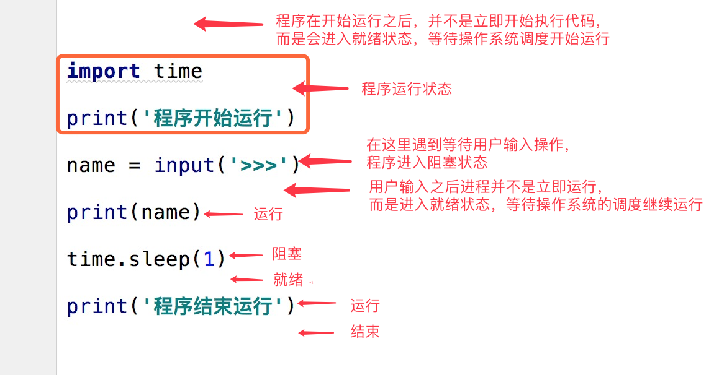

# 系统编程

<a href="https://www.cnblogs.com/xiao987334176/p/9014370.html">python 全栈开发，Day37(操作系统的发展史)</a>

<a href="http://www.cnblogs.com/Eva-J/articles/8253521.htmll">python之路——操作系统的发展史</a>

## 回顾


    # C/S和B/S架构
    # osi五层模型
    # 应用层
        # 自定义协议(struct) _ 解决黏包
        # 验证客户端合法性 _ hmac os.urandom
        # 解决TCP协议的server端并发问题 _socketserver
    #######socket#########
    # 传输层
        # 端口 在一台机器上唯一标识一个运行中的网络程序
        # tcp  三次握手 四次挥手 黏包问题
        # udp
        # 四层交换机 四层路由器
    # 网络层
        # ip协议
            # ip 网关ip 子网掩码
        # 路由器 三层交换机
    # 数据链路层
        # arp协议 ip-->mac  
        # 网卡
        # 交换机 
    # 物理层
## 操作系统的发展史

## 手工操作 —— 穿孔卡片

## 批处理 —— 磁带存储

批处理系统

加载在计算机上的一个系统软件，在它的控制下，计算机能够自动地、成批地处理一个或多个用户的作业（这作业包括程序、数据和命令）。

## 联机批处理系统

## 脱机批处理系统

## 多道程序系统

## 多道程序设计技术

所谓多道程序设计技术，就是指允许多个程序同时进入内存并运行。即同时把多个程序放入内存，并允许它们交替在CPU中运行，它们共享系统中的各种硬、软件资源。当一道程序因I/O请求而暂停运行时，CPU便立即转去运行另一道程序。

多道程序系统的出现，标志着操作系统渐趋成熟的阶段，先后出现了作业调度管理、处理机管理、存储器管理、外部设备管理、文件系统管理等功能。由于多个程序同时在计算机中运行，开始有了空间隔离的概念，只有内存空间的隔离，才能让数据更加安全、稳定。除了空间隔离之外，多道技术还第一次体现了时空复用的特点，遇到I/O操作就切换程序，使得cpu的利用率提高了，计算机的工作效率也随之提高。

总结
多个作业之间的切换依赖于操作系统。

## 多道批处理系统

多道：系统内可同时容纳多个作业。这些作业放在外存中，组成一个后备队列，系统按一定的调度原则每次从后备作业队列中选取一个或多个作业进入内存运行，运行作业结束、退出运行和后备作业进入运行均由系统自动实现，从而在系统中形成一个自动转接的、连续的作业流。

成批：在系统运行过程中，不允许用户与其作业发生交互作用，即：作业一旦进入系统，用户就不能直接干预其作业的运行。

## 分时系统

分时系统的主要目标：对用户响应的及时性，即不至于用户等待每一个命令的处理时间过长。分时系统可以同时接纳数十个甚至上百个用户，由于内存空间有限，往往采用对换（又称交换）方式的存储方法。即将未“轮到”的作业放入磁盘，一旦“轮到”，再将其调入内存；而时间片用完后，又将作业存回磁盘，使同一存储区域轮流为多个用户服务。

注意：分时系统的分时间片工作，在没有遇到IO操作的时候就用完了自己的时间片被切走了，这样的切换工作其实并没有提高cpu的效率，反而使得计算机的效率降低了。但是我们牺牲了一点效率，却实现了多个程序共同执行的效果。

## 实时系统

系统能够及时响应随机发生的外部事件，并在严格的时间范围内完成对该事件的处理。
实时系统可分成两类——1.实时控制系统2.实时信息处理系统。实时操作系统的主要特点：1.及时响应。每一个信息接收、分析处理和发送的过程必须在严格的时间限制内完成。2.高可靠性。需采取冗余措施，双机系统前后台工作，也包括必要的保密措施等。

## 分时系统和实时系统的比较

分时：现在流行的PC，服务器都是采用这种运行模式，即把CPU的运行分成若干时间片分别处理不同的运算请求。实时：一般用于单片机上、PLC等，比如电梯的上下控制中，对于按键等动作要求进行实时处理。

## 通用操作系统

操作系统的三种基本类型：多道批处理系统、分时系统、实时系统。通用操作系统：具有多种类型操作特征的操作系统。可以同时兼有多道批处理、分时、实时处理的功能，或其中两种以上的功能。

## 操作系统的进一步发展

## 个人计算机操作系统

## 网络操作系统

计算机网络：通过通信设施，将地理上分散的、具有自治功能的多个计算机系统互连起来，实现信息交换、资源共享、互操作和协作处理的系统。

网络操作系统：在原来各自计算机操作系统上，按照网络体系结构的各个协议标准增加网络管理模块，其中包括：通信、资源共享、系统安全和各种网络应用服务。

## 分布式操作系统

表面上看，分布式系统与计算机网络系统没有多大区别。分布式操作系统也是通过通信网络，将地理上分散的具有自治功能的数据处理系统或计算机系统互连起来，实现信息交换和资源共享，协作完成任务。——硬件连接相同。

但有如下一些明显的区别：（1）分布式系统要求一个统一的操作系统，实现系统操作的统一性。（2）分布式操作系统管理分布式系统中的所有资源，它负责全系统的资源分配和调度、任务划分、信息传输和控制协调工作，并为用户提供一个统一的界面。（3）用户通过这一界面，实现所需要的操作和使用系统资源，至于操作定在哪一台计算机上执行，或使用哪台计算机的资源，则是操作系统完成的，用户不必知道，此谓：系统的透明性。（4）分布式系统更强调分布式计算和处理，因此对于多机合作和系统重构、坚强性和容错能力有更高的要求，希望系统有：更短的响应时间、高吞吐量和高可靠性。

## 操作系统的作用

操作系统就是一个协调、管理和控制计算机硬件资源和软件资源的控制程序。
操作系统应该分成两部分功能
一，隐藏了丑陋的硬件调用接口，为应用程序员提供调用硬件资源的更好，更简单，更清晰的模型（系统调用接口）。程序员有了这些接口后，就不用再考虑操作硬件的细节，专心开发自己的应用程序即可。

例如：操作系统提供了文件这个抽象概念，对文件的操作就是对磁盘的操作，有了文件我们无需再去考虑关于磁盘的读写控制（比如控制磁盘转动，移动磁头读写数据等细节）。

二，将应用程序对硬件资源的竞态请求变得有序化。

例如：很多应用软件其实是共享一套计算机硬件，比方说有可能有三个应用程序同时需要申请打印机来输出内容，
那么a程序竞争到了打印机资源就打印，然后可能是b竞争到打印机资源，也可能是c，这就导致了无序，打印机可能打印一段a的内容然后又去打印c...，操作系统的一个功能就是将这种无序变得有序。

## 操作系统背景知识

进程即正在执行的一个过程。进程是对正在运行程序的一个抽象。进程的概念起源于操作系统，是操作系统最核心的概念，即使可以利用的cpu只有一个（早期的计算机确实如此），也能保证支持（伪）并发的能力。将一个单独的cpu变成多个虚拟的cpu（多道技术：时间多路复用和空间多路复用+硬件上支持隔离），没有进程的抽象，现代计算机将不复存在。

## 多道技术

1.产生背景：针对单核，实现并发 

2.空间上的复用：如内存中同时有多道程序 

3.时间上的复用：复用一个cpu的时间片

 强调：遇到io切，占用cpu时间过长也切，核心在于切之前将进程的状态保存下来，这样才能保证下次切换回来时，能基于上次切走的位置继续运行。

## 什么是进程

进程是系统进行资源分配和调度的基本单位，是操作系统结构的基础。在早期面向进程设计的计算机结构中，进程是程序的基本执行实体；在当代面向线程设计的计算机结构中，进程是线程的容器。程序是指令、数据及其组织形式的描述，进程是程序的实体。

狭义定义：进程是正在运行的程序的实例。广义定义：进程是一个具有一定独立功能的程序关于某个数据集合的一次运行活动。它是操作系统动态执行的基本单元，在传统的操作系统中，进程既是基本的分配单元，也是基本的执行单元。

第一，进程是一个实体。每一个进程都有它自己的地址空间，一般情况下，包括文本区域、数据区域和堆栈。文本区域存储处理器执行的代码；数据区域存储变量和进程执行期间使用的动态分配的内存；堆栈区域存储着活动过程调用的指令和本地变量。第二，进程是一个“执行中的程序”。程序是一个没有生命的实体，操作系统执行之后，它才能成为一个活动的实体，我们称其为进程。多道程序系统出现后，为了刻画系统内部出现的动态情况，描述系统内部各道程序的活动规律引进的一个概念。所有多道程序设计操作系统都建立在进程的基础上。

## 进程的特征

动态性：进程的实质是程序在多道程序系统中的一次执行过程，进程是动态产生，动态消亡的。
并发性：任何进程都可以同其他进程一起并发执行。
独立性：进程是一个能独立运行的基本单位，同时也是系统分配资源和调度的独立单位。
异步性：由于进程间的相互制约，使进程具有执行的间断性，即进程按各自独立的、不可预知的速度向前推进。
结构特征：进程由程序、数据和进程控制块三部分组成。
多个不同的进程可以包含相同的程序：一个程序在不同的数据集里就构成不同的进程，能得到不同的结果；但是执行过程中，程序不能发生改变。

## 进程与程序中的区别

程序是指令和数据的有序集合，其本身没有任何运行的含义，是一个静态的概念。而进程是程序在处理机上的一次执行过程，它是一个动态的概念。程序可以作为一种软件资料长期存在，而进程是有一定生命期的。程序是永久的，进程是暂时的。

同一个程序执行两次，就会在操作系统中出现两个进程，所以我们可以同时运行一个软件，分别做不同的事情也不会混乱。

## 进程调度

## 先来先服务调度算法

先来先服务调度算法（FCFS）是一种最简单的调度算法，该算法既可用于作业调度，也可用于进程调度。FCFS算法比较有利于长作业（进程），而不利于短作业（进程）。FCFS算法适合于CPU繁忙型作业，而不利于I/O繁忙型的作业（进程）。

## 短作业优先调度算法

短作业（进程）优先调度算法是指对短作业或短进程优先调度的算法，该算法既可用于作业调度，也可用于进程调度。但其对长作业不利；不能保证紧迫性作业（进程）被及时处理；作业的长短只是被估算出来的。

## 时间片轮转法

时间片轮转法的基本思路是让每个进程在就绪队列中的等待时间与享受服务的时间成比例。在时间片轮转法中，需要将CPU的处理时间分成固定大小的时间片，例如，几十毫秒至几百毫秒。如果一个进程在被调度选中之后用完了系统规定的时间片，但又未完成要求的任务，则它自行释放自己所占有的CPU而排到就绪队列的末尾，等待下一次调度。同时，进程调度程序又去调度当前就绪队列中的第一个进程。

显然，轮转法只能用来调度分配一些可以抢占的资源。这些可以抢占的资源可以随时被剥夺，而且可以将它们再分配给别的进程。CPU是可抢占资源的一种。但打印机等资源是不可抢占的。由于作业调度是对除了CPU之外的所有系统硬件资源的分配，其中包含有不可抢占资源，所以作业调度不使用轮转法。

在轮转法中，时间片长度的选取非常重要。首先，时间片长度的选择会直接影响到系统的开销和响应时间。如果时间片长度过短，则调度程序抢占处理机的次数增多。这将使进程上下文切换次数也大大增加，从而加重系统开销。
反过来，如果时间片长度选择过长，例如，一个时间片能保证就绪队列中所需执行时间最长的进程能执行完毕，则轮转法变成了先来先服务法。时间片长度的选择是根据系统对响应时间的要求和就绪队列中所允许最大的进程数来确定的。

在轮转法中，加入到就绪队列的进程有3种情况：

一种是分给它的时间片用完，但进程还未完成，回到就绪队列的末尾等待下次调度去继续执行。

另一种情况是分给该进程的时间片并未用完，只是因为请求I/O或由于进程的互斥与同步关系而被阻塞。当阻塞解除之后再回到就绪队列。

第三种情况就是新创建进程进入就绪队列。

如果对这些进程区别对待，给予不同的优先级和时间片从直观上看，可以进一步改善系统服务质量和效率。

## 多级反馈队列

1.应设置多个就绪队列，并为各个队列赋予不同的优先级。
第一个队列的优先级最高，第二个队列次之，其余各队列的优先权逐个降低。该算法赋予各个队列中进程执行时间片的大小也各不相同，在优先权愈高的队列中，为每个进程所规定的执行时间片就愈小。例如，第二个队列的时间片要比第一个队列的时间片长一倍，……，第i+1个队列的时间片要比第i个队列的时间片长一倍。
2.当一个新进程进入内存后，首先将它放入第一队列的末尾，按FCFS原则排队等待调度。当轮到该进程执行时，如它能在该时间片内完成，便可准备撤离系统；如果它在一个时间片结束时尚未完成，调度程序便将该进程转入第二队列的末尾，再同样地按FCFS原则等待调度执行；如果它在第二队列中运行一个时间片后仍未完成，再依次将它放入第三队列，……，如此下去，当一个长作业(进程)从第一队列依次降到第n队列后，在第n 队列便采取按时间片轮转的方式运行。

3.仅当第一队列空闲时，调度程序才调度第二队列中的进程运行；仅当第1～(i-1)队列均空时，才会调度第i队列中的进程运行。如果处理机正在第i队列中为某进程服务时，又有新进程进入优先权较高的队列(第1～(i-1)中的任何一个队列)，则此时新进程将抢占正在运行进程的处理机，即由调度程序把正在运行的进程放回到第i队列的末尾，把处理机分配给新到的高优先权进程。


一个进程首先会进入高级队列，在单位时间内，如果没有执行完，就会降级，进入低级队列。

## 进程的并行与并发

并行：并行是指两者同时执行，比如赛跑，两个人都在不停的往前跑；并发：并发是指资源有限的情况下，两者交替轮流使用资源，比如一段路(单核CPU资源)同时只能过一个人，A走一段后，让给B，B用完继续给A ，交替使用，目的是提高效率。

区别：并行是从微观上，也就是在一个精确的时间片刻，有不同的程序在执行，这就要求必须有多个处理器。并发是从宏观上，在一个时间段上可以看出是同时执行的，比如一个服务器同时处理多个session。

## 同步异步阻塞非阻塞

## 状态介绍

在程序运行的过程中，由于被操作系统的调度算法控制，程序会进入几个状态：就绪，运行和阻塞。
**就绪状态**：当进程已分配到除CPU以外的所有必要的资源，只要获得处理机便可立即执行，这时的进程状态称为就绪状态。**运行状态**：当进程已获得处理机，其程序正在处理机上执行，此时的进程状态称为执行状态。**阻塞状态**：正在执行的进程，由于等待某个事件发生而无法执行时，便放弃处理机而处于阻塞状态。引起进程阻塞的事件可有多种，例如，等待I/O完成、申请缓冲区不能满足、等待信件(信号)等。



## 同步和异步

所谓同步就是一个任务的完成需要依赖另外一个任务时，只有等待被依赖的任务完成后，依赖的任务才能算完成，这是一种可靠的任务序列。要么成功都成功，失败都失败，两个任务的状态可以保持一致。

所谓异步是不需要等待被依赖的任务完成。只是通知被依赖的任务要完成什么工作，依赖的任务也立即执行，只要自己完成了整个任务就算完成了。至于被依赖的任务最终是否真正完成，依赖它的任务无法确定，所以它是不可靠的任务序列。

比如我去银行办理业务，可能会有两种方式：第一种 ：选择排队等候；第二种 ：选择取一个小纸条上面有我的号码，等到排到我这一号时由柜台的人通知我轮到我去办理业务了；第一种：前者(排队等候)就是同步等待消息通知，也就是我要一直在等待银行办理业务情况；第二种：后者(等待别人通知)就是异步等待消息通知。在异步消息处理中，等待消息通知者(在这个例子中就是等待办理业务的人)往往注册一个回调机制，在所等待的事件被触发时由触发机制(在这里是柜台的人)通过某种机制(在这里是写在小纸条上的号码，喊号)找到等待该事件的人。

## 阻塞与非阻塞

阻塞和非阻塞这两个概念与程序（线程）等待消息通知(无所谓同步或者异步)时的状态有关。

继续上面的那个例子，不论是排队还是使用号码等待通知，如果在这个等待的过程中，等待者除了等待消息通知之外不能做其它的事情，那么该机制就是阻塞的，表现在程序中,也就是该程序一直阻塞在该函数调用处不能继续往下执行。相反，有的人喜欢在银行办理这些业务的时候一边打打电话发发短信一边等待，这样的状态就是非阻塞的，因为他(等待者)没有阻塞在这个消息通知上，而是一边做自己的事情一边等待。

注意：同步非阻塞形式实际上是效率低下的，想象一下你一边打着电话一边还需要抬头看到底队伍排到你了没有。
如果把打电话和观察排队的位置看成是程序的两个操作的话，这个程序需要在这两种不同的行为之间来回的切换，效率可想而知是低下的；而异步非阻塞形式却没有这样的问题，因为打电话是你(等待者)的事情，而通知你则是柜台(消息触发机制)的事情，程序没有在两种不同的操作中来回切换。

## 同步阻塞形式

效率最低。拿上面的例子来说，就是你专心排队，什么别的事都不做。

## 异步阻塞形式

如果在银行等待办理业务的人采用的是异步的方式去等待消息被触发（通知），也就是领了一张小纸条，假如在这段时间里他不能离开银行做其它的事情，那么很显然，这个人被阻塞在了这个等待的操作上面；异步操作是可以被阻塞住的，只不过它不是在处理消息时阻塞，而是在等待消息通知时被阻塞。

## 同步非阻塞形式

实际上是效率低下的。想象一下你一边打着电话一边还需要抬头看到底队伍排到你了没有，如果把打电话和观察排队的位置看成是程序的两个操作的话，这个程序需要在这两种不同的行为之间来回的切换，效率可想而知是低下的。

## 异步非阻塞形式

效率更高，因为打电话是你(等待者)的事情，而通知你则是柜台(消息触发机制)的事情，程序没有在两种不同的操作中来回切换。比如说，这个人突然发觉自己烟瘾犯了，需要出去抽根烟，于是他告诉大堂经理说，排到我这个号码的时候麻烦到外面通知我一下，那么他就没有被阻塞在这个等待的操作上面，自然这个就是异步+非阻塞的方式了。

很多人会把同步和阻塞混淆，是因为很多时候同步操作会以阻塞的形式表现出来，同样的，很多人也会把异步和非阻塞混淆，因为异步操作一般都不会在真正的IO操作处被阻塞。

## 老王烧开水

出场人物：老张，水壶两把（普通水壶，简称水壶；会响的水壶，简称响水壶）。
老王想了想，有好几种等待方式
1.老王用水壶煮水，并且站在那里，不管水开没开，每隔一定时间看看水开了没。－同步阻塞

老王想了想，这种方法不够聪明。

2.老王还是用水壶煮水，不再傻傻的站在那里看水开，跑去寝室上网，但是还是会每隔一段时间过来看看水开了没有，水没有开就走人。－同步非阻塞

老王想了想，现在的方法聪明了些，但是还是不够好。

3.老王这次使用高大上的响水壶来煮水，站在那里，但是不会再每隔一段时间去看水开，而是等水开了，水壶会自动的通知他。－异步阻塞

老王想了想，不会呀，既然水壶可以通知我，那我为什么还要傻傻的站在那里等呢，嗯，得换个方法。

4.老王还是使用响水壶煮水，跑到客厅上网去，等着响水壶自己把水煮熟了以后通知他。－异步非阻塞

老王豁然，这下感觉轻松了很多。

**同步和异步**

同步就是烧开水，需要自己去轮询（每隔一段时间去看看水开了没），异步就是水开了，然后水壶会通知你水已经开了，你可以回来处理这些开水了。同步和异步是相对于操作结果来说，会不会等待结果返回。

**阻塞和非阻塞**

阻塞就是说在煮水的过程中，你不可以去干其他的事情，非阻塞就是在同样的情况下，可以同时去干其他的事情。阻塞和非阻塞是相对于线程是否被阻塞。

## 进程的创建与结束

## 进程的创建

1. 系统初始化（查看进程linux中用ps命令，windows中用任务管理器，前台进程负责与用户交互，后台运行的进程与用户无关，运行在后台并且只在需要时才唤醒的进程，称为守护进程，如电子邮件、web页面、新闻、打印）
2. 一个进程在运行过程中开启了子进程（如nginx开启多进程，os.fork,subprocess.Popen等）
3. 用户的交互式请求，而创建一个新进程（如用户双击暴风影音）
4. 一个批处理作业的初始化（只在大型机的批处理系统中应用）

无论哪一种，新进程的创建都是由一个已经存在的进程执行了一个用于创建进程的系统调用而创建的。

## 创建子进程

1. 在UNIX中该系统调用是：fork，fork会创建一个与父进程一模一样的副本，二者有相同的存储映像、同样的环境字符串和同样的打开文件（在shell解释器进程中，执行一个命令就会创建一个子进程）。
2. 在windows中该系统调用是：CreateProcess，CreateProcess既处理进程的创建，也负责把正确的程序装入新进程。

关于创建子进程，UNIX和windows

1.相同的是：进程创建后，父进程和子进程有各自不同的地址空间（多道技术要求物理层面实现进程之间内存的隔离），任何一个进程的在其地址空间中的修改都不会影响到另外一个进程。

2.不同的是：在UNIX中，子进程的初始地址空间是父进程的一个副本，提示：子进程和父进程是可以有只读的共享内存区的。但是对于windows系统来说，从一开始父进程与子进程的地址空间就是不同的。

## 进程的结束

- 正常退出（自愿，如用户点击交互式页面的叉号，或程序执行完毕调用发起系统调用正常退出，在linux中用exit，在windows中用ExitProcess）
- 出错退出（自愿，python a.py中a.py不存在）
- 严重错误（非自愿，执行非法指令，如引用不存在的内存，1/0等，可以捕捉异常，try...except...）
- 被其他进程杀死（非自愿，如kill -9）

<a href="https://www.cnblogs.com/xiao987334176/p/9019884.html">python 全栈开发，Day38(在python程序中的进程操作,multiprocess.Process模块)</a>

## 回顾

两个任务依次执行 —— 同步

两个任务一起执行 —— 异步

同步 + 阻塞

```python
inp = input()
print(inp)
```


异步 + 非阻塞

```
a.py input() 异步阻塞
b.py print() 异步非阻塞 
```

在python代码中，是从上向下执行的，它是属于同步的。同步往往是，同步+阻塞。

同步总是伴随着阻塞，比如上面的例子，input都得等着用户输入。异步往往和非阻塞在一起，比如a.py和b.py，2个py在不同的文件中，执行互相不影响。当a.py和b.py同时执行时，就是异步非阻塞。单纯的一个py文件，没有异步非阻塞。异步非阻塞存在多个文件执行时才存在。


## multiprocess模块

仔细说来，multiprocess不是一个模块而是python中一个操作、管理进程的包。之所以叫multi是取自multiple的多功能的意思，在这个包中几乎包含了和进程有关的所有子模块。由于提供的子模块非常多，为了方便大家归类记忆，我将这部分大致分为四个部分：**创建进程部分，进程同步部分，进程池部分，进程之间数据共享**。

## process模块介绍

process模块是一个创建进程的模块

## 参数介绍

```
Process([group [, target [, name [, args [, kwargs]]]]])
由该类实例化得到的对象，表示一个子进程中的任务（尚未启动）

强调：
1. 需要使用关键字的方式来指定参数
2. args指定的为传给target函数的位置参数，是一个元组形式，必须有逗号

参数介绍：
group参数未使用，值始终为None
target表示调用对象，即子进程要执行的任务
args表示调用对象的位置参数元组，args=(1,2,'egon',)
kwargs表示调用对象的字典,kwargs={'name':'egon','age':18}
name为子进程的名称
```

## 方法介绍

```
p.start()：启动进程，并调用该子进程中的p.run()
p.run()：进程启动时运行的方法，正是它去调用target指定的函数，我们自定义类的类中一定要实现该方法
p.terminate()：强制终止进程p，不会进行任何清理操作
如果p创建了子进程，该子进程就成了僵尸进程，使用该方法需要特别小心这种情况。
如果p还保存了一个锁那么也将不会被释放，进而导致死锁。
p.is_alive()：如果p仍然运行，返回True
p.join([timeout])：主线程等待p终止（强调：是主线程处于等的状态，而p是处于运行的状态）
timeout是可选的超时时间，需要强调的是，p.join只能join住start开启的进程，而不能join住run开启的进程
```

## 属性介绍

```
1 p.daemon：默认值为False，如果设为True，代表p为后台运行的守护进程，当p的父进程终止时，p也随之终止，并且设定为True后，p不能创建自己的新进程，必须在p.start()之前设置
2 p.name：进程的名称
3 p.pid：进程的pid
4 p.exitcode：进程在运行时为None、如果为–N，表示被信号N结束(了解即可)
5 p.authkey：进程的身份验证键,默认是由os.urandom()随机生成的32字符的字符串。这个键的用途是为涉及网络连接的底层进程间通信提供安全性，这类连接只有在具有相同的身份验证键时才能成功（了解即可）
```

## 在windows中使用process模块的注意事项

```
在Windows操作系统中由于没有fork(linux操作系统中创建进程的机制)，在创建子进程的时候会自动import启动它的这个文件，而在 import 的时候又执行了整个文件。因此如果将process()直接写在文件中就会无限递归创建子进程报错。所以必须把创建子进程的部分使用if __name__ =="__main__"判断保护起来，import的时候就不会递归运行了。
```

```python
import os
import time
from multiprocessing import Process

print('1', os.getpid())  
time.sleep(1)
print('2', os.getppid())  
time.sleep(1)


def func():
    print('3', os.getpid(), os.getppid())
    time.sleep(1)


if __name__ == '__main__':
    Process(target=func).start()
# 1 6396
# 2 1556
# 1 8440
# 2 6396
# 3 8440 6396
```

为啥会输出5个结果呢？应该是3个才对呀？在Windows操作系统中由于没有fork(linux操作系统中创建进程的机制)，在创建子进程的时候会自动 import 启动它的这个文件，而在 import 的时候又执行了整个文件。

## 查看进程id

```python
import os
import time

print(os.getpid())
print(os.getppid())
time.sleep(1000)  # 方便查看
```

系统中的进程id号，是不会冲突的。每一个进程，对应一个唯一的进程id号。

假设这台电脑是4核，它可以开4个进程，每一个进程对应一个核。但是上面的代码，在同一时间，只能用一个核。如果想充分利用CPU，需要开4个线程才行。多进程的作用，就是为了提高效率。

## **进程与子进程**

```python
import os
import time

print(os.getpid())  # 当前进程
print(os.getppid()) # 父进程
time.sleep(10000)
# 8460
# 1556
```

整个py文件运行之后，就是主进程，主进程默认会等待子进程执行完毕之后才结束。

```python
import os
import time
from multiprocessing import Process


def func():
    print('func', os.getpid(), os.getppid())
    time.sleep(1)


if __name__ == '__main__':
    print(os.getpid(), os.getppid())
    Process(target=func).start()
    print('*' * 20)

# 2596 1556
# ********************
# func 6236 2596
```

它是一个异步程序，主程序执行时，它不会等待1秒(子进程)，但是执行结束的动作时，它会等待子进程结束，除非异常退出。否则子进程会变成一个僵尸进程。自己创建的，需要自己销毁。

总结：
主进程默认会等待子进程执行完毕之后才结束，主进程和子进程之间的代码是异步的。为什么主进程要等待子进程结束：回收一些子进程的资源。开启一个进程是有时间开销的 ：操作系统响应开启进程指令，给这个进程分配必要的资源。

## 同步控制

```python
import os
import time
from multiprocessing import Process


def func():
    print('func', os.getpid(), os.getppid())
    time.sleep(1)


if __name__ == '__main__':
    print(os.getpid(), os.getppid())
    p = Process(target=func)
    p.start()
    p.join()  # 主线程等待p终止（强调：是主线程处于等的状态，而p是处于运行的状态）
    print('*' * 20)  # 等待1秒后执行
# 9956 1556
# func 10676 9956
# ********************
```

让子进程计算一个值，主进程必须等到子进程计算完之后，根据计算的值，来进行下一步计算。以文件为消息中间件，来完成主进程获取子进程的值，从而计算最终结果。

```python
import os
from multiprocessing import Process


def func(exp):
    print('func', os.getpid(), os.getppid())
    result = eval(exp)
    with open('file', 'w') as f:
        f.write(str(result))  # 写入的内容必须是一个字符串


if __name__ == '__main__':
    print(os.getpid(), os.getppid())
    p = Process(target=func, args=('3*5',))
    p.start()
    ret = 5 / 6
    p.join()  # 主线程等待子进程计算完
    with open('file') as f:
        result = f.read()  # 读取结果
    ret = ret + int(result)  # 最终计算结果
    print(ret)
# 4680 1556
# func 10716 4680
# 15.833333333333334
```

## 开启多个子进程

```python
import os
from multiprocessing import Process


def func(n):
    print(n, os.getpid(), os.getppid())


if __name__ == '__main__':
    Process(target=func, args=(1,)).start()
    Process(target=func, args=(2,)).start()

# 1 6096 10512
# 2 2284 10512
```

使用for循环开启10个进程

```python
import os
from multiprocessing import Process


def func(n):
    print(n, os.getpid(), os.getppid())


if __name__ == '__main__':
    for i in range(10):
        Process(target=func, args=(i,)).start()
        
# 2 7112 8972
# 1 8948 8972
# 3 2192 8972
# 9 1116 8972
# 5 3324 8972
# 4 6588 8972
# 0 4968 8972
# 6 10424 8972
# 8 3880 8972
# 7 4192 8972
```

随机：多个进程同时运行（注意，子进程的执行顺序不是根据启动顺序决定的）是操作系统来决定的。它不一定是按照你的顺序来开启进程的。它有自己的算法，比如开启一个进程，时间片轮转了。那么就不是顺序的。

```python
import os
from multiprocessing import Process


def func(n):
    print(n, os.getpid(), os.getppid())


if __name__ == '__main__':
    for i in range(10):
        p = Process(target=func, args=(i,))
        p.start()
    print('求和')
# 求和
# 8 7740 10216
# 4 10224 10216
# 7 1176 10216
# 3 6128 10216
# 2 6036 10216
# 9 7540 10216
# 0 7964 10216
# 5 816 10216
# 1 11024 10216
# 6 10000 10216
```


```python
import os
import time
from multiprocessing import Process


def process(n):
    print(os.getpid(), os.getppid())
    time.sleep(1)
    print(n)


if __name__ == '__main__':
    p_lst = []  # 定义一个列表
    for i in range(10):
        p = Process(target=process, args=(i,))
        p.start()
        p_lst.append(p)  # 将所有进程写入列表中
    for p in p_lst: p.join()  # 检测p是否结束,如果没有结束就阻塞直到结束,如果已经结束了就不阻塞
    print('求和')
    
# 8784 10664
# 844 10664
# 5960 10664
# 9460 10664
# 8408 10664
# 8272 10664
# 9520 10664
# 11208 10664
# 5756 10664
# 4784 10664
# 6
# 1
# 0
# 7
# 2
# 3
# 8
# 5
# 4
# 9
# 求和
```

它是将所有进程放入一个列表里面，那么当列表里面的每一个进程都执行完成之后，执行最后一个打印”求和“。
这里用到了异步+同步。每一个子进程执行，属于异步。最终打印”求和“时，属于同步，因为它要等待所有子进程结束。

## 开启进程的第二种方式

第二种方式，是通过继承来实现的，必须要重写run方法。

```python
import os
from multiprocessing import Process


class MyProcess(Process):
    def run(self):
        print(os.getpid())
        print('和女主播聊天')


if __name__ == '__main__':
    print(os.getpid())
    p = MyProcess()
    p.start()  # 在执行start的时候,会自动帮我们主动执行run方法
# 9204
# 9180
# 和女主播聊天
```

## 接收参数

```python
import os
from multiprocessing import Process


class MyProcess(Process):
    def __init__(self, *args):
        super().__init__()
        self.args = args

    def run(self):
        print(os.getpid())
        for i in self.args:
            print('%s和女主播聊天' % i)


if __name__ == '__main__':
    print(os.getpid())
    p = MyProcess('alex', 'taibai')
    p.start()
# 9276
# 8408
# alex和女主播聊天
# taibai和女主播聊天
```

## 打印进程名，进程id

```python
import os
from multiprocessing import Process


class MyProcess(Process):
    def __init__(self, *args):
        super().__init__()
        self.args = args

    def run(self):
        print(os.getpid(), self.name, self.pid)  # 打印进程id，进程名，进程id
        for i in self.args:
            print('%s和女主播聊天' % i)


if __name__ == '__main__':
    print(os.getpid())
    p = MyProcess('alex', 'taibai')
    p.start()
# 104
# 1500 MyProcess-1 1500
# alex和女主播聊天
# taibai和女主播聊天
```

## 进程中的数据隔离

子进程的变量不会影响主进程的变量

```python
from multiprocessing import Process

n = 100  # 全局变量


def func():
    global n
    n += 1  # 修改全局变量
    print('son : ', n)


if __name__ == '__main__':
    p = Process(target=func)
    p.start()
    p.join()  # 等待子进程结束
    print(n)  # 打印全局变量
# son :  101
# 100
```

## 守护进程

主进程创建守护进程

其一：守护进程会在主进程代码执行结束后就终止；

其二：守护进程内无法再开启子进程，否则抛出异常：AssertionError: daemonic processes are not allowed to 

have children；

注意：进程之间是互相独立的，主进程代码运行结束，守护进程随即终止。

```python
import time
from multiprocessing import Process


def func():
    print('son start')
    time.sleep(1)
    print('son end')


if __name__ == '__main__':
    p = Process(target=func)
    p.start()
    print(p.name)  # 打印进程名
    print('在主进程中')  # 主进程会等待子进程结束而结束
# Process-1
# 在主进程中
# son start
# son end
```

```
一定要在p.start()前设置，设置p为守护进程，禁止p创建子进程，并且父进程代码执行结束，p即终止运行。
```

```python
import time
from multiprocessing import Process


def func():
    print('son start')
    time.sleep(1)
    print('son end')


if __name__ == '__main__':
    p = Process(target=func)
    # 在一个进程开启之前可以设置它为一个守护进程
    p.daemon = True
    p.start()
    print('main------')
# main------
```

为什么只输出了一句话，子进程的输出呢？打印该行则主进程代码结束，则守护进程Process-1应该被终止。可能会有Process-1任务执行的打印信息son start，因为主进程打印main----时,Process-1也执行了，但是随即被终止。

总结：
守护进程的意义：子进程会随着主进程代码的执行结束而结束；注意：守护进程不会关心主进程什么时候结束，我只关心主进程中的代码什么时候结束。

```python
import time
from multiprocessing import Process


def func():
    print('son start')
    while True:
        time.sleep(1)
        print('son end')


def fun2():
    print('start :in fun2')
    time.sleep(5)
    print('end : in fun2')


if __name__ == '__main__':
    p = Process(target=func)
    # 在一个进程开启之前可以设置它为一个守护进程
    p.daemon = True
    p.start()  # 异步执行
    print(p.name)
    p2 = Process(target=fun2)
    p2.start()  # 异步执行
    print(p2.name)
    time.sleep(2)
    print('在主进程中')
# Process-1
# Process-2
# son start
# start :in fun2
# son end
# 在主进程中
# end : in fun2
```

## 进程中的其他方法

## 显示进程名和id

```python
from multiprocessing import Process


def func():
    print('wahaha')


if __name__ == '__main__':
    p = Process(target=func)
    p.start()
    print(p.pid)  # 进程id
    print(p.name) # 进程名
# 8544
# Process-1
# wahaha
```

## 检测当前进程是否活着

```python
import time
from multiprocessing import Process


def func():
    print('wahaha')
    time.sleep(5)
    print('wahaha end')


if __name__ == '__main__':
    p = Process(target=func)
    p.start()
    print(p.is_alive())  # 是否活着,返回bool值
    time.sleep(3)
    p.terminate()  # 在主进程中结束一个子进程
# True
# wahaha
```

```python
import time
from multiprocessing import Process


def func():
    print('wahaha')
    time.sleep(5)
    print('wahaha end')


if __name__ == '__main__':
    p = Process(target=func)
    p.start()
    print(p.is_alive())  # 是否活着,返回bool值
    time.sleep(1)
    p.terminate()  # 在主进程中结束一个子进程
    print(p.is_alive())
# True
# wahaha
# True
```

为啥最后会输出True呢？因为terminate是告知操作系统，要关闭这个进程。但是操作系统不会立即执行，它还有别的任务执行。那么执行is_alive时，结果仍然为True。

```python
import time
from multiprocessing import Process


def func():
    print('wahaha')
    time.sleep(5)
    print('wahaha end')


if __name__ == '__main__':
    p = Process(target=func)
    p.start()
    print(p.is_alive())  # 是否活着,返回bool值
    time.sleep(1)
    p.terminate()  # 在主进程中结束一个子进程
    time.sleep(0.5)  # 等待0.5秒
    print(p.is_alive())
# True
# wahaha
# False
```

## socket聊天并发实例

使用原生socket的TCP协议，实现一个聊天的并发实例

server

```python
import socket
from multiprocessing import Process


def com(con, cl_adr):
    while True:
        try:
            msg = con.recv(1024).decode('utf-8')
            print(msg)
            # print(client_adr)
            if not msg: break
            con.send(msg.upper().encode('utf-8'))
        except Exception as e:
            print(e)
            break


if __name__ == '__main__':
    sk = socket.socket()
    sk.setsockopt(socket.SOL_SOCKET, socket.SO_REUSEADDR, 1)
    sk.bind(('127.0.0.1', 9999))
    sk.listen()
    while True:
        conn, client_adr = sk.accept()
        Process(target=com, args=(conn, client_adr)).start()
```

client

