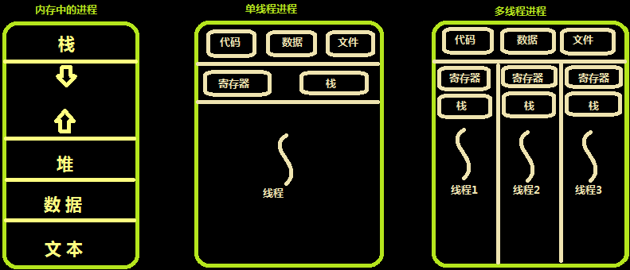
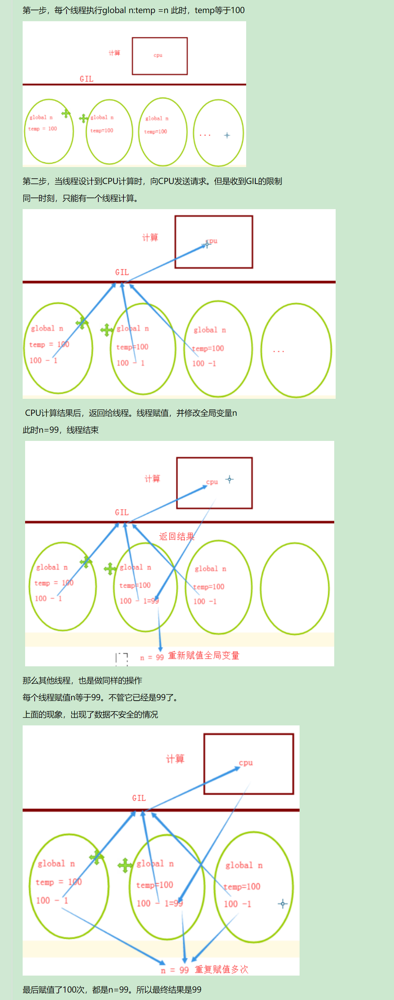

# 系统编程

## json

```python
import json

# 字典序列化  在内存中操作
dic = {'k1': 'v1'}
str_dic = json.dumps(dic)
print(str_dic)

# 序列化 文件句柄
with open('file', mode='w') as f:
    json.dump(dic, f)

# 反序列化
loads_dic = json.loads(str_dic)
print(loads_dic)

# 反序列化
with open('file') as f:
    res = json.load(f)
print(res)
```

## 操作系统线程理论

<a href="https://www.cnblogs.com/xiao987334176/p/9041318.html">python 全栈开发，Day41(线程概念,线程的特点,进程和线程的关系,线程和python 理论知识,线程的创建)</a>

## 线程概念的引入背景

**进程**

之前我们已经了解了操作系统中进程的概念，程序并不能单独运行，只有将程序装载到内存中，系统为它分配资源才能运行，而这种执行的程序就称之为进程。

程序和进程的区别就在于：程序是指令的集合，它是进程运行的静态描述文本；进程是程序的一次执行活动，属于动态概念。在多道编程中，我们允许多个程序同时加载到内存中，在操作系统的调度下，可以实现并发地执行。
这样的设计，大大提高了CPU的利用率。进程的出现让每个用户感觉到自己独享CPU，因此，进程就是为了在CPU上实现多道编程而提出的。

**有了进程为什么要有线程？**
进程有很多优点，它提供了多道编程，让我们感觉我们每个人都拥有自己的CPU和其他资源，可以提高计算机的利用率。很多人就不理解了，既然进程这么优秀，为什么还要线程呢？
其实，仔细观察就会发现进程还是有很多缺陷的，主要体现在两点上：

进程只能在一个时间干一件事，如果想同时干两件事或多件事，进程就无能为力了。进程在执行的过程中如果阻塞，例如等待输入，整个进程就会挂起，即使进程中有些工作不依赖于输入的数据，也将无法执行。

如果这两个缺点理解比较困难的话，举个现实的例子也许你就清楚了。如果把我们上课的过程看成一个进程的话，那么我们要做的是耳朵听老师讲课，手上还要记笔记，脑子还要思考问题，这样才能高效的完成听课的任务。而如果只提供进程这个机制的话，上面这三件事将不能同时执行，同一时间只能做一件事，听的时候就不能记笔记，也不能用脑子思考，这是其一；如果老师在黑板上写演算过程，我们开始记笔记，而老师突然有一步推不下去了，阻塞住了，他在那边思考着，而我们呢，也不能干其他事，即使你想趁此时思考一下刚才没听懂的一个问题都不行，这是其二。

现在你应该明白了进程的缺陷了，而解决的办法很简单，我们完全可以让听、写、思三个独立的过程，并行起来，这样很明显可以提高听课的效率。而实际的操作系统中，也同样引入了这种类似的机制——线程。

## 线程的出现

60年代，在OS中能拥有资源和独立运行的基本单位是进程，然而随着计算机技术的发展，进程出现了很多弊端，
一是由于进程是资源拥有者，创建、撤消与切换存在较大的时空开销，因此需要引入轻型进程。二是由于对称多处理机（SMP）出现，可以满足多个运行单位，而多个进程并行开销过大。因此在80年代，出现了能独立运行的基本单位——线程（Threads），注意：**进程是资源分配的最小单位，线程是CPU调度的最小单位。每一个进程中至少有一个线程。**

一个进程 —— 实现不了并发，你既不希望数据隔离，还要实现并发的效果，那么就应该使用线程。

**线程是轻量级的进程；线程的创建和销毁所需要的时间开销都非常小；线程直接使用进程的内存；线程不能独立存在，要依赖于进程。**

## 进程和线程的关系

线程与进程的区别可以归纳为以下4点
1.地址空间和其它资源（如打开文件）：进程间相互独立，同一进程的各线程间共享。某进程内的线程在其它进程不可见。2.通信：进程间通信IPC，线程间可以直接读写进程数据段（如全局变量）来进行通信——需要进程同步和互斥手段的辅助，以保证数据的一致性。3.调度和切换：线程上下文切换比进程上下文切换要快得多。4.在多线程操作系统中，进程不是一个可执行的实体。

真正执行代码的是线程，程序启动是一个进程。使用线程执行代码，接受CPU调度。线程的时间开销小于进程时间开销。

## 线程的特点

在多线程的操作系统中，通常是在一个进程中包括多个线程，每个线程都是作为利用CPU的基本单位，是花费最小开销的实体。线程具有以下属性。

1 轻型实体
线程中的实体基本上不拥有系统资源，只是有一点必不可少的、能保证独立运行的资源。线程的实体包括程序、数据和TCB。线程是动态概念，它的动态特性由线程控制块TCB描述。

TCB包括以下信息：1 线程状态；2 当线程不运行时，被保存的现场资源；3 一组执行堆栈；4 存放每个线程的局部变量主存区；5 访问同一个进程中的主存和其它资源。

用于指示被执行指令序列的程序计数器、保留局部变量、少数状态参数和返回地址等的一组寄存器和堆栈。

2 独立调度和分派的基本单位
在多线程OS中，线程是能独立运行的基本单位，因而也是独立调度和分派的基本单位。由于线程很“轻”，故线程的切换非常迅速且开销小（在同一进程中的）。

3 共享进程资源
线程在同一进程中的各个线程，都可以共享该进程所拥有的资源。这首先表现在：所有线程都具有相同的进程id。
这意味着，线程可以访问该进程的每一个内存资源。此外，还可以访问进程所拥有的已打开文件、定时器、信号量机构等。由于同一个进程内的线程共享内存和文件，所以线程之间互相通信不必调用内核。

4 可并发执行
在一个进程中的多个线程之间，可以并发执行，甚至允许在一个进程中所有线程都能并发执行；同样，不同进程中的线程也能并发执行，充分利用和发挥了处理机与外围设备并行工作的能力。

## 使用线程的实际场景

开启一个字处理软件进程，该进程肯定需要办不止一件事情。比如监听键盘输入，处理文字，定时自动将文字保存到硬盘。这三个任务操作的都是同一块数据，因而不能用多进程。只能在一个进程里并发地开启三个线程，如果是单线程，那就只能是键盘输入时，不能处理文字和自动保存，自动保存时又不能输入和处理文字。

## 内存中的线程



线程通常是有益的，但是带来了不小程序设计难度。

线程是轻量级的进程；线程的创建、销毁和切换所需要的时间开销都非常小；线程直接使用进程的内存；线程不能独立存在，要依赖于进程；进程 —— 资源分配的最小单位；线程 —— CPU调度的最小单位；数据不隔离；可以并发；依赖进程——每一个进程里至少有一个线程；进程负责管理资源、线程负责执行代码。

python程序运行起来 —— 进程；进程 —— 管理整个程序的内存，存储全局的变量 : 内置的函数，全局的名字；线程 —— 执行代码。

## 用户级线程和内核级线程

线程的实现可以分为两类：用户级线程和内核线线程

## 用户级线程

内核的切换由用户态程序自己控制内核切换，不需要内核干涉，少了进出内核态的消耗，但不能很好的利用多核cpu。

## 内核级线程

内核级线程：切换由内核控制，当线程进行切换的时候，由用户态转化为内核态。切换完毕要从内核态返回用户态；可以很好的利用smp，即利用多核cpu。windows线程就是这样的。

## 内核线程的优缺点

优点：当有多个处理机时，一个进程的多个线程可以同时执行。缺点：由内核进行调度。

## 用户级线程的优缺点

优点：线程的调度不需要内核直接参与，控制简单。可以在不支持线程的操作系统中实现。创建和销毁线程、线程切换代价等线程管理的代价比内核线程少得多。允许每个进程定制自己的调度算法，线程管理比较灵活。线程能够利用的表空间和堆栈空间比内核级线程多。同一进程中只能同时有一个线程在运行，如果有一个线程使用了系统调用而阻塞，那么整个进程都会被挂起。
缺点：资源调度按照进程进行，多个处理机下，同一个进程中的线程只能在同一个处理机下分时复用。

## 混合实现

## 线程和python

## 全局解释器锁GIL

Python代码的执行由Python虚拟机(也叫解释器主循环)来控制。Python在设计之初就考虑到要在主循环中，同时只有一个线程在执行。虽然Python解释器中可以“运行”多个线程，但在任意时刻只有一个线程在解释器中运行。
对Python虚拟机的访问由全局解释器锁(GIL)来控制，正是这个锁能保证同一时刻只有一个线程在运行。在多线程环境中，Python虚拟机按以下方式执行：a、设置 GIL；b、切换到一个线程去运行；c、运行指定数量的字节码指令或者线程主动让出控制(可以调用 time.sleep(0))；d、把线程设置为睡眠状态；e、解锁 GIL；d、再次重复以上所有步骤。

在调用外部代码(如 C/C++扩展函数)的时候，GIL将会被锁定，直到这个函数结束为止(由于在这期间没有Python的字节码被运行，所以不会做线程切换)编写扩展的程序员可以主动解锁GIL。

## python线程模块的选择

Python提供了几个用于多线程编程的模块，包括thread、threading和Queue等。thread和threading模块允许程序员创建和管理线程。**thread模块提供了基本的线程和锁的支持，threading提供了更高级别、功能更强的线程管理的功能。Queue模块允许用户创建一个可以用于多个线程之间共享数据的队列数据结构。**避免使用thread模块，因为更高级别的threading模块更为先进对线程的支持更为完善。而且使用thread模块里的属性有可能会与threading出现冲突。其次低级别的thread模块的同步原语很少(实际上只有一个)，而threading模块则有很多，再者，thread模块中当主线程结束时，所有的线程都会被强制结束掉，没有警告也不会有正常的清除工作，至少threading模块能确保重要的子线程退出后进程才退出。

thread模块不支持守护线程，当主线程退出时，所有的子线程不论它们是否还在工作，都会被强行退出。而threading模块支持守护线程，守护线程一般是一个等待客户请求的服务器，如果没有客户提出请求它就在那等着
如果设定一个线程为守护线程，就表示这个线程是不重要的，在进程退出的时候，不用等待这个线程退出。

## threading模块

multiprocess模块的完全模仿了threading模块的接口，二者在使用层面，有很大的相似性。

<a href="https://docs.python.org/3/library/threading.html?highlight=threading#">官方链接 </a>

## 线程的创建

创建线程的方式1

```python
from threading import Thread
import time


def sayhi(name):
    time.sleep(1)
    print('%s say hello' % name)


if __name__ == '__main__':
    t = Thread(target=sayhi, args=('egon',))
    t.start()
    print('主线程')

# 主线程
# egon say hello
```

创建线程的方式2

```python
from threading import Thread
import time


class Sayhi(Thread):
    def __init__(self, name):
        super().__init__()
        self.name = name

    def run(self):
        time.sleep(1)
        print('%s say hello' % self.name)


if __name__ == '__main__':
    t = Sayhi('egon')
    t.start()
    print('主线程')

# 主线程
# egon say hello
```

## 执行顺序

```python
import threading
import time


class MyThread(threading.Thread):
    def run(self):
        for i in range(3):
            time.sleep(1)
            msg = "I'm " + self.name + ' @ ' + str(i)
            print(msg)


def test():
    for i in range(5):
        t = MyThread()
        t.start()


if __name__ == '__main__':
    test()
```

从代码和执行结果我们可以看出，多线程程序的执行顺序是不确定的。当执行到sleep语句时，线程将被阻塞，到sleep结束后，线程进入就绪状态，等待调度。而线程调度将自行选择一个线程执行。上面的代码中只能保证每个线程都运行完整个run函数，但是线程的启动顺序、run函数中每次循环的执行顺序都不能确定。

## 多线程与多进程

## pid的比较

```python
from threading import Thread
from multiprocessing import Process
import os


def work():
    print('hello', os.getpid())


if __name__ == '__main__':
    # part1:在主进程下开启多个线程,每个线程都跟主进程的pid一样
    t1 = Thread(target=work)
    t2 = Thread(target=work)
    t1.start()
    t2.start()
    print('主线程/主进程pid', os.getpid())

    # part2:开多个进程,每个进程都有不同的pid
    p1 = Process(target=work)
    p2 = Process(target=work)
    p1.start()
    p2.start()
    print('主线程/主进程pid', os.getpid())

# hello 9536
# hello 9536
# 主线程/主进程pid 9536
# 主线程/主进程pid 9536
# hello 7076
# hello 4692
```

## 开启效率的较量

```python
from threading import Thread
from multiprocessing import Process


def work():
    print('hello')


if __name__ == '__main__':
    # 在主进程下开启线程
    t = Thread(target=work)
    t.start()
    print('主线程/主进程')

    # 在主进程下开启子进程
    t = Process(target=work)
    t.start()
    print('主线程/主进程')
# hello
# 主线程/主进程
# 主线程/主进程
# hello
```

## 内存数据的共享问题

```python
from threading import Thread
from multiprocessing import Process


def work():
    global n
    n = 0


if __name__ == '__main__':
    n = 100
    p = Process(target=work)
    p.start()
    p.join()
    print('主', n)

    n = 1
    t = Thread(target=work)
    t.start()
    t.join()
    print('主,', n)

# 主 100
# 主, 0
```

毫无疑问子进程p已经将自己的全局的n改成了0，但改的仅仅是它自己的，查看父进程的n仍然为100。查看结果为0，因为同一进程内的线程之间共享进程内的数据。

## 多线程实现socket

server

```python
import socket
from threading import Thread


def talk(con):
    while True:
        rec_msg = con.recv(1024)
        if not rec_msg: break
        print(rec_msg.decode('utf-8'))
        con.send(rec_msg.upper())


if __name__ == '__main__':
    server = socket.socket()
    server.setsockopt(socket.SOL_SOCKET, socket.SO_REUSEADDR, 1)
    HOST, PORT = '127.0.0.1', 9999
    server.bind((HOST, PORT))
    server.listen()
    while True:
        con, adr = server.accept()
        Thread(target=talk, args=(con,)).start()
```

client

```python
import socket

client = socket.socket()
HOST, PORT = '127.0.0.1', 9999
client.connect((HOST, PORT))
while True:
    send_msg = input('>>>').strip()
    if not send_msg:
        continue
    client.send(send_msg.encode('utf-8'))
    rec_msg = client.recv(1024).decode('utf-8')
    if rec_msg == 'Q':
        break
    print(rec_msg)

client.close()
```

## Thread类的其他方法

Thread实例对象的方法

```
isAlive(): 返回线程是否活动的。
getName(): 返回线程名。
setName(): 设置线程名。
```

threading模块提供的一些方法

```
threading.currentThread(): 返回当前的线程变量。
threading.enumerate(): 返回一个包含正在运行的线程的list。正在运行指线程启动后、结束前，不包括启动前和终止后的线程。
threading.activeCount(): 返回正在运行的线程数量，与len(threading.enumerate())有相同的结果。
```

**代码示例**

```python
from threading import Thread


def func():
    print(123)


t = Thread(target=func)
t.start()
print(t.is_alive())  # 返回线程是否是活动的


# 123
# True
```

```python
import time
from threading import Thread


def func():
    time.sleep(0.1)
    print(123)


t = Thread(target=func)
t.start()
print(t.is_alive())

# True
# 123
```

```python
import time
from threading import Thread


def func():
    time.sleep(0.1)
    print(123)


t = Thread(target=func)
t.start()
print(t.is_alive())  # 返回线程是否活动的
print(t.getName())  # 返回线程名
t.setName('t1')  # 设置线程名
print(t.getName())

# True
# Thread-1
# t1
# 123
```


```python
from threading import Thread
import threading
import time


def work():
    time.sleep(3)
    print(threading.current_thread().getName())


if __name__ == '__main__':
    # 在主进程下开启线程
    t = Thread(target=work)
    t.start()

    print(threading.current_thread().getName())
    print(threading.current_thread())  # 主线程
    print(threading.enumerate())  # 连同主线程在内有两个运行的线程
    print(threading.active_count())
    print('主线程/主进程')

# MainThread
# <_MainThread(MainThread, started 892)>
# [<_MainThread(MainThread, started 892)>, <Thread(Thread-1, started 10080)>]
# 2
# 主线程/主进程
# Thread-1
```

```python
import time
from threading import Thread, currentThread, enumerate, activeCount


def func():
    time.sleep(0.1)
    # print(123)


t = Thread(target=func)
t.start()
print(currentThread)  # 返回当前的线程变量
print(enumerate())  # 返回一个包含正在运行的线程的list
print(activeCount())  # 返回正在运行的线程数量

# <function current_thread at 0x000002E572E24620>
# [<_MainThread(MainThread, started 6204)>, <Thread(Thread-1, started 11032)>]
# 2
```

## **join方法**

```python
from threading import Thread
import time


def sayhi(name):
    time.sleep(2)
    print('%s say hello' % name)


if __name__ == '__main__':
    t = Thread(target=sayhi, args=('egon',))
    t.start()
    t.join()
    print('主线程')
    print(t.is_alive())

# egon say hello
# 主线程
# False
```

## 守护线程

无论是进程还是线程，都遵循：守护xx会等待主xx运行完毕后被销毁。需要强调的是：运行完毕并非终止运行。

1.对主进程来说，运行完毕指的是主进程代码运行完毕。
2.对主线程来说，运行完毕指的是主线程所在的进程内所有非守护线程统统运行完毕，主线程才算运行完毕。

**详细解释**

1 主进程在其代码结束后就已经算运行完毕了（守护进程在此时就被回收），然后主进程会一直等非守护的子进程都运行完毕后回收子进程的资源(否则会产生僵尸进程)，才会结束。

2 主线程在其他非守护线程运行完毕后才算运行完毕（守护线程在此时就被回收）。因为主线程的结束意味着进程的结束，进程整体的资源都将被回收，而进程必须保证非守护线程都运行完毕后才能结束。

**例1**

```python
from threading import Thread
import time


def sayhi(name):
    time.sleep(2)
    print('%s say hello' % name)


if __name__ == '__main__':
    t = Thread(target=sayhi, args=('egon',))
    t.setDaemon(True)  # 必须在t.start()之前设置
    t.start()

    print('主线程')
    time.sleep(3)
    print(t.is_alive())

# 主线程
# egon say hello
# False
```

**例2**

```python
from threading import Thread
import time


def foo():
    print(123)
    time.sleep(1)
    print("end123")


def bar():
    print(456)
    time.sleep(3)
    print("end456")


t1 = Thread(target=foo)
t2 = Thread(target=bar)

t1.daemon = True
t1.start()
t2.start()
print("main-------")

# 123
# 456
# main-------
# end123
# end456
```

**例3**

```python
import time
from threading import Thread


# 守护线程
def func1():
    while True:
        time.sleep(1)
        print('子线程')


def func2():
    time.sleep(5)
    print('子线程2')


t = Thread(target=func1)
t2 = Thread(target=func2)
t.setDaemon(True)  # 设置守护线程
t.start()
t2.start()
print('主线程')

# 主线程
# 子线程
# 子线程
# 子线程
# 子线程
# 子线程2
```

```python
import time
from threading import Thread


def func1():  # 守护线程
    while True:
        time.sleep(1)
        print('子线程')


t = Thread(target=func1)
t.setDaemon(True)
t.start()
print('主线程')

# 主线程
```

发送瞬间就执行完毕了。子线程没输出，因主线程执行完毕，子线程随之关闭。

```python
from threading import Thread


def func1():  # 守护线程
    while True:
        print('子线程')


t = Thread(target=func1)
t.setDaemon(True)
t.start()
print('主线程')

# 子线程
# 子线程
# 子线程
# 子线程
# 子线程
# 子线程
# 主线程
```


## 打印线程号

线程执行，是异步的。操作系统控制了线程的执行。线程执行，顺序是乱的。并发执行，没有顺序。

```python
import os
import time
from threading import Thread


def func(i):
    print('--->子线程', os.getpid())
    time.sleep(1)
    print('*' * i)


if __name__ == '__main__':
    print('主进程', os.getpid())
    start = time.time()
    thread_lst = []
    for i in range(10):
        t = Thread(target=func, args=(i,))
        t.start()
        thread_lst.append(t)
    for t in thread_lst: t.join()
    print(time.time() - start)

# 主进程 8652
# --->子线程 8652
# --->子线程 8652
# --->子线程 8652
# --->子线程 8652
# --->子线程 8652
# --->子线程 8652
# --->子线程 8652
# --->子线程 8652
# --->子线程 8652
# --->子线程 8652
# ****
# **
#
# *
# ***
# ********
# *****
# ******
# *******
# *********
# 1.0035877227783203
```

```python
import os
import time
from threading import Thread


def func(i):
    print('--->子线程', os.getpid())
    # time.sleep(1)
    print('*' * i)


if __name__ == '__main__':
    print('主进程', os.getpid())
    start = time.time()
    thread_lst = []
    for i in range(10):
        t = Thread(target=func, args=(i,))
        t.start()
        thread_lst.append(t)
    for t in thread_lst: t.join()
    print(time.time() - start)
# 主进程 7432
# --->子线程 7432
# 
# --->子线程 7432
# *
# --->子线程 7432
# **
# --->子线程 7432
# ***
# --->子线程 7432
# ****
# --->子线程 7432
# *****
# --->子线程 7432
# ******
# --->子线程 7432
# *******
# --->子线程 7432
# ********
# --->子线程 7432
# *********
# 0.0029757022857666016
```

## 显示线程名以及线程标识号

```python
import os
import time
from threading import Thread


def func(i):
    print('--->子线程', os.getpid())
    time.sleep(1)
    print('*'*i)


if __name__ == '__main__':
    print('主进程', os.getpid())
    start = time.time()
    thread_lst = []
    for i in range(10):
        t = Thread(target=func, args=(i,))
        t.start()
        # Thread.name 获取和设置线程的名称
        # Thread.ident 获取线程的标识符
        print('-->', t.name, t.ident)
        thread_lst.append(t)
    for t in thread_lst: t.join()  # 等待所有线程结束
    print(time.time() - start)

# 主进程 1704
# --->子线程 1704
# --> Thread-1 7452
# --->子线程 1704
# --> Thread-2 7432
# --->子线程 1704
# --> Thread-3 10016
# --->子线程 1704
# --> Thread-4 6052
# --->子线程 1704
# --> Thread-5 7656
# --->子线程 1704
# --> Thread-6 9020
# --->子线程 1704
# --> Thread-7 2804
# --->子线程 1704
# --> Thread-8 10064
# --->子线程 1704
# --> Thread-9 1316
# --->子线程 1704
# --> Thread-10 5208
# *
#
# *****
# ***
# **
# ****
# ******
# *******
# ********
# *********
# 1.0028445720672607
```

可以看出，同一个进程下的多个线程进程号相同，线程号不同。

```
为什么进程执行需要if __name__ == '__main__' : 加了if __name__ = '__main__'，不会出现循环导入问题
进程执行时，相当于把当前文件给import了一次，那么所有代码会加载一次。而线程不需要，而线程执行时，是直接从进程中获取值。
```


## 线程和进程的区别

做效率测试，进程和线程，谁更快

```python
import time
from threading import Thread
from multiprocessing import Process


def func(i):
    print('*'*i)


if __name__ == '__main__':
    start = time.time()
    for i in range(5):
        Thread(target=func, args=(i,)).start()
    print('线程', time.time()-start)

    start = time.time()
    for i in range(5):
        Process(target=func, args=(i,)).start()
    print('进程', time.time()-start)

#
# *
# **
# ***
# ****
# 线程 0.0018033981323242188
# 进程 0.01002955436706543
#
# ***
# *
# **
# ****
```

使用join方法等待所有线程/进程执行完毕，再测试

```python
import time
from threading import Thread
from multiprocessing import Process


def func(i):
    print('*' * i)


if __name__ == '__main__':
    start = time.time()
    thread_lst = []
    for i in range(5):
        t = Thread(target=func, args=(i,))
        t.start()
        thread_lst.append(t)
    for t in thread_lst: t.join()  # 等待所有线程执行完毕
    print('线程', time.time() - start)

    start = time.time()
    process_lst = []
    for i in range(5):
        p = Process(target=func, args=(i,))
        p.start()
        process_lst.append(p)
    for p in process_lst: p.join()
    print('进程', time.time() - start)

#
# *
# **
# ***
# ****
# 线程 0.0009989738464355469
# *
# **
# ***
#
# ****
# 进程 0.1574258804321289
```

```
1. 效率问题：线程快，进程慢
2. 同一个进程下的多个线程进程号相同，线程号不同
3. if __name__ == '__main__'：开启进程必须有这句话，但是开启线程不需要这种现象只在windows操作系统上才出现
4. 数据的共享问题：在进程之间数据隔离，在线程之间数据共享
```

## 全局解释器锁GIL

多个线程之间在同一时间只能有一个线程访问CPU。解释型语言，都存在这个问题，主要是锁线程。不是锁进程。

python运行，相对于编译型语言，比如c语言，执行比较慢2者的运行区别：
python代码 --> 字节码--> 机器码
c语言 字节码 --> 机器码
python多线程同时只能调用一个CPU。而C语言，能直接调用多个CPU。所以在高计算性场景中，C比python更胜一筹。python更适合高IO型的程序 ： 比如web网站，爬虫...

python的程序就不能充分的利用CPU了呢？使用多进程就可以解决，多进程 —— 开启和销毁的时候慢，操作系统切换的时候也慢，但是切换的影响非常小。

全局解释器锁
锁线程
在计算的时候同一时刻只能有一个线程访问CPU
线程锁限制了你对CPU的使用，但是不影响web类或者爬虫类代码的效率，我们可以通过启动多进程的形式来弥补这个问题

在同一个进程里面的多个线程，会受到GIL锁的限制。多个进程之间，不会有GIL。一个CPU，同时只有一个线程执行。

cpu同一时刻只能执行一个进程？答案是的，cpu同一时刻只能执行一个进程中的某一个线程，之前写的python代码，都是属于单线程的程序。

**主线程，会等待子线程结束**

```python
import time
from threading import Thread


def func1():
    while True:
        time.sleep(1)
        print('子线程')


t = Thread(target=func1)
t.start()
print('主线程')

# 主线程
# 子线程
# 子线程
# 子线程
# ...
```

## 线程并发效果

所有方法睡1秒

```python
import time
from threading import Thread


def func(i):
    time.sleep(1)
    print('*' * i)


if __name__ == '__main__':
    start = time.time()
    thread_lst = []
    for i in range(10):
        t = Thread(target=func, args=(i,))
        t.start()
        thread_lst.append(t)
    for t in thread_lst: t.join()
    print(time.time() - start)

# ****
# ***
# *
# **
#
# *******
# ******
# *****
# *********
# ********
# 1.003023624420166
```

```python
import time
from threading import Thread


def func(i):
    print('*' * i, i)


if __name__ == '__main__':
    start = time.time()
    thread_lst = []
    for i in range(10):
        t = Thread(target=func, args=(i,))
        t.start()
        thread_lst.append(t)
    for t in thread_lst: t.join()
    print(time.time() - start)

#  0
# * 1
# ** 2
# *** 3
# **** 4
# ***** 5
# ****** 6
# ******* 7
# ******** 8
# ********* 9
# 0.00200653076171875
```

进程

```python
import time
from multiprocessing import Process


def func(i):
    time.sleep(1)
    print('*' * i)


if __name__ == '__main__':
    start = time.time()
    process_lst = []
    for i in range(10):
        t = Process(target=func, args=(i,))
        t.start()
        process_lst.append(t)
    for p in process_lst: p.join()
    print(time.time() - start)
```

## 多线程之争

**任务**

```python
def decrement(n):
    while n > 0:
        n -= 1
```


```python 
import time

start = time.time()
decrement(100000000)
cost = time.time() - start
print(cost)
# 5.2599570751190186
```

**多线程**

```python
import threading
import time

start = time.time()
t1 = threading.Thread(target=decrement, args=(50000000,))
t2 = threading.Thread(target=decrement, args=(50000000,))
t1.start()  # 启动线程，执行任务
t2.start()  # 同上
t1.join()  # 主线程阻塞，直到t1执行完成，主线程继续往后执行
t2.join()  # 同上
cost = time.time() - start
print(cost)
# 5.167425870895386
```

创建两个子线程 t1、t2，每个线程各执行 5 千万次减操作，等两个线程都执行完后，主线程终止程序运行。

是什么原因导致多线程不快反慢的呢？

原因就在于 GIL ，在 Cpython 解释器（Python语言的主流解释器）中，有一把全局解释锁（Global Interpreter Lock），在解释器解释执行 Python 代码时，先要得到这把锁，意味着，任何时候只可能有一个线程在执行代码，
其它线程要想获得 CPU 执行代码指令，就必须先获得这把锁，如果锁被其它线程占用了，那么该线程就只能等待，直到占有该锁的线程释放锁才有执行代码指令的可能。因此，这也就是为什么两个线程一起执行反而更加慢的原因，因为同一时刻，只有一个线程在运行，其它线程只能等待，即使是多核CPU，也没办法让多个线程「并行」地同时执行代码，只能是交替执行，因为多线程涉及到上线文切换、锁机制处理（获取锁，释放锁等），所以，多线程执行不快反慢。

什么时候 GIL 被释放呢？
当一个线程遇到 IO 任务时，将释放GIL。计算密集型（CPU-bound）线程执行 100 次解释器的计步（ticks）时（计步可粗略看作 Python 虚拟机的指令），也会释放 GIL。可以通过 sys.setcheckinterval()设置计步长度，sys.getcheckinterval() 查看计步长度。相比单线程，这些多是多线程带来的额外开销。

CPython 解释器为什么要这样设计？

多线程有个问题，怎么解决共享数据的同步、一致性问题，因为，对于多个线程访问共享数据时，可能有两个线程同时修改一个数据情况，如果没有合适的机制保证数据的一致性，那么程序最终导致异常，所以，Python之父就搞了个全局的线程锁，不管你数据有没有同步问题，反正一刀切，上个全局锁，保证数据安全。这也就是多线程鸡肋的原因，因为它没有细粒度的控制数据的安全，而是用一种简单粗暴的方式来解决。

<a href="https://www.cnblogs.com/xiao987334176/p/9046028.html">python 全栈开发，Day42(Thread类的其他方法,同步锁,死锁与递归锁,信号量,事件,条件,定时器,队列,Python标准模块--concurrent.futures) </a>

## 同步锁

## 多个线程抢占资源的情况

```python
import time
from threading import Thread


def func():
    global n
    temp = n
    time.sleep(1)
    n = temp - 1


n = 100
t_lst = []
for i in range(100):
    t = Thread(target=func)
    t.start()
    t_lst.append(t)
for t in t_lst: t.join()
print(n)

# 99
```



## 加锁

```python
from threading import Thread, Lock


def func(lock):
    global n
    lock.acquire()  # 加锁
    temp = n
    n = temp - 1
    lock.release()  # 解锁


n = 100
t_lst = []
lock = Lock()  # 创建锁
for i in range(100):
    t = Thread(target=func, args=(lock,))
    t.start()
    t_lst.append(t)
for t in t_lst: t.join()  # 等待所有子线程结束
print(n)

# 0
```

如果把计算和赋值拆开，就会出现数据不安全的情况。下面写法，不用加锁，也可以得到0。

```python
from threading import Thread


def func():
    global n
    n -= 1


n = 100
for i in range(100):
    t = Thread(target=func)
    t.start()
print(n)

# 0
```

因为默认有一个GIL锁，所以每个线程都减等1，所以最终结果为0。

## 死锁与递归锁

## 死锁

是指两个或两个以上的进程或线程在执行过程中因争夺资源而造成的一种互相等待的现象，若无外力作用，它们都将无法推进下去 此时称系统处于死锁状态或系统产生了死锁，这些永远在互相等待的进程称为死锁进程，如下就是死锁。

```python
from threading import Lock

lock = Lock()  # 在同一个线程中,能够被一个锁的多个acquire阻住,这种锁就叫做互斥锁
lock.acquire()
lock.acquire()
lock.acquire()
```

死锁，也叫互斥锁。

```python
import time
from threading import Thread, Lock


def eat1(noodle_lock, fork_lock, name):  # 吃面
    noodle_lock.acquire()  # 面条加锁
    print('%s 抢到了面条' % name)
    fork_lock.acquire()  # 叉子加锁
    print('%s 抢到了叉子' % name)
    print('%s 正在吃面' % name)
    fork_lock.release()  # 叉子解锁
    print('%s归还了叉子' % name)
    noodle_lock.release()  # 面条解锁
    print('%s归还了面条' % name)


def eat2(noodle_lock, fork_lock, name):  # 也是吃面，不同的是：先抢叉子，再抢面
    fork_lock.acquire()
    print('%s抢到了叉子' % name)
    time.sleep(0.5)
    noodle_lock.acquire()
    print('%s抢到了面' % name)
    print('%s正在吃面' % name)
    noodle_lock.release()
    print('%s归还了面' % name)
    fork_lock.release()
    print('%s归还了叉子' % name)


noodle_lock = Lock()  # 面条锁
fork_lock = Lock()  # 叉子锁

t1 = Thread(target=eat1, args=(noodle_lock, fork_lock, 'nazha')).start()
t2 = Thread(target=eat2, args=(noodle_lock, fork_lock, 'egon')).start()
t3 = Thread(target=eat1, args=(noodle_lock, fork_lock, 'yuan')).start()
t4 = Thread(target=eat2, args=(noodle_lock, fork_lock, 'alex')).start()

# nazha 抢到了面条
# nazha 抢到了叉子
# nazha 正在吃面
# nazha归还了叉子
# nazha归还了面条
# egon抢到了叉子
# yuan 抢到了面条
```

发现程序卡住了 egon和yuan分别抢到了叉子和面条，但是谁也不愿意给对方。互掐在...那么就出现了死锁现象。

只有一个锁，不会出现死锁。在多个锁的情况下，就会出现死锁。

在线程间共享多个资源的时候，如果两个线程分别占有一部分资源并且同时等待对方的资源，就会造成死锁。
尽管死锁很少发生，但一旦发生就会造成应用的停止响应。

下面看一个死锁的例子

```python
import threading
import time


class MyThread1(threading.Thread):
    def run(self):
        if mutexA.acquire():
            print(self.name + '----do1---up----')
            time.sleep(1)

            if mutexB.acquire():
                print(self.name + '----do1---down----')
                mutexB.release()
            mutexA.release()


class MyThread2(threading.Thread):
    def run(self):
        if mutexB.acquire():
            print(self.name + '----do2---up----')
            time.sleep(1)
            if mutexA.acquire():
                print(self.name + '----do2---down----')
                mutexA.release()
            mutexB.release()


mutexA = threading.Lock()
mutexB = threading.Lock()

if __name__ == '__main__':
    t1 = MyThread1()
    t2 = MyThread2()
    t1.start()
    t2.start()

# Thread-1----do1---up----
# Thread-2----do2---up----

# 卡住...
```


避免死锁：程序设计时要尽量避免（银行家算法）；添加超时时间等。

## 递归锁

在Python中为了支持在同一线程中多次请求同一资源，python提供了可重入锁RLock。这个RLock内部维护着一个Lock和一个counter变量，counter记录了acquire的次数，从而使得资源可以被多次acquire。直到一个线程所有的acquire都被release，其他的线程才能获得资源。

**简单例子**

```python
from threading import Thread, RLock

rlock = RLock()  # 创建递归锁
rlock.acquire()  # 加第一个锁
print('*')
rlock.acquire()  # 加第二个锁
print('**')
# *
# **
```

瞬间就输出了，程序没有卡顿。递归锁在同一个线程中对同一个锁多次acquire不会产生阻塞。

```python
from threading import Thread, RLock


def func(rlock, flag):
    rlock.acquire()  # 第一道锁
    print(flag * 10)
    rlock.acquire()  # 第二道锁
    print(flag * 10)
    rlock.acquire()  # 第三道锁
    print(flag * 10)
    rlock.acquire()  # 第四道锁
    print(flag * 10)


rlock = RLock()  # 创建递归锁
Thread(target=func, args=(rlock, '*')).start()  # 传入递归锁和*
Thread(target=func, args=(rlock, '-')).start()

# **********
# **********
# **********
# **********
```

程序卡住了，---------没有输出，必须4次relase。

```python
from threading import Thread, RLock


def func(rlock, flag):
    rlock.acquire()  # 第一道锁
    print(flag * 10)
    rlock.acquire()  # 第二道锁
    print(flag * 10)
    rlock.acquire()  # 第三道锁
    print(flag * 10)
    rlock.acquire()  # 第四道锁
    print(flag * 10)
    rlock.release()  # 解锁
    rlock.release()
    rlock.release()
    rlock.release()


rlock = RLock()  # 创建递归锁
Thread(target=func, args=(rlock, '*')).start()
Thread(target=func, args=(rlock, '-')).start()

# **********
# **********
# **********
# **********
# ----------
# ----------
# ----------
# ----------
```

## 递归锁解决科学家吃面的问题

```python
import time
from threading import Thread, RLock


def eat1(noodle_lock, fork_lock, name):  # 吃面
    noodle_lock.acquire()  # 拿到面条的整串钥匙
    print('%s 抢到了面条' % name)
    fork_lock.acquire()  # 拿到叉子的整串钥匙
    print('%s 抢到了叉子' % name)
    print('%s 正在吃面' % name)
    fork_lock.release()  # 叉子解锁
    print('%s归还了叉子' % name)
    noodle_lock.release()  # 面条解锁
    print('%s归还了面条' % name)


def eat2(noodle_lock, fork_lock, name):  # 也是吃面，不同的是：先抢叉子，再抢面
    fork_lock.acquire()
    print('%s抢到了叉子' % name)
    time.sleep(0.5)
    noodle_lock.acquire()
    print('%s抢到了面' % name)
    print('%s正在吃面' % name)
    noodle_lock.release()
    print('%s归还了面' % name)
    fork_lock.release()
    print('%s归还了叉子' % name)


noodle_lock = fork_lock = RLock()  # 面条锁和叉子锁，表示一串钥匙

t1 = Thread(target=eat1, args=(noodle_lock, fork_lock, 'nazha')).start()
t2 = Thread(target=eat2, args=(noodle_lock, fork_lock, 'egon')).start()
t3 = Thread(target=eat1, args=(noodle_lock, fork_lock, 'yuan')).start()
t4 = Thread(target=eat2, args=(noodle_lock, fork_lock, 'alex')).start()
```

什么情况下，需要用到递归锁呢？有超过一个资源需要锁的时候，使用递归锁。

## 信号量

同进程一样Semaphore管理一个内置的计数器，每当调用acquire()时内置计数器-1，调用release() 时内置计数器+1；计数器不能小于0；当计数器为0时，acquire()将阻塞线程直到其他线程调用release()。

实例：(同时只有5个线程可以获得semaphore，即可以限制最大连接数为5)

```python
import time
from threading import Thread, Semaphore


def func(sem, i):
    sem.acquire()
    print(i)
    time.sleep(1)
    sem.release()


sem = Semaphore(5)
for i in range(6):
    Thread(target=func, args=(sem, i)).start()
```

## 池与信号量

与进程池是完全不同的概念，进程池Pool(4)，最大只能产生4个进程，而且从头到尾都只是这四个进程，不会产生新的，而信号量是产生一堆线程/进程。

## 事件

同进程的一样，线程的一个关键特性是每个线程都是独立运行且状态不可预测。如果程序中的其他线程需要通过判断某个线程的状态来确定自己下一步的操作，这时线程同步问题就会变得非常棘手。为了解决这些问题，我们需要使用threading库中的Event对象。 对象包含一个可由线程设置的信号标志，它允许线程等待某些事件的发生。在 初始情况下，Event对象中的信号标志被设置为假。如果有线程等待一个Event对象，而这个Event对象的标志为假，那么这个线程将会被一直阻塞直至该标志为真。一个线程如果将一个Event对象的信号标志设置为真，它将唤醒所有等待这个Event对象的线程。如果一个线程等待一个已经被设置为真的Event对象，那么它将忽略这个事件, 继续执行。

```
event.isSet()：返回event的状态值；
event.wait()：如果event.isSet()==False将阻塞线程；
event.set()：设置event的状态值为True，所有阻塞池的线程激活进入就绪状态， 等待操作系统调度；
event.clear()：恢复event的状态值为False。
```

## 连接数据库

```python
import time
import random
from threading import Event, Thread


def connect_db(e):
    count = 1  # 初始计数器
    while count < 4:
        print('尝试第%s次检测连接' % count)
        e.wait(0.5)
        # 等待0.5,再去执行下面的代码
        # 如果不传参数会一直等到事件为True为止
        # 如果传参数 传一个时间参数,到时间后,
        count += 1  # 加1
        if e.is_set():  # 判断状态是否为True
            print('连接成功')
            break
    else:
        print('连接失败')


# 检测数据库是否可以连接
def check_conn(e):
    time.sleep(random.randint(1, 2))  # 等待1~2秒
    e.set()  # 设置状态为True


e = Event()
Thread(target=check_conn, args=(e,)).start()
Thread(target=connect_db, args=(e,)).start()
```

什么时候，用到事件？

你要做的一件事情是有前提的，你就先去处理前提的问题 —— 前提处理好了，把状态设置成True，来控制即将要做的事情可以开始。

## 条件

使得线程等待，只有满足某条件时，才释放n个线程。Python提供的Condition对象提供了对复杂线程同步问题的支持。Condition被称为条件变量，除了提供与Lock类似的acquire和release方法外，还提供了wait和notify方法。线程首先acquire一个条件变量，然后判断一些条件。如果条件不满足则wait；如果条件满足，进行一些处理改变条件后，通过notify方法通知其他线程，其他处于wait状态的线程接到通知后会重新判断条件。不断的重复这一过程，从而解决复杂的同步问题。

起10个线程

```python
from threading import Condition, Thread


def func(i, con):
    con.acquire()  # 进入锁定池
    con.wait()  # 等待通知,前后必须要有acquire和release
    print(i * '*')
    con.release()  # 解锁


con = Condition()  # 条件变量
for i in range(10):
    Thread(target=func, args=(i, con)).start()

while True:
    n = int(input('>>>'))
    con.acquire()  # 加锁
    con.notify(n)
    # 通知其他线程,其他处于wait状态的线程接到通知后会重新判断条件,解除wait状态。
    # 前后必须要有acquire和release
    con.release()  # 解锁
```

```
con.notify(n) 表示按照要求放开线程
con.notify_all() 表示一次性放开线程
```

## 总结

semaphore 允许同一时刻n个线程执行这段代码
event 有一个内部的事件来控制wait的行为，控制的是所有的线程
condition 有一个内部的条件来控制wait的行为，它可以逐个或者分批次的控制线程的走向

## 定时器

定时器，指定n秒后执行某个操作

```python
import time
from threading import Timer


def func():
    print('*' * 10)
    print('子线程', time.strftime("%Y-%m-%d %H:%M:%S"))


t = Timer(5, func)  # 要开始一个线程,等到5秒之后才开启并执行
t.start()
print('主进程', time.strftime("%Y-%m-%d %H:%M:%S"))

# 主进程 2018-10-25 21:17:51
# **********
# 子线程 2018-10-25 21:17:56
```

虽然可以用time.sleep(5)完成5秒的过程，但是它会阻塞主线程。如果用timer，就不会，它是异步的。

## 线程队列

## 先进先出

```python
import queue

q = queue.Queue()
q.put('first')
q.put('second')
q.put('third')

print(q.get())
print(q.get())
print(q.get())
# first
# second
# third
```

## 后进先出

```python
import queue

q = queue.LifoQueue()
q.put('first')
q.put('second')
q.put('third')

print(q.get())
print(q.get())
print(q.get())

# third
# second
# first
```

## 优先级队列

class queue.PriorityQueue(maxsize=0) # 存储数据时可设置优先级的队列

```python
import queue

q = queue.PriorityQueue()
# put进入一个元组,元组的第一个元素是优先级
# (通常是数字,也可以是非数字之间的比较),数字越小优先级越高
q.put((20, 'a'))
q.put((10, 'b'))
q.put((30, 'c'))

print(q.get())
print(q.get())
print(q.get())
# (10, 'b')
# (20, 'a')
# (30, 'c')
```

```python
import queue

q = queue.PriorityQueue()
q.put((2, 'z'))
q.put((2, 'a'))
print(q.get())

# (2, 'a')
```

结果是根据ascii码的顺序来排序的。

## 更多方法说明

```
Queue.qsize()
Queue.empty() #return True if empty
Queue.full() #return True if full
Queue.put(item, block=True, timeout=None)
Queue.put_nowait(item) #Equivalent to put(item, False)
Queue.get(block=True, timeout=None)
Queue.get_nowait()
Equivalent to get(False)
Queue.task_done()
Queue.join() block直到queue被消费完毕
```

## concurrent.futures  

<a href="https://docs.python.org/dev/library/concurrent.futures.html">concurrent.futures </a>

```
#1 介绍
concurrent.futures模块提供了高度封装的异步调用接口
ThreadPoolExecutor：线程池，提供异步调用
ProcessPoolExecutor：进程池，提供异步调用
Both implement the same interface, which is defined by the abstract Executor class.

#2 基本方法
#submit(fn, *args, **kwargs)
异步提交任务

#map(func, *iterables, timeout=None, chunksize=1) 
取代for循环submit的操作

#shutdown(wait=True) 
相当于进程池的pool.close()+pool.join()操作
wait=True，等待池内所有任务执行完毕回收完资源后才继续
wait=False，立即返回，并不会等待池内的任务执行完毕
但不管wait参数为何值，整个程序都会等到所有任务执行完毕
submit和map必须在shutdown之前

#result(timeout=None)
取得结果

#add_done_callback(fn)
回调函数
```

## 异步提交任务

```python
import time
from concurrent.futures import ThreadPoolExecutor


def func(i):
    print(i * '*')
    time.sleep(1)


thread_pool = ThreadPoolExecutor(5)  # 创建一个线程池
thread_pool.submit(func, 1)  # 异步提交任务,往线程池里面加入一个任务
print("主进程")
# *
# 主进程
```

```python
import time
from concurrent.futures import ThreadPoolExecutor


def func(i):
    print(i * '*')
    time.sleep(1)


thread_pool = ThreadPoolExecutor(5)
for i in range(6):
    thread_pool.submit(func, i)  # 异步提交任务,往线程池里面加入一个任务
print('wahaha')

#
# *
# **
# ***
# ****
# wahaha
# *****

# thread_pool.submit 相当于之前线程的apply_async，表示异步
```

最后打印wahaha

```python
import time
from concurrent.futures import ThreadPoolExecutor


def func(i):
    print(i * '*')
    time.sleep(1)


thread_pool = ThreadPoolExecutor(5)
for i in range(5):
    thread_pool.submit(func, i)  # 异步提交任务,往线程池里面加入一个任务
thread_pool.shutdown()  # 相当于进程池的pool.close()+pool.join()操作
print('wahaha')

#
# *
# **
# ***
# ****
# *****
# wahaha
```

```python
import time
from concurrent.futures import ThreadPoolExecutor


def func(i):
    print(i * '*')
    time.sleep(1)
    return i ** 2


thread_pool = ThreadPoolExecutor(5)
ret_lst = []
for i in range(6):
    ret = thread_pool.submit(func, i)  # 异步提交任务,往线程池里面加入一个任务
    ret_lst.append(ret)
thread_pool.shutdown()  # 相当于进程池的pool.close()+pool.join()操作
for ret in ret_lst:
    print(ret.result())  # 取得结果
print('wahaha')

#
# *
# **
# ***
# ****
# *****
# 0
# 1
# 4
# 9
# 16
# 25
# wahaha
```


## ProcessPoolExecutor

```python
import os
import time
import random
from concurrent.futures import ProcessPoolExecutor


def task(n):
    print('%s is runing' % os.getpid())
    time.sleep(random.randint(1, 3))
    return n ** 2


if __name__ == '__main__':
    executor = ProcessPoolExecutor(max_workers=3)
    futures = []
    for i in range(11):
        future = executor.submit(task, i)
        futures.append(future)
    executor.shutdown(True)
    print('+++>')
    for future in futures:
        print(future.result())

# 1440 is runing
# 10732 is runing
# 6752 is runing
# 10732 is runing
# 1440 is runing
# 6752 is runing
# 1440 is runing
# 10732 is runing
# 1440 is runing
# 6752 is runing
# 10732 is runing
# +++>
# 0
# 1
# 4
# 9
# 16
# 25
# 36
# 49
# 64
# 81
# 100
```

## ThreadPoolExecutor

ThreadPoolExecutor用法与ProcessPoolExecutor相同

## map的用法

```python
import os
import time
import random
from concurrent.futures import ThreadPoolExecutor


def task(n):
    print('%s is runing' % os.getpid())
    time.sleep(random.randint(1, 3))
    return n ** 2


if __name__ == '__main__':
    executor = ThreadPoolExecutor(max_workers=3)
    # for i in range(11):
    #     future = executor.submit(task, i)
    executor.map(task, range(1, 12))  # map取代了for+submit 
```

```python
import os
import time
import random
from concurrent.futures import ThreadPoolExecutor


def task(n):
    print('%s is runing' % os.getpid())
    # time.sleep(random.randint(1, 3))
    return n ** 2


if __name__ == '__main__':
    executor = ThreadPoolExecutor(max_workers=3)
    # for i in range(11):
    #     future = executor.submit(task, i)
    res = executor.map(task, range(1, 12))  # map取代了for+submit  
    print(list(res))
# 1164 is runing
# 1164 is runing
# 1164 is runing
# 1164 is runing
# 1164 is runing
# 1164 is runing
# 1164 is runing
# 1164 is runing
# 1164 is runing
# 1164 is runing
# 1164 is runing
# [1, 4, 9, 16, 25, 36, 49, 64, 81, 100, 121]
```


## 回调函数

```python
from concurrent.futures import ProcessPoolExecutor
import requests
import os


def get_page(url):
    print('<进程%s> get %s' % (os.getpid(), url))
    respone = requests.get(url)
    if respone.status_code == 200:
        return {'url': url, 'text': respone.text}


def parse_page(res):
    res = res.result()
    print('<进程%s> parse %s' % (os.getpid(), res['url']))
    parse_res = 'url:<%s> size:[%s]\n' % (res['url'], len(res['text']))
    with open('db.txt', 'a') as f:
        f.write(parse_res)


if __name__ == '__main__':
    urls = [
        'https://www.baidu.com',
        'https://www.python.org',
        'https://www.openstack.org',
        'https://help.github.com/'
    ]

    # p=Pool(3)
    # for url in urls:
    #     p.apply_async(get_page,args=(url,),callback=pasrse_page)
    # p.close()
    # p.join()

    p = ProcessPoolExecutor(3)
    for url in urls:
        p.submit(get_page, url).add_done_callback(parse_page)
        # parse_page拿到的是一个future对象obj，需要用obj.result()拿到结果

```


```python
import time
from concurrent.futures import ThreadPoolExecutor


def func(i):
    print(i * '*')
    time.sleep(1)
    return i ** 2


def callback(arg):  # 回调函数
    print(arg.result() * '-')  # 取得结果,并乘以-


thread_pool = ThreadPoolExecutor(5)
for i in range(5):
    ret = thread_pool.submit(func, i).add_done_callback(callback)  # 异步提交任务,执行回调函数
thread_pool.shutdown()  # 相当于进程池的pool.close()+pool.join()操作
print('wahaha')

#
# *
# **
# ***
# ****
#
# ---------
# ----
# -
# ----------------
# wahaha
```

```python
import time
import random
from concurrent.futures import ThreadPoolExecutor


def task(i):
    print('*' * i)
    # time.sleep(random.random())
    return i + 1


def callb(res):
    print(res.result() * '-')


if __name__ == '__main__':
    threads = ThreadPoolExecutor(5)
    for item in range(1, 6):
        threads.submit(task, item).add_done_callback(callb)
    threads.shutdown()
    print('@' * 7)
```

什么情况下，使用进程池/线程池？

当内存不需要共享，且高计算的时候用进程；当内存需要共享，且高IO的时候用线程。

当并发很大的时候

多进程：多个任务 —— 进程池版socket并发聊天：cpu个数、cpu个数+1

多线程：多个任务 —— 线程池：cpu个数*5

4核CPU，可以开4~5个进程，开20条线程/进程。最终可以开80~100个任务。

