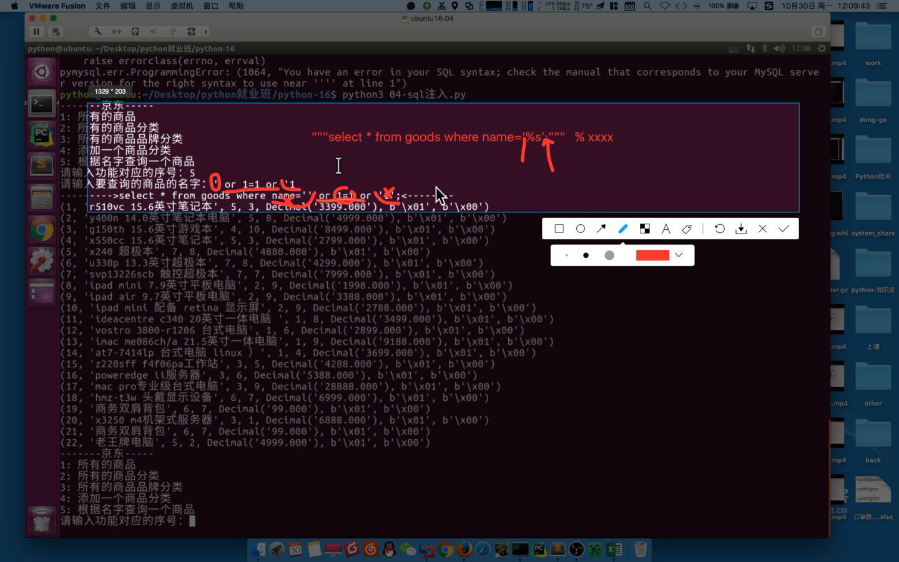

## 增删改

```python
from pymysql import *


def main():
    # 创建Connection连接
    conn = connect(host='localhost', port=3306, database='jing_dong', user='root',                                  password='123456', charset='utf8')
    # 获得Cursor对象
    cs1 = conn.cursor()
    # 执行insert语句，并返回受影响的行数：添加一条数据
    # 增加
    count = cs1.execute('insert into goods_cates(name) values("硬盘2")')
    # 打印受影响的行数
    print(count)

    # # 更新
    count = cs1.execute('update goods_cates set name="机械硬盘2" where name="硬盘2"')
    # # 删除
    count = cs1.execute('delete from goods_cates where id=11')

    # 提交之前的操作，如果之前已经之执行过多次的execute，那么就都进行提交
    conn.commit()

    # 关闭Cursor对象
    cs1.close()
    # 关闭Connection对象
    conn.close()


if __name__ == '__main__':
    main()

```

## 查询一行数据

```python
from pymysql import *


def main():
    # 创建Connection连接
    conn = connect(host='localhost', port=3306, user='root', password='123456',                                    database='jing_dong', charset='utf8')
    # 获得Cursor对象
    cs1 = conn.cursor()
    # 执行select语句，并返回受影响的行数：查询一条数据
    count = cs1.execute('select id,name from goods where id>=4')
    # 打印受影响的行数
    print("查询到%d条数据:" % count)

    for i in range(count):
        # 获取查询的结果
        result = cs1.fetchone()
        # 打印查询的结果
        print(result)
        # 获取查询的结果

    # 关闭Cursor对象
    cs1.close()
    conn.close()


if __name__ == '__main__':
    main()

```

## 查询多行数据

```python
from pymysql import *


def main():
    # 创建Connection连接
    conn = connect(host='localhost', port=3306, user='root', password='123456',                 				 database='jing_dong', charset='utf8')
    # 获得Cursor对象
    cs1 = conn.cursor()
    # 执行select语句，并返回受影响的行数：查询一条数据
    count = cs1.execute('select id,name from goods where id>=4')
    # 打印受影响的行数
    print("查询到%d条数据:" % count)

    result = cs1.fetchall()
    print(result)

    # 关闭Cursor对象
    cs1.close()
    conn.close()


if __name__ == '__main__':
    main()

```

## 面向对象实现查询功能

```python
from pymysql import connect


class JD(object):
    def __init__(self):
        self.conn = connect(host='localhost', port=3306, user='root',
                            password='123456', database='jing_dong', charset='utf8')
        self.cursor = self.conn.cursor()

    def __del__(self):
        self.cursor.close()
        self.conn.close()

    def execute_sql(self, sql):
        self.cursor.execute(sql)
        for temp in self.cursor.fetchall():
            print(temp)

    def show_all_items(self):
        sql = 'select * from goods;'
        self.execute_sql(sql)

    def show_all_cates(self):
        sql = 'select name from goods_cates;'
        self.execute_sql(sql)

    def show_all_brands(self):
        sql = 'select name from goods_brands;'
        self.execute_sql(sql)

    @staticmethod
    def print_menu():
        print('-----京东-----')
        print('1:所有的商品')
        print('2:所有的商品分类')
        print('3:所有的商品品牌')
        return input('请输入功能序号:')

    def run(self):
        while True:
            num = self.print_menu()
            if num == '1':
                self.show_all_items()
            elif num == '2':
                self.show_all_cates()
            elif num == '3':
                self.show_all_brands()
            else:
                print('输入有误')


def main():
    JD().run()


if __name__ == '__main__':
    main()

```


## 面向对象实现查询功能和增加品牌

```python
from pymysql import connect


class JD(object):
    def __init__(self):
        self.conn = connect(host='localhost', port=3306, user='root',
                            password='123456', database='jing_dong', charset='utf8')
        self.cursor = self.conn.cursor()

    def __del__(self):
        self.cursor.close()
        self.conn.close()

    def execute_sql(self, sql):
        self.cursor.execute(sql)
        for temp in self.cursor.fetchall():
            print(temp)

    def show_all_items(self):
        sql = 'select * from goods;'
        self.execute_sql(sql)

    def show_all_cates(self):
        sql = 'select name from goods_cates;'
        self.execute_sql(sql)

    def show_all_brands(self):
        sql = 'select name from goods_brands;'
        self.execute_sql(sql)

    def adds_brands(self):
        name = input("请输入品牌名:")
        sql = """insert into goods_brands (name) values ("%s")""" % name
        self.cursor.execute(sql)
        self.conn.commit()

    @staticmethod
    def print_menu():
        print('-----京东-----')
        print('1:所有的商品')
        print('2:所有的商品分类')
        print('3:所有的商品品牌')
        print('4:增加品牌')
        return input('请输入功能序号:')

    def run(self):
        while True:
            num = self.print_menu()
            if num == '1':
                self.show_all_items()
            elif num == '2':
                self.show_all_cates()
            elif num == '3':
                self.show_all_brands()
            elif num == "4":
                self.adds_brands()
            else:
                print('输入有误')


def main():
    JD().run()


if __name__ == '__main__':
    main()

```


## sql注入

```python
from pymysql import connect


class JD(object):
    def __init__(self):
        self.conn = connect(host='localhost', port=3306, user='root',
                            password='123456', database='jing_dong', charset='utf8')
        self.cursor = self.conn.cursor()

    def __del__(self):
        self.cursor.close()
        self.conn.close()

    def execute_sql(self, sql):
        self.cursor.execute(sql)
        for temp in self.cursor.fetchall():
            print(temp)

    def show_all_items(self):
        sql = 'select * from goods;'
        self.execute_sql(sql)

    def show_all_cates(self):
        sql = 'select name from goods_cates;'
        self.execute_sql(sql)

    def show_all_brands(self):
        sql = 'select name from goods_brands;'
        self.execute_sql(sql)

    def adds_brands(self):
        name = input("请输入品牌名:")
        sql = """insert into goods_brands (name) values ("%s")""" % name
        self.cursor.execute(sql)
        self.conn.commit()

    def get_info_by_name(self):
        find_name = input("请输入要查询的商品名:")
        sql = """select * from goods where name = '%s'""" % find_name
        print('------>%s------->' % sql)
        self.execute_sql(sql)

    @staticmethod
    def print_menu():
        print('-----京东-----')
        print('1:所有的商品')
        print('2:所有的商品分类')
        print('3:所有的商品品牌')
        print('4:增加品牌')
        print('5:根据商品名查询商品信息')

        return input('请输入功能序号:')

    def run(self):
        while True:
            num = self.print_menu()
            if num == '1':
                self.show_all_items()
            elif num == '2':
                self.show_all_cates()
            elif num == '3':
                self.show_all_brands()
            elif num == "4":
                self.adds_brands()
            elif num == '5':
                self.get_info_by_name()
            else:
                print('输入有误')


def main():
    JD().run()


if __name__ == '__main__':
    main()

```

## 代码分析




## 参数化，防止sql注入

```python
from pymysql import connect


class JD(object):
    def __init__(self):
        self.conn = connect(host='localhost', port=3306, user='root',
                            password='123456', database='jing_dong', charset='utf8')
        self.cursor = self.conn.cursor()

    def __del__(self):
        self.cursor.close()
        self.conn.close()

    def execute_sql(self, sql):
        self.cursor.execute(sql)
        for temp in self.cursor.fetchall():
            print(temp)

    def show_all_items(self):
        sql = 'select * from goods;'
        self.execute_sql(sql)

    def show_all_cates(self):
        sql = 'select name from goods_cates;'
        self.execute_sql(sql)

    def show_all_brands(self):
        sql = 'select name from goods_brands;'
        self.execute_sql(sql)

    def adds_brands(self):
        name = input("请输入品牌名:")
        sql = """insert into goods_brands (name) values ("%s")""" % name
        self.cursor.execute(sql)
        self.conn.commit()

    def get_info_by_name(self):
        find_name = input("请输入要查询的商品名:")
        sql = "select * from goods where name=%s"
        self.cursor.execute(sql,[find_name])
        print(self.cursor.fetchall())

    @staticmethod
    def print_menu():
        print('-----京东-----')
        print('1:所有的商品')
        print('2:所有的商品分类')
        print('3:所有的商品品牌')
        print('4:增加品牌')
        print('5:根据商品名查询商品信息')

        return input('请输入功能序号:')

    def run(self):
        while True:
            num = self.print_menu()
            if num == '1':
                self.show_all_items()
            elif num == '2':
                self.show_all_cates()
            elif num == '3':
                self.show_all_brands()
            elif num == "4":
                self.adds_brands()
            elif num == '5':
                self.get_info_by_name()
            else:
                print('输入有误')


def main():
    JD().run()


if __name__ == '__main__':
    main()

```

