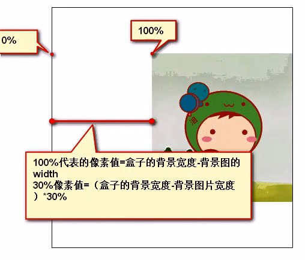
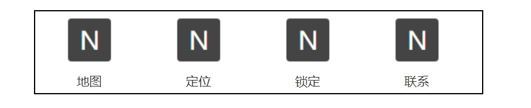
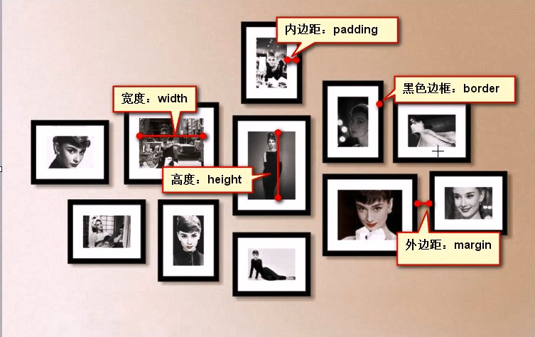
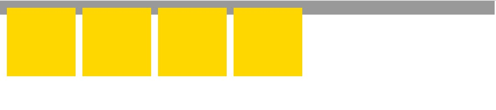
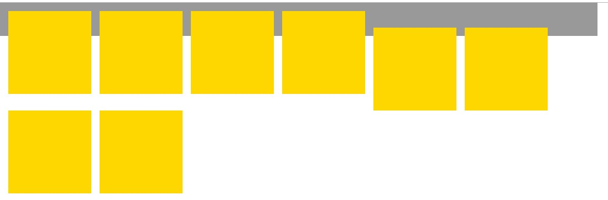
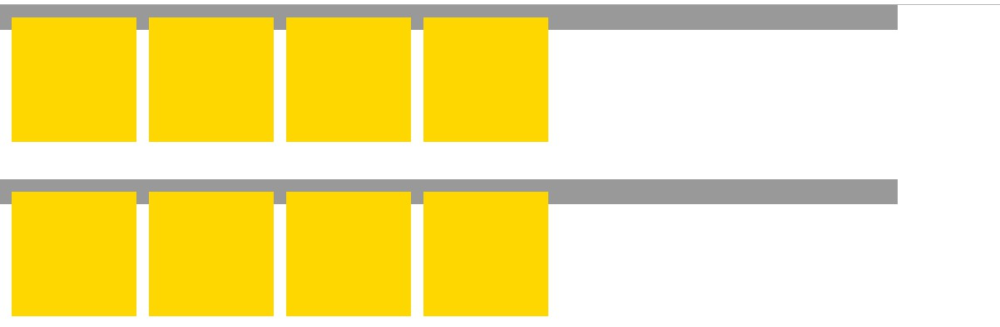
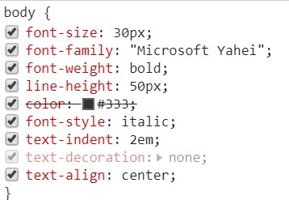
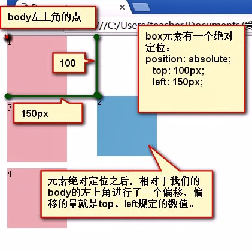
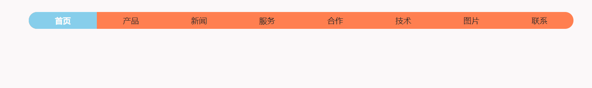
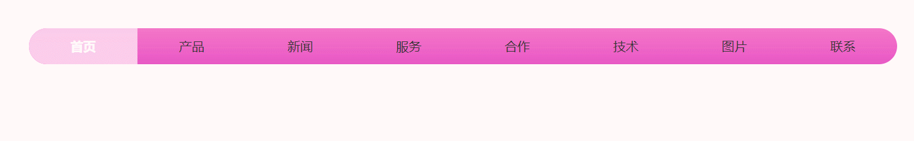

# 前端基础之CSS


## CSS介绍

- HTML：超文本标记语言。从语义的角度描述页面结构。
- CSS：层叠样式表。从审美的角度负责页面样式。
- JS：JavaScript 。从交互的角度描述页面行为。

CSS：Cascading Style Sheet，层叠样式表。

CSS的作用就是给HTML页面标签添加各种样式，定义网页的显示效果。简单一句话：CSS将网页内容和显示样式进行分离，提高了显示功能。

### HTML的缺陷

- 不能够适应多种设备
- 要求浏览器必须智能化足够庞大
- 数据和显示没有分开
- 功能不够强大

### CSS的优点

- 使数据和显示分开
- 降低网络流量
- 使整个网站视觉效果一致
- 使开发效率提高了（耦合性降低）


当浏览器读到一个样式表，它就会按照这个样式表来对文档进行格式化（渲染）。

### CSS的语法

每个CSS样式由两个组成部分：选择器和声明。声明又包括属性和属性值。每个声明之后用分号结束。

CSS注释

```css
/*这是注释*/
```

## CSS引入方式

### 行内样式

在标记的style属性中设定CSS样式。

```css
/* 多个样式之间用分号隔开、一个样式多个属性用空格分开 */
<div style="width:100px;height:100px;background:red;"></div>
```

### 内部样式

嵌入式是将CSS样式集中写在网页的head标签对的style标签对中。

```css
    <style>
        #d1 {
            width: 100px;
            height: 100px;
            background: red;
        }
    </style>

```

### 外部样式

外部样式就是将css写在一个单独的文件中，然后在页面进行引入即可。

html文件

```html
    <!--写在头部title标签下-->
    <link rel="stylesheet" href="./index.css">
```


## CSS选择器

### 基本选择器

### 元素选择器

```css
p {color: "red";}
```

### ID选择器

- 同一个页面中id不能重复 。
- 任何的标签都可以设置id。
- id命名规范，要以字母开头 后面可以有数字 、下划线、横线， 大小写严格区分。

```css
#i1 {
  background-color: red;
}
```

### 类选择器

```css
.c1 {
  font-size: 14px;
}
```


一个标签可以有多个类名，如果有多个类名，用空格分隔。

### 通用选择器

```css
* {
  color: white;
}
```

### 组合选择器

### 后代选择器

根据嵌套关系，空格左侧是右侧的祖先元素。空格两侧只要是后代关系都可以，不限于父子关系。可以根据嵌套关系来确定最终元素。

```css
/*div内部的p标签设置字体颜色*/
div p {
  color: green;
}
```

```css

/*类名为box1后代里面所有类名叫做one的标签*/
.box .one {
    color: pink;
}
```

### 交集选择器

既满足条件1也满足条件2。写法：选择器直接连接，没有任何符号。

交集选择器使用的基础选择器，可以都是类选择器，也可以是标签和类的混写。

```css
/*这个元素既是p标签，必须有one的类名。*/
p.one {
        color: blue;
    }

/*这个元素既是p标签，必须有one的类名，还必须有two的类名。*/
p.one.two {
        color: gold;
    }

```

### 并集选择器

有很多元素可能都有相同css样式，可以通过并集选择器将这些标签写在一起，统一设置css样式。

前面所有的选择器都可以作为并集里的一项，选择器之间用逗号隔开。

用途：多个选择器使用同一个样式。

格式：

选择器1,选择器2,...{

​                属性:值;
           }


### 儿子选择器

```css
/*选择所有父级是 <div> 元素的 <p> 元素*/
div>p {
 color: red;
}
```

### 毗邻选择器

```css
/*选择紧接着<div>元素之后的<p>元素*/
div+p {
  margin: 5px;
}
```

### 弟弟选择器

```css
/*i1后面所有的兄弟p标签*/
#div~p {
  border: 2px solid royalblue;
}
```

### 属性选择器

```css
/*用于选取带有指定属性的元素。*/
p[title] {
  color: red;
}
/*用于选取带有指定属性和值的元素。*/
p[title="213"] {
  color: green;
}
```

```css
/*找到所有title属性以hello开头的元素*/
[title^="hello"] {
  color: red;
}

/*找到所有title属性以hello结尾的元素*/
[title$="hello"] {
  color: yellow;
}

/*找到所有title属性中包含（字符串包含）hello的元素*/
[title*="hello"] {
  color: red;
}

/*找到所有title属性中有一个值为hello的元素：*/
[title~="hello"] {
  color: green;
}

```

### 

### 伪类选择器

```css
/* 未访问的链接 */
a:link {
  color: #FF0000
}

/* 已访问的链接 */
a:visited {
  color: #00FF00
} 

/* 鼠标移动到链接上 */
a:hover {
  color: #FF00FF
} 

/* 选定的链接 */ 
a:active {
  color: #0000FF
}

/*input输入框获取焦点时样式*/
input:focus {
  outline: none;
  background-color: #eee;
}
```

### 伪元素选择器

**first-letter**

```css
/* 常用的给首字母设置特殊样式 */
p:first-letter {
  font-size: 48px;
  color: red;
}
```

**before**

```css
/*在每个<p>元素之前插入内容*/
p:before {
  content:"*";
  color:red;
}
```

**after**

```css
/*在每个<p>元素之后插入内容*/
p:after {
  content:"[?]";
  color:blue;
} 
```


## 选择器的优先级

### CSS继承

后代元素能够继承祖先元素的文字样式，不能继承盒子的样式。


### 层叠性

### 选择器的优先级

通配符权重最低。

具体的选择器权重计算方式如下图：


高级选择器比较权重的方法：数基础选择器的个数，依次比较id的个数→类的个数→标签个数。

如果有并集，计算权重是单独拆开来计算。如果权重一样，谁写在后面听谁的。

```html
<!DOCTYPE html>
<html lang="zh-CN">
<head>
    <meta charset="UTF-8">
    <title>爱前端</title>
    <style>
        .box1 .box2 .box3 p {
            color: red;
        }

        .box1 #box2.box2 .box3 p {
            color: green;
        }

        .box1 #box2 .box3 p {
            color: blue;
        }
    </style>
</head>
<body>
    <div class="box1" id="box1">
        <div class="box2" id="box2">
            <div class="box3" id="box3">
                <p>看看我的颜色听谁的</p>
            </div>
        </div>
    </div>
</body>
</html>
```

如果没选中元素，样式靠继承。
第一种情况：祖先元素距离目标元素距离不同，继承的样式，听最近的（就近原则）。

第二种情况：如果距离相同，比较权重。

第三种情况：如果距离相同，权重相同，后写的层叠前面的。

```html
<!DOCTYPE html>
<html lang="zh-CN">
<head>
    <meta charset="UTF-8">
    <title>爱前端</title>
    <style>
        .box1 {
            color: red;
        }

        .box1 .box2 .box3 {
            color: gold;
        }

        #box1 .box2 {
            color: blue;
        }
    </style>
</head>
<body>
<div class="box1" id="box1">
    <div class="box2" id="box2">
        <div class="box3" id="box3">
            <p>看看我的颜色听谁的</p>
        </div>
    </div>
</div>
</body>
</html>
```

关键字：!important提高指定样式规则的应用优先权，会给这个属性的权重提升到最大。不推荐使用，除非万不得已。

```html
<!DOCTYPE html>
<html lang="zh-CN">
<head>
    <meta charset="UTF-8">
    <title>爱前端</title>
    <style>
        p {
            color: red !important;
        }

        #box1 #box2 #box3 p {
            color: blue;
        }
    </style>
</head>
<body>
<div class="box1" id="box1">
    <div class="box2" id="box2">
        <div class="box3" id="box3">
            <p>看看我的颜色听谁的</p>
        </div>
    </div>
</div>
</body>
</html>
```


## CSS属性相关

### 宽和高

width属性可以为元素设置宽度，height属性可以为元素设置高度。


### 字体属性

### **文字字体**

font - family属性指定一个元素的字体。如果浏览器不支持第一个字体，则会尝试下一个。浏览器会使用它可识别的第一个值。

```css
body {
  font-family: "Microsoft Yahei", "Arial", sans-serif
}
```

### 字体大小

```css
p {
  font-size: 14px;
}
```

如果设置成inherit表示继承父元素的字体大小值。

### 文字字重 

font-weight属性用来设置字体的字重（粗细）。

| 值      | 描述                                           |
| ------- | ---------------------------------------------- |
| normal  | 默认值，标准粗细                               |
| bold    | 粗体                                           |
| bolder  | 更粗                                           |
| lighter | 更细                                           |
| 100~900 | 设置具体粗细，400等同于normal，而700等同于bold |
| inherit | 继承父元素字体的粗细值                         |

### 文本颜色

color属性被用来设置文字的颜色。

rgba(255,0,0,0.3)，第四个值指定了色彩的透明度/不透明度，它的范围为0.0到1.0之间。

### 字体样式

font-style 属性定义字体的风格。

| 值      | 描述                                   |
| ------- | -------------------------------------- |
| normal  | 默认值。浏览器显示一个标准的字体样式。 |
| italic  | 浏览器会显示一个斜体的字体样式。       |
| oblique | 浏览器会显示一个倾斜的字体样式。       |
| inherit | 规定应该从父元素继承字体样式。         |

### 行高

line-height 属性设置行间的距离。

| 值      | 描述                                                        |
| ------- | ----------------------------------------------------------- |
| normal  | 默认。设置合理的行间距。                                    |
| number  | 设置数字，此数字会与当前的字体尺寸相乘来设置行间距。 数值。 |
| length  | 设置固定的行间距。像素值。                                  |
| %       | 基于当前字体尺寸的百分比行间距。百分比。                    |
| inherit | 规定应该从父元素继承 line-height 属性的值。                 |


### 字体属性

```html
<!DOCTYPE html>
<html lang="zh-CN">
<head>
    <meta charset="UTF-8">
    <title>字体属性</title>
    <style>
        * {
            margin: 0;
            padding: 0;
        }

        p {
            font-size: 30px;
            line-height: 48px;
            color: #333;
            font-family: "Consolas", "Arial", "Microsoft Yahei";
        }

        .p1 {
            /*font-style: normal;*/
            /*复合属性书写 行高一定要写在字体大小后面*/
            
            font: italic bold 40px/200% "Microsoft Yahei";
        }

        .p2 {
            font-style: italic;
        }

        .p3 {
            font-style: oblique;
        }

    </style>
</head>
<body>
<p class="p1">中文,This is a paragraph,normal</p>
<p class="p2">中文,This is a paragraph,italic</p>
<p class="p3">中文,This is a paragraph,oblique</p>
</body>
</html>
```

| 字体              |
| ----------------- |
| 字号，font-size   |
| 颜色 ，color      |
| 字体，font-family |
| 行高，line-height |
| 复合属性，font    |


| 文本                                                         |
| ------------------------------------------------------------ |
| 对齐：text-align                                             |
| 缩进：text-indent ，属性值，em、px、%、cm                    |
| 修饰：text-decoration  属性值，none、overline、line-through、underline |


### 

### 文字对齐

text-align 属性规定元素中的文本的水平对齐方式。

| 值      | 描述                |
| ------- | ------------------- |
| left    | 默认值， 左边对齐。 |
| right   | 右对齐。            |
| center  | 居中对齐            |
| justify | 两端对齐            |

### 文字装饰

text-decoration 属性用来给文字添加特殊效果。

| 值           | 描述                                  |
| ------------ | ------------------------------------- |
| none         | 默认。定义标准的文本。                |
| underline    | 定义文本下的一条线。                  |
| overline     | 定义文本上的一条线。                  |
| line-through | 定义穿过文本下的一条线。              |
| inherit      | 继承父元素的text-decoration属性的值。 |

去掉a标签默认的自划线

```css
a {
  text-decoration: none;
}
```

### 首行缩进

text-indent 属性规定文本块中首行文本的缩进。允许使用负值。如果使用负值，那么首行会被缩进到左边。

| 值      | 描述                                        |
| ------- | ------------------------------------------- |
| length  | 定义固定的缩进。默认值：0。                 |
| %       | 定义基于父元素宽度的百分比的缩进。          |
| inherit | 规定应该从父元素继承 text-indent 属性的值。 |


```css
/*将段落的第一行缩进 32像素*/
p {
  text-indent: 32px;
}
```

### 背景属性

background是一个复合属性。

background-color ，背景色，渲染位置border及以内。

```css
/*背景颜色*/
background-color: red;

/*背景图片*/
background-image: url('图片地址');
/*
 背景重复
 repeat(默认):背景图片平铺排满整个网页
 repeat-x：背景图片只在水平方向上平铺
 repeat-y：背景图片只在垂直方向上平铺
 no-repeat：背景图片不平铺
*/


```

### 背景图

background-image

背景图实际渲染位置：跟背景色一样，能看到的其实就是border以内。属性值 url，指向图像的路径。

背景图和背景色的压盖顺序：背景图压盖背景色。

### 背景重复

background-repeat

设置背景图片以什么方式进行重复。

| 值        | 描述                                                |
| --------- | --------------------------------------------------- |
| repeat    | 背景图像将在垂直方向和水平方向重复。默认。          |
| repeat-x  | 背景图像将在水平方向重复。                          |
| repeat-y  | 背景图像将在垂直方向重复。                          |
| no-repeat | 背景图像将仅显示一次。                              |
| inherit   | 规定应该从父元素继承 background-repeat 属性的设置。 |


### 背景图位置

background-position

规定插入的背景图在盒子里的位置。

关键字定位，水平方向可选关键字有 left | center | right，垂直方向可选关键字有 top | center | bottom。如果仅规定了一个关键词，那么第二个值将是"center"。

百分比定位，第一个值是水平位置，第二个值是垂直位置。左上角是 0% 0%。右下角是 100% 100%。如果仅规定了一个值，另一个值将是 50%。



百分比表示法，100%的宽度 = 盒子 border内部的宽度  -  背景图片的宽度。

长度值定位，第一个值是水平位置，第二个值是垂直位置。左上角是 0 0。单位是像素或任何其他的 CSS 单位。可以为负值。

可以混合使用。


### 精灵图

很多元素都有背景图，需要有实际存在的图片，就需要发送多个http请求下载图片。将很多小的背景图合成在一张图片上，谁用背景图加载的始终都是一张图片。

用法：给一个合适盒子大小，通过背景图定位找到图片的位置。

### 背景附着

background-attachment

| 值      | 描述                                       |
| ------- | ------------------------------------------ |
| scroll  | 滚动，背景图会随着页面滚动而滚动。默认值。 |
| fixed   | 当页面的其余部分滚动时，背景图像不会移动。 |
| inherit |                                            |

**background复合属性**

```css
background: url("img/bg_cat.jpg") no-repeat center top fixed #4c4d4c;
```

五个属性之间位置可以更换，position的两个属性值位置不能颠倒。


### **内填充挤出背景图**

给盒子用padding-left留出一个空白区域，添加一个合适的背景图，不重复。

```html
<!DOCTYPE html>
<html lang="zh-CN">
<head>
    <meta charset="UTF-8">
    <title>padding挤出背景图</title>
    <style type="text/css">
        * {
            margin: 0;
            padding: 0;
        }

        ul {
            width: 300px;
            list-style: none;
            margin: 100px;
            font-size: 14px;
            color: #333;
            line-height: 28px;
            border: 1px solid #000;
        }

        ul li {
            padding-left: 22px;
            background: url("img/home.png") no-repeat left center;
        }
    </style>
</head>
<body>
<ul>
    <li>温暖的家</li>
    <li>温暖的家</li>
    <li>温暖的家</li>
    <li>温暖的家</li>
    <li>温暖的家</li>
    <li>温暖的家</li>
</ul>
</body>
</html>
```


```html
<!DOCTYPE html>
<html lang="zh-CN">
<head>
    <meta charset="UTF-8">
    <title>padding挤出背景图</title>
    <style type="text/css">
        * {
            margin: 0;
            padding: 0;
        }

        ul {
            width: 500px;
            list-style: none;
            margin: 100px auto;
            font-size: 14px;
            color: #333;
            line-height: 28px;
            border: 1px solid #000;
            text-align: center;
            overflow: hidden;
        }

        ul li {
            float: left;
            width: 96px;
            margin: 0 13px;
            padding-top: 64px;
            background: url("img/64.png") no-repeat center top;

        }
    </style>
</head>
<body>
<ul>
    <li>地图</li>
    <li>定位</li>
    <li>锁定</li>
    <li>联系</li>
</ul>
</body>
</html>
```



### logo文字换图片

提高搜索引擎优化，搜索时都是搜索文字。

```html
<!DOCTYPE html>
<html lang="zh-CN">
<head>
    <meta charset="UTF-8">
    <title>logo文字替换图片</title>
    <style type="text/css">
        * {
            margin: 0;
            padding: 0;
        }

        h1 {
            width: 224px;
            overflow: hidden;
        }

        h1 a {
            display: block;
            height: 58px;
            background: url("img/Logo.png");
            /*font-size: 0;*/
            text-indent: -999em;
            overflow: hidden;
        }
    </style>
</head>
<body>
<h1><a href="http://www.iqianduan.cn/">爱前端</a></h1>
</body>
</html>
```


### 边框属性


| 边框属性     |
| ------------ |
| border-width |
| border-style |
| border-color |

```css
#i1 {
  border-width: 2px;
  border-style: solid;
  border-color: red;
}
```

简写方式

```css
#i1 {
  border: 2px solid red;
}
```

边框样式

| 值      |
| ------- |
| none    |
| hidden  |
| dotted  |
| dashed  |
| solid   |
| double  |
| groove  |
| ridge   |
| inset   |
| outset  |
| inherit |

### border-radius 

设置元素的外边框圆角


```
<length> 定义圆形半径或椭圆的半长轴，半短轴。负值无效。
<percentage> 使用百分数定义圆形半径或椭圆的半长轴，半短轴。水平半轴相对于盒模型的宽度；垂直半轴相对于盒模型的高度。负值无效。
```

<a href="https://developer.mozilla.org/zh-CN/docs/Web/CSS/border-radius">border-radius</a>

<a href="http://www.w3school.com.cn/cssref/pr_border-radius.asp">CSS3 border-radius 属性</a>

<a href="https://blog.csdn.net/hcwbr123/article/details/80847230">CSS的border-radius 设置圆弧</a>


除了可以统一设置边框外还可以单独为某一个边框设置样式

```css
#i1 {
  border-top-style:dotted;
  border-top-color: red;
  border-right-style:solid;
  border-bottom-style:dotted;
  border-left-style:none;
}
```


### display属性

用于控制HTML元素的显示效果。

| 值           | 意义                                             |
| ------------ | ------------------------------------------------ |
| none         | HTML文档中元素存在，但是在浏览器中不显示。       |
| block        | 此元素将显示为块级元素，此元素前后会带有换行符。 |
| inline       | 此元素会被显示为内联元素，元素前后没有换行符。   |
| inline-block | 使元素同时具有行内元素和块级元素的特点。         |

<a href="https://www.jianshu.com/p/65f99387fa5f">CSS display属性</a>

**display:"none"与visibility:hidden的区别**

visibility:hidden: 可以隐藏某个元素，但隐藏的元素仍需占用与未隐藏之前一样的空间。也就是说，该元素虽然被隐藏了，但仍然会影响布局。

display:none: 可以隐藏某个元素，且隐藏的元素不会占用任何空间。也就是说，该元素不但被隐藏了，而且该元素原本占用的空间也会从页面布局中消失。

## CSS盒子模型

**宽高** 

宽度：width， 高度：height。这个宽高规定的是我们能够书写内容的区域，实际内容区域。
实际内容区域：width+height。

**盒子占有位置区域**
实际占有区域：width+height+padding+border。
盒子有时候设置了宽高，如果增加内边距和边框，要想占有的位置保持不变，需要对宽高进行内减。

padding区域可以渲染背景，但不可以书写文字。

| 值      | 描述                                                         |
| ------- | ------------------------------------------------------------ |
| margin  | 外边距。用于控制元素与元素之间的距离。margin的最基本用途就是控制元素周围空间的间隔，从视觉角度上达到相互隔开的目的。 |
| padding | 内边距。用于控制内容与边框之间的距离。                       |
| border  | 边框。                                                       |
| content | 内容。盒子的内容。                                           |




### margin外边距

外边距是盒子与盒子之间的距离。


```css
.margin-test {
  margin-top:5px;
  margin-right:10px;
  margin-bottom:15px;
  margin-left:20px;
}
```

简写

```css
.margin-test {
  margin: 5px 10px 15px 20px;
}
```

顺序：上右下左


| 值      | 描述                                                         |
| ------- | ------------------------------------------------------------ |
| auto    | 浏览器计算外边距。                                           |
| length  | 规定以具体单位计的外边距值，比如像素、厘米等。默认值是 0px。 |
| %       | 规定基于父元素的宽度的百分比的外边距。                       |
| inherit | 规定应该从父元素继承外边距。                                 |

maigin: 0 auto; 指元素的上下边距为0，左右边距根据于父元素宽度自适应，即左右水平居中。

### padding内填充

```css
.padding-test {
  padding-top: 5px;
  padding-right: 10px;
  padding-bottom: 15px;
  padding-left: 20px;
}
```

简写

```css
.padding-test {
  padding: 5px 10px 15px 20px;
}
```

顺序：上右下左

padding的常用简写方式

- 提供一个，用于四边；
- 提供两个，第一个用于上－下，第二个用于左－右；
- 如果提供三个，第一个用于上，第二个用于左－右，第三个用于下；
- 提供四个参数值，将按上－右－下－左的顺序作用于四边；

### border边框

边框，盒子占有的最外层的区域。

border 属性是一个复合属性。

**CSS 边框属性**

| 属性                |
| ------------------- |
| border              |
| border-style        |
| border-width        |
| border-color        |
| border-bottom       |
| border-bottom-color |
| border-bottom-style |
| border-bottom-width |
| border-left         |
| border-left-color   |
| border-left-style   |
| border-left-width   |
| border-right        |
| border-right-color  |
| border-right-style  |
| border-right-width  |
| border-top          |
| border-top-color    |
| border-top-style    |
| border-top-width    |

| 值           | 描述                                     |
| ------------ | ---------------------------------------- |
| border-width | 规定边框的宽度。                         |
| border-style | 规定边框的样式。                         |
| border-color | 规定边框的颜色。                         |
| inherit      | 规定应该从父元素继承 border 属性的设置。 |


**border-style**  

| 值      |
| ------- |
| none    |
| hidden  |
| dotted  |
| dashed  |
| solid   |
| double  |
| groove  |
| ridge   |
| inset   |
| outset  |
| inherit |


border-collapse 属性设置表格的边框是否被合并为一个单一的边框，还是象在标准的 HTML 中那样分开显示。

| 值       | 描述                                                         |
| -------- | ------------------------------------------------------------ |
| separate | 默认值。边框会被分开。不会忽略 border-spacing 和 empty-cells 属性。 |
| collapse | 如果可能，边框会合并为一个单一的边框。会忽略 border-spacing 和 empty-cells 属性。 |
| inherit  | 规定应该从父元素继承 border-collapse 属性的值。              |

 


## **盒模型**

包含：宽度、高度、内边距、边框、外边距。

实际书写内容区域：width+height  ，实际占有区域：width+height+padding+border

盒子有时候设置了宽高，如果增加内边距和边框，要想占有的位置保持不变，需要对宽高进行内减。

盒模型内减：确定宽高的方法，用实际占有宽高减去对应的padding和border。

### **清空默认样式**

很多标签都有一些默认的盒子样式。比如：body、p、div、ul、li、ol、dl、dt、dd、h1~h6等都有默认的内外边距。ul、ol：都有一个list-style列表样式的默认样式。a：有默认的字体样式，有下划线，字体颜色。在制作网页之前，别的工作先不写，先去清除设置默认样式。

```css
    * {
            margin: 0;
            padding: 0;
        }

        ul, ol {
            list-style: none;
        }
        a {
            text-decoration: none;
        }
```

### **高度自适应**

一般情况下，不给盒子设置高度，而是用内部的内容撑高元素。
目的：为了保证我们的元素在添加或者删除内容的时候，高度可以自适应内容高度而变化。

高度自适应还可以书写成

```css
 height: auto;
```

### **margin塌陷**

垂直方向上相邻的两个元素如果都有外边距，而且外边距有相交的部分，相交的部分会出现外边距重合现象，
，也叫作外边距塌陷。嵌套的盒子 ，垂直方向也会有margin塌陷。

解决办法：平级盒子，给盒子都设置同一方向的margin，不要重复设置反方向。父子盒模型，1、给父盒子添加一个边框，强制限定内部元素开始的位置。2、（常用方法）不用儿子的margin去踹父亲，用父亲的padding挤出边距。

父盒子没有外边距，而子盒子有外边距，父盒子会随着子盒子一起掉下来。相当于用子盒子去用外边距踹父亲。

html

```html
<div class="outer">
    <div class="inner"></div>
</div>
```

css

```css
* {
    margin: 0;
    padding: 0;
}
.outer {
    height: 200px;
    width: 200px;
    background-color: red;
}
.inner {
    height: 100px;
    width: 100px;
    background-color: blue;
    margin-top: 50px;
}
```

如果一个盒子内部的子盒子与自己有同方向的垂直的margin，也会发生margin端陷。两个同级盒子之间，要么给上面的盒子设置下边距，要么给下面的盒子设置上边距，不要同时设置。

子盒子和父盒子之间的垂直距离

- 强行给父盒子加一个边框，强制限定父盒子的位置。
- 距离用父盒子的padding撑开，不用儿子的margin去踹父亲。

html

```html
<div class="outer">
    <div class="inner"></div>
</div>
```

css

```css
* {
margin: 0;
padding: 0;
}
.outer {
height: 150px;
width: 200px;
background-color: red;
padding-top: 50px;
}
.inner {
height: 100px;
width: 100px;
background-color: blue;
}
```

### 宽度剩余

制作网页的一个小技巧：一般右边距根据内容不同，边距大小不同，没办法去确定这个padding-right。我们只需要设置左边距，右侧都给width。内容自动去填充，剩余的部分自动留白就可以。|

### 居中

### 文字居中

水平方向文字居中：text-align:center。

垂直方向：单行文本居中，行高等于盒子高。

多行文本垂直居中：（盒子不设置高度）高度自适应，用内容撑开高度，上下给相同的内边距。


```html
<!DOCTYPE html>
<html lang="zh-CN">
<head>
    <meta charset="UTF-8">
    <title>多行文本居中</title>
    <style>
        * {
            margin: 0;
            padding: 0;
        }

        div {
            width: 300px;
            border: 1px solid #000;
            font-size: 16px;
            color: red;
            text-align: center;
            line-height: 28px;
            padding: 20px;
        }
    </style>
</head>
<body>

<div>
    一行文字一行文字一行文字一行文字
    一行文字一行文字一行文字一行文字
    一行文字一行文字一行文字一行文字
</div>
</body>
</html>
```


### 盒子居中

**水平居中**

给父盒子添加宽度，子盒子margin值上下随意，左右都是auto。

html

```html
<div class="outter">
    <div class="inner"></div>
</div>
```

css

```css
* {
    margin: 0;
    padding: 0;
}	

.outter {
    width: 500px;
    height: 300px;
    border: 1px solid #4c4d4c;
    margin: 100px 200px;
}

.inner {
    width: 200px;
    height: 100px;
    background-color: skyblue;
    margin: 0 auto;
}
```


**垂直居中**

父盒子不设置高度，内边距上下相等，父盒子高度会自适应子盒子的内容高度。

```css
* {
    margin: 0;
    padding: 0;
}

.outter {
    width: 500px;
    padding: 30px 0;
    border: 1px solid #4c4d4c;
    margin: 100px 200px;
}

.inner {
    width: 200px;
    height: 100px;
    background-color: skyblue;
    margin: 0 auto;
}
```

### 父子盒模型

子盒子的整体占位不能超过父盒子的内容区域。父盒子的内容区域宽度≥子盒子width+padding乘2+border乘2。

如果子盒子不设置宽度，会自动撑满父亲，宽度是父亲的100%。如果再设置边框和内边距，自动向内减少，不需要手动的去减少宽度。

html

```html
<div class="outter">
    <div class="inner">
        一段文字一段文字一段文字一段文字一段文字一段文字
        一段文字一段文字一段文字一段文字一段文字一段文字
        一段文字一段文字一段文字一段文字一段文字一段文字
    </div>
</div>
```

css

```css
.outter {
    width: 500px;
    border: 1px solid red;
    margin: 100px 200px;
}

.inner {
    padding: 10px 20px;
    background-color: skyblue;
    line-height: 28px;
}
```


### 空格处理

**white-space**

| 值       |
| -------- |
| normal   |
| pre      |
| nowrap   |
| pre-wrap |
| pre-line |
| inherit  |

<a href="https://blog.csdn.net/qq_33706382/article/details/78328188">css white-space属性详解</a>

### 标准文档流


html就是标准文档流，网页只能从上到下，从左到右进行加载。

微观性质

- html文本之间有空白折叠现象。
- 文本类的元素：高矮不齐，底边对齐。
- 文字在盒子内如果一行书写完毕，会自动换行。

标准文档流里将html标签分为块级标签、行内标签。

### 块级标签

包含了所有的容器级标签以及p标签。

特性：

块级元素会独占一行。同行不会出现其他的同级标签。

能够设置宽高。嵌套的关系里，子盒子不设置宽度会自动继承父亲宽度的100%。

### 行内标签

包含除了p之外的所有文本级标签。

特性：

行内标签不独占一行，可以和其他行内元素并排在一行。

行内元素不能设置宽高，其他的内边距、边框、外边距能够正常设置。

行内元素不设置宽度，不会自动继承父亲的宽度，宽度只能用内容撑开。

### 行内块标签

特性：

既可以设置宽高，还可以在一行排列。

display属性可以在块级元素和行内元素之间进行转换。

```css
/* 块级转行内 */
display: inline;

/* 行内转快 */
display: block;

/* 转行内块 */
display:inline-block;
```

标准文档流制作网页有局限。

解决办法：让元素脱离标准流，既可以设置宽高，又可以一行排列。

脱离标准流方法：浮动、绝对定位、固定定位。


### 清除浮动

**浮动存在的问题**

- 浮动的元素不能撑高父级。元素脱离标准流之后，不能再撑高它的父级盒子。
- 浮动会影响后面的浮动的元素。如果后面的浮动方向相同，会去贴上一个浮动最后一个元素的边。




html

```html
    <div class="box">
        <div></div>
        <div></div>
        <div></div>
        <div></div>
    </div>
    <div class="box">
        <div></div>
        <div></div>
        <div></div>
        <div></div>
    </div>
```

css

```css
* {
    margin: 0;
    padding: 0;
}

.box {
    width: 700px;
    border: 10px solid #999;
}

.box div {
    float: left;
    width: 100px;
    height: 100px;
    background-color: gold;
    margin-right: 10px;
}
```



### **解决方法**

### 给父盒子加高度

给父级元素增加高度，它内部的浮动元素，被限制了范围，不会再影响后面的元素浮动。

效果：解决父级高度的问题，解决浮动影响后面的浮动的问题。
问题：高度还是不能够自适应。

### **清除浮动属性clear**

clear 属性规定元素的哪一侧不允许其他浮动元素。

| 值      | 描述                                  |
| ------- | ------------------------------------- |
| left    | 在左侧不允许浮动元素。                |
| right   | 在右侧不允许浮动元素。                |
| both    | 在左右两侧均不允许浮动元素。          |
| none    | 默认值。允许浮动元素出现在两侧。      |
| inherit | 规定应该从父元素继承 clear 属性的值。 |

元素可以设置一个叫做clear的属性，清除浮动的作用，表示清除自身受到的其他元素带来的浮动的影响。clear 属性只会对自身起作用，而不会影响其他元素。

解决：浮动的互相影响。

问题：父盒子还是不能被子盒子撑高。margin如果小于中间浮动的子元素的高度，显示效果失效。

html

```html
<div class="box">
    <div></div>
    <div></div>
    <div></div>
    <div></div>
</div>
<div class="box1">
    <div></div>
    <div></div>
    <div></div>
    <div></div>
</div>
```

css

```css
* {
    margin: 0;
    padding: 0;
}

.box,
.box1 {
    width: 700px;
    border: 10px solid #999;
}

.box {
    margin-bottom: 120px;
    /* margin如果小于中间浮动的子元素的高度，显示效果失效。*/
    /* 要想显示可以设置成120px */
}

.box div,
.box1 div {
    float: left;
    width: 100px;
    height: 100px;
    background-color: gold;
    margin-right: 10px;
}

.box1 {
    clear: both;
}
```



### 隔墙法

在互相影响的元素中间加一道墙，墙上面添加一个clear属性，阻隔开两边的元素。

### 外墙法

在有浮动元素的父盒子之间隔一堵墙。

```html
<!DOCTYPE html>
<html lang="zh-CN">
<head>
    <meta charset="UTF-8">
    <title>清除浮动-外墙法</title>
    <style>
        * {
            margin: 0;
            padding: 0;
        }

        .box {
            width: 700px;
            border: 10px solid #999;
            /*margin-bottom: 20px;*/
        }

        .box1 {
            width: 700px;
            border: 10px solid #999;
        }

        .box div,
        .box1 div {
            width: 100px;
            height: 100px;
            background-color: gold;
            margin-right: 10px;
            float: left;
        }

        /*清除浮动*/
        .cl {
            clear: both;
        }

        /*模拟间距*/
        .h20 {
            height: 20px;
        }
    </style>
</head>
<body>
<div class="box">
    <div></div>
    <div></div>
    <div></div>
    <div></div>
</div>
<div class="cl h20"></div>
<div class="box1">
    <div></div>
    <div></div>
    <div></div>
    <div></div>
</div>
</body>
</html>

```

解决：浮动互相影响。问题：高度自适应，margin失效。

### 内墙法

将清除浮动的墙放在有浮动元素的父盒子内部的最后。只要有浮动，就在盒子内部加一堵墙。

```html
<!DOCTYPE html>
<html lang="zh-CN">
<head>
    <meta charset="UTF-8">
    <title>清除浮动-内墙法</title>
    <style>
        * {
            margin: 0;
            padding: 0;
        }

        .box,
        .box1{
            width: 700px;
            border: 10px solid #999;
            margin-bottom: 20px;
        }

        .box div.fl,
        .box1 div.fl {
            width: 100px;
            height: 100px;
            background-color: gold;
            margin-right: 10px;
            float: left;
        }

        /*清除浮动*/
        .cl {
            clear: both;
        }
    </style>
</head>
<body>
<div class="box">
    <div class="fl"></div>
    <div class="fl"></div>
    <div class="fl"></div>
    <div class="fl"></div>
    <div class="cl"></div>
</div>
<div class="box1">
    <div class="fl"></div>
    <div class="fl"></div>
    <div class="fl"></div>
    <div class="fl"></div>
    <div class="cl"></div>
</div>
</body>
</html>
```

解决：浮动互相影响，高度自适应，margin失效。

缺点：1、html结构布局，很多需要进行浮动，每个浮动的盒子内都需要隔一堵墙。页面结构复杂会出现很多冗余的没有意义的标签。2、一个盒子内的标签要浮动就都浮动，浮动后面的墙是一个标准流里的元素。

### 溢出隐藏

CSS属性overflow定义溢出元素内容区的内容会如何处理，它是overflow-x和overflow-y的简写属性。

- overflow（水平和垂直均设置）
- overflow-x（设置水平方向）
- overflow-y（设置垂直方向）

| 值      | 描述                                                     |
| ------- | -------------------------------------------------------- |
| visible | 默认值。内容不会被修剪，会呈现在元素框之外。             |
| hidden  | 内容会被修剪，并且其余内容是不可见的。                   |
| scroll  | 内容会被修剪，但是浏览器会显示滚动条以便查看其余的内容。 |
| auto    | 如果内容被修剪，则浏览器会显示滚动条以便查看其余的内容。 |
| inherit | 规定应该从父元素继承 overflow 属性的值。                 |

overflow的其他小功能，能够清除盒子内部元素的浮动影响。

```html
<!DOCTYPE html>
<html lang="zh-CN">
<head>
    <meta charset="UTF-8">
    <title>清除浮动-overflow</title>
    <style>
        * {
            margin: 0;
            padding: 0;
        }

        .box {
            width: 700px;
            border: 10px solid #999;
            margin-bottom: 20px;
            overflow: hidden;
        }

        .box div{
            width: 100px;
            height: 100px;
            background-color: gold;
            margin-right: 10px;
            float: left;
        }

    </style>
</head>
<body>
<div class="box">
    <div></div>
    <div></div>
    <div></div>
    <div></div>

</div>
<div class="box">
    <div></div>
    <div></div>
    <div></div>
    <div></div>

</div>
</body>
</html>
```

解决：浮动互相影响，高度自适应，margin失效。优势：能够解决所有的问题，不会增加无用的标签。

**加载机制**
高度自适应：如果元素有溢出隐藏的属性，网页加载时，会强制的去元素内部搜索，识别所有内部元素的高度，会用最高的元素高度配给我们父盒子的自适应高度。
浮动影响：加载时，如果有溢出隐藏，强制检索，看盒子内部是否有浮动的元素，如果有，会被整体管理起来，在自身的高度内，不会影响其他的浮动元素。

实际工作中：就用overflow来清浮动。如果遇到大的结构，会在结构之间加一堵外墙。

### a标签

爱恨准则：**l**ink，**v**isited，**h**over，**a**ctive。

a标签是一个行内标签，不能设置宽高。
a标签的一部分文本属性不能继承父级，color、text-decoration。




**a标签的实际应用**

```html
<!DOCTYPE html>
<html lang="zh-CN">
<head>
    <meta charset="UTF-8">
    <title>a标签的实际应用</title>
    <style type="text/css">

        body {
            font-size: 30px;
            color: #333333;
            line-height: 50px;
            font-family: "Microsoft Yahei";
            font-weight: bold;
            text-decoration: none;
            text-align: center;
        }

        a {
            display: block;
            width: 200px;
            height: 50px;
            border: 1px solid #000;
            background-color: pink;
            color: #333;
            text-decoration: none;
        }

        a:hover {
            background-color: green;
            color: #fff;
        }

        a:active {
            background-color: skyblue;
            color: #fff;
        }
    </style>
</head>
<body>

<a href="http://www.iqianduan.cn/" target="_blank">点击跳转</a>

</body>
</html>
```


### float

让元素以某一个方向在一行并排排列。

浮动的特殊效果：元素脱离标准流。既可以设置宽高，又可以一行排列。

左浮动：从第一个元素开始，会依次去贴父元素的左边。

右浮动：从第一个元素（元素结构书写顺序），会依次去贴父元素的右边。

同一个盒子里，子元素可以有不同方向的浮动。

在 CSS 中，任何元素都可以浮动。

关于浮动的两个特点：

- 浮动的框可以向左或向右移动，直到它的外边缘碰到包含框或另一个浮动框的边框为止。
- 由于浮动框不在文档的普通流中，所以文档的普通流中的块框表现得就像浮动框不存在一样。

| 值    | 描述           |
| ----- | -------------- |
| left  | 向左浮动       |
| right | 向右浮动       |
| none  | 默认值，不浮动 |

### 贴边

多个浮动的元素在一个父盒子内，会根据书写标签的顺序依次向前贴边。

如果父盒子范围不够装下所有子盒子，后面的盒子会自动换行去贴上一个元素的边。依次去找上一个盒子，如果上一个盒子后面的距离不够，再往上找。子盒子如果高矮不同，中间出现了维隙，后面的盒子不会去钻空。

如果两个方向都有浮动的元素:元素会找他同一方向上的上一个元素去贴边。

### margin塌陷失效

标准流里 margin在垂直方问上有塌陷的现象，浮动的元素脱离标准流后，margin塌陷失效。


### 浮动元素脱标

元素在标准文档流里有自己的书写位置，一个元素写完之后才能加载另一个元素。元素浮动之后，不再是标准流，位置会让给后面的标准流文档里的标签元素。让出的效果看起来像是压盖效果。实际上我们不需要用浮动制作压盖，用后面学习的绝对定位制作压盖。

同一个父盒子里，有的元素浮动，有的不浮动，这种会影响标准流显示效果，要求，一个父盒子里的元素,要浮动就都浮动。

### 字围效果

文字不像盒子背景部分一样，不会被浮动的元素给遮盖住，文字会绕开浮动元素进行排列。

### 清除浮动

清除浮动的副作用（父标签塌陷问题）

主要有三种方式

- 固定高度
- 伪元素清除法
- overflow:hidden

伪元素清除法（使用较多）

```css
.clearfix:after {
  content: "";
  display: block;
  clear: both;
}
```


###  圆形头像示例

```html
<!DOCTYPE HTML>
<html>
<head>
    <meta charset="UTF-8">
    <title>圆形的头像示例</title>
    <style>
        * {
            margin: 0;
            padding: 0;
            background-color: #eeeeee;
        }

        .header-img {
            width: 150px;
            height: 150px;
            border: 3px solid white;
            border-radius: 50%;
            overflow: hidden;
        }

        .header-img > img {
            max-width: 100%;
        }
    </style>
</head>
<body>

<div class="header-img">
    
</div>

</body>
</html>
```

### 定位

position

### 无定位

static

static 默认值，无定位，不能当作绝对定位的参照物，并且设置标签对象的left、top等值是不起作用的的。

### 相对定位

relative

relative，相对定位是相对于该元素在文档流中的原始位置，即以自己原始位置为参照物。即使设定了元素的相对定位以及偏移值，元素还占有着原来的位置，即占据文档流空间。对象遵循正常文档流，但将依据top，right，bottom，left方向属性在正常文档流中偏移位置。而其层叠通过z-index属性定义。

注意：position：relative的一个主要用法：方便绝对定位元素找到参照物。

偏移方向判断，如果属性值为正，偏移方向与属性方向相反。属性值为负值，偏移方向与属性方向相同。

水平方向和垂直方向可以任选一个属性，进行搭配。

```css
/* 以元素自身的左上顶点为参考点，向右向下移动*/
left: 100px; 
top: 100px;
```

```css
/* 以元素自身的左下顶点为参考点，向右向上移动*/
left: 100px; 
bottom: 100px;
```

```css
/* 以元素自身的右下顶点为参考点，向左向上移动*/
right: 100px; 
bottom: 100px;
```


```css
/* 以元素自身的右上顶点为参考点，向左向下移动*/
right: 100px; 
top: 100px;
```


**用途**

结构比较稳固，经常拿来做绝对定位的参考元素，子绝父相。

相对定位不脱离标准流，结构稳定，有压盖效果。经常做一些小特效，微调效果。

### 绝对定位

absolute

与相对定位比较，元素绝对定位之后，脱离标准流，标准流的位置让给了后面的元素。并相对于最近的已定位祖先元素定位，如果元素没有已定位的祖先元素，那么它相对于最初的包含块即body元素定位。元素定位后生成一个块级框，而不论原来它在正常流中生成何种类型的框。





**body元素作为参考点**

有top参与的参考点是页面的左上角和右上角，有bottom参与的参考点是页面首屏的左下角和右下角。

**祖先元素作为参考点**

绝对定位元素的参考盒子必须是定位过了的盒子，可以是相对定位，也可以是绝对定位，还可以是固定定位。

只要祖先元素中有任何一种定位，距离该子元素最近，它就是定位参考元素。

祖先元素作为参考时，会忽视祖先元素的padding区域，以border内部的四个顶点作为相应方向的参考。

**子绝父相**

子元素是绝对定位，参考的祖先元素是相对定位。

**子绝父绝**

子元素是绝对定位，参考的祖先元素是绝对地位。

**子绝父固**

子元素是绝对定位，参考的祖先元素是固定地位。

子绝父相方法最常用，相对定位的元素不脱离标准流，结构稳定，对于当参考物来说比较方便。

制作压盖现象，一般都使用绝对定位。

**绝对定位制作盒子居中**

```html
<!DOCTYPE html>
<html lang="zh-CN">
<head>
    <meta charset="UTF-8">
    <title>绝对定位制作盒子居中</title>
    <style type="text/css">
        * {
            margin: 0;
            padding: 0;
        }

        .box {
            height: 400px;
            width: 400px;
            border: 1px solid #000;
            padding: 20px;
            margin: 100px auto;
            position: relative;
        }

        .demo1 {
            width: 400px;
            height: 400px;
            background-color: skyblue;
        }

        .demo2 {
            width: 100px;
            height: 100px;
            background-color: green;
            position: absolute;
            left: 50%; /* 移动父亲宽度的百分之五十*/
            bottom: 50%;
            margin-left: -50px; /* 将元素拽回自身宽度的一半*/
            margin-bottom: -50px;
        }
    </style>
</head>
<body>
<div class="box">
    <div class="demo1"></div>
    <div class="demo2"></div>
</div>
</body>
</html>
```


### 固定定位

fixed

参考浏览器窗口进行定位，元素不会随着页面的滚动而滚动，始终固定在浏览器上的某个位置。

固定定位对象脱离正常文档流，使用top，right，bottom，left等方向属性以窗口为参考点进行定位。 一个元素若设置了 position:absolute | fixed; 则该元素就不能设置float。因为这是两个不同的流，一个是浮动流，另一个是定位流。但是 relative 却可以，因为它原本所占的空间仍然占据文档流。


### z-index

```css
#i2 {
  z-index: 999;
}
```


**默认压盖顺序**

有定位的元素压盖没有定位的元素。

有定位的元素，不区分定位类型，只要html结构写在后面的压盖写在前面。

**自定义压盖顺序**

z-index。

属性值：数字，没有任何单位。

只能给定位的元素加，其他的标准流的或者浮动元素都没有z-index属性。

默认的定位元素的z-index值是1。属性值大的会压盖属性值小的。

如果属性值相同，看html结构书写顺序，后面的压盖前面的。

父子盒模型里，如果父子都有定位，都有自定义的z-index值，两对父子对比时，不管子元素的属性值

多大，只要父亲z-index值小，都只能被压盖。子级再大，如果父级数值小，都不管用。


### opacity

用来定义透明效果。取值范围是0~1，0是完全透明，1是完全不透明。

## 综合示例

### 顶部导航菜单

```html
<!DOCTYPE HTML>
<html>
<head>
    <meta charset="UTF-8">
    <meta http-equiv="x-ua-compatible" content="IE=edge">
    <meta name="viewport" content="width=device-width, initial-scale=1">
    <title>li标签的float示例</title>
    <style>
        /*清除浏览器默认外边距和内填充*/
        * {
            margin: 0;
            padding: 0;
        }

        a {
            text-decoration: none; /*去除a标签默认的下划线*/
        }

        .nav {
            background-color: black;
            height: 40px;
            width: 100%;
            position: fixed;
            top: 0;
        }

        ul {
            list-style-type: none; /*删除列表默认的圆点样式*/
            margin: 0; /*删除列表默认的外边距*/
            padding: 0; /*删除列表默认的内填充*/
        }

        /*li元素向左浮动*/
        li {
            float: left;
        }

        li > a {
            display: block; /*让链接显示为块级标签*/
            padding: 0 15px; /*设置左右各15像素的填充*/
            color: #b0b0b0; /*设置字体颜色*/
            line-height: 40px; /*设置行高*/
        }

        /*鼠标移上去颜色变白*/
        li > a:hover {
            color: #fff;
        }

        /*清除浮动 解决父级塌陷问题*/
        .clearfix:after {
            content: "";
            display: block;
            clear: both;
        }
    </style>
</head>
<body>
<!-- 顶部导航栏 开始 -->
<div class="nav">
    <ul class="clearfix">
        <li><a href="">玉米商城</a></li>
        <li><a href="">MIUI</a></li>
        <li><a href="">ioT</a></li>
        <li><a href="">云服务</a></li>
        <li><a href="">水滴</a></li>
        <li><a href="">金融</a></li>
        <li><a href="">优品</a></li>
    </ul>
</div>
<!-- 顶部导航栏 结束 -->
</body>
</html>
```
<a href="https://tool.lu/css/">Css在线解压缩/整理/格式化 - 在线工具</a>

<a href="https://dummyimage.com/600x400/f00/fff.png&text=xiaoqiang">作图</a>


### 小三角形

html

```html
<div>

</div>
```

CSS

```css
* {
    margin: 0;
    padding: 0;
}

div {
    width: 0;
    height: 0;
    border: 30px solid transparent;
    margin: 100px;
    border-left-color: rebeccapurple;
    border-right: none;

}
```

### 两列式全屏布局

```html
<html>
<head>
    <meta http-equiv="Content-Type" content="text/html; charset=utf-8"/>
    <title>两列式全屏布局</title>

    <style type="text/css">
        html, body {
            margin: 0;
            padding: 0;
        }

        .top {
            background-color: red;
            border: solid 1px black;
            margin: 0 0 5px 0;
            height: 50px;
        }

        .sidebar {
            position: absolute;
            left: 0;
            top: 57px;
            width: 205px;
            background-color: yellow;
            border: solid 1px black;
            border-left-width: 0;
            height: 50px;
        }

        .main {
            margin-left: 210px;
            background-color: white;
            border: solid 1px black;
            height: 50px;
        }
    </style>

</head>

<body>
<div class="top">A(固定高度，宽度自适应)</div>
<div class="sidebar">B(高度任意，宽度为固定)</div>
<div class="main">C(高度任意，宽度为除开B之外的所有空间，自适应)</div>
</body>
</html>
```

### 北京大学网页布局

```html
<!DOCTYPE html>
<html lang="zh-CN">
<head>
    <meta charset="UTF-8">
    <title>北京大学网页布局</title>
    <style>
        * {
            margin: 0;
            padding: 0;
        }

        .header {
            width: 970px;
            height: 103px;
            margin: 0 auto 10px;
            /*background-color: pink;*/
        }

        .header .logo {
            float: left;
            width: 277px;
            height: 103px;
            background-color: red;
        }

        .header .nav {
            float: right;
            width: 679px;
            height: 103px;
            /*background-color: red;*/
        }

        .header .nav .lang {
            float: right;
            width: 137px;
            height: 49px;
            margin-bottom: 8px;
            background-color: green;
        }

        .header .nav .nav_in {
            float: right;
            width: 679px;
            height: 46px;
            background-color: green;
        }

        .content {
            width: 970px;
            height: 435px;
            margin: 0 auto 10px;
            /*background-color: pink;*/
        }

        .content .slide {
            width: 310px;
            height: 435px;
            float: left;
            background-color: orange;
        }

        .content .main {
            width: 650px;
            height: 435px;
            float: right;
            /*background-color: skyblue;*/
        }

        .content .maintop {
            width: 650px;
            height: 400px;
            /*background-color: pink;*/
            margin-bottom: 10px;
        }

        .content .maintop .left {
            float: left;
            width: 450px;
            height: 400px;
            /*background-color: red;*/
        }

        .content .maintop .left .top {
            height: 240px;
            margin-bottom: 10px;
            background-color: skyblue;
        }

        .content .maintop .left .center {
            height: 110px;
            margin-bottom: 10px;
            background-color: skyblue;
        }

        .content .maintop .left .bottom {
            height: 30px;
            margin-bottom: 10px;
            background-color: skyblue;
        }

        .content .maintop .right {
            float: right;
            width: 190px;
            height: 400px;
            background-color: purple;
        }

        .content .mainbottom {
            width: 650px;
            height: 25px;
            background-color: #00f;
        }

        .footer {
            width: 970px;
            height: 35px;
            margin: 0 auto;
            background-color: green;
        }

    </style>
</head>
<body>
<div class="header">
    <div class="logo"></div>
    <div class="nav">
        <div class="lang"></div>
        <div class="nav_in"></div>
    </div>
</div>
<div class="content">
    <div class="slide"></div>
    <div class="main">
        <div class="maintop">
            <div class="left">
                <div class="top"></div>
                <div class="center"></div>
                <div class="bottom"></div>
            </div>
            <div class="right"></div>
        </div>
        <div class="mainbottom"></div>
    </div>
</div>
<div class="footer"></div>
</body>
</html>
```

### 制作变色边框效果

```html
<!DOCTYPE html>
<html lang="zh-CN">
<head>
    <meta charset="UTF-8">
    <title>制作变色边框效果</title>
    <style type="text/css">
        * {
            margin: 0;
            padding: 0;
        }

        .box {
            width: 301px;
            /*height: 100px;*/
            border-top: 2px solid blue;
            margin: 100px auto;
        }

        .box .top {
            border-left: 1px solid #999;
            overflow: hidden;
        }

        .box .top h3 {
            float: left;
            width: 99px;
            height: 40px;
            border-right: 1px solid #999;
            border-bottom: 1px solid #999;
            background-color: #ddd;
            font-size: 18px;
            font-family: "Microsoft Yahei";
            line-height: 40px;
            text-align: center;
        }

        .box .top h3.now {
            border-bottom: none;
            background: none;
        }

        .box .bottom div {
            padding: 10px;
            height: 150px;
            background-color: skyblue;
            display: none;
        }

        .box .bottom div.now {
            display: block;
        }
    </style>
</head>
<body>
<div class="box">
    <div class="top">
        <h3 class="now">新闻</h3>
        <h3>娱乐</h3>
        <h3>体育</h3>
    </div>
    <div class="bottom">
        <div class="now">新闻内容</div>
        <div>娱乐内容</div>
        <div>体育内容</div>
    </div>
</div>
</body>
</html>
```

### 重做北京大学页面布局

```html
<!DOCTYPE html>
<html lang="zh-CN">
<head>
    <meta charset="UTF-8">
    <title>北京大学页面布局</title>
    <style type="text/css">
        * {
            margin: 0;
            padding: 0;
        }

        /*原子类、公共类*/
        .inner_c {
            width: 970px;
            margin: 0 auto;
        }

        .c1 {
            clear: both;
        }

        .h10 {
            height: 10px;
        }

        .mb8 {
            margin-bottom: 8px;
        }

        .mb10 {
            margin-bottom: 10px;
        }

        .mr10 {
            margin-right: 10px;
        }

        .header {
            overflow: hidden;
        }

        .header h1 {
            float: left;
            width: 277px;
            height: 103px;
            background-color: #f00;
        }

        .header .lang {
            float: right;
            width: 137px;
            height: 49px;
            background-color: #00ff41;
        }

        .header .nav {
            float: right;
            width: 679px;
            height: 46px;
            background-color: #00ff41;
        }

        .content {
            overflow: hidden;
        }

        .content .slide {
            float: left;
            width: 310px;
            height: 435px;
            background-color: #ffca00;
        }

        .content .main_news {
            float: left;
            width: 450px;
            height: 400px;
            /*background-color: #09f;*/
        }

        .content .main_news .news1 {
            height: 240px;
            background-color: #0099ff;
        }

        .content .main_news .news2 {
            height: 110px;
            background-color: #0099ff;
        }

        .content .main_news .news3 {
            height: 30px;
            background-color: #0099ff;
        }

        .content .main_r {
            float: left;
            width: 190px;
            height: 400px;
            background-color: #e4248b;
        }

        .content .main_nav {
            float: left;
            width: 650px;
            height: 25px;
            background-color: #009925;
        }

        .footer {
            height: 35px;
            background-color: #000290;
        }
    </style>
</head>
<body>
<!--header开始-->
<div class="header inner_c">
    <h1>logo</h1>
    <div class="lang mb8">English</div>
    <div class="nav">导航</div>
</div>
<div class="c1 h10"></div>
<!--header结束 content开始-->
<div class="content inner_c">
    <div class="slide mr10"></div>
    <div class="main_news mr10 mb10">
        <div class="news1 mb10">1</div>
        <div class="news2 mb10">2</div>
        <div class="news3">3</div>
    </div>
    <div class="main_r"></div>
    <div class="main_nav"></div>
</div>
<div class="c1 h10"></div>
<!--content结束 footer开始-->
<div class="footer inner_c"></div>

</body>
</html>
```

### 表格作业

```html
<!DOCTYPE html>
<html lang="zh-CN">
<head>
    <meta charset="UTF-8">
    <title>表格作业</title>
    <style type="text/css">
        * {
            margin: 0;
            padding: 0;
        }

        .box {
            width: 528px;
            padding: 10px;
            border: 1px solid #000;
            margin: 100px auto;
        }

        .box ul {
            list-style: none;
            overflow: hidden;
        }

        .box ul li {
            float: left;
            width: 108px;
            height: 33px;
            padding-left: 24px;
            color: #8d8d8d;
            line-height: 33px;
            background: url("https://i.loli.net/2018/12/07/5c0a3c8bcb52e.png") no-repeat left center;
        }
    </style>
</head>
<body>
<div class="box">
    <ul>
        <li>穿越火线</li>
        <li>穿越火线</li>
        <li>穿越火线</li>
        <li>穿越火线</li>
        <li>穿越火线</li>
        <li>穿越火线</li>
        <li>穿越火线</li>
        <li>穿越火线</li>
        <li>穿越火线</li>
        <li>穿越火线</li>
        <li>穿越火线</li>
        <li>穿越火线</li>
        <li>穿越火线</li>
        <li>穿越火线</li>
        <li>穿越火线</li>
        <li>穿越火线</li>
        <li>穿越火线</li>
        <li>穿越火线</li>
        <li>穿越火线</li>
        <li>穿越火线</li>
        <li>穿越火线</li>
    </ul>
</div>
</body>
</html>
```

### 完善tab栏

```html
<!DOCTYPE html>
<html lang="zh-CN">
<head>
    <meta charset="UTF-8">
    <title>完善tab栏</title>
    <style type="text/css">
        * {
            margin: 0;
            padding: 0;
        }

        a {
            color: #252525;
            text-decoration: none;
        }

        .box {
            width: 310px;
            margin: 100px auto;
            border-top: 2px solid #206f96;
            overflow: hidden;
        }

        .box .top {
            border-left: 1px solid #cfcfcf;
            overflow: hidden;
        }

        .box .top span {
            float: left;
            width: 102px;
            height: 29px;
            background-color: #f4f4f4;
            border-right: 1px solid #cfcfcf;
            border-left: 1px solid #cfcfcf;
            border-bottom: 1px solid #cfcfcf;
            margin-left: -1px;
            font-size: 14px;
            color: #252525;
            line-height: 29px;
            text-align: center;
        }

        .box .top span.current {
            background: none;
            border-bottom: none;
            font-weight: bold;
        }

        .box .top span a:hover {
            text-decoration: underline;
        }

        .box .bottom {
            padding: 17px 0 17px 9px;
            overflow: hidden;
        }

        .box .bottom ul {
            list-style: none;
            display: none;
        }

        .box .bottom ul.current {
            display: block;
        }

        .box .bottom ul li {
            height: 27px;
            font-size: 14px;
            color: #252525;
            line-height: 27px;
        }

        .box .bottom ul li.first {
            font-weight: bold;
        }

        .box .bottom ul li a:hover {
            color: #f00;
            text-decoration: underline;
        }
    </style>
</head>
<body>
<div class="box">
    <div class="top">
        <span class="current"><a href="#">新闻</a></span>
        <span><a href="#">图片</a></span>
        <span><a href="#">军事</a> <a href="#">航空</a></span>
    </div>
    <div class="bottom">
        <ul class="current">
            <li class="first"><a href="#">习近平离京访问捷克并出席核安全峰会</a></li>
            <li><a href="#">习近平会见朝鲜外相李勇浩</a></li>
            <li><a href="#">日本拟将华为排除出采购清单</a></li>
            <li><a href="#">章建华任国家能源局局长</a></li>
            <li><a href="#">习近平会见朝鲜外相李勇浩</a></li>
        </ul>
        <ul>
            <li class="first"><a href="#">习近平离京访问捷克并出席核安全峰会</a></li>
            <li><a href="#">习近平会见朝鲜外相李勇浩</a></li>
            <li><a href="#">日本拟将华为排除出采购清单</a></li>
            <li><a href="#">章建华任国家能源局局长</a></li>
            <li><a href="#">习近平会见朝鲜外相李勇浩</a></li>
        </ul>
        <ul>
            <li class="first"><a href="#">习近平离京访问捷克并出席核安全峰会</a></li>
            <li><a href="#">习近平会见朝鲜外相李勇浩</a></li>
            <li><a href="#">日本拟将华为排除出采购清单</a></li>
            <li><a href="#">章建华任国家能源局局长</a></li>
            <li><a href="#">习近平会见朝鲜外相李勇浩</a></li>
        </ul>
    </div>
</div>
</body>
</html>
```

### 简易导航栏

```html
<!DOCTYPE html>
<html lang="zh-CN">
<head>
    <meta charset="UTF-8">
    <title>简易导航栏</title>
    <style type="text/css">
        * {
            margin: 0;
            padding: 0;
        }

        ul {
            list-style: none;
        }

        .nav {
            width: 960px;
            background-color: coral;
            margin: 50px auto;
            overflow: hidden;
            font-size: 14px;
            font-family: "Microsoft Yahei";
            color: #252525;
            line-height: 30px;
            text-align: center;
            border-radius: 2em;
        }

        .nav ul {
            overflow: hidden;
        }

        .nav ul li {
            float: left;
            width: 120px;
        }

        .nav ul li a {
            display: block;
            width: 120px;
            height: 30px;
            color: #252525;
            text-decoration: none;
        }

        .nav ul li.currrnt a,
        .nav ul li a:hover {
            background-color: skyblue;
            color: #fff;
            font-weight: bold;
        }

    </style>
</head>
<body>
<div class="nav">
    <ul>
        <li class="currrnt"><a href="#">首页</a></li>
        <li><a href="#">产品</a></li>
        <li><a href="#">新闻</a></li>
        <li><a href="#">服务</a></li>
        <li><a href="#">合作</a></li>
        <li><a href="#">技术</a></li>
        <li><a href="#">图片</a></li>
        <li><a href="#">联系</a></li>
    </ul>
</div>
</body>
</html>
```



### 渐变色导航栏

```html
<!DOCTYPE html>
<html lang="zh-CN">
<head>
    <meta charset="UTF-8">
    <title>渐变色导航栏</title>
    <style type="text/css">
        * {
            margin: 0;
            padding: 0;
        }

        ul {
            list-style: none;
        }

        .nav {
            width: 960px;
            height: 40px;
            margin: 50px auto;
            background: url("images/jbs.jpg") repeat-x;
            font-size: 14px;
            font-family: "Microsoft Yahei";
            line-height: 40px;
            text-align: center;
            border-radius: 2em;
            overflow: hidden;
        }

        .nav ul {
            overflow: hidden;
        }

        .nav ul li {
            float: left;
            width: 120px;
        }

        .nav ul li a {
            display: block;
            color: #333;
            text-decoration: none;
        }

        .nav ul li.current a,
        .nav ul li a:hover {
            font-weight: bold;
            background: url("images/jbs2.jpg") repeat-x;
            color: white;
            /*text-decoration: underline;*/
        }
    </style>
</head>
<body>
<div class="nav">
    <ul>
        <li class="current"><a href="#">首页</a></li>
        <li><a href="#">产品</a></li>
        <li><a href="#">新闻</a></li>
        <li><a href="#">服务</a></li>
        <li><a href="#">合作</a></li>
        <li><a href="#">技术</a></li>
        <li><a href="#">图片</a></li>
        <li><a href="#">联系</a></li>
    </ul>
</div>
</body>
</html>
```



### 精灵图制作div字母

```html
<!DOCTYPE html>
<html lang="zh-CN">
<head>
    <meta charset="UTF-8">
    <title>精灵图制作div字母</title>
    <style type="text/css">
        * {
            margin: 0;
            padding: 0;
        }

        div {
            float: left;
            margin-right: 10px;
            height: 136px;
            background: url("images/alphabet.jpg") no-repeat;
        }

        .d {
            width: 96px;
            background-position: -475px -33px;
        }

        .i {
            width: 124px;
            background-position: -186px -272px;
        }

        .v {
            width: 112px;
            background-position: -195px -729px;
        }
    </style>
</head>
<body>
<div class="d"></div>
<div class="i"></div>
<div class="v"></div>
</body>
</html>
```

### 相对定位微调案例

```html
<!DOCTYPE html>
<html lang="zh-CN">
<head>
    <meta charset="UTF-8">
    <title>简易导航栏</title>
    <style type="text/css">
        * {
            margin: 0;
            padding: 0;
        }

        ul {
            list-style: none;
        }

        .nav {
            width: 960px;
            height: 30px;
            background-color: coral;
            margin: 50px auto;
            /*overflow: hidden;*/
            font-size: 14px;
            font-family: "Microsoft Yahei";
            color: #252525;
            line-height: 30px;
            text-align: center;
            border-radius: 2em;
        }

        .nav ul {
            height: 30px;
            /*overflow: hidden;*/
        }

        .nav ul li {
            float: left;
            width: 120px;
        }

        .nav ul li a {
            display: block;
            width: 120px;
            height: 30px;
            color: #252525;
            text-decoration: none;
        }

        .nav ul li.currrnt a {
            background-color: skyblue;
            color: #fff;
            font-weight: bold;
        }

        .nav ul li a:hover {
            background-color: skyblue;
            color: #fff;
            font-weight: bold;
            border-top: 5px solid gold;
            position: relative;
            bottom: 5px;
        }
    </style>
</head>
<body>
<div class="nav">
    <ul>
        <li class="currrnt"><a href="#">首页</a></li>
        <li><a href="#">产品</a></li>
        <li><a href="#">新闻</a></li>
        <li><a href="#">服务</a></li>
        <li><a href="#">合作</a></li>
        <li><a href="#">技术</a></li>
        <li><a href="#">图片</a></li>
        <li><a href="#">联系</a></li>
    </ul>
</div>
</body>
</html>
```

### 简易轮播图布局

```html
<!DOCTYPE html>
<html lang="zh-CN">
<head>
    <meta charset="UTF-8">
    <title>简易轮播图布局</title>
    <style type="text/css">
        * {
            margin: 0;
            padding: 0;
        }

        ol {
            list-style: none;
        }

        .scroll {
            width: 880px;
            height: 550px;
            border: 1px solid #000;
            margin: 30px auto;
            position: relative;
            cursor: pointer;
        }

        .scroll .img {
            width: 880px;
            height: 550px;
            background: url("img/go.jpg") no-repeat;
        }

        .scroll .left_btn {
            width: 22px;
            height: 37px;
            background: url("img/tb.png") no-repeat -212px -376px rgba(255, 255, 255, 0.2);
            position: absolute;
            left: 20px;
            bottom: 50%;
            margin-bottom: 18.5px;
        }

        .scroll .right_btn {
            width: 22px;
            height: 37px;
            background: url("img/tb.png") no-repeat -161px -375px rgba(255, 255, 255, 0.2);
            position: absolute;
            right: 20px;
            bottom: 50%;
            margin-bottom: 18.5px;
        }

        .scroll ol {
            overflow: hidden;
            width: 180px;
            height: 20px;
            /*background-color: red;*/
            position: absolute;
            bottom: 40px;
            left: 50%;
            margin-left: -90px;
        }

        .scroll ol li {
            float: left;
            width: 20px;
            height: 20px;
            background-color: rgba(255, 255, 255, 0.4);
            margin: 0 5px;
            font-size: 16px;
            line-height: 20px;
            text-align: center;
            font-family: "Arial";
        }

        .scroll ol li.now {
            background-color: rgba(255, 255, 255, 1);
        }
    </style>
</head>
<body>
<div class="scroll">
    <div class="img"></div>
    <span class="left_btn"></span>
    <span class="right_btn"></span>
    <ol>
        <li class="now">1</li>
        <li>2</li>
        <li>3</li>
        <li>4</li>
        <li>5</li>
        <li>6</li>
    </ol>
</div>
</body>
</html>
```

### 呼吸轮播布局

```html
<!DOCTYPE html>
<html lang="zh-CN">
<head>
    <meta charset="UTF-8">
    <title>呼吸轮播布局</title>
    <style type="text/css">
        * {
            margin: 0;
            padding: 0;
        }

        ul,
        ol {
            list-style: none;
        }

        a {
            color: white;
            text-decoration: none;
        }

        img {
            display: block;
        }

        .scroll {
            width: 880px;
            height: 550px;
            margin: 100px auto;
            position: relative;
        }

        .scroll ul li {
            position: absolute;
            top: 0;
            left: 0;
            display: none;
        }

        .scroll ul li.now {
            display: block;
        }

        .scroll .button a {
            width: 30px;
            height: 40px;
            font-size: 20px;
            line-height: 40px;
            text-align: center;
            background-color: rgba(255, 255, 255, 0.5);
            position: absolute;
            /*left: 10px;*/
            top: 50%;
            margin-top: -20px;
        }

        .scroll .button a.left {
            left: 10px;
        }

        .scroll .button a.right {
            right: 10px;
        }

        .scroll ol {
            width: 170px;
            height: 20px;
            position: absolute;
            bottom: 30px;
            left: 50%;
            margin-left: -85px;
        }

        .scroll ol li {
            float: left;
            width: 20px;
            height: 20px;
            margin-right: 10px;
            background-color: white;
            border-radius: 10px;
            line-height: 20px;
            text-align: center;
            font-family: "Arial";
            font-size: 12px;
        }

        .scroll ol li.now {
            background-color: #b61b1f;
        }

        .scroll ol li.last {
            margin-right: 0;
        }
    </style>
</head>
<body>
<div class="scroll">
    <ul>
        <li class="now"><a href="#"></a></li>
        <li><a href="#"></a></li>
        <li><a href="#"></a></li>
        <li><a href="#"></a></li>
        <li><a href="#"></a></li>
        <li><a href="#"></a></li>
    </ul>
    <div class="button">
        <a href="#" class="left">&lt;</a>
        <a href="#" class="right">&gt;</a>
    </div>
    <ol>
        <li class="now">1</li>
        <li>2</li>
        <li>3</li>
        <li>4</li>
        <li>5</li>
        <li class="last">6</li>
    </ol>
</div>
</body>
</html>
```


制作 banner居中效果，用插入图而不用背景图，让插入图绝对定位，在父盒子内部水平居中。

### 导航栏特殊边框效果

```html
<!DOCTYPE html>
<html lang="zh-CN">
<head>
    <meta charset="UTF-8">
    <title>导航栏特殊边框效果</title>
    <style>
        * {
            margin: 0;
            padding: 0;
        }

        a {
            color: #444;
            text-decoration: none;
        }

        .inner_c {
            width: 1000px;
            height: 30px;
            font-size: 14px;
            line-height: 30px;
            text-align: center;
            border: 1px solid #000;
            margin: 100px auto;
        }

        .nav {
            width: 410px;
            margin: 0 auto;
        }

        .nav a {
            float: left;
        }

        .nav a:hover {
            color: red;
            text-decoration: underline;
        }

        .nav span {
            margin: 0 5px;
            float: left;
        }
    </style>
</head>
<body>
<div class="inner_c">
    <div class="nav">
        <a href="#">关于我们</a>
        <span>|</span>
        <a href="#">关于我们</a>
        <span>|</span>
        <a href="#">关于我们</a>
        <span>|</span>
        <a href="#">关于我们</a>
        <span>|</span>
        <a href="#">关于我们</a>
        <span>|</span>
        <a href="#">关于我们</a>
    </div>
</div>

</body>
</html>
```

