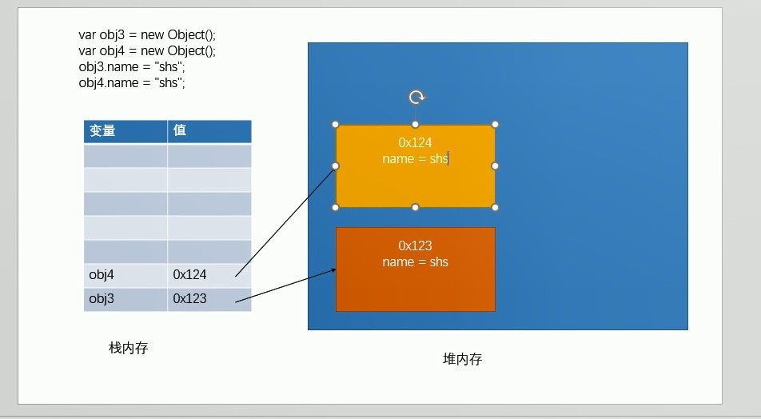

# 前端基础之JavaScript


```javascript
// 控制浏览器弹出一个警告框
alert("这是我的第一行js代码");
// 让计算机在页面中输出一个内容
document.write("看我出不出来~~");
// 向控制台输出一个内容
console.log("看看在哪里输出");
```

## Js编写位置

可以将js代码编写到标签的onclick属性中，当我们点击按钮时，js代码才会执行

```html
<button onclick="alert('来自button标签内部的js代码');"> button按钮</button>
```

可以将js代码写在超链接的href属性中，这样当点击超链接时，会执行js代码

```html
<a href="javascript:alert('来自a标签的js代码');">这是一个a标签</a>
<a href="javascript:;">这也是一个a标签</a>
```

可以将js代码编写到script标签

```javascript
 <script type="text/javascript">
        alert("来自script标签内部的js代码");
    </script>
```

可以将s代码编写到外部s文件中，然后通过script标签引入

```html
<script type="text/javascript" src="script.js"></script>
```

script标签一旦用于引入外部文件了，就不能在编写代码了，即使编写了浏览器也会忽略，如果需要则可以在创建一个新的script标签用于编写内部代码。

## Js基本语法


```javascript
/*
	多行注释
	多行注释
	多行注释
*/

// 单行注释
```

- JS中严格区分大小写
- JS中每一条语句以分号结尾
- JS中会忽略多个空格和换行

字面量，都是一些不可改变的值，可以直接使用，但是我们一般都不会直接使用字面量。

变量可以用来保存字面量，而且变量的值是可以任意改变，变量更加方便我们使用，所以在开发中都是通过变量去

保存一个字面量而很少直接使用字面量。

声明变量

在js中使用var关键字来声明一个变量

```javascript
var a;
```

为变量赋值

```javascript
a = 100;
```

声明和赋值同时进行

```javascript
var age = 18;
```

## 标识符

在JS中所有可以由我们自主命名的都可以称为是标识符，例如：变量名、函数名、属性名都属于标识符

命名一个标识符时需要遵守如下的规则：

- 标识符中可以含有字母、数字、下划线、$
- 标识符不能以数字开头
- 标识符不能是ES中的关键字或保留字
- 标识符一般都采用驼峰命名法，首字母小写，每个单词的开头字母大写，其余字母小写

JS底层保存标识符时实际上是采用的Unicode编码，所以理论上讲，所有的utf-8中含有的内容都可以作为标识符

## 数据类型

指的是字面量的类型，在JS中一共有六种数据类型

- String 字符串
- Number 数值
- Boolean 布尔值
- Null 空值
- Undefined 未定义
- Object 对象

其中String、Number、Boolean、Null、Undefined属于基本数据类型，而Object属于引用数据类型。


## String字符串

在JS中字符串需要使用引号引起来

使用双引号或单引号都可以，但不可以混用

引号不能嵌套，双引号不能嵌套双引号，单引号不能嵌套单引号

在字符串中我们可以使用\作为转义字符，当表示一些特殊符号时可以使用\进行转义


```
\"  表示"
\'  表示'
\n  表示换行
\t  表示制表符
\\  表示\

```

## Number数值

在JS中所有的数值都是Number类型，包括整数和浮点数。

可以使用一个运算符 typeof来检查一个变量的类型。语法：typeof 变量


JS中可以表示的数字的最大值 

```javascript
Number.MAX_VALUE
// 1.7976931348623157e+308
```

如果使用Number表示的数字超过了最大值，则会返回一个Infinity，-Infinity表示负无穷，使用typeof检查Infinity也会返回Numberr


```javascript
a = Number.MAX_VALUE * Number.MAX_VALUE;
console.log(a);
// Infinity

console.log(Infinity);
// Infinity

console.log(typeof Infinity);
//  number

b = -Number.MAX_VALUE * Number.MAX_VALUE;
console.log(b);
// -Infinity

```

NaN是一个特殊的数字，表示Not A Number，使用typeof检查一个NaN也会返回number。

```javascript
a = "abc" * "bcd";
console.log(a);
// NaN

console.log(typeof NaN);
// number
```

JS中可以表示的数字的最小值 

```javascript
Number.MIN_VALUE
// 5e-324
```

在JS中整数的运算基本可以保证精确，如果使用JS进行浮点运算,可能得到一个不精确的结果，所以千万不要使用JS

进行对精确度要求比较高的运算。

```javascript
var a = 0.1 + 0.2;
console.log(a);
// 0.30000000000000004
```


## Boolean布尔值

Boolean 布尔值

布尔值只有两个，主要用来做逻辑判断true表示真，false表示假。

## Null和Undefined

Null(空值)类型的值只有一个，就是null，null这个值专门用来表示一个为空的对象，使用typeof检查一个null值

时，会返回object。

```javascript
var a = null;
console.log(a);
// null
console.log(typeof a);
// object
```


Undefined(未定义)类型的值只有一个， undefined，当声明一个变量，但是并不给变量赋值时，它的值就是 undefined。

```javascript
var b;
console.log(b);
// undefined
```

## 强制类型转换

## 将其他的数据类型转换为String

转换方式一

调用被转换数据类型的 toString()方法

该方法不会影响到原变量，它会将结果返回，null和 undefined这两个值没有 toString()方法。

转换方式二

调用 String()函数，并将被转换的数据作为参数传递给函数

使用String强制类型转换时，对于 Number和Boolean实际上就是调用的 toString()方法，但是对于null和 

undefined，就不会调用 toString()方法它会将null直接转换为"null"将 undefined直接转换为"undefined"。

```javascript
var a = 1;
a.toString(); // "1"

String(null); // "null"
String(undefined); // "undefined"
```


## 将其他的数据类型转换为Number

转换方式一

使用 Number()函数
字符串 ---> 数字

- 如果是纯数字的字符串，则直接将其转换为数字
- 如果字符串中有非数字的内容，则转换为NaN
- 如果字符串是一个空串或者是一个全是空格的字符串，则转换为0

布尔 ---> 数字
true转成1，false转成0

null ---> 数字 0，undefined --->数字NaN


转换方式二
这种方式专门用来对付字符串

parseInt把一个字符串转换为一个整数，parseFloat把一个字符串转换为一个浮点数


```javascript
var a = "123";
a = Number(a);
console.log(typeof a); // number // 123
console.log(a); // 123
 
var b = "1a";
b = Number(b);
console.log(typeof b); // number
console.log(b); // NaN

Number(true); // 1
Number(false); // 0
Number(null); // 0
Number(undefined); // NaN
```

```javascript
var a = "123a";
a = parseInt(a);
console.log(typeof a); // number
console.log(a); // 123 

var a = "a123";
a = parseInt(a);
console.log(typeof a); // number
console.log(a); // NaN
```


## 其他进制的数字

在JS中，如果需要表示16进制的数字,则需要以0x开头，如果需要表示8进制的数字，则需要以0开头，如果要要表示2进制的数字，则需要以0b开头（但是不是所有的浏览器都支持）。

向"070"这种字符串，有些浏览器会当成8进制解析，有些会当成10进制解析。可以在 parseInt中传递一个第二个参数，来指定数字的进制。

```javascript
var a = "010";
a = parseInt(a,2);
console.log(a);
// 2

a = "010";
a = parseInt(a,10);
console.log(a);
// 10

a = "010";
a = parseInt(a,8);
console.log(a);
// 8

0x10; // 16
010; // 8
0b10; // 2
```

## 将其他的数据类型转换为Boolean

使用Boolean函数

- 数字 ---> 布尔，除了0和NaN，其余的都是true。

- 字符串 ---> 布尔，除了空串，其余的都是true。
- null和undefined都会转换为 false，对象会转换为true。

```javascript
Boolean(0); // false
Boolean(NaN); // false
Boolean(1); // true

Boolean(""); // false
Boolean(" "); // true
Boolean("1"); // true

Boolean(null); // false
Boolean(undefined); // false
```


## 算数运算符

运算符也叫操作符

通过运算符可以对一个或多个值进行运算，并获取运算结果，比如：typeof就是运算符，可以来获得一个值的类型

它会将该值的类型以字符串的形式返回。

算数运算符

```css
+
-
*
/
%
```


**加法运算**

+

可以对两个值进行加法运算，并将结果返回。

- 当对非Number类型的值进行运算时，会将这些值转换为Number，然后再运算。
- 任何值和NaN做运算都得NaN。
- 如果对两个字符串进行加法运算，则会做拼串，会将两个字符串拼接为一个字符串，并返回。
- 任何值和字符串相加都会转换为字符串，并做拼串操作。

```css
1 + true;   // 2
1 + null; 	// 1
1 + undefined;  // NaN
2 + false;      // 2
'33' + NaN;     // "33NaN"
'hello' + ' wolrd'; 	// "hello wolrd"
3 + NaN;               // NaN
```

可以利用这一特点，将一个任意的数据类型转换为String，只需要让任意的数据类型+一个空串即可将其转换为

String，这是一种隐式的类型转换，由浏览器自动完成，实际上它也是调用String函数。

```css
var c = 123;
c = c + "";
console.log(typeof c); // string
console.log(c);		  // 123	
```

```css
var result = 1+2+"3"; 		 // "33"
var result = "123"+1+2+3;	 // "123123"
```


**减法运算**

-

可以对两个值进行减法运算，并将结果返回。

```css
100 - 5; // 95
100 - true; // 99
100 - '1'; // 99
100 - 'true'; // NaN
100 - 'qw'; // NaN
100 - ' '; // 100
```

**乘法运算**

```
* 
```

可以对两个值进行乘法运算。

```css
2 * 2; // 4
2 * '2'; // 4
2 * undefined; // NaN
2 * null; // 0
2 * NaN; // NaN
```


**除法运算**

/

```
任何值做- * / 运算时都会自动转换为Number,可以通过为一个值-0 *1 /1来将其转换为Number
```

```css
var d = '123';
d = d - 0; // 123
```


**取模运算**

取余数

% 

```css
9 % 2; // 1
9 % 3; // 0
```

## 一元运算符

一元运算符，只需要一个操作数。

正号

+

正号不会对数字产生任何影响

负号

-

对数字进行符号的取反

```javascript
var a = 123;
a = -a;
console.log(a);
```

对于非Number类型的值，它会将先转换为Number，然后再运算。

```css
+true; // +1
-true; // -1
```

可以对一个其他的数据类型使用+，来将其转换为number。

```css
var a = '18';
a = +a; // 18
```


```css
var result = 1 + '2' + 3;  // "123"
var result = 1 + +'2' + 3; // 6
```

## 自增和自减

**自增**

++
通过自增可以使变量在自身的基础上增加1，对于一个变量自增以后，原变量的值会立即自增1。

```javascript
var a = 11;
a++; // 11
a;   // 12
```

```javascript
var a = 22;
++a; // 23
a;   // 23
```

自增分成两种，后++和前++，都会立即使原变量的值自增1。不同的是后++和前++的值不同，后++的值等于原变量的值（自增前的值），前++的值等于原变量自增后的值。

```javascript
var c = 10;
c++;
console.log(c++); // 11
c; // 12
console.log(++c); // 13
```

```javascript
var d = 20;
var result = d++ + ++d + d;
console.log("result = " +result); // result = 64
d = d++; // 22
```

**自减**

--

通过自减可以使变量在自身的基础上减1。自减分成两种，后-- 和前-- ，无论是 后-- 还是 前-- 都会立即使原变量的值自减1。不同的是后-- 和前-- 的值不同，后-- 的值是变量的原值，自减前的值，前-- 的值是变量的新值，自减后的值。

**练习**

```javascript
var n1 = 10, n2 = 20;
var n = n1++;
console.log('n=' + n);
console.log('n1=' + n1);
n = ++n1;
console.log('n=' + n);
console.log('n1=' + n1);
n = n2--;
console.log('n=' + n);
console.log('n2=' + n2);
n = --n2;
console.log('n=' + n);
console.log('n2=' + n2);

// n=10
// n1=11
// n=12
// n1=12
// n=20
// n2=19
// n=18
// n2=18
```

## 逻辑运算符

**非** 

!

对一个值进行非运算，就是对一个布尔值进行取反操作，true变false，false变true。

如果对一个值取反两次，它不会发生变化。可以利用该特点，来将一个其他的数据类型转换为布尔值。将一个任意

数据类型取两次反，来将其转换为布尔值，原理和Boolean函数一样。

如果对非布尔值进行元素，则会将其转换为布尔值，然后再取反。

```javascript
var a = false;
a = !a;
console.log('a=' + a); // a=true
a = !!a;
console.log('a=' + a); // a=true
```

```javascript
var b = 10;
b = !b;
console.log('b=' + b); // b=false
console.log(typeof b); // boolean
```

```javascript
var b = 0;
b = !b;
console.log('b=' + b); // b=true
console.log(typeof b); // boolean
```

```javascript
var a = 'hello';
a = !!a;
a; // true
```

**与**

&&

两个值中只要有一个值为false就返回false，只有两个值都为true时，才会返回true。

```javascript
var result = true && false;
console.log('result=' + result); // result=false
```

JS中的“与”属于短路的与。如果第一个值为false，则不会看第二个值。如果第一个值为true，则会看第二个值。

```javascript
false && alert('你看我出不出来'); // 第一个值为false，不会检查第二个值。
true && alert('你看我出不出来'); // 第一个值为true，会检查第二个值。
```

**或**

||

两个都是false，则返回false，只要有一个true，就返回true。

```javascript
var result = false || false;
result; // false
result = false || true;
result; // true
result = true || true;
result; // true
```

JS中的“或”属于短路的或，如果第一个值为true，则不会检查第二个值，第一个值为false，则会检查第二个值。

```javascript
true || alert('你看我出不出来');  // 第一个值为true，则不再检查第二个值
false || alert('你看我出不出来'); // 第一个值为false，则会检查第二个值
```

## 非布尔值的与或运算

对于非布尔值进行与或运算时，会先将其转换为布尔值，然后再运算，并且返回原值。
**与运算**
如果第一个值为true，则必然返回第二个值，如果第一个值为false，则直接返回第一个值。

```javascript
var result = 1 && 2;
result; // 2

var result = 2 && 1;
result; // 1

var result = 0 && 2;
result; // 0

var result = "" && 2;
result; // ""

var result = 2 && 0;
result; // 0

var result = NaN && 0;
result; // NaN

```

**或运算**
如果第一个值为true，则直接返回第一个值，如果第一个值为false,则返回第二个值。

```javascript
var result = 1 || 0;
result; // 1

var result = 1 || 2;
result; // 1

var result = 1 || NaN;
result; // 1

var result = NaN || 1;
result; // 1

var result = NaN || 0;
result; // 0

var result = "" || "hello";
result; // "hello"

var result = -1 || "hello";
result; // -1
```

## 赋值运算符

```
= 可以将符号右侧的值赋值给符号左侧的变量
```

```javascript
// +=
var a = 1;
a += 5; // 等价于 a = a + 5;

// -=
a -= 5; // 等价于 a = a - 5;

// *=
a *= 5; // 等价于 a = a * 5;

// /= 
a /= 5; // 等价于 a = a / 5;

// %=
a %= 5; // 等价于 a = a % 5;
```

## 关系运算符

通过关系运算符可以比较两个值之间的大小关系，如果关系成立它会返回true，如果关系不成立则返回false。

**大于号**

```
>
```

判断符号左侧的值是否大于右侧的

**大于等于号**

判断符号左侧的值是否大于或等于右侧的值

```
>=
```

**小于号**

```
<
```

**小于等于号**

```
<=
```

**非数值的情况**

对于非数值进行比较时，会将其转换为数字然后再比较。

```javascript
var a = 10 > true;
console.log('a = '+a); // a = true

var a = 1 > true;
console.log('a = '+a); // a = false

var a = 1 > '0';
console.log('a = '+a); // a = true

var a = 1 > null;
console.log('a = '+a);// a = true

var a = true > false;
console.log(a); // true
```

任何值和NaN做任何比较都是false。

```javascript
var a = 1 > NaN;
console.log(a); // false

var a = 1 <= NaN;
console.log(a); // false

var a = 10 > "hello";
console.log(a); // false

var a = 10 <= "hello";
console.log(a); // false
```

如果符号两侧的值都是字符串时，不会将其转换为数字进行比较，而会分别比较字符串中字符的Unicode编码。

比较字符编码时是一位一位进行比较，如果两位一样，会比较下一位，可以借用起来对英文进行排序。

```javascript
var a = '1' > '5';
console.log(a); // false

var a = '11' > '5';
console.log(a); // false

console.log('a'>'b'); // false
console.log('a'>'bbb'); // false
```

如果比较两个字符串型的数字，可能会得到不可预期的结果，在比较两个字符串型的数字时，一定要转型。

```javascript
console.log('1'< '2'); // true
console.log('11'< '2'); // true

console.log('11'< +'2'); // false
```

## Unicode编码表

<a href="http://unicode.org/charts/">Code Charts</a>

JS

```javascript
// \u四位编码
console.log('\u2620'); // ☠
```

HTML

```html
<!-- 这里的编码需要转换为10进制，&#编码；-->
<p style="font-size: 16px;color:red">&#1874;</p>
```
## 相等运算符

相等运算符用来比较两个值是否相等，如果相等会返回true，否则返回 false。

**相等运算**

==

当使用==来比较两个值时，如果值的类型不同，则会自动进行类型转换，将其转换为相同的类型然后再比较。

**不相等**

!=

不相等用来判断两个值是否不相等，如果不相等返回true，否则返回false。不相等也会对变量进行自动的类型转换，如果转换后相等它也会返回false。

- undefined衍生自null，所以这两个值做相等判断时，会返回true。
- NaN不和任何值相等，包括他本身。

```javascript
console.log(1 == 1); // true
console.log(10 == 1); // false

console.log("2" == 2); // true

console.log(true == 1); // true
console.log(true == 2); // false

console.log("true" == "1"); // false
console.log("true" == "hello"); // false
console.log(true == "hello"); // false

console.log(true == "1"); // true

console.log(null == 0); // false

console.log(undefined == null); // true

console.log(NaN == NaN); // false
console.log(NaN == 0); // false
console.log(NaN == 1); // false

console.log(10 != 5); // true
console.log(10 != 10); // false

console.log(1 != true); // false

console.log('abcd' != 'abcd'); // false
console.log('abcd' == 'abcd'); // true

console.log('1' == 1); // true
```

判断变量的值是否是NaN，可以通过isNaN函数来判断。

```javascript
var b = NaN;
console.log(isNaN(b)); // true
```

**全等**

===

用来判断两个值是否全等，它和相等类似，不同的是它不做自动的类型转换，如果两个值的类型不同，直接返回false。

```javascript
console.log('123' === 123); // false
console.log('123' == 123); // true
console.log(null === undefined); // false
```

 **不全等**

!==

用来判断两个值是否不全等，和不等类似，不同的是它不做自动的类型转换，如果两个值的类型不同，直接返回true。

```javascript
console.log(1 !== '1'); // true
console.log(1 !== true); // true
console.log(1 != true); // false
```

## 条件运算符

条件运算符也叫三元运算符。

**语法**

条件表达式 ? 语句1 : 语句2 ;

**执行流程**

条件运算符在执行时，首先对条件表达式进行求值，如果该值为true，则执行语句1，并返回执行结果。如果该值

为false，则执行语句2，并返回执行结果。

```javascript
true ? alert('语句1') : alert('语句2');
false ? alert('语句1') : alert('语句2');

var a = 10;
var b = 20;
a > b ? alert('a大') : alert('b大');
```

```javascript
// 获取a和b中的最大值
var a = 20;
var b = 10;
var max = a > b ? a : b;
console.log("max=" + max);

//获取a b c中的大值
var a = 20;
var b = 10;
var c = 55;
var max = a > b ? a : b;
max = max > c ? max : c;
console.log("max=" + max);

// 这种写法不推荐使用，不方便阅读
var max = a > b ? a > c ? a : c : b > c ? b : c;
var max = a > b ? (a > c ? a : c ) : (b > c ? b : c);
```

如果条件的表达式的求值结果是一个非布尔值，会将其转换为布尔值然后再运算。

```javascript
"hello" ? alert("语句1") : alert("语句2");
"" ? alert("语句1") : alert("语句2");
```

## 运算符优先级

, 运算符，可以分割多个语句，一般可以在声明多个变量时使用。

```javascript
var a;
var b;
var c;

// 使用,可以同时声明多个变量
var a, b, c;

// 可以同时声明多个变量并赋值
var a = 1, b = 2, c = 3;
```


如果遇到优先级不清楚，可以使用()来改变优先级。

```javascript
var result = 1 || 2  && 3;
console.log(result); // 1

var result = (1 || 2) && 3;
console.log(result); // 3
```

## 代码块

我们的程序是由一条一条语句构成的，语句是按照自上向下的顺序一条一条执行的。在JS中可以使用{}来为语句进行分组，同一个{}中的语句我们称为是一组语句，它们要么都执行，要么都不执行，一个{}中的语句我们也称为叫一个代码块。在代码块的后边就不用再编写;了。

```javascript
{
    alert("hello");
    console.log("你好");
    document.write("世界");
}
```

JS中的代码块，只具有分组的的作用，没有其他的用途。

```javascript
{
    var a = 10;
    alert("hello");
    console.log("你好");
    document.write("世界");
}

console.log(a); // 10
```

## 条件判断语句

**流程控制语句**
JS中的程序是从上到下一行一行执行的，通过流程控制语句可以控制程序执行流程，使程序可以根据一定的条件选择执行。
**语句分类**

- 条件判断语句
- 条件分支语句
- 循环语句

**条件判断语句**

使用条件判断语句可以在执行某个语句之前进行判断，如果条件成立才会执行语句，条件不成立则语句不执行。

**if 语句**

```javascript
if (条件) 语句 
```

```javascript
if (true)
    alert("语句1"); 
```

```javascript
var a = 10;

if (a > 1)
    alert("a大于1");
```

if语句只能控制紧随其后的那个语句，如果希望语句可以控制多条语句，可以将这些语句统一放到代码块中。

if语句后的代码块不是必须的，但是在开发中尽量写上代码块，即使if后只有一条语句。

```javascript
var a = 10;

if (a > 1)
    alert("a大于1");
    alert('execute anyway');
```

```javascript
if (条件)
  {
  只有当条件为 true 时执行的代码
  }
```

```javascript
var a = 10;

if (a > 1)
{
    alert("a大于1");
    alert('execute anyway'); 
}
```

```javascript
var a = 13;

if (a > 10 && a < 20) {
    alert("a大于10且小于20");
    alert('execute anyway');
}

var a = 13;

if (a > 10 || a < 20) {
    alert("语句");
    alert('execute anyway');
}
```

## If...else 语句

**语法**

```
if (条件){
    语句...
}else{
    语句...
}
```

当该语句执行时，会先对if语句后的条件表达式进行求值判断，如果该值为true，则执行if后的语句，如果该值为false，则执行else后的语句。

```javascript
var age = 50;
if (age > 60) {
    alert("你已经可以退休了");
} else {
    alert("你还没有到达退休年龄");
}
```

## **If...else if...else 语句**

```
if (条件 1)
  {
  当条件 1 为 true 时执行的代码
  }
else if (条件 2)
  {
  当条件 2 为 true 时执行的代码
  }
else
  {
  当条件 1 和 条件 2 都不为 true 时执行的代码
  }
```

当该语句执行时，会从上到下依次对条件表达式进行求值判断。如果值为true，则执行当前语句。如果值为false，则继续向下判断。如果所有的条件都不满足，则执行最后一个else后的语句。该语句中，只会有一个代码块被执行，一旦代码块执行了，则直接结束语句。

```javascript
var age = 100;
if (age > 100) {
    alert("活着挺没有意思~~");
} else if (age > 80) {
    alert("你已经耄耋之年了~~");
} else if (age > 60) {
    alert("你已经可以退休了~~");
} else if (age > 30) {
    alert("你已经到了而立之年了~~");
} else if (age > 17) {
    alert("你已经成年了~~");
} else {
    alert("你还是个孩子~~");
}
```

```javascript
// 代码不报错，但是中间的判断语句不会被执行，是死代码。
var age = 100;
if (age > 17) {
    alert("你已经成年了~~");
} else if (age > 30) {
    alert("你已经到了而立之年了~~");
} else if (age > 60) {
    alert("你已经可以退休了~~");
} else {
    alert("你的年龄深不可测~~");
}
```

```javascript
// 修改
var age = 100;
if (age > 17 && age <= 30) {
    alert("你已经成年了~~");
} else if (age > 30 && age <= 60) {
    alert("你已经到了而立之年了~~");
} else if (age > 60 && age <= 80) {
    alert("你已经可以退休了~~");
} else {
    alert("你的年龄深不可测~~");
}
```


## 练习

prompt可以弹出一个提示框，该提示框中会带有一个文本框。用户可以在文本框中输入一段内容，该函数需要一个字符串作为参数，字符串将会作为提示框的提示文字。用户输入的内容会作为函数的返回值返回，可以定义一个变量来接收该内容。


```javascript
var score = prompt("请输入小明的期末成绩");
if (score > 100 || score < 0 || isNaN(score)) {
    alert("输入非法");
} else {
    if (score == 100) {
        alert("奖励你一台宝马");
    } else if (score >= 80) {
        alert("奖励你一台huawei mate pro");
    } else if (score >= 60) {
        alert("奖励你一本书");
    } else {
        alert("一顿棍揍");
    }
}
```

```javascript
var height = +prompt("请输入你的身高(CM)");
var wealth = +prompt("请输入你的财富值(million)")
var looking = +prompt("请输入你的颜值(PX)")

// alert(height + "," + wealth + "," + looking);
if (height > 180 && wealth > 1000 && looking > 500) {
    alert("完美");
} else if (height > 180 || wealth > 1000 || looking > 500) {
    alert("not bad");
} else {
    alert("滚蛋");
}
```

```javascript
var num1 = +prompt("请输入第一个数");
var num2 = +prompt("请输入第二个数")
var num3 = +prompt("请输入第三个数")

// num1 < num2 < num3
if (num1 < num2 && num1 < num3) {
    // alert(num1 + ',' + num2 + ',' + num3)
    if (num2 < num3) {
        alert(num1 + ',' + num2 + ',' + num3);
    } else {
        alert(num1 + ',' + num3 + ',' + num2);
    }
} else if (num2 < num3 && num2 < num1) {
    if (num3 < num1) {
        alert(num2 + ',' + num3 + ',' + num1);
    }
    else {
        alert(num2 + ',' + num1 + ',' + num3);
    }

} else {
    // num3 最小
    if (num2 < num3) {
        alert(num3 + ',' + num2 + ',' + num1);
    } else {
        alert(num3 + ',' + num1 + ',' + num2);
    }
}
```

## switch语句

**语法**

```javascript
switch(n)
{
case 1:
  执行代码块 1
  break;
case 2:
  执行代码块 2
  break;
default:
  n 与 case 1 和 case 2 不同时执行的代码
}
```

**执行流程**

在执行时会依次将case后的表达式的值和 switch后的条件表达式的值进行全等比较，如果比较结果为true，则从当前case处开始执行代码（当前case以后的所有的代码都会执行）。如果比较结果为 false，则继续向下比较。使用break语句可以退出 switch语句。如果所有的比较结果都为false，则只执行deault后的语句。

```javascript
var num = 1;

switch (num) {
    case 1:
        console.log("一");
       
    case 2:
        console.log("二");
     
    case 3:
        console.log("三");
   
    default:
        console.log("非法数字");
}
```


```javascript
var num = 1;

switch (num) {
    case 1:
        console.log("一");
        break;
    case 2:
        console.log("二");
        break;
    case 3:
        console.log("三");
        break;
    default:
        console.log("非法数字");
}
```

**练习**

```javascript
var score = 33;

switch (parseInt(score / 10)) {
    case 10:
    case 9:
    case 8:
    case 7:
    case 6:
        console.log("合格");
        break;
    default:
        console.log("不合格");
        break;
}
```

```javascript
switch (true) {
    case score >= 60:
        console.log("合格");
        break;
    default:
        console.log("不合格");
        break;
}
```

## 循环语句

```css
var n = 1;
document.write(n++ + "<br />");
```

**while循环**

语法

```
while(条件表达式){
	语句...
	}
```

while语句在执行时，先对条件表达式进行求值判断，如果值为true，则执行循环体，循环体执行完毕以后，继续对表达式进行判断，如果为true，则继续执行循环体，以此类推，如果值为false，则终止循环。

```javascript
// 死循环
var n = 1;

while (true) {
    alert(n++);
}
```

```javascript
//可以使用break，来终止循环
var n = 1;

while (true) {
    alert(n++);
    //判断n是否是10
    if (n == 10) {
        // 退出循环
        break;
    }
}
```

创建一个循环，往往需要三个步骤。

```javascript
// 1.初始化一个变量
var i = 0;
// 2.在循环中设置一个条件表达式
while(i <= 10){
    alert(i);
    // 3.定义一个更新表达式，每次更新初始化变量
    i++;
}
```

 **do...while循环**

```javascript
do {
    语句...
} while (条件表达式)
```


```javascript
var i = 0;
do {
    document.write(i++ + "<br />");
} while (i <= 10);

```

do...while语句在执行时，会先执行循环体，循环体执行完毕以后，再对while后的条件表达式进行判断，如果结果为true，则继续执行循环体，执行完毕继续判断以此类推，如果结果为false，则终止循环。

实际上这两个语句功能类似，不同的是while是先判断后执行，而do...while会先执行后判断，do...while可以保证循环体至少执行一次，而while不能。

## 练习

```javascript
// 假如投资的年利率为5%，试求从1000块增长到5000块，需要花费多少年？
// 定义一个变量，表示当前的钱数
var money = 1000;
// 定义一个计数器
var count = 0;
// 定义一个while循环来计算每年的钱数
while (money < 5000) {
    money *= 1.05;
    // 使count自增
    count++;
}
console.log("一共需要" + count + "年");
```

```javascript
while (true) {
    // score就是小明的期末成绩
    var score = prompt("请输入小明的期末成绩(0-100):");
    // 判断用户输入的值是否合法
    if (score >= 0 && score <= 100) {
        // 满足该条件则证明用户的输入合法，退出循环
        break;
    }

    alert("请输入有效的分数！！！");
}


// 根据score的值来决定给小明什么奖励
if (score == 100) {
    // 奖励一台宝马
    alert("宝马，拿去~~~");
} else if (score >= 80) {
    // 奖励一个手机
    alert("手机，拿去玩~~~");
} else if (score >= 60) {
    // 奖励一本参考书
    alert("参考书，拿去看~~~");
} else {
    alert("棍子一根~~");
}
```

## for循环


```javascript
// 创建一个执行10次的while循环
// 初始化表达式
var i = 0;
// 创建一个循环，定义条件表达式
while (i < 10) {
    // 设置更新表达式
    alert(i++);
}
```

**语法**

在for循环中，为我们提供了专门的位置用来放三个表达式。1.初始化表达式 2.条件表达式 3.更新表达式

```javascript
for(①初始化表达式;②条件表达式;④更新表达式){
    ③语句...
}    
```

```javascript
for (var i = 0; i < 10; i++) {
    alert(i);
}
```

**执行流程**

①执行初始化表达式，初始化变量（初始化表达式只会执行一次）。

②执行条件表达式，判断是否执行循环。如果为true，则执行循环③，如果为false，终止循环。

④执行更新表达式，更新表达式执行完毕继续重复②。

for循环中的三个部分都可以省略，也可以写在外部。

```javascript
var i = 0;
for (; i < 10;) {
    alert(i++);
}
```

如果在for循环中不写任何的表达式，只写两个;，此时循环是一个死循环会一直执行下去，慎用。

```javascript
for (; ;) {
    alert("hello");
}
```

**练习**

```javascript
// 打印1-100之间所有奇数之和

for (var i = 1, sum = 0; i <= 100; i++) {
    // 判断i是否是奇数
    // 不能被2整除的数就是奇数
    if (i % 2 != 0) {
        sum = sum + i;
    }
}
console.log("奇数之和为 : " + sum);
```

```javascript
// 水仙花数是指一个3位数，它的每个位上的数字的3次幂之和等于它本身。
for (var i = 100; i < 1000; i++) {
    // 获取百位 十位 个位上的数字
    bai = parseInt(i / 100);
    shi = parseInt((i - bai * 100) / 10)
    ge = i % 10;
    if (bai * bai * bai + shi * shi * shi + ge * ge * ge == i) {
        console.log(i);
    }
}
    
```

```javascript
// 在页面中接收一个用户输入的数字，并判断该数是否是质数。
// 质数，只能被1和它自身整除的数，1不是质数也不是合数，质数必须是大于1的自然数。	
var num = prompt("请输入一个大于1的整数:");
// 判断这个值是否合法
if (num <= 1) {
    alert("输入不合法！");
} else {
    // 创建一个变量来保存当前的数的状态
    var flag = true;
    // 判断num是否是质数
    // 2-num之间的数
    for (var i = 2; i < num; i++) {
        // 判断num是否能被i整除
        if (num % i == 0) {
            // 如果num能被i整除，则说明num一定不是质数
            // 设置flag为false
            flag = false;
        }
    }
    if (flag) {
        alert(num + "是质数！！！");
    } else {
        alert(num + "不是质数！！！");
    }
}

```

## 嵌套

```javascript
// 通过一个for循环来输出图形
// 这个for循环执行几次，图形的高度就是多少
// 它可以用来控制图形的高度

for (var i = 0; i < 5; i++) {

    // 在循环的内部再创建一个循环，用来控制图形的宽度
    // 内层循环可以来决定图形的宽度，执行几次图形的宽度就是多少
    for (var j = 0; j < i + 1; j++) {
        document.write("*&nbsp;&nbsp;&nbsp;");
    }

    // 输出一个换行
    document.write("<br />");
}
```


## 九九乘法表

JS

```javascript
// 创建外层循环，用来控制乘法表的高度
for (var i = 1; i < 10; i++) {
    // 创建一个内层循环来控制乘法表的宽度
    for (var j = 1; j <= i; j++) {
        document.write("<span>" + j + "*" + i + "=" + i * j + "</span>")
    }
    // 输出一个换行
    document.write("<br/>")
}
```

CSS

```css
body {
    width: 2000px;
}

span {
    display: inline-block;
    width: 100px;
}
```

## 打印质数

```javascript
// 打印出1-100之间所有的质数
for (var i = 2; i <= 100; i++) {
    // 创建一个布尔值，用来保存结果，默认是质数
    var flag = true;
    // 判断i是否是质数
    // 获取到2-i之间的所有的数
    for (var j = 2; j < i; j++) {
        // 判断i是否能被j整除
        if (i % j == 0) {
            // 如果进入判断则证明i不是质数,修改flag值为false
            flag = false;
        }

    }
    //如果是质数，则打印i的值
    if (flag) {
        console.log(i);
    }
}
```

## break和continue

break关键字可以用来退出switch和循环语句。不能直接在if语句中使用break关键字。break关键字，会立即终止离他最近的那个循环语句。

```javascript
for (var i = 0; i < 5; i++) {
    console.log(i);
    if (i == 2) {
        break;
    }
}
```

```javascript
for (var i = 0; i < 5; i++) {
    console.log("@外层循环" + i)
    for (var j = 0; j < 5; j++) {
        break;
        console.log("内层循环:" + j);
    }
}
```

可以为循环语句创建一个label，来标识当前的循环。label : 循环语句，使用break语句时，可以在break后跟着一个label，这样break将会结束指定的循环。

```javascript
outer:
    for (var i = 0; i < 5; i++) {
        console.log("@外层循环" + i)
        for (var j = 0; j < 5; j++) {
            break outer;
            console.log("内层循环:" + j);
        }
    }
```

continue关键字可以用来跳过当次循环，同样continue也是默认只会对离他最近的循环循环起作用，continue也可以通过指定标识跳过外层循环。

```javascript
for (var i = 0; i < 5; i++) {

    if (i == 2) {
        continue;
    }
    console.log(i);
}
```


```javascript
outer:
    for (var i = 0; i < 5; i++) {

        for (var j = 0; j < 5; j++) {

            continue outer;

            console.log("-->" + j);

        }

        console.log("@--->" + i);
    }

```

## 质数练习补充

```javascript
// 测试如下的程序的性能
// 在程序执行前，开启计时器
// console.time("计时器的名字")可以用来开启一个计时器
// 它需要一个字符串作为参数，这个字符串将会作为计时器的标识
console.time("test");
for (var i = 2; i <= 10000; i++) {

    var flag = true;
    for (var j = 2; j < i; j++) {

        if (i % j == 0) {
            flag = false;
            // 一旦进入判断，则证明i不可能是质数了，此时循环再执行已经没有任何意义了
            // 使用break来结束循环
            // 不加break 247ms
            // 加break 32ms
            break;
        }

    }

    if (flag) {
        // console.log(i);
    }
}
// 终止计时器
// console.timeEnd()用来停止一个计时器，需要一个计时器的名字作为参数
console.timeEnd("test");
```


## 对象

JS中数据类型

- String 字符串

- Number 数值

- Boolean 布尔值

- Null 空值

- Undefined 未定义

  以上这五种类型属于基本数据类型，以后我们看到的值，只要不是上边的5种，全都是对象。

- Object 对象

基本数据类型都是单一的值"hello" 、123、 true，值和值之间没有任何的联系。

对象属于一种复合的数据类型，在对象中可以保存多个不同数据类型的属性。

**对象的分类**

**内建对象**

由ES标准中定义的对象，在任何的ES的实现中都可以使用。

比如：Math String Number Boolean Function Object....

**宿主对象**

由JS的运行环境提供的对象，目前来讲主要指由浏览器提供的对象。比如：BOM DOM

**自定义对象**

由开发人员自己创建的对象。

## 对象的基本操作

**创建对象**

 使用new关键字调用的函数，是构造函数constructor。构造函数是专门用来创建对象的函数。使用typeof检查一

个对象时，会返回object。

```javascript
var obj = new Object();
console.log(typeof obj); // object
```

在对象中保存的值称为属性，**向对象添加属性**。语法：对象.属性名 = 属性值;

```javascript
// 向obj中添加一个name属性
obj.name = "孙悟空";
// 向obj中添加一个gender属性
obj.gender = "男";
// 向obj中添加一个age属性
obj.age = 18;
```

**读取对象中的属性**，语法：对象.属性名。如果读取对象中没有的属性，不会报错而是会返回undefined。

```javascript
console.log(obj.gender); // 男
console.log(obj.hello); // undefined
```

**修改对象的属性值**。语法：对象.属性名 = 新值;

```javascript
console.log(obj.name); // 孙悟空
obj.name = "tom";
console.log(obj.name); // tom
```

**删除对象的属性**。语法：delete 对象.属性名;

```javascript
delete obj.name;
console.log(obj.name); // undefined
```

## 属性名和属性值

**属性名**

对象的属性名不强制要求遵守标识符的规范，但是我们使用时还是尽量按照标识符的规范去做。

```javascript
var obj = new Object();
obj.name = "孙悟空";
// obj.var = "hello";
// console.log(obj.var); // hello
```

如果要使用特殊的属性名，不能采用.的方式来操作。需要使用另一种方式，语法：对象["属性名"] = 属性值;

读取时也需要采用这种方式。使用[]这种形式去操作属性，更加的灵活，在[]中可以直接传递一个变量，这样变量值是多少就会读取那个属性。

```javascript
// Uncaught SyntaxError: Unexpected number
// obj.123 = 789; 

obj["123"] = 789;
console.log(obj["123"]); // 789

obj["nihao"] = "你好";
var n = "nihao";
console.log(obj[n]); // 你好

n = "123";
console.log(obj[n]); // 789
```

**属性值**

JS对象的属性值，可以是任意的数据类型，也可以是一个对象。

```javascript
obj.test = true;
obj.test = null;
obj.test = undefined;

// 创建一个对象
var obj2 = new Object();
obj2.name = "猪八戒";

// 将obj2设置为obj的属性
obj.test = obj2;
console.log(obj.test.name); // 猪八戒
```

**in 运算符**

通过该运算符可以检查一个对象中是否含有指定的属性，如果有则返回true，没有则返回false。

语法："属性名" in 对象;

```javascript
// console.log(obj.test2);
console.log("test2" in obj); // false
console.log("test" in obj); // true
console.log("name" in obj); // false
```

## 基本数据类型和引用数据类型

基本数据类型，String、Number、Boolean、Null、Undefined。

引用数据类型，Object。

```javascript
var a = 123;
var b = a;
a++;
console.log("a = " + a); // a = 124
console.log("b = " + b); // b = 123
```

```javascript
var obj = new Object();
obj.name = "孙悟空";
var obj2 = obj;
console.log(obj.name); // 孙悟空
console.log(obj2.name); // 孙悟空
```

```javascript
// 修改obj的name属性
obj.name = "猪八戒";
console.log(obj.name); // 猪八戒
console.log(obj2.name); // 猪八戒
```

JS中的变量都是保存到栈内存中的，基本数据类型的值直接在栈内存中存储，值与值之间是独立存在，修改一个变量不会影响其他的变量。对象是保存到堆内存中的，每创建一个新的对象，就会在堆内存中开辟出一个新的空间。

而变量保存的是对象的内存地址（对象的引用），如果两个变量保存的是同一个对象引用，当一个通过一个变量修改属性时，另一个也会受到影响。

```javascript
// 设置obj2为null
obj2 = null;
console.log(obj); // {name: "猪八戒"}
console.log(obj2); // null
```

```javascript
var c = 10;
var d = 10;
console.log(c == d); // true
```

当比较两个基本数据类型的值时，就是比较值。而比较两个引用数据类型时，它是比较的对象的内存地址，如果两个对象是一摸一样的，但是地址不同，它也会返回false。

```javascript
var obj3 = new Object();
var obj4 = new Object();
obj3.name = "沙和尚";
obj4.name = "沙和尚";

console.log(obj3); // {name: "沙和尚"}
console.log(obj4); // {name: "沙和尚"}
console.log(obj3 == obj4); // false
```




## 对象字面量

使用对象字面量来创建一个对象。

```javascript
var obj = {};
console.log(typeof obj); // object
obj.name = "孙悟空";
console.log(obj.name); // 孙悟空
```

使用对象字面量，可以在创建对象时，直接指定对象中的属性。语法：{属性名:属性值,属性名:属性值....};

对象字面量的属性名可以加引号也可以不加，建议不加，如果要使用一些特殊的名字，则必须加引号。

属性名和属性值是一组一组的名值对结构，名和值之间使用:连接，多个名值对之间使用,隔开，如果一个属性之后没有其他的属性了，就不要写,。

```javascript
var obj2 = {
    name: "猪八戒",
    age: 13,
    gender: "男",
    test: {name: "沙僧"}
};
```

## 函数

函数也是一个对象。函数中可以封装一些功能（代码），在需要时可以执行这些功能（代码）。使用typeof检查一

个函数对象时，会返回function。

**构造函数**

```javascript
// 创建一个函数对象
var fun = new Function();
console.log(typeof fun); // function

// 可以将要封装的代码以字符串的形式传递给构造函数
var fun = new Function("console.log('Hello 这是我的第一个函数');");

console.log(fun);
// ƒ anonymous(
// ) {
// console.log('Hello 这是我的第一个函数');
// }
```

封装到函数中的代码不会立即执行，函数中的代码会在函数调用的时候执行。

调用函数，语法：函数对象();，当调用函数时，函数中封装的代码会按照顺序执行。

```javascript
fun(); // Hello 这是我的第一个函数
```

```javascript
fun.hello = "你好";
console.log(fun.hello); // 你好
```

**使用函数声明来创建一个函数**

```javascript
function 函数名([形参1, 形参2...形参N]) {

    语句...

}
```

```javascript
function fun2() {
    console.log("这是我的第二个函数~~~");
    alert("哈哈哈哈哈");
    document.write("~~~~(>_<)~~~~");
}

// console.log(fun2);

fun2();
```

 **使用函数表达式来创建一个函数**

```
var 函数名  = function([形参1,形参2...形参N]){
     语句....
}
```

```javascript
var fun3 = function () {
    console.log("我是匿名函数中封装的代码");
};

fun3();
```

## 函数的参数

```javascript
// 定义一个用来求两个数和的函数
// 可以在函数的()中来指定一个或多个形参（形式参数）
// 多个形参之间使用,隔开，声明形参就相当于在函数内部声明了对应的变量，但是并不赋值
function sum(a, b) {
    console.log(a + b);
}

// 在调用函数时，可以在()中指定实参（实际参数）
// 实参将会赋值给函数中对应的形参
sum(123, 456); // 579
sum(1, 2); // 3
```

**调用函数时解析器不会检查实参的类型，函数的实参可以是任意的数据类型。**所以要注意，是否有可能会接收到非法的参数，如果有可能则需要对参数进行类型的检查。

```javascript
sum(123, "hello"); // 123hello
sum(true, false); // 1
```

**调用函数时，解析器也不会检查实参的数量。**多余实参不会被赋值，如果实参的数量少于形参的数量，则没有对应

实参的形参将是undefined。

```javascript
sum(123, 456, "hello", true, null); // 579
```

```javascript
function sum(a, b) {
    console.log("a = " + a);
    console.log("b = " + b);
    console.log(a + b);
}

sum(123);
// a = 123
// b = undefined
// NaN
```

## 函数的返回值

可以使用 return 来设置函数的返回值，return后的值将会会作为函数的执行结果返回，可以定义一个变量，来接

收该结果。

```javascript
// 创建一个函数，用来计算三个数的和

function sum(a, b, c) {
    var d = a + b + c;
    return d;
}

var result = sum(4,7,8);
console.log("result = "+result); // result = 19
```

在函数中return后的语句都不会被执行。

```javascript
function sum(a, b, c) {
    var d = a + b + c;
    return d;
    alert("hello"); // 不会被执行
}
```

return后可以跟任意类型的值。

```javascript
function sum(a, b, c) {
    var d = a + b + c;
    return 'hello';
}

var result = sum(1, 2, 3);
console.log(result); // hello
```

如果return语句后不跟任何值就相当于返回一个undefined，如果函数中不写return，则也会返回undefined。

```javascript
function sum(a, b, c) {
    var d = a + b + c;
    return;
}

var result = sum(4,7,8);
console.log("result = "+result); // result = undefined
```

## 实参可以是任何值

```javascript
// 定义一个函数，判断一个数字是否是偶数，如果是返回true，否则返回false
function isEven(num) {
    return num % 2 == 0;
}

var result = isEven(15);
console.log("result = " + result); // result = false

```

**实参可以是任意的数据类型，也可以是一个对象。**当我们的参数过多时，可以将参数封装到一个对象中，然后通过对象传递。

```javascript
// 创建一个函数，可以在控制台中输出一个人的信息
// 可以输出人的 name age gender address
function sayHello(name, age, gender, address) {
    console.log("我是" + name + ",今年我" + age + "岁了," 
        		+ "我是一个" + gender + "人" + ",我住在" + address);
}

sayHello("孙悟空", 18, "男", "花果山"); // 我是孙悟空,今年我18岁了,我是一个男人,我住在花果山
```


```javascript
function sayHello(o) {
    console.log("我是" + o.name + ",今年我" + o.age + "岁了,"
                + "我是一个" + o.gender + "人" + ",我住在" + o.address);
}

var obj = {
    name: "孙悟空",
    age: 18,
    address: "花果山",
    gender: "男"

};

sayHello(obj); // 我是孙悟空,今年我18岁了,我是一个男人,我住在花果山
```

**实参可以是一个对象，也可以是一个函数。**

```javascript
function fun(a) {
    console.log("a = " + a);
}

fun(sayHello);
/*
a = function sayHello(o) {
    console.log("我是" + o.name + ",今年我" + o.age + "岁了,"
                + "我是一个" + o.gender + "人" + ",我住在" + o.address);
}
 */
```

```javascript
function fun(a) {
   a(obj);
}

fun(sayHello);
// 我是孙悟空,今年我18岁了,我是一个男人,我住在花果山
```

```javascript
function fun(a) {
    console.log("a = " + a);
}

fun(function(){});
/*
a = function(){}
 */
```

**调用函数，相当于使用的函数的返回值**。函数对象，相当于直接使用函数对象。

```javascript
function isEven(num) {
    return num % 2 == 0;
}

fun(isEven(16));
/*
a = true
*/
```

## return

```javascript
function fun() {
    alert("函数要执行了~~~~");

    for (var i = 0; i < 5; i++) {
        if (i == 2) {
            //使用break可以退出当前的循环
            //break;

            //continue用于跳过当次循环
            //continue;

            //使用return可以结束整个函数
            return;
        }

        console.log(i);
    }

    alert("函数执行完了~~~~");
}

fun();
```

```javascript

/*
返回值可以是任意的数据类型
可以是一个对象，也可以是一个函数
*/
function fun2() {

    //返回一个对象
    return {name: "aoa"};
}

var a = fun2();
console.log("a = " + a.name);
/*
a = aoa
*/

		
function fun3(){
    //在函数内部再声明一个函数
    function fun4(){
        alert("我是fun4");
    }

    //将fun4函数对象作为返回值返回
    return fun4;
}

a = fun3();
//console.log(a);
a();

// 等价于a();
fun3()();
```

## 立即执行函数

函数定义完，立即被调用，这种函数叫做立即执行函数。立即执行函数往往只会执行一次。


```javascript
(function () {
    alert("我是一个匿名函数~~~");
})();
```

```javascript
(function (a, b) {
    console.log("a = " + a);
    console.log("b = " + b);
})(123, 456);
```

## 对象

```javascript
// 创建一个对象
var obj = new Object();
//向对象中添加属性
obj.name = "孙悟空";
obj.age = 18;

//对象的属性值可以是任何的数据类型，也可以是个函数
obj.sayName = function () {
    console.log(obj.name);
};
// console.log(obj.sayName);

//调方法
obj.sayName();
/*
孙悟空
*/
```

函数也可以做为对象的属性，如果一个函数作为一个对象的属性保存，那么我们称这个函数是这个对象的方法，调用这个函数就说调用对象的方法（method）。

```javascript
var obj2 = {

    name: "aoa",
    age: 18,
    sayName: function () {
        console.log(obj2.name);
    }

};
obj2.sayName();
/*
aoa
 */
```

## 枚举对象中的属性

使用for ... in 语句

语法

```
for(var 变量 in 对象){

}
```

for...in语句 对象中有几个属性，循环体就会执行几次，每次执行时，会将对象中的一个属性的名字赋值给变量。

```javascript
for (var n in obj) {
    console.log("属性名:" + n);
    console.log("属性值:" + obj[n]);
}
```

## 全局作用域

**作用域**

作用域指一个变量的作用的范围

```javascript
console.log(a);
/*
Uncaught ReferenceError: a is not defined
*/
```

**全局作用域**

直接编写在script标签中的JS代码，都在全局作用域。全局作用域在页面打开时创建，在页面关闭时销毁。

在全局作用域中有一个全局对象window，它代表的是一个浏览器的窗口，它由浏览器创建我们可以直接使用。

在全局作用域中，创建的变量都会作为window对象的属性保存，创建的函数都会作为window对象的方法保存。

全局作用域中的变量都是全局变量，在页面的任意的部分都可以访问的到。

```javascript
var a = 10;
console.log(a); // 10
console.log(window.a); // 10
```

```javascript
function fun() {
    console.log("我是fun函数");
}

window.fun(); // 我是fun函数

window.alert("hello");
```

## 变量的声明提前

使用var关键字声明的变量，会在所有的代码执行之前被声明（但是不会赋值），但是如果声明变量时不使用var关

键字，则变量不会被声明提前。

```javascript
console.log("a = " + a);
var a = 123;
/* 
a = undefined
*/
```

```javascript
console.log("a = " + a);
a = 123;
/*
Uncaught ReferenceError: a is not defined
*/
```

## **函数的声明提前**

使用函数声明形式创建的函数 function 函数(){}，它会在所有的代码执行之前就被创建，所以我们可以在函数声明

前来调用函数。使用函数表达式创建的函数，不会被声明提前，所以不能在声明前调用。

```javascript
fun();

// 函数声明，会被提前创建
function fun() {
    console.log("我是一个fun函数");
}
/* 
我是一个fun函数
*/
```

```javascript
fun2(); // 虽然变量的声明提前了，但是此时fun2是undefind，所以加括号执行会报错。

// 函数表达式，不会被提前创建
var fun2 = function () {
    console.log("我是fun2函数");
};
/*
Uncaught TypeError: fun2 is not a function
*/
```

```javascript
fun2();

fun2 = function () {
    console.log("我是fun2函数");
};
/*
Uncaught ReferenceError: fun2 is not defined
*/
```

## 函数作用域

调用函数时创建函数作用域，函数执行完毕以后，函数作用域销毁。每调用一次函数就会创建一个新的函数作用

域，他们之间是互相独立的。

在函数作用域中可以访问到全局作用域的变量。

```javascript
// 创建一个变量
var a = 10;

function fun() {
    console.log("a = " + window.a);
}

fun();
/*
a = 10
*/
```


在全局作用域中无法访问到函数作用域的变量。

```javascript
function fun() {
    var b = 20;
    console.log("a = " + window.a);
}

fun();
console.log("b = " + b);
/*
Uncaught ReferenceError: b is not defined
*/
```

当在函数作用域操作一个变量时，它会先在自身作用域中寻找，如果有就直接使用。如果没有则向上一级作用域中寻找，直到找到全局作用域，如果全局作用域中依然没有找到，则会报错ReferenceError。

```javascript
var a = 10;

function fun() {
    var a = "我是fun函数中的变量a";
    console.log("a = " + a);
}

fun();
/*
a = 我是fun函数中的变量a
*/
```

```javascript
// var a = 10;

function fun() {

    // var a = "我是fun函数中的变量a";

    function fun2() {
        console.log("a = " + a);
    }

    fun2();

}

fun();
/*
Uncaught ReferenceError: a is not defined
*/
```

在函数中要访问全局变量可以使用window对象。

```javascript
var a = 10;

function fun() {

    var a = "我是fun函数中的变量a";

    function fun2() {
        console.log("a = " + window.a);
    }

    fun2();

}

fun();
/*
a = 10
*/
```

在函数作用域也有声明提前的特性，使用var关键字声明的变量，会在函数中所有的代码执行之前被声明，函数声

明也会在函数中所有的代码执行之前执行。函数声明也会在函数中所有的代码执行之前执行。

```javascript
function fun3() {
    console.log("a = " + a);
    var a = 35;

}

fun3();
/*
a = undefined
*/
```

```javascript
function fun3() {
    fun4();
    var a = 35;

    function fun4() {
        console.log("fun4");
    }

}

fun3();
/*
fun4
*/
```

在函数中，不使用var声明的变量都会成为全局变量。

```javascript
var c = 33;

function fun5() {
    console.log("c = " + c);
    var c = 10;
}

fun5();
/*
c = undefined
*/
```

```javascript
var c = 33;

function fun5() {
    console.log("c = " + c);
    c = 10;
}

fun5();
console.log("c = " + c);
/*
c = 33
c = 10
*/
```

```javascript
var c = 33;

function fun5() {
    // d没有使用var关键字，则会设置为全局变量，等价于window.d = 100;
    d = 100;
}

fun5();
console.log("d = " + d);
/*
d = 100
*/
```

 定义形参就相当于在函数作用域中声明了变量。

```javascript
var e = 23;

function fun6(e) {
    // var e;
    alert(e);
}

fun6();
```


```javascript
var e = 23;

function fun6(e) {
    alert(e);
}

fun6(35);
```


```javascript
var a = 123;

function fun(a) {
    alert(a);
    a = 456;
}

fun();
alert(a);
```


```javascript
var a = 123;

function fun(a) {
    alert(a);
    a = 456;
    alert(a);
}

fun(123);
alert(a);
```


## debug

```javascript
alert(d);

var a = 10;

var b = "hello";

c = true;

function fun() {
    alert("hello");
}

var d = 35;
```


## this

解析器在调用函数每次都会向函数内部传递进一个隐含的参数，这个隐含的参数就是this，this指向的是一个对象，这个对象我们称为函数执行的上下文对象。根据函数的调用方式的不同，this会指向不同的对象。以函数的形式调用时，this永远都是window。以方法的形式调用时，this就是调用方法的那个对象。


```javascript
function fun() {
    console.log(this.name);
}

var obj = {
    name: "孙悟空",
    sayName: fun
};

var obj2 = {
    name: "AOA",
    sayName: fun
};

var name = "全局";
fun();
obj.sayName();
obj2.sayName();
/*
全局
孙悟空
AOA
*/
```

## 通过工厂方法创建对象

```javascript
// 创建一个对象
var obj = {
    name: "孙悟空",
    age: 18,
    gender: "男",
    sayName: function () {
        alert(this.name);
    }
};

obj.sayName();
```

使用工厂方法创建对象，通过该方法可以大批量的创建对象。

```javascript
function createPerson(name, age, gender) {
    //创建一个新的对象
    var obj = new Object();
    //向对象中添加属性
    obj.name = name;
    obj.age = age;
    obj.gender = gender;
    obj.sayName = function () {
        alert(this.name);
    };
    //将新的对象返回
    return obj;
}

var obj2 = createPerson("猪八戒", 28, "男");
var obj3 = createPerson("白骨精", 16, "女");
var obj4 = createPerson("蜘蛛精", 18, "女");
obj2.sayName();
obj3.sayName();
obj4.sayName();
```

## 构造函数

使用工厂方法创建的对象，使用的构造函数都是Object，所以创建的对象都是Object这个类型，就导致我们无法区分出多种不同类型的对象。

```javascript
function createPerson(name, age, gender) {

    var obj = new Object();

    obj.name = name;
    obj.age = age;
    obj.gender = gender;
    obj.sayName = function () {
        alert(this.name);
    };

    return obj;
}

function createDog(name, age) {
    var obj = new Object();
    obj.name = name;
    obj.age = age;
    obj.sayHello = function () {
        alert("汪汪");
    }
    return obj;
}

var obj2 = createPerson("孙悟空", 18, "男");
var dog = createDog("旺财", 3);

console.log(obj2);
console.log(dog);
```


构造函数就是一个普通的函数，创建方式和普通函数没有区别，不同的是构造函数习惯上首字母大写。

构造函数和普通函数的区别就是调用方式的不同，普通函数是直接调用，而构造函数需要使用new关键字来调用。

**构造函数的执行流程**

1. 立刻创建一个新的对象
2. 将新建的对象设置为函数中this，在构造函数中可以使用this来引用新建的对象
3. 逐行执行函数中的代码
4. 将新建的对象作为返回值返回

```javascript
function Person(name, age, gender) {
    this.name = name;
    this.age = age;
    this.gender = gender;
    this.sayName = function () {
        alert(this.name);
    };
}

var per = new Person("孙悟空", 18, "男");
var per2 = new Person("擎天柱", 200, "男");
var per3 = new Person("AOA", 16, "女");

console.log(per);
console.log(per2);
console.log(per3);
```


```javascript
function Dog() {

}

var dog = new Dog();
console.log(dog);
```


使用同一个构造函数创建的对象，我们称为一类对象，也将一个构造函数称为一个类。我们将通过一个构造函数创建的对象，称为是该类的实例。使用instanceof可以检查一个对象是否是一个类的实例。语法：对象 instanceof 构造函数;，如果是，则返回true，否则返回false。所有的对象都是Object的后代，所以任何对象和Object左instanceof检查时都会返回true。

```javascript
console.log(per instanceof Person); // true
console.log(dog instanceof Person); // false
console.log(dog instanceof Object); // true
```

**this的情况**

1. 当以函数的形式调用时，this是window
2. 当以方法的形式调用时，谁调用方法this就是谁
3. 当以构造函数的形式调用时，this就是新创建的那个对象

## 构造函数修改

创建一个Person构造函数，在Person构造函数中，为每一个对象都添加了一个sayName方法，构造函数每执行一次就会创建一个新的sayName方法，所有实例的sayName都是唯一的。执行10000次就会创建10000个新的方法，而10000个方法都是一摸一样的，这是完全没有必要，完全可以使所有的对象共享同一个方法。

```javascript
function Person(name, age, gender) {
    this.name = name;
    this.age = age;
    this.gender = gender;
    this.sayName = function () {
        alert("Hello大家好，我是:"+this.name);
    };
}

var per = new Person("孙悟空", 18, "男");
var per2 = new Person("擎天柱", 200, "男");

console.log(per.sayName == per2.sayName); // false
```

```javascript
// 将sayName方法在全局作用域中定义。
function fun() {
    alert("Hello大家好，我是:" + this.name);
};

function Person(name, age, gender) {
    this.name = name;
    this.age = age;
    this.gender = gender;
    // 向对象中添加一个方法
    this.sayName = fun;
}

var per = new Person("孙悟空", 18, "男");
var per2 = new Person("擎天柱", 200, "男");

console.log(per.sayName == per2.sayName); // true
```

## 原型对象

将函数定义在全局作用域，污染了全局作用域的命名空间，而且定义在全局作用域中也很不安全。

我们所创建的每一个函数，解析器都会向函数中添加一个属性prototype。

这个属性对应着一个对象，这个对象就是我们所谓的原型对象。

如果函数作为普通函数调用prototype没有任何作用。

当函数以构造函数的形式调用时，它所创建的对象中都会有一个隐含的属性，指向该构造函数的原型对象，我们可

以通过双下划线proto来访问该属性。

```javascript
function Person() {

}

function MyClass() {

}

console.log(Person.prototype);
console.log(MyClass.prototype);
```


```javascript
console.log(Person.prototype == MyClass.prototype); // false
```

```javascript
var mc = new MyClass();
var mc2 = new MyClass();
var mc3 = new MyClass();

console.log(mc.__proto__ == MyClass.prototype); // true
console.log(mc2.__proto__ == MyClass.prototype); // true
```

原型对象就相当于一个公共的区域，所有同一个类的实例都可以访问到这个原型对象。

我们可以将对象中共有的内容，统一设置到原型对象中。

当我们访问对象的一个属性或方法时，它会先在对象自身中寻找，如果有则直接使用。

如果没有则会去原型对象中寻找，如果找到则使用原型对象中的属性或方法。


```javascript
// 向MyClass的原型中添加属性a
MyClass.prototype.a = 123;
console.log(mc.a); 

// 向mc中添加a属性
mc.a = "我是mc中的a";
console.log(mc.a);

/*
123
我是mc中的a
*/
```

```javascript
// 向MyClass的原型中添加一个方法
MyClass.prototype.sayHello = function () {
    alert("hello");
};

mc.sayHello();
```

以后我们创建构造函数时，可以将这些对象共有的属性和方法，统一添加到构造函数的原型对象中。

这样不用分别为每一个对象添加，也不会影响到全局作用域，就可以使每个对象都具有这些属性和方法了。

## 原型对象二

使用in检查对象中是否含有某个属性时，如果对象中没有但是原型中有，也会返回true。

可以使用对象的hasOwnProperty()来检查对象自身中是否含有该属性。

使用该方法只有当对象自身中含有属性时，才会返回true。

```javascript
// 创建一个构造函数
function MyClass() {

}

// 向MyClass的原型中添加一个name属性
MyClass.prototype.name = "我是原型中的名字";

// 通过MyClass创建对象
var mc = new MyClass();

console.log(mc.name);
console.log("name" in mc);
/*
我是原型中的名字
true
*/
```

```javascript
console.log(mc.hasOwnProperty("name")); // false

mc.age = 18;
console.log(mc.hasOwnProperty("age")); // true
```

原型对象也是对象，所以它也有原型。当我们使用一个对象的属性或方法时，会先在自身中寻找，自身中如果有，

则直接使用。如果没有则去原型对象中寻找，如果原型对象中有，则使用，如果没有则去原型的原型中寻找，直到

找到Object对象的原型。Object对象的原型没有原型，如果在Object原型中依然没有找到，则返回undefined。

```javascript
console.log(mc.hasOwnProperty("hasOwnProperty")); // false
console.log(mc.__proto__.hasOwnProperty("hasOwnProperty")); // false
console.log(mc.__proto__.__proto__.hasOwnProperty("hasOwnProperty")); // true

console.log(mc.__proto__);
console.log(mc.__proto__.__proto__);
console.log(mc.__proto__.__proto__.__proto__);
```


```javascript
console.log("hello"); // hello
console.log(mc.__proto__.__proto__.__proto__); // null
```

