# 前端基础之JavaScript二

## toString

当我们直接在页面中打印一个对象时，实际上是输出的对象的toString()方法的返回值。

```javascript
function Person(name, age, gender) {
    this.name = name;
    this.age = age;
    this.gender = gender;
}

// 创建Person实例
var per = new Person("孙悟空", 18, "男");
var per2 = new Person("AOA", 16, "女");

// console.log(per);

var result = per.toString();
console.log(result);
/*
[object Object]
*/
```


如果我们希望在输出对象时不输出[object Object]，可以为对象添加一个toString()方法。

```javascript
console.log(per.__proto__.__proto__.hasOwnProperty("toString")); // true
```

```javascript
per.toString = function () {
    return "Person[name=" + this.name + ",age=" + this.age + ",gender=" + this.gender + "]";
};

console.log(per.toString());
console.log(per2.toString());

/*
Person[name=孙悟空,age=18,gender=男]
[object Object]
*/
```

修改Person原型的toString方法。

```javascript
Person.prototype.toString = function () {
    return "Person[name=" + this.name + ",age=" + this.age + ",gender=" + this.gender + "]";
};

console.log(per.toString());
console.log(per2.toString());
/*
Person[name=孙悟空,age=18,gender=男]
Person[name=AOA,age=16,gender=女]
*/
```


## 垃圾回收

当一个对象没有任何的变量或属性对它进行引用，此时我们将永远无法操作该对象。

这种对象就是一个垃圾，这种对象过多会占用大量的内存空间，导致程序运行变慢，所以这种垃圾必须进行清理。

在JS中拥有自动的垃圾回收机制，会自动将这些垃圾对象从内存中销毁。

我们不需要也不能进行垃圾回收的操作，我们需要做的只是要将不再使用的对象设置null即可。

## 数组

内建对象、宿主对象、自定义对象。

数组也是一个对象，它和我们普通对象功能类似，也是用来存储一些值的。

不同的是普通对象是使用字符串作为属性名的，而数组是使用数字来作为索引（从0开始的整数）操作元素。

数组的存储性能比普通对象要好，在开发中我们经常使用数组来存储一些数据。

**创建数组对象**

new Array();

```javascript
var arr = new Array();

// 使用typeof检查一个数组时，会返回object
console.log(typeof arr); 
```

**向数组中添加元素**

数组[索引] = 值;

```javascript
arr[0] = 10;
arr[1] = 33;
```

**读取数组中的元素**

数组[索引];

如果读取不存在的索引，他不会报错而是返回undefined。

```javascript
console.log(arr[1]); // 33
```

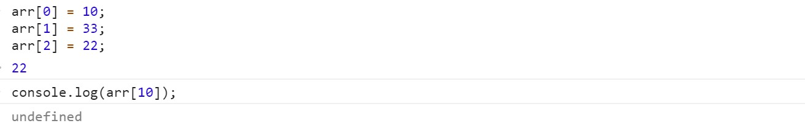

**获取数组的长度**

可以使用length属性来获取数组的长度(元素的个数)。

对于连续的数组，使用length可以获取到数组的长度（元素的个数）。

对于非连续的数组，使用length会获取到数组的最大的索引+1。

尽量不要创建非连续的数组。

 **非连续**

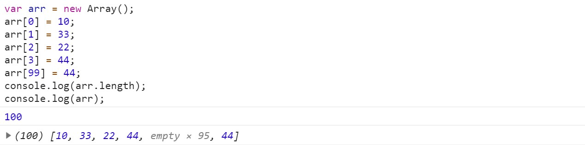


**连续**

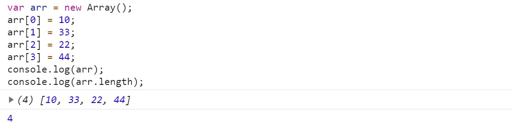

**设置长度**

如果修改的length大于原长度，则多出部分会空出来。

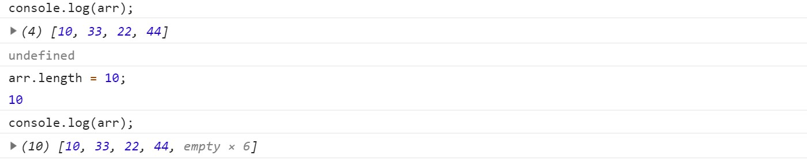

如果修改的length小于原长度，则多出的元素会被删除。

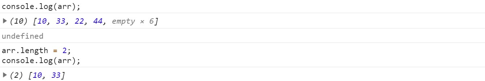

**向数组的最后一个位置添加元素**

数组[数组.length] = 值;

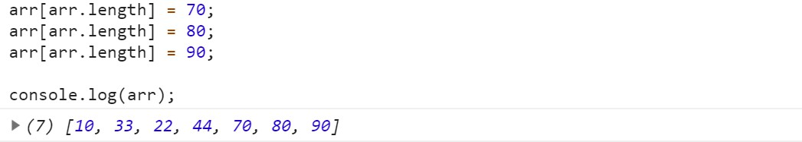

## 字面量

```javascript
var arr = new Array();

arr[0] = 123;
arr.hello = "abc";

console.log(arr.hello); // abc
```

**使用字面量来创建数组**

```javascript
var arr = [];

console.log(arr);
console.log(typeof arr);
```

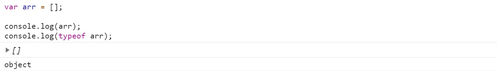

使用字面量创建数组时，可以在创建时就指定数组中的元素。

```javascript
var arr = [1, 2, 3, 4, 5, 10];

console.log(arr);
// [1, 2, 3, 4, 5, 10]
```

使用构造函数创建数组时，也可以同时添加元素，将要添加的元素作为构造函数的参数，元素之间使用,隔开。

```javascript
var arr2 = new Array(10, 20, 30);
console.log(arr2);
// [10, 20, 30]
```

创建一个数组数组中只有一个元素10。

```javascript
arr = [10];
```

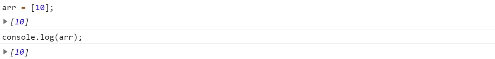

创建一个长度为10的数组。

```javascript
arr2 = new Array(10);
```

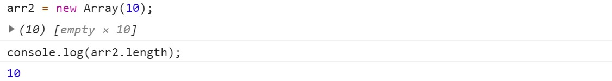

数组中的元素可以是任意的数据类型，可以是对象，也可以是一个函数。

```javascript
arr = ["hello", 1, true, null, undefined];

// 创建一个obj对象
var obj = {name: "孙悟空"};
// 添加到arr数组中
arr[arr.length] = obj;
```

```javascript
arr = [{name: "孙悟空"}, {name: "擎天柱"}, {name: "天明"}];

// 取值
console.log(arr[1].name); // 擎天柱
```

```javascript
arr = [function () {
    alert(1)
}, function () {
    alert(2)
}];

// 调用
arr[0]();
```

数组中也可以放数组，如下这种数组我们称为二维数组。

```javascript
arr = [[1, 2, 3], [3, 4, 5], [5, 6, 7]];

console.log(arr[1]);
console.log(arr[1][1]);
/*
[3, 4, 5]
4
*/

```

## 四个方法

创建一个数组

```javascript
var arr = ["孙悟空", "猪八戒", "沙和尚"];
```

**push**

该方法可以向数组的末尾添加一个或多个元素，并返回数组的新的长度。

可以将要添加的元素作为方法的参数传递，这些元素将会自动添加到数组的末尾。该方法会将数组新的长度作为返

回值返回。

```javascript
arr.push("唐僧", "蜘蛛精", "白骨精", "玉兔精");
```

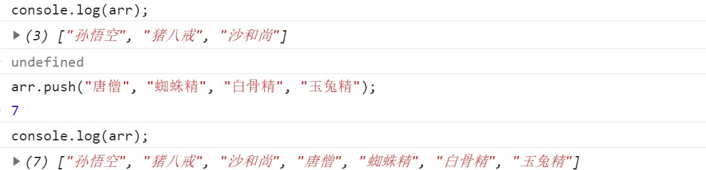

```javascript
arr.push("擎天柱");
```

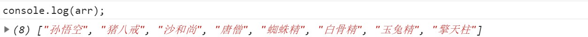

```javascript
var result = arr.push(1);
console.log(arr);
console.log("result = " + result);
```

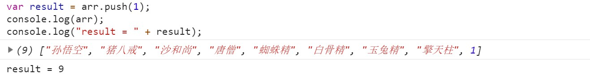


**pop**

该方法可以删除数组的最后一个元素，并将被删除的元素作为返回值返回。

```javascript
console.log(arr); 
result = arr.pop();
console.log(arr);
console.log("result = " + result);
```

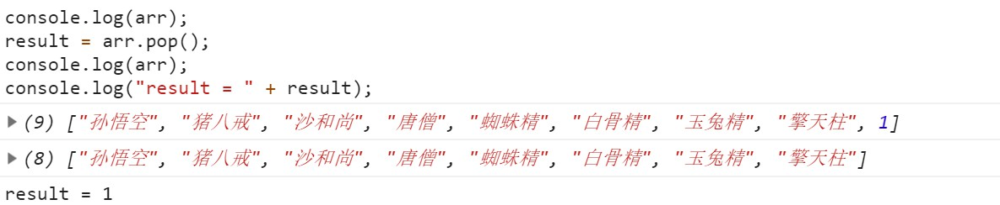

**unshift**

向数组开头添加一个或多个元素，并返回新的数组长度。向前边插入元素以后，其他的元素索引会依次调整。

```javascript
console.log(arr);
var result = arr.unshift("牛魔王", "二郎神");
console.log(arr);
console.log(result);
```

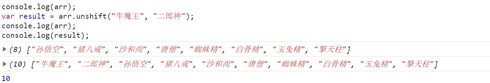

**shift**

可以删除数组的第一个元素，并将被删除的元素作为返回值返回。

```javascript
console.log(arr);
var result = result = arr.shift();
console.log(arr);
console.log(result);
```

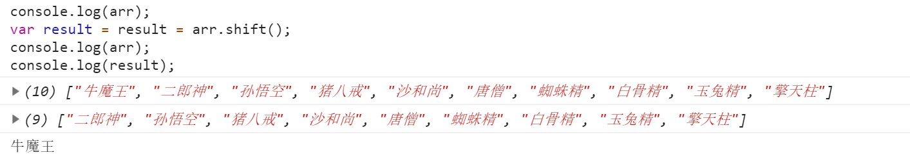

## 遍历

```javascript
// 创建一个数组
var arr = ["孙悟空", "猪八戒", "沙和尚", "唐僧", "白骨精"];

// 所谓的遍历数组，就是将数组中所有的元素都取出来
for (var i = 0; i < arr.length; i++) {
    console.log(arr[i]);
}
```

## 练习

```javascript
// 构造函数
function Person(name, age) {
    this.name = name;
    this.age = age;
}

// 修改Person原型的toString
Person.prototype.toString = function () {
    return "Person[name=" + this.name + ",age=" + this.age + "]";
};

// 创建Person对象
var per = new Person("孙悟空", 18);
var per2 = new Person("猪八戒", 28);
var per3 = new Person("红孩儿", 8);
var per4 = new Person("蜘蛛精", 16);
var per5 = new Person("二郎神", 38);

/*
* 将这些Person对象放入到一个数组中
*/
var perArr = [per, per2, per3, per4, per5];

/*
 * 创建一个函数，可以将perArr中的满18岁的Person提取出来，
 * 然后封装到一个新的数组中并返回
 * arr 形参，要提取信息的数组
 */

function getAdult(arr) {
    // 创建一个新的数组
    var newArr = [];

    // 遍历arr，获取arr中Person对象
    for (var i = 0; i < arr.length; i++) {
        var p = arr[i];
        // 判断Person对象的age是否大于等于18
        if (p.age >= 18) {
            //如果大于等于18，则将这个对象添加到newArr中
            //将对象放入到新数组中
            newArr.push(p);
        }
    }
    // 将新的数组返回
    return newArr;
}

var result = getAdult(perArr);
console.log(result);
// Person[name=孙悟空,age=18],Person[name=猪八戒,age=28],Person[name=二郎神,age=38]
```

## forEach

JS中还为我们提供了一个方法，用来遍历数组，forEach。

forEach方法需要一个函数作为参数，像这种函数，由我们创建但是不由我们调用的，我们称为回调函数。

数组中有几个元素，函数就会执行几次，每次执行时，浏览器会将遍历到的元素以实参的形式传递进来，我们可以

来定义形参，来读取这些内容。

浏览器会在回调函数中传递三个参数：第一个参数，就是当前正在遍历的元素。第二个参数，就是当前正在遍历的

元素的索引。第三个参数，就是正在遍历的数组。

```javascript
// 创建一个数组
var arr = ["孙悟空", "猪八戒", "沙和尚", "唐僧", "白骨精"];

arr.forEach(function (value, index, obj) {
    console.log(value);
});

/*
孙悟空
猪八戒
沙和尚
唐僧
白骨精
*/

arr.forEach(function (value, index, obj) {
    console.log(index);
});
/*
0
1
2
3
4
*/

arr.forEach(function (value, index, obj) {
    console.log(obj == arr);
});
```


```javascript
var arr = ["孙悟空", "猪八戒", "沙和尚", "唐僧", "白骨精"];

arr.forEach(function () {
    console.log("Hello");
});
```


## slice和splice

**slice**

可以用来从数组提取指定元素。

该方法不会改变元素数组，而是将截取到的元素封装到一个新数组中返回。

参数：第一个参数，截取开始的位置的索引，包含开始索引。

第二个参数，截取结束的位置的索引，不包含结束索引。

第二个参数可以省略不写，此时会截取从开始索引往后的所有元素。

索引可以传递一个负值，如果传递一个负值，则从后往前计算，-1表示倒数第一个元素，-2表示倒数第二个元素。

```javascript
var arr = ["孙悟空", "猪八戒", "沙和尚", "唐僧", "白骨精"];

var result = arr.slice(1, 4);
console.log(result);
console.log(arr);
/*
["猪八戒", "沙和尚", "唐僧"]
["孙悟空", "猪八戒", "沙和尚", "唐僧", "白骨精"]
*/
```

```javascript
var result = arr.slice(1);
console.log(result);
console.log(arr);
/*
["猪八戒", "沙和尚", "唐僧", "白骨精"]
["孙悟空", "猪八戒", "沙和尚", "唐僧", "白骨精"]
*/
```

```javascript
var result = arr.slice(1, -2);
console.log(result);
console.log(arr);
/*
["猪八戒", "沙和尚"]
["孙悟空", "猪八戒", "沙和尚", "唐僧", "白骨精"]
*/
```

**splice**

可以用于删除数组中的指定元素。

使用splice方法会影响到原数组，会将指定元素从原数组中删除，并将被删除的元素作为返回值返回。

参数：第一个，表示开始位置的索引。第二个，表示删除的数量。

第三个及以后，可以传递一些新的元素，这些元素将会自动插入到开始位置索引前边。

```javascript
var arr = ["孙悟空", "猪八戒", "沙和尚", "唐僧", "白骨精"];

var result = arr.splice(3, 1, "牛魔王", "铁扇公主", "红孩儿");
console.log(arr);
console.log(result);
/*
["孙悟空", "猪八戒", "沙和尚", "牛魔王", "铁扇公主", "红孩儿", "白骨精"]
["唐僧"]
*/
```

## 数组去重练习

```javascript
// 创建一个数组
var arr = [1, 2, 3, 2, 2, 1, 3, 4, 2, 5];

// 去除数组中重复的数字
// 获取数组中的每一个元素
for (var i = 0; i < arr.length; i++) {
    // console.log(arr[i]);
    // 获取当前元素后的所有元素 //
    for (var j = i + 1; j < arr.length; j++) {
        // console.log("---->"+arr[j]);
        // 判断两个元素的值是否相等
        if (arr[i] == arr[j]) {
            // 如果相等则证明出现了重复的元素，则删除j对应的元素
            arr.splice(j, 1);
            // 当删除了当前j所在的元素以后，后边的元素会自动补位
            // 此时将不会在比较这个元素，我需要再比较一次j所在位置的元素
            // 使j自减
            j--;
        }
    }
}

console.log(arr);
```

## 数组剩余方法

**concat**

可以连接两个或多个数组，并将新的数组返回。该方法不会对原数组产生影响。

```javascript
var arr = ["孙悟空", "猪八戒", "沙和尚"];
var arr2 = ["白骨精", "玉兔精", "蜘蛛精"];
var arr3 = ["二郎神", "太上老君", "玉皇大帝"];

var result = arr.concat(arr2,arr3,"牛魔王","铁扇公主");
console.log(result);
/*
["孙悟空", "猪八戒", "沙和尚", "白骨精", "玉兔精", "蜘蛛精", "二郎神", "太上老君", "玉皇大帝", "牛魔王", "铁扇公主"]
*/
```

**join**

该方法可以将数组转换为一个字符串。

该方法不会对原数组产生影响，而是将转换后的字符串作为结果返回。

在join方法中可以指定一个字符串作为参数，这个字符串将会成为数组中元素的连接符。

如果不指定连接符，则默认使用,作为连接符。

```javascript
var arr = ["孙悟空", "猪八戒", "沙和尚", "唐僧"];

console.log(arr.join("-"));
console.log(arr.join());
console.log(arr.join(" "));
/*
孙悟空-猪八戒-沙和尚-唐僧
孙悟空,猪八戒,沙和尚,唐僧
孙悟空 猪八戒 沙和尚 唐僧
*/
```

**reverse**

该方法用来反转数组，该方法会直接修改原数组。

```javascript
var arr = ["孙悟空", "猪八戒", "沙和尚", "唐僧"];
arr.reverse();
console.log(arr);
/*
["唐僧", "沙和尚", "猪八戒", "孙悟空"]
*/
```

**sort**

可以用来对数组中的元素进行排序，会影响原数组，默认会按照Unicode编码进行排序。

```javascript
var arr = ["b", "d", "e", "a", "c"];
arr.sort();
console.log(arr);
/*
["a", "b", "c", "d", "e"]
*/
```

 即使对于纯数字的数组，使用sort()排序时，默认也会按照Unicode编码来排序。

```javascript
var arr = [3, 1, 11, 13, 6];
arr.sort();
console.log(arr);
/*
[1, 11, 13, 3, 6]
*/
```

**自己指定排序的规则**

在sort方法添加一个回调函数，来指定排序规则。

回调函数中需要定义两个形参，浏览器将会分别使用数组中的元素作为实参去调用回调函数。

使用哪个元素调用不确定，但是肯定的是在数组中a一定在b前边。

浏览器会根据回调函数的返回值来决定元素的顺序：如果返回一个大于0的值，则元素会交换位置。

如果返回一个小于0的值，则元素位置不变。如果返回一个0，则认为两个元素相等，也不交换位置。

```javascript
var arr = [3, 1, 11, 13, 6];
arr.sort(
    function (a, b) {
        console.log("a = " + a);
        console.log("b = " + b);
    }
);
/*
a = 1
b = 3
a = 11
b = 1
a = 13
b = 11
a = 6
b = 13
*/
```


```javascript
var arr = [3, 1, 11, 13, 6];
arr.sort(
    function (a, b) {
        return -1;
    }
);
console.log(arr);
/*
[ 3, 1, 11, 13, 6 ]
*/
```

```javascript
var arr = [3, 1, 11, 13, 6];
arr.sort(
    function (a, b) {
        return 0;
    }
);
console.log(arr);
/*
[ 3, 1, 11, 13, 6 ]
*/
```

```javascript
var arr = [3, 1, 11, 13, 6];
arr.sort(
    function (a, b) {
        return 1;
    }
);
console.log(arr);
/*
[ 6, 13, 11, 1, 3 ]
*/
```

```javascript
var arr = [3, 1, 11, 13, 6];
arr.sort(function (a, b) {

    //前边的大
    /*if(a > b){
        return -1;
    }else if(a < b){
        return 1;
    }else{
        return 0;
    }*/

    //升序排列
    //return a - b;

    //降序排列
    return b - a;

});

console.log(arr);
/*
[ 13, 11, 6, 3, 1 ]
*/
```

## call和apply

这两个方法都是函数对象的方法，需要通过函数对象来调用。当对函数调用call和apply都会调用函数执行。

```javascript
function fun() {
    alert("fun函数");
}

fun();
fun.call();
fun.apply();
```

 在调用call和apply可以将一个对象指定为第一个参数，此时这个对象将会成为函数执行时的this。

call方法可以将实参在对象之后依次传递。apply方法需要将实参封装到一个数组中统一传递。

```javascript
var name = "Window";

var obj = {name: "obj"};
var obj2 = {name: "obj2"};

function fun() {
    alert(this.name);
}

fun();
fun.call(obj);
fun.apply(obj2);
```

```javascript
var obj = {
    name: "obj",
    sayName: function () {
        alert(this.name);
    }
};

var obj2 = {
    name: "obj2"
};

obj.sayName.apply(obj2);
```


```javascript
function fun(a, b) {
    console.log("a = " + a);
    console.log("b = " + b);
}

fun.call(obj, 2, 3);
fun.apply(obj, [2, 3]);
```

**this的情况**

1. 以函数形式调用时，this永远都是window
2. 以方法的形式调用时，this是调用方法的对象
3. 以构造函数的形式调用时，this是新创建的那个对象
4. 使用call和apply调用时，this是指定的那个对象

## arguments

在调用函数时，浏览器每次都会传递进两个隐含的参数。

函数的上下文对象 this  ，封装实参的对象 arguments。

arguments是一个类数组对象，它也可以通过索引来操作数据，也可以获取长度。

在调用函数时，我们所传递的实参都会在arguments中保存。

arguments.length可以用来获取实参的长度。

即使不定义形参，也可以通过arguments来使用实参。

arguments[0] 表示第一个实参，arguments[1] 表示第二个实参 。

callee属性，对应一个函数对象，就是当前正在指向的函数的对象。

```javascript
function fun() {
    console.log(arguments instanceof Array);
    console.log(Array.isArray(arguments));
    console.log(arguments[1]);
    console.log(arguments.length);
    console.log(arguments.callee == fun);
}

fun("hello", "world");
/*
false
false
world
2
true
*/
```

## Date


创建一个Date对象

如果直接使用构造函数创建一个Date对象，则会封装为当前代码执行的时间。

```javascript
var d = new Date();

console.log(d);
```


**创建一个指定的时间对象**

需要在构造函数中传递一个表示时间的字符串作为参数，日期的格式：月份/日/年 时:分:秒

```javascript
var d2 = new Date("2/18/2011 11:10:30");

console.log(d2);
/*
Fri Feb 18 2011 11:10:30 GMT+0800 (中国标准时间)
*/
```

getDate

获取当前日期对象是几日。

```javascript
var date = d2.getDate();
console.log(date); // 18
```

getDay

获取当前日期对象是周几，会返回一个0~6的值，0 表示周日，1 表示周一。

```javascript
var day = d2.getDay();
console.log(day); // 5
```

getMonth

获取当前时间对象的月份，会返回一个0-11的值，0 表示1月，1 表示2月，11 表示12月。

```javascript
var month = d2.getMonth();
console.log(month); // 1
console.log("现在是" + (+month + 1) + "月"); // 现在是2月
```

getFullYear

获取当前日期对象的年份。

```javascript
var year = d2.getFullYear();
console.log(year); // 2011
```

getTime

获取当前日期对象的时间戳。时间戳，指的是从格林威治标准时间的1970年1月1日，0时0分0秒，到当前日期所

花费的毫秒数（1秒 = 1000毫秒）。

```javascript
var time = d2.getTime();
console.log(time); // 1297998630000
```


```javascript
var d3 = new Date("1/1/1970 0:0:0");
time = d3.getTime();
console.log(time); // -28800000 因为系统默认是北京时间，东八区。
```

获取当前的时间戳

```javascript
var start = Date.now();
console.log(start);
```

## Math

Math和其他的对象不同，它不是一个构造函数，它属于一个工具类不用创建对象，它里边封装了数学运算相关的

属性和方法。

**属性**

| 属性 | 描述         |
| ---- | ------------ |
| PI   | 返回圆周率。 |

```javascript
console.log(Math.PI); // 3.141592653589793
```

**方法**

| 方法   | 描述                                      |
| ------ | ----------------------------------------- |
| abs    | 返回数的绝对值。                          |
| ceil   | 对数进行上舍入。小数位只要有值就自动进1。 |
| floor  | 对数进行下舍入。小数部分会被舍掉。        |
| round  | 四舍五入取整。                            |
| random | 可以用来生成一个0~1之间的随机数。         |
| max    | 返回多个数中的最大值。                    |
| min    | 返回多个数中的最小值。                    |
| pow    | 返回x的y次幂。                            |
| sqrt   | 返回数的平方根。                          |

```javascript
console.log(Math.ceil(1.1)); // 2
console.log(Math.ceil(1.0)); // 1
console.log(Math.ceil(1.99)); // 2
```

```javascript
console.log(Math.floor(1.99)); // 1

console.log(Math.round(1.4)); // 1
console.log(Math.round(1.5)); // 2
```

random，可以用来生成一个0~1之间的随机数。

生成一个0~x之间的随机数

```javascript
Math.round(Math.random()*x)
```

生成一个x~y之间的随机数

```javascript
Math.round(Math.random()*(y-x)+x)
```

```javascript
for (var i = 0; i < 10; i++) {
    // 生成0-10之间的随机数
    console.log(Math.round(Math.random() * 10));
    // 生成0-20之间的随机数
    console.log(Math.round(Math.random() * 20));

    // 生成1-10之间的随机数
    console.log(Math.round(Math.random() * 9) + 1);
    // 生成2-10之间的随机数
    console.log(Math.round(Math.random() * 8) + 2);

    //生成1-6之间的随机数
    console.log(Math.round(Math.random() * 5 + 1));
}
```

```javascript
var max = Math.max(10, 45, 30, 100);
var min = Math.min(10, 45, 30, 100);

console.log(min); // 10
console.log(max); // 100
```

```javascript
console.log(Math.pow(12, 3)); //1728
```

```javascript
console.log(Math.sqrt(2)); // 1.4142135623730951
```

## 包装类

在JS中为我们提供了三个包装类，通过这三个包装类可以将基本数据类型的数据转换为对象。

String，可以将基本数据类型字符串转换为String对象。

Number，可以将基本数据类型的数字转换为Number对象。

Boolean，可以将基本数据类型的布尔值转换为Boolean对象。

```javascript
var a = 123;
console.log(typeof a); // number
```

```javascript
var num = new Number(3);
var str = new String("hello");
var bool = new Boolean(true);

num.hello = "abcdef";
console.log(num.hello); // abcdef

var a = 3;
a.hello = "你好";
console.log(a.hello); // undefined
```

```javascript
var num2 = new Number(3);
console.log(num2 == num); // false
```

```javascript
var bool2 = true;
console.log(bool == bool2); // true
```

```javascript
var str2 = new String("hello");
console.log(str === str2); // false
```

```javascript
var b = new Boolean(false);

if (b) {
    alert("我运行了~~~");
}
```

方法和属性只能添加给对象，不能添加给基本数据类型。

当我们对一些基本数据类型的值去调用属性和方法时，浏览器会临时使用包装类将其转换为对象，然后在调用对象

的属性和方法，调用完以后，在将其转换为基本数据类型。

```javascript
var s = 123;
s = s.toString();
console.log(s); // 123
console.log(typeof s); // string
```

```javascript
s.hello = "你好";
console.log(s.hello); // undefined
```

## 字符串的相关方法

在底层字符串是以字符数组的形式保存的。

length属性，可以用来获取字符串的长度。

```javascript
var str = "Hello Atguigu";
console.log(str.length); // 13
console.log(str[1]); // e
```

 charAt，可以返回字符串中指定位置的字符，根据索引获取指定的字符 。

```javascript
var result = str.charAt(4);
console.log(result); // o
```

charCodeAt，获取指定位置字符的字符编码（Unicode编码）。

```javascript
result = str.charCodeAt(0);
console.log(result); // 72
```

String.formCharCode()，可以根据字符编码去获取字符。

```javascript
result = String.fromCharCode(0x2692);
console.log(result); // ⚒
```

concat，可以用来连接两个或多个字符串，作用和+一样。

```javascript
result = str.concat("你好", "再见");
console.log(result); // Hello Atguigu你好再见
```

indexof，该方法可以检索一个字符串中是否含有指定内容。

如果字符串中含有该内容，则会返回其第一次出现的索引。如果没有找到指定的内容，则返回-1。

可以指定一个第二个参数，指定开始查找的位置。

```javascript
result = str.indexOf("e");
console.log(result); // 1
result = str.indexOf("h"); 
console.log(result); // -1
result = str.indexOf("l", 2);
console.log(result); // 2
result = str.indexOf("l", 4);
console.log(result); // -1
```

lastIndexOf，该方法的用法和indexOf一样，不同的是indexOf是从前往后找，而lastIndexOf是从后往前找。

```javascript
result = str.indexOf("u");
console.log(result); // 9
result = str.lastIndexOf("u");
console.log(result); // 12
result = str.lastIndexOf("u", 9);
console.log(result); // 9
```

slice，可以从字符串中截取指定的内容。不会影响原字符串，而是将截取到内容返回。

参数：第一个，开始位置的索引（包括开始位置）。第二个，结束位置的索引（不包括结束位置）。

如果省略第二个参数，则会截取到后边所有的。也可以传递一个负数作为参数，负数的话将会从后边计算。

```javascript
str = "abcdefghijk";

result = str.slice(1, 4);
console.log(result); // bcd
result = str.slice(1, -1);
console.log(result); // bcdefghij
result = str.slice(1);
console.log(result); // bcdefghijk
```

substring，可以用来截取一个字符串，跟slice类似。

参数：第一个：开始截取位置的索引（包括开始位置）。第二个：结束位置的索引（不包括结束位置）。

不同的是这个方法不能接受负值作为参数，如果传递了一个负值，则默认使用0。

如果第二个参数小于第一个，则自动交换，自动调整参数的位置。

```javascript
result = str.substring(1, 3);
console.log(result); // bc
result = str.substring(2, -1);
console.log(result); // ab
result = str.substring(9, 0);
console.log(result); // abcdefghi
```

substr，用来截取字符串。参数：第一个参数，截取开始位置的索引。第二个参数，截取的长度。

```javascript
result = str.substr(3, 2);
console.log(result); // de
result = str.substr(3);
console.log(result); // defghijk
```

split，可以将一个字符串拆分为一个数组。参数：需要一个字符串作为参数，将会根据该字符串去拆分数组。

```javascript
result = str.split("d");
console.log(result); // ["abc", "efghijk"]
result = str.split("");
console.log(result); // ["a", "b", "c", "d", "e", "f", "g", "h", "i", "j", "k"]
```

```javascript
console.log(Array.isArray(result)); // true
console.log(result[0]); // a
console.log(result[2]); // c
```

toUpperCase，将一个字符串转换为大写并返回。

```javascript
str = "abcdefg";
result = str.toUpperCase();
console.log(result); // ABCDEFG
```

toLowerCase，将一个字符串转换为小写并返回。

```javascript
str = "ABCDEFG";
result = str.toLowerCase();
console.log(result); // abcdefg

result2 = "ABCDEFG".toLowerCase();
console.log(result2); // abcdefg
```