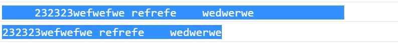

# 前端基础之JavaScript

## RegExp

**创建正则表达式的对象**

语法：var 变量 = new RegExp("正则表达式","匹配模式"); 

使用typeof检查正则对象，会返回object。

在构造函数中可以传递一个匹配模式作为第二个参数，i 忽略大小写 ，g 全局匹配模式。

```javascript
var reg = new RegExp("a");
console.log(reg); // /a/
console.log(typeof reg); // object
```

**test**

使用这个方法可以用来检查一个字符串是否符合正则表达式的规则，如果符合则返回true，否则返回false。

```javascript
// 上面reg这个正则表达式可以来检查一个字符串中是否含有a。
var str = "a";
var result = reg.test(str);
console.log(result); // true
console.log(reg.test("abc")); // true
console.log(reg.test("vabc")); // true
console.log(reg.test("vAbc")); // false
```

```javascript
reg = new RegExp("a", "i");
console.log(reg.test("vAbc")); // true
```

```javascript
reg = new RegExp("ab", "i");
console.log(reg.test("vAbc")); // true
console.log(reg.test("vAcab")); // true
console.log(reg.test("vAc")); // false
```

**使用字面量来创建正则表达式**

语法：var 变量 = /正则表达式/匹配模式;

使用字面量的方式创建更加简单，使用构造函数创建更加灵活。

```javascript
var reg = /a/i; // 相当于 var reg = new RegExp("a","i");
console.log(typeof reg); // object
console.log(reg.test("abc")); // true
```

使用 | 表示或者的意思。

创建一个正则表达式，检查一个字符串中是否有a或b。

```javascript
reg = /a|b/;
console.log(reg.test("vbcd")); // true
console.log(reg.test("vca")); // true
console.log(reg.test("vBcA")); // false
```

[]里的内容也是或的关系，[ab] == a|b。

[a-z] 任意小写字母，[A-Z] 任意大写字母，[A-z] 任意字母，[0-9] 任意数字。

```javascript
reg = /[a-z]/;
console.log(reg.test("0123a")); // true
console.log(reg.test("0123")); // false
console.log(reg.test("0123A")); // false

reg = /[A-z]/;
console.log(reg.test("0123A")); // true
console.log(reg.test("0123c")); // true
console.log(reg.test("0123")); // false
```

检查一个字符串中是否含有 abc 或 adc 或 aec。

```javascript
reg = /a[bde]c/;
console.log(reg.test("aec")); // true
console.log(reg.test("abc")); // true
console.log(reg.test("aeec")); // false
```

| 表达式 | 描述                           |
| ------ | ------------------------------ |
| [^abc] | 查找任何不在方括号之间的字符。 |

```javascript
reg = /[^ab]/;
console.log(reg.test("ab")); // false
console.log(reg.test("ab1")); // true

reg = /[^0-9]/;
console.log(reg.test("0123456789")); // false
console.log(reg.test("0123456789a")); // true
```

## 字符串和正则相关的方法

| 方法    | 描述                                                         |
| ------- | ------------------------------------------------------------ |
| split   | 可以将一个字符串拆分为一个数组。方法中可以传递一个正则表达式作为参数，这样方法将会根据正则表达式去拆分字符串。即使不指定全局匹配，也会全都拆分。 |
| search  | 可以搜索字符串中是否含有指定内容。如果搜索到指定内容，则会返回第一次出现的索引，如果没有搜索到返回-1。方法可以接受一个正则表达式作为参数，然后会根据正则表达式去检索字符串。只会查找第一个，即使设置全局匹配也没用。 |
| match   | 可以根据正则表达式，从一个字符串中将符合条件的内容提取出来。默认情况下match只会找到第一个符合要求的内容，找到以后就停止检索。设置正则表达式为全局匹配模式，这样就会匹配到所有的内容。方法会将匹配到的内容封装到一个数组中返回，即使只查询到一个结果。 |
| replace | 可以将字符串中指定内容替换为新的内容。第一个参数为被替换的内容，可以接受一个正则表达式作为参数。第二个参数是新的内容。默认只会替换第一个。 |

```javascript
var str = "1a2b3c4d5e6f7";
var result = str.split(/[A-z]/);
console.log(result); // ["1", "2", "3", "4", "5", "6", "7"]
console.log(typeof result); // object
console.log(Array.isArray(result)); // true
```

```javascript
str = "hello abc hello aec afc";
result = str.search(/a[bef]c/); // 6
str = "hello aac hello aec afc";
result = str.search(/a[bef]c/); // 16
str = "hello aac hello aac aac";
result = str.search(/a[bef]c/); // -1
str = "hello abc hello aec afc";
result = str.search(/a[bef]c/g); // 6
```

```javascript
str = "1a2a3a4a5e6f7A8B9C";
result = str.match(/[a-z]/);
console.log(result); // a
console.log(typeof result); // object
console.log(Array.isArray(result)); // true

// 可以为一个正则表达式设置多个匹配模式，顺序无所谓。
result = str.match(/[a-z]/ig);
console.log(result); // ["a", "a", "a", "a", "e", "f", "A", "B", "C"]
console.log(typeof result); // object
console.log(Array.isArray(result)); // true
console.log(result[8]); // C
```

```javascript
result = str.replace(/a/, "!");
console.log(result); // 1!2a3a4a5e6f7A8B9C
result = str.replace(/[a-z]/gi , "!");
console.log(result) // 1!2!3!4!5!6!7!8!9!
result = str.replace(/[a-z]/gi, "");
console.log(result); // 123456789
```

## 正则表达式语法

**量词**

通过量词可以设置一个内容出现的次数，量词只对它前边的一个内容起作用。

| 量词  | 描述                  |
| ----- | --------------------- |
| {n}   | 正好出现n次           |
| {n,}  | n次以上               |
| {m,n} | 出现m-n次             |
| +     | 至少一个，相当于{1,}  |
| *     | 0个或多个，相当于{0,} |
| ?     | 0个或1个，相当于{0,1} |

| 正则 | 描述     |
| ---- | -------- |
| ^    | 表示开头 |
| $    | 表示结尾 |

```javascript
var reg = /a{3}/;
console.log(reg.test("aaa")); // true
console.log(reg.test("aa")); // false

reg = /ab{3}/;
console.log(reg.test("abbb")); // true
console.log(reg.test("ababab")); // false

reg = /(ab){3}/;
console.log(reg.test("ababab")); // true
console.log(reg.test("abab")); // false

reg = /ab{3}c/;
console.log(reg.test("abbbc")); // true
console.log(reg.test("abbbbc")); // false

reg = /ab{1,3}c/;
console.log(reg.test("abbbc")); // true
console.log(reg.test("abc")); // true
console.log(reg.test("abbbbc")); // false

reg = /ab{3,}c/;
console.log(reg.test("abbbbc")); // true
console.log(reg.test("abbc")); // false

reg = /ab+c/;
console.log(reg.test("abc")); // true
console.log(reg.test("abbc")); // true
console.log(reg.test("ac")); // false

reg = /ab*c/;
console.log(reg.test("abc")); // true
console.log(reg.test("abbc")); // true
console.log(reg.test("ac")); // true
console.log(reg.test("a c")); // false

reg = /ab?c/;
console.log(reg.test("abc")); // true
console.log(reg.test("ac")); // true
console.log(reg.test("abbc")); // false
console.log(reg.test("a c")); // false
```

```javascript
reg = /^a/; // 匹配开头的a
reg = /a$/; // 匹配结尾的a
reg = /^a$/; // 如果在正则表达式中同时使用^ $则要求字符串必须完全符合正则表达式
console.log(reg.test("a")); // true
console.log(reg.test("aa")); // false
```

创建一个正则表达式，用来检查一个字符串是否是一个合法手机号。

手机号的规则：（11位数字）以1开头，第二位3-9任意数字，三位以后任意数字9个。

```javascript
var phoneStr = "13067890123";

var phoneReg = /^1[3-9][0-9]{9}$/;

console.log(phoneReg.test(phoneStr)); // true
```

**元字符**

元字符是拥有特殊含义的字符

在正则表达式中使用\作为转义字符。使用构造函数时，它的参数是一个字符串，而\也是字符串中转义字符。

```
如果要使用\则需要使用\\来代替
```


| 元字符 | 描述                                      |
| ------ | ----------------------------------------- |
| .      | 表示任意字符，除了换行和行结束符。        |
| \w     | 任意字母、数字、下划线。相当于[A-z0-9_]。 |
| \W     | 跟\w相反 。                               |
| \d     | 任意的数字。相当于[0-9]。                 |
| \D     | 非数字字符，跟\d相反。                    |
| \s     | 空白字符。                                |
| \S     | 非空白字符。                              |
| \b     | 单词边界。                                |
| \B     | 非单词边界。                              |

```javascript
var reg = /./;
console.log(reg.test(".")); // true
console.log(reg.test("a")); // true
console.log(reg.test(" ")); // true
console.log(reg.test("")); // false
console.log(reg.test("\n")); // false
console.log(reg.test("\t")); // true

var reg = /\./;
console.log(reg.test(".")); // true
console.log(reg.test("a")); // false

reg = new RegExp("\\.");
console.log(reg.test(".")); // true
console.log(reg.test("a")); // false

console.log("a\.b"); // a.b
console.log("a\\.b"); // a\.b

reg = new RegExp("\.");
console.log(reg); // /./

reg = new RegExp("\\\\");
console.log(reg); // /\\/
```

 

```javascript
reg = /\w/;
console.log(reg.test("a")); // true
console.log(reg.test("@")); // false

reg = /\W/;
console.log(reg.test("a")); // false
console.log(reg.test("@")); // true

reg = /\d/;
console.log(reg.test("0")); // true
console.log(reg.test("a")); // false

reg = /\D/;
console.log(reg.test("0")); // false
console.log(reg.test("a")); // true
console.log(reg.test("@")); // true

reg = /\s/;
console.log(reg.test(" ")); // true
console.log(reg.test("	")); // true
console.log(reg.test("q")); // false

reg = /\S/;
console.log(reg.test(" ")); // false
console.log(reg.test("	")); // false
console.log(reg.test("q")); // true
console.log(reg.test("#@")); // true

reg = /\bchild\b/;
console.log(reg.test("hello child ")); // true
console.log(reg.test("hello children ")); // false
```

接收一个用户的输入，去除掉字符串中的前后的空格。去除空格就是使用""来替换空格。

```javascript
var str = prompt("请输入你的用户名:");

console.log(str);

// 去除开头的空格
//str = str.replace(/^\s*/, "");
// 去除结尾的空格
//str = str.replace(/\s*$/, "");
// /^\s*|\s*$/g 匹配开头和结尾的空格

str = str.replace(/^\s*|\s*$/g,"");

console.log(str);
```




**电子邮件正则**

```javascript
/*
hello  .nihao          @     abc  .com.cn
任意字母数字下划线    .任意字母数字下划线  @   任意字母数字     .任意字母（2-5位）   .任意字母（2-5位）
\w{3,}  (.\w+)*  @  [A-z0-9]+  (.[A-z]{2,5}){1,2}
*/

var emailReg = /^\w{3,}(\.\w+)*@[A-z0-9]+(\.[A-z]{2,5}){1,2}$/;

var email = "abc.hello@163.com";

console.log(emailReg.test(email));
```

