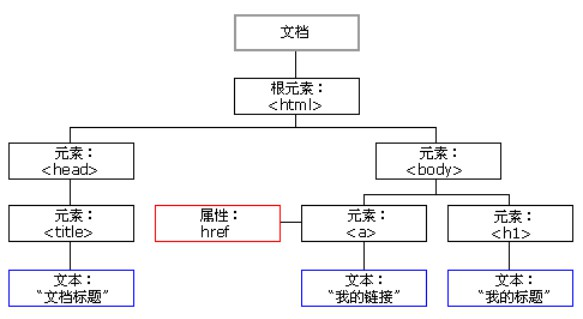
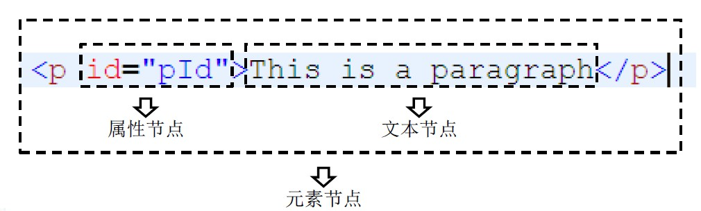
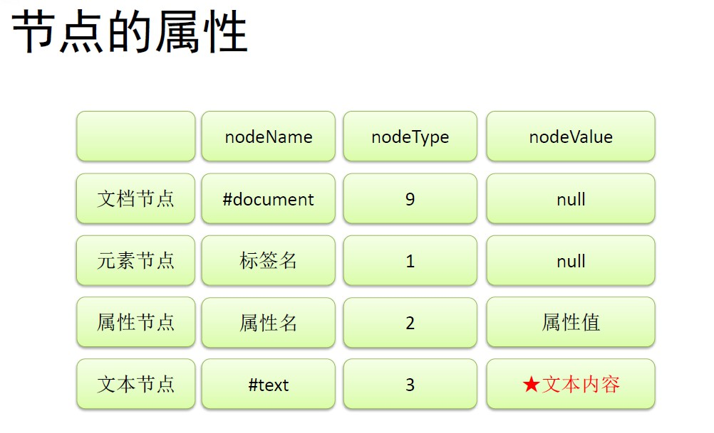
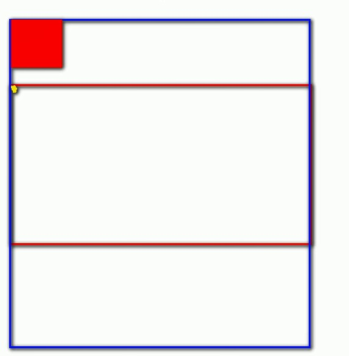
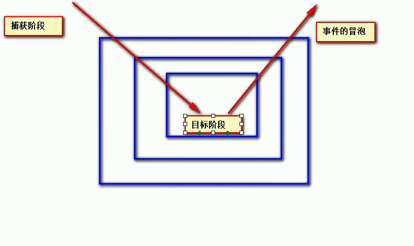

# 前端基础之JavaScript

## DOM简介

**DOM**，全称Document Object Model文档对象模型。JS中通过DOM来对HTML文档进行操作。

**文档**：文档表示的就是整个的HTML网页文档。

**对象**：对象表示将网页中的每一个部分都转换为了一个对象。

**模型**：使用模型来表示对象之间的关系，这样方便我们获取对象。



**节点**

节点是构成HTML文档最基本的单元。

常用节点分为四类：**文档节点**——整个HTML文档，**元素节点**——HTML文档中的HTML标签，**属性节点**——元素

的属性，**文本节点**——HTML标签中的文本内容。

> html标签、属性、文本、注释、整个文档等都是一个节点。





**文档节点**

文档节点document，代表的是整个HTML文档，网页中的所有节点都是它的子节点。

document对象作为window对象的属性存在的，我们不用获取可以**直接使用**。

通过该对象我们可以在整个文档访问内查找节点对象，并可以通过该对象创建各种节点对象。

**元素节点**

HTML中的各种标签都是元素节点，这也是我们最常用的一个节点。

浏览器会将页面中所有的标签都转换为一个元素节点，我们可以通过document的方法来获取元素节点。

```javascript
// 根据id属性值获取一个元素节点对象。
document.getElementById();
```

**文本节点**

文本节点表示的是HTML标签以外的文本内容，任意非HTML的文本都是文本节点。

文本节点一般是作为元素节点的子节点存在的。

获取文本节点时，一般先要获取元素节点，再通过元素节点获取文本节点。

**属性节点**

属性节点表示的是标签中的一个一个的属性，这里要注意的是属性节点并非是元素节点的子节点，而是元素节点的

一部分。可以通过元素节点来获取指定的属性节点。

```
元素节点.getAttributeNode("属性名");
```

```html
<!DOCTYPE html>
<html lang="zh-CN">
<head>
    <meta charset="UTF-8">
    <title>DOM</title>
</head>
<body>
    
<button id="btn">我是一个按钮</button>
<script type="text/javascript">
    
    console.log(document); // [object HTMLDocument]
    
    var btn = document.getElementById("btn"); // 获取到button对象
    
    console.log(btn); // [object HTMLButtonElement]
    
    console.log(btn.innerHTML); // 我是一个按钮
    
    btn.innerHTML = "I'm a button"; // 修改按钮的文字
    
</script>
</body>
</html>
```

## 事件简介

事件，就是文档或浏览器窗口中发生的一些特定的交互瞬间。

JS 与 HTML 之间的交互是通过事件实现的。

```html
<!DOCTYPE html>
<html lang="zh-CN">
	<head>
		<meta charset="UTF-8">
		<title>事件简介</title>
	</head>
	<body>
		<!--
			我们可以在事件对应的属性中设置一些js代码，
			这样当事件被触发时，这些代码将会执行
			这种写法结构和行为耦合，不方便维护，不推荐使用
		-->
		<!--<button id="btn" onmousemove="alert('讨厌，你点我干嘛！');">我是一个按钮</button>-->
		<button id="btn">我是一个按钮</button>
		<script type="text/javascript">
			// 获取按钮对象
			var btn = document.getElementById("btn");
			
			/*
			 * 可以为按钮的对应事件绑定处理函数的形式来响应事件
			 * 	这样当事件被触发时，其对应的函数将会被调用
			 */
			
			// 绑定一个单击事件
			// 像这种为单击事件绑定的函数，我们称为单击响应函数
			btn.onclick = function(){
				alert("不许点我~~~");
			};
			
			
		</script>
	</body>
</html>

```

## 文档的加载

```html
<!DOCTYPE html>
<html>
<head>
    <meta charset="UTF-8">
    <title></title>
    <script type="text/javascript">

        /*
         * 浏览器在加载一个页面时，是按照自上向下的顺序加载的，
         * 读取到一行就运行一行,如果将script标签写到页面的上边，
         * 在代码执行时，页面还没有加载，页面没有加载DOM对象也没有加载，
         * 会导致无法获取到DOM对象
         */


        /*
         * onload事件会在整个页面加载完成之后才触发
         * 为window绑定一个onload事件
         * 该事件对应的响应函数将会在页面加载完成之后执行，
         * 这样可以确保我们的代码执行时所有的DOM对象已经加载完毕了
         * 	
         */
        window.onload = function () {
            // 获取id为btn的按钮
            var btn = document.getElementById("btn");
            // 为按钮绑定一个单击响应函数
            btn.onclick = function () {
                alert("hello");
            };
        };


    </script>
</head>
<body>

<button id="btn">点我一下</button>

<!--<script type="text/javascript">
    
    /*
     * 将js代码编写到页面的下部就是为了，可以在页面加载完毕以后再执行js代码
     */
    // 获取id为btn的按钮
    var btn = document.getElementById("btn");
    // 为按钮绑定一个单击响应函数
    btn.onclick = function(){
        alert("hello");
    };
    
</script>-->

</body>
</html>

```

## DOM查询

**图片切换练习**

```html
<!DOCTYPE html>
<html lang="zh-CN">
<head>
    <meta charset="UTF-8">
    <title>图片切换练习</title>
    <style type="text/css">
        * {
            margin: 0;
            padding: 0;
        }

        .outer {
            margin: 50px auto;
            width: 500px;
            text-align: center;
            padding: 10px;
            background-color: beige;
            /*border: 10px solid beige;*/
        }

        #info,
        #pre,
        #next {
            /*display: inline-block;*/
            font-weight: 200;
            font-size: 16px;
            font-family: MingLiU-ExtB, serif;
        }
    </style>
    <script type="text/javascript">

        window.onload = function () {
            // 点击按钮切换图片

            // 获取两个按钮
            var pre = document.getElementById("pre");
            var next = document.getElementById("next");

            /*
            * 要切换图片就是要修改img标签的src属性
             */

            // 获取图片标签
            var img = document.getElementsByTagName("img")[0];

            // 将图片地址放到数组中
            var imgArr = ["img/1.jpg", "img/2.jpg", "img/3.jpg", "img/4.jpg", "img/5.jpg"];

            // 创建一个变量，来保存当前正在显示的图片的索引
            var index = 0;

            // 获取p标签
            var p = document.getElementById("info");

            // 设置图片上面提示信息
            p.innerHTML = "一共" + imgArr.length + "张图片" + "，" + "现在是第" + (index + 1) + "张图片";

            // /分别为两个按钮绑定单击响应函数

            // 上一张图片
            pre.onclick = function () {
                // 索引自减
                index--;

                // 设置循环
                if (index < 0) {
                    index = imgArr.length - 1;
                }

                img.src = imgArr[index];
                // 当点击按钮以后，重新设置信息
                p.innerHTML = "一共" + imgArr.length + "张图片" + "，" + "现在是第" + (index + 1) + "张图片";
            };

            // 下一张图片
            next.onclick = function () {
                // 索引加一
                index++;
                // 设置循环
                if (index > (imgArr.length - 1)) {
                    index = 0;
                }
                img.src = imgArr[index];
                p.innerHTML = "一共" + imgArr.length + "张图片" + "，" + "现在是第" + (index + 1) + "张图片";
            };
        };

    </script>
</head>
<body>
<div class="outer">

    <p id="info"></p>

    

    <button id="pre">上一张</button>
    <button id="next">下一张</button>
</div>
</body>
</html>
```

**获取元素节点**

```javascript
/*
* 通过document对象调用
*/

// 通过id属性获取一个元素节点对象
getElementById();

// 通过标签名获取一组元素节点对象
getElementsByTagName();

// 通过name属性获取一组元素节点对象
getElementsByName();
```

**获取元素节点的子节点**

```javascript
/*
*通过具体的元素节点调用
*/

/*
* 方法
* 返回当前节点的指定标签名后代节点
*/
getElementsByTagName();

/*
* 属性
* 表示示当前节点的所有子节点
*/
childNodes;

/*
* 属性
* 表示当前节点的第一个子节点
*/
firstChild;

/*
* 属性
* 表示当前节点的最后一个子节点
*/
lastChild;
```

**元素节点的属性**

```javascript
/*
*获取，元素对象.属性名
*/
element.value;
element.id;
element.className;

/*
* 设置，元素对象.属性名=新的值
*/
element.value = "hello";
element.id = "id01";
lement.className = "newClass";
```

**其他属性**

nodeValue：文本节点可以通过nodeValue属性获取和设置文本节点的内容

innerHTML：元素节点通过该属性获取和设置标签内部的html代码


**HTML**


```html
<!DOCTYPE html>
<html lang="zh-CN">
<head>
    <meta charset="UTF-8">
    <title>DOM查询</title>
    <link rel="stylesheet" type="text/css" href="style/css.css"/>
    <script type="text/javascript">

        /*
         * 定义一个函数，专门用来为指定元素绑定单击响应函数
         * 	参数：
         * 		idStr 要绑定单击响应函数的对象的id属性值
         * 		fun 事件的回调函数，当单击元素时，该函数将会被触发
         */
        function myClick(idStr, fun) {
            var btn = document.getElementById(idStr);
            btn.onclick = fun;
        }

        window.onload = function () {

            //为id为btn01的按钮绑定一个单击响应函数
            var btn01 = document.getElementById("btn01");
            btn01.onclick = function () {
                //查找#bj节点
                var bj = document.getElementById("bj");
                //打印bj
                //innerHTML 通过这个属性可以获取到元素内部的html代码
                alert(bj.innerHTML);
            };


            //为id为btn02的按钮绑定一个单击响应函数
            var btn02 = document.getElementById("btn02");
            btn02.onclick = function () {
                //查找所有li节点
                //getElementsByTagName()可以根据标签名来获取一组元素节点对象
                //这个方法会给我们返回一个类数组对象，所有查询到的元素都会封装到对象中
                //即使查询到的元素只有一个，也会封装到数组中返回
                var lis = document.getElementsByTagName("li");

                //打印lis
                //alert(lis.length);

                //变量lis
                for (var i = 0; i < lis.length; i++) {
                    alert(lis[i].innerHTML);
                }
            };


            //为id为btn03的按钮绑定一个单击响应函数
            var btn03 = document.getElementById("btn03");
            btn03.onclick = function () {
                //查找name=gender的所有节点
                var inputs = document.getElementsByName("gender");

                //alert(inputs.length);

                for (var i = 0; i < inputs.length; i++) {
                    /*
                     * innerHTML用于获取元素内部的HTML代码的
                     * 对于自结束标签，这个属性没有意义
                     */
                    //alert(inputs[i].innerHTML);
                    /*
                     * 如果需要读取元素节点属性，
                     * 	直接使用 元素.属性名
                     * 		例子：元素.id 元素.name 元素.value
                     * 		注意：class属性不能采用这种方式，
                     * 			读取class属性时需要使用 元素.className
                     */
                    alert(inputs[i].className);
                }
            };

            // 为id为btn04的按钮绑定一个单击响应函数
            var btn04 = document.getElementById("btn04");
            btn04.onclick = function () {

                // 获取id为city的元素
                var city = document.getElementById("city");

                // 查找#city下所有li节点
                var lis = city.getElementsByTagName("li");

                for (var i = 0; i < lis.length; i++) {
                    alert(lis[i].innerHTML);
                }

            };

            // 为id为btn05的按钮绑定一个单击响应函数
            var btn05 = document.getElementById("btn05");
            btn05.onclick = function () {
                // 获取id为city的节点
                var city = document.getElementById("city");
                // 返回#city的所有子节点
                /*
                 * childNodes属性会获取包括文本节点在内的所有节点
                 * 标签间空白也会当成文本节点
                 * 注意：在IE8及以下的浏览器中，不会将空白文本当成子节点，
                 * 	所以该属性在IE8中会返回4个子元素而其他浏览器是9个
                 */
                var cns = city.childNodes;

                //alert(cns.length);

                /*
                for(var i=0 ; i<cns.length ; i++){
                    alert(cns[i]);
                }
                */

                /*
                 * children属性可以获取当前元素的所有子元素
                 */
                var cns2 = city.children;
                alert(cns2.length);
            };

            // 为id为btn06的按钮绑定一个单击响应函数
            var btn06 = document.getElementById("btn06");
            btn06.onclick = function () {
                // 获取id为phone的元素
                var phone = document.getElementById("phone");
                // 返回#phone的第一个子节点
                // phone.childNodes[0];
                // firstChild可以获取到当前元素的第一个子节点（包括空白文本节点）
                var fir = phone.firstChild;

                // firstElementChild获取当前元素的第一个子元素
                /*
                 * firstElementChild不支持IE8及以下的浏览器，
                 * 如果需要兼容他们尽量不要使用
                 */
                //fir = phone.firstElementChild;

                alert(fir);
            };

            // 为id为btn07的按钮绑定一个单击响应函数
            myClick("btn07", function () {

                // 获取id为bj的节点
                var bj = document.getElementById("bj");

                // 返回#bj的父节点
                var pn = bj.parentNode;

                //alert(pn.innerHTML);

                /*
                 * innerText
                 * 	- 该属性可以获取到元素内部的文本内容
                 * 	- 它和innerHTML类似，不同的是它会自动将html标签去除
                 */
                alert(pn.innerText);


            });


            // 为id为btn08的按钮绑定一个单击响应函数
            myClick("btn08", function () {

                // 获取id为android的元素
                var and = document.getElementById("android");

                // 返回#android的前一个兄弟节点（也可能获取到空白的文本）
                var ps = and.previousSibling;

                //previousElementSibling获取前一个兄弟元素，IE8及以下不支持
                //var pe = and.previousElementSibling;
                //alert(pe);

                alert(ps);

            });

            // 读取#username的value属性值
            myClick("btn09", function () {
                // 获取id为username的元素
                var um = document.getElementById("username");
                // 读取um的value属性值
                // 文本框的value属性值，就是文本框中填写的内容
                alert(um.value);
            });


            //设置#username的value属性值
            myClick("btn10", function () {
                //获取id为username的元素
                var um = document.getElementById("username");

                um.value = "今天天气真不错~~~";
            });


            //返回#bj的文本值
            myClick("btn11", function () {

                //获取id为bj的元素
                var bj = document.getElementById("bj");

                //alert(bj.innerHTML);
                //alert(bj.innerText);

                //获取bj中的文本节点
                /*var fc = bj.firstChild;
                alert(fc.nodeValue);*/

                alert(bj.firstChild.nodeValue);


            });

        };


    </script>
</head>
<body>
<div id="total">
    <div class="inner">
        <p>
            你喜欢哪个城市?
        </p>

        <ul id="city">
            <li id="bj">北京</li>
            <li>上海</li>
            <li>东京</li>
            <li>首尔</li>
        </ul>

        <br>
        <br>

        <p>
            你喜欢哪款单机游戏?
        </p>

        <ul id="game">
            <li id="rl">红警</li>
            <li>实况</li>
            <li>极品飞车</li>
            <li>魔兽</li>
        </ul>

        <br/>
        <br/>

        <p>
            你手机的操作系统是?
        </p>

        <ul id="phone">
            <li>IOS</li>
            <li id="android">Android</li>
            <li>Windows Phone</li>
        </ul>
    </div>

    <div class="inner">
        gender:
        <input class="hello" type="radio" name="gender" value="male"/>
        Male
        <input class="hello" type="radio" name="gender" value="female"/>
        Female
        <br>
        <br>
        name:
        <input type="text" name="name" id="username" value="abcde"/>
    </div>
</div>
<div id="btnList">
    <div>
        <button id="btn01">查找#bj节点</button>
    </div>
    <div>
        <button id="btn02">查找所有li节点</button>
    </div>
    <div>
        <button id="btn03">查找name=gender的所有节点</button>
    </div>
    <div>
        <button id="btn04">查找#city下所有li节点</button>
    </div>
    <div>
        <button id="btn05">返回#city的所有子节点</button>
    </div>
    <div>
        <button id="btn06">返回#phone的第一个子节点</button>
    </div>
    <div>
        <button id="btn07">返回#bj的父节点</button>
    </div>
    <div>
        <button id="btn08">返回#android的前一个兄弟节点</button>
    </div>
    <div>
        <button id="btn09">返回#username的value属性值</button>
    </div>
    <div>
        <button id="btn10">设置#username的value属性值</button>
    </div>
    <div>
        <button id="btn11">返回#bj的文本值</button>
    </div>
</div>
</body>
</html>
```


## 全选练习

```html
<!DOCTYPE html>
<html lang="zh-CN">
<head>
    <meta charset="UTF-8">
    <title>全选练习</title>
    <script type="text/javascript">

        window.onload = function () {


            //获取四个多选框items
            var items = document.getElementsByName("items");
            //获取全选/全不选的多选框
            var checkedAllBox = document.getElementById("checkedAllBox");

            /*
             * 全选按钮
             * 	- 点击按钮以后，四个多选框全都被选中
             */

            //1.#checkedAllBtn
            //为id为checkedAllBtn的按钮绑定一个单击响应函数
            var checkedAllBtn = document.getElementById("checkedAllBtn");
            checkedAllBtn.onclick = function () {


                //遍历items
                for (var i = 0; i < items.length; i++) {

                    //通过多选框的checked属性可以来获取或设置多选框的选中状态
                    //alert(items[i].checked);

                    //设置四个多选框变成选中状态
                    items[i].checked = true;
                }

                //将全选/全不选设置为选中
                checkedAllBox.checked = true;


            };

            /*
             * 全不选按钮
             * 	- 点击按钮以后，四个多选框都变成没选中的状态
             */
            //2.#checkedNoBtn
            //为id为checkedNoBtn的按钮绑定一个单击响应函数
            var checkedNoBtn = document.getElementById("checkedNoBtn");
            checkedNoBtn.onclick = function () {

                for (var i = 0; i < items.length; i++) {
                    //将四个多选框设置为没选中的状态
                    items[i].checked = false;
                }

                //将全选/全不选设置为不选中
                checkedAllBox.checked = false;

            };

            /*
             * 反选按钮
             * 	- 点击按钮以后，选中的变成没选中，没选中的变成选中
             */
            //3.#checkedRevBtn
            var checkedRevBtn = document.getElementById("checkedRevBtn");
            checkedRevBtn.onclick = function () {

                //将checkedAllBox设置为选中状态
                checkedAllBox.checked = true;

                for (var i = 0; i < items.length; i++) {

                    //判断多选框状态
                    /*if(items[i].checked){
                        //证明多选框已选中，则设置为没选中状态
                        items[i].checked = false;
                    }else{
                        //证明多选框没选中，则设置为选中状态
                        items[i].checked = true;
                    }*/

                    items[i].checked = !items[i].checked;

                    //判断四个多选框是否全选
                    //只要有一个没选中则就不是全选
                    if (!items[i].checked) {
                        //一旦进入判断，则证明不是全选状态
                        //将checkedAllBox设置为没选中状态
                        checkedAllBox.checked = false;
                    }
                }

                //在反选时也需要判断四个多选框是否全都选中


            };

            /*
             * 提交按钮：
             * 	- 点击按钮以后，将所有选中的多选框的value属性值弹出
             */
            //4.#sendBtn
            //为sendBtn绑定单击响应函数
            var sendBtn = document.getElementById("sendBtn");
            sendBtn.onclick = function () {
                //遍历items
                for (var i = 0; i < items.length; i++) {
                    //判断多选框是否选中
                    if (items[i].checked) {
                        alert(items[i].value);
                    }
                }
            };


            //5.#checkedAllBox
            /*
             * 全选/全不选 多选框
             * 	- 当它选中时，其余的也选中，当它取消时其余的也取消
             *
             * 在事件的响应函数中，响应函数是给谁绑定的this就是谁
             */
            //为checkedAllBox绑定单击响应函数
            checkedAllBox.onclick = function () {

                //alert(this === checkedAllBox);

                //设置多选框的选中状态
                for (var i = 0; i < items.length; i++) {
                    items[i].checked = this.checked;
                }

            };

            //6.items
            /*
             * 如果四个多选框全都选中，则checkedAllBox也应该选中
             * 如果四个多选框没都选中，则checkedAllBox也不应该选中
             */

            //为四个多选框分别绑定点击响应函数
            for (var i = 0; i < items.length; i++) {
                items[i].onclick = function () {

                    //将checkedAllBox设置为选中状态
                    checkedAllBox.checked = true;

                    for (var j = 0; j < items.length; j++) {
                        //判断四个多选框是否全选
                        //只要有一个没选中则就不是全选
                        if (!items[j].checked) {
                            //一旦进入判断，则证明不是全选状态
                            //将checkedAllBox设置为没选中状态
                            checkedAllBox.checked = false;
                            //一旦进入判断，则已经得出结果，不用再继续执行循环
                            break;
                        }

                    }


                };
            }


        };

    </script>
</head>
<body>

<form method="post" action="">
    你爱好的运动是？<input type="checkbox" id="checkedAllBox"/>全选/全不选

    <br/>
    <input type="checkbox" name="items" value="足球"/>足球
    <input type="checkbox" name="items" value="篮球"/>篮球
    <input type="checkbox" name="items" value="羽毛球"/>羽毛球
    <input type="checkbox" name="items" value="乒乓球"/>乒乓球
    <br/>
    <input type="button" id="checkedAllBtn" value="全　选"/>
    <input type="button" id="checkedNoBtn" value="全不选"/>
    <input type="button" id="checkedRevBtn" value="反　选"/>
    <input type="button" id="sendBtn" value="提　交"/>
</form>
</body>
</html>
```

## **使用CSS选择器进行查询**


```javascript
querySelector();
querySelectorAll();
```

这两个方法都是用document对象来调用，两个方法使用相同，都是传递一个选择器字符串作为参数，方法会自动

根据选择器字符串去网页中查找元素。

不同的地方是querySelector()只会返回找到的第一个元素，而querySelectorAll()会返回所有符合条件的元素。

```html
<!DOCTYPE html>
<html>
<head>
    <meta charset="UTF-8">
    <title></title>
    <script type="text/javascript">

        window.onload = function () {

            //获取body标签
            //var body = document.getElementsByTagName("body")[0];

            /*
             * 在document中有一个属性body，它保存的是body的引用
             */
            var body = document.body;

            /*
             * document.documentElement保存的是html根标签
             */
            var html = document.documentElement;

            //console.log(html);

            /*
             * document.all代表页面中所有的元素
             */
            var all = document.all;

            //console.log(all.length);

            /*for(var i=0 ; i<all.length ; i++){
                console.log(all[i]);
            }*/

            //all = document.getElementsByTagName("*");
            //console.log(all.length);


            /*
             * 根据元素的class属性值查询一组元素节点对象
             * getElementsByClassName()可以根据class属性值获取一组元素节点对象，
             * 但是该方法不支持IE8及以下的浏览器
             */
            //var box1 = document.getElementsByClassName("box1");
            //console.log(box1.length);

            //获取页面中的所有的div
            //var divs = document.getElementsByTagName("div");

            //获取class为box1中的所有的div
            //.box1 div
            /*
             * document.querySelector()
             * 	- 需要一个选择器的字符串作为参数，可以根据一个CSS选择器来查询一个元素节点对象
             * 	- 虽然IE8中没有getElementsByClassName()但是可以使用querySelector()代替
             * 	- 使用该方法总会返回唯一的一个元素，如果满足条件的元素有多个，那么它只会返回第一个
             */
            var div = document.querySelector(".box1 div");

            var box1 = document.querySelector(".box1");

            //console.log(div.innerHTML);
            //console.log(box1.innerHTML);

            /*
             * document.querySelectorAll()
             * 	- 该方法和querySelector()用法类似，不同的是它会将符合条件的元素封装到一个数组中返回
             * 	- 即使符合条件的元素只有一个，它也会返回数组
             */
            box1 = document.querySelectorAll(".box1");
            box1 = document.querySelectorAll("#box2");
            console.log(box1);

        };


    </script>
</head>
<body>
<div id="box2"></div>
<div class="box1">
    我是第一个box1
    <div>我是box1中的div</div>
</div>
<div class="box1">
    <div>我是box1中的div</div>
</div>
<div class="box1">
    <div>我是box1中的div</div>
</div>
<div class="box1">
    <div>我是box1中的div</div>
</div>

<div></div>
</body>
</html>
```

## 增删改

```javascript
创建节点
document.createElement(标签名)

删除节点
父节点.removeChild(子节点)

替换节点
父节点.replaceChild(新节点 , 旧节点)

插入节点
父节点.appendChild(子节点)
父节点.insertBefore(新节点 , 旧节点)
```

```html
<!DOCTYPE html>
<html lang="zh-CN">
	<head>
		<meta charset="UTF-8">
		<title>增删改</title>
		<link rel="stylesheet" type="text/css" href="style/css.css" />
		<script type="text/javascript">
		
			window.onload = function() {
				
				//创建一个"广州"节点,添加到#city下
				myClick("btn01",function(){
					//创建广州节点 <li>广州</li>
					//创建li元素节点
					/*
					 * document.createElement()
					 * 	可以用于创建一个元素节点对象，
					 * 	它需要一个标签名作为参数，将会根据该标签名创建元素节点对象，
					 * 	并将创建好的对象作为返回值返回
					 */
					var li = document.createElement("li");
					
					//创建广州文本节点
					/*
					 * document.createTextNode()
					 * 	可以用来创建一个文本节点对象
					 *  需要一个文本内容作为参数，将会根据该内容创建文本节点，并将新的节点返回
					 */
					var gzText = document.createTextNode("广州");
					
					//将gzText设置li的子节点
					/*
					 * appendChild()
					 * 	 - 向一个父节点中添加一个新的子节点
					 * 	 - 用法：父节点.appendChild(子节点);
					 */
					li.appendChild(gzText);
					
					//获取id为city的节点
					var city = document.getElementById("city");
					
					//将广州添加到city下
					city.appendChild(li);
					
					
				});
				
				//将"广州"节点插入到#bj前面
				myClick("btn02",function(){
					//创建一个广州
					var li = document.createElement("li");
					var gzText = document.createTextNode("广州");
					li.appendChild(gzText);
					
					//获取id为bj的节点
					var bj = document.getElementById("bj");
					
					//获取city
					var city = document.getElementById("city");
					
					/*
					 * insertBefore()
					 * 	- 可以在指定的子节点前插入新的子节点
					 *  - 语法：
					 * 		父节点.insertBefore(新节点,旧节点);
					 */
					city.insertBefore(li , bj);
					
					
				});
				
				
				//使用"广州"节点替换#bj节点
				myClick("btn03",function(){
					//创建一个广州
					var li = document.createElement("li");
					var gzText = document.createTextNode("广州");
					li.appendChild(gzText);
					
					//获取id为bj的节点
					var bj = document.getElementById("bj");
					
					//获取city
					var city = document.getElementById("city");
					
					/*
					 * replaceChild()
					 * 	- 可以使用指定的子节点替换已有的子节点
					 * 	- 语法：父节点.replaceChild(新节点,旧节点);
					 */
					city.replaceChild(li , bj);
					
					
				});
				
				//删除#bj节点
				myClick("btn04",function(){
					//获取id为bj的节点
					var bj = document.getElementById("bj");
					//获取city
					var city = document.getElementById("city");
					
					/*
					 * removeChild()
					 * 	- 可以删除一个子节点
					 * 	- 语法：父节点.removeChild(子节点);
					 * 		
					 * 		子节点.parentNode.removeChild(子节点);
					 */
					//city.removeChild(bj);
					
					bj.parentNode.removeChild(bj);
				});
				
				
				//读取#city内的HTML代码
				myClick("btn05",function(){
					//获取city
					var city = document.getElementById("city");
					
					alert(city.innerHTML);
				});
				
				//设置#bj内的HTML代码
				myClick("btn06" , function(){
					//获取bj
					var bj = document.getElementById("bj");
					bj.innerHTML = "昌平";
				});
				
				myClick("btn07",function(){
					
					//向city中添加广州
					var city = document.getElementById("city");
					
					/*
					 * 使用innerHTML也可以完成DOM的增删改的相关操作
					 * 一般我们会两种方式结合使用
					 */
					//city.innerHTML += "<li>广州</li>";
					
					//创建一个li
					var li = document.createElement("li");
					//向li中设置文本
					li.innerHTML = "广州";
					//将li添加到city中
					city.appendChild(li);
					
				});
				
				
			};
			
			function myClick(idStr, fun) {
				var btn = document.getElementById(idStr);
				btn.onclick = fun;
			}
			
		
		</script>
		
	</head>
	<body>
		<div id="total">
			<div class="inner">
				<p>
					你喜欢哪个城市?
				</p>

				<ul id="city">
					<li id="bj">北京</li>
					<li>上海</li>
					<li>东京</li>
					<li>首尔</li>
				</ul>
				
			</div>
		</div>
		<div id="btnList">
			<div><button id="btn01">创建一个"广州"节点,添加到#city下</button></div>
			<div><button id="btn02">将"广州"节点插入到#bj前面</button></div>
			<div><button id="btn03">使用"广州"节点替换#bj节点</button></div>
			<div><button id="btn04">删除#bj节点</button></div>
			<div><button id="btn05">读取#city内的HTML代码</button></div>
			<div><button id="btn06">设置#bj内的HTML代码</button></div>
			<div><button id="btn07">创建一个"广州"节点,添加到#city下</button></div>
		</div>
	</body>
</html>
```

## 添加删除记录

```html
<!DOCTYPE html>
<html lang="zh-CN">
<head>
    <meta charset="UTF-8">
    <title>添加删除记录</title>
    <link rel="stylesheet" type="text/css" href="ex_2_style/css.css"/>
    <script type="text/javascript">

        /*
         * 删除tr的响应函数
         */
        function delA() {

            //点击超链接以后需要删除超链接所在的那行
            //这里我们点击哪个超链接，this就是谁
            //获取当前tr
            var tr = this.parentNode.parentNode;

            //获取要删除的员工的名字
            //var name = tr.getElementsByTagName("td")[0].innerHTML;
            var name = tr.children[0].innerHTML;

            //删除之前弹出一个提示框
            /*
             * confirm()用于弹出一个带有确认和取消按钮的提示框
             * 	需要一个字符串作为参数，该字符串将会作为提示文字显示出来
             * 如果用户点击确认则会返回true，如果点击取消则返回false
             */
            var flag = confirm("确认删除" + name + "吗?");

            //如果用户点击确认
            if (flag) {
                //删除tr
                tr.parentNode.removeChild(tr);
            }

            /*
             * 点击超链接以后，超链接会跳转页面，这个是超链接的默认行为，
             * 	但是此时我们不希望出现默认行为，可以通过在响应函数的最后return false来取消默认行为
             */
            return false;
        }

        window.onload = function () {

            /*
             * 点击超链接以后，删除一个员工的信息
             */

            //获取所有超链接
            var allA = document.getElementsByTagName("a");

            //为每个超链接都绑定一个单击响应函数
            for (var i = 0; i < allA.length; i++) {
                allA[i].onclick = delA;
            }

            /*
             * 添加员工的功能
             * 	- 点击按钮以后，将员工的信息添加到表格中
             */

            //为提交按钮绑定一个单击响应函数
            var addEmpButton = document.getElementById("addEmpButton");
            addEmpButton.onclick = function () {

                //获取用户添加的员工信息
                //获取员工的名字
                var name = document.getElementById("empName").value;
                //获取员工的email和salary
                var email = document.getElementById("email").value;
                var salary = document.getElementById("salary").value;

                //alert(name+","+email+","+salary);
                /*
                 *  <tr>
                        <td>Tom</td>
                        <td>tom@tom.com</td>
                        <td>5000</td>
                        <td><a href="javascript:;">Delete</a></td>
                    </tr>
                    需要将获取到的信息保存到tr中
                 */

                //创建一个tr
                var tr = document.createElement("tr");

                //设置tr中的内容
                tr.innerHTML = "<td>" + name + "</td>" +
                    "<td>" + email + "</td>" +
                    "<td>" + salary + "</td>" +
                    "<td><a href='javascript:;'>Delete</a></td>";

                //获取刚刚添加的a元素，并为其绑定单击响应函数
                var a = tr.getElementsByTagName("a")[0];
                a.onclick = delA;

                //获取table
                var employeeTable = document.getElementById("employeeTable");
                //获取employeeTable中的tbody
                var tbody = employeeTable.getElementsByTagName("tbody")[0];
                //将tr添加到tbodye中
                tbody.appendChild(tr);
                /*tbody.innerHTML += "<tr>"+

                "<td>"+name+"</td>"+
                                "<td>"+email+"</td>"+
                                "<td>"+salary+"</td>"+
                                "<td><a href='javascript:;'>Delete</a></td>"

                +"</tr>";*/

            };

        };
    </script>
</head>

<body>

<table id="employeeTable">
    <tr>
        <th>Name</th>
        <th>Email</th>
        <th>Salary</th>
        <th>&nbsp;</th>
    </tr>
    <tr>
        <td>Tom</td>
        <td>tom@tom.com</td>
        <td>5000</td>
        <td>
            <a href="javascript:;">Delete</a>
        </td>
    </tr>
    <tr>
        <td>Jerry</td>
        <td>jerry@sohu.com</td>
        <td>8000</td>
        <td>
            <a href="deleteEmp?id=002">Delete</a>
        </td>
    </tr>
    <tr>
        <td>Bob</td>
        <td>bob@tom.com</td>
        <td>10000</td>
        <td>
            <a href="deleteEmp?id=003">Delete</a>
        </td>
    </tr>
</table>

<div id="formDiv">

    <h4>添加新员工</h4>

    <table>
        <tr>
            <td class="word">name:</td>
            <td class="inp">
                <input type="text" name="empName" id="empName"/>
            </td>
        </tr>
        <tr>
            <td class="word">email:</td>
            <td class="inp">
                <input type="text" name="email" id="email"/>
            </td>
        </tr>
        <tr>
            <td class="word">salary:</td>
            <td class="inp">
                <input type="text" name="salary" id="salary"/>
            </td>
        </tr>
        <tr>
            <td colspan="2" align="center">
                <button id="addEmpButton">
                    Submit
                </button>
            </td>
        </tr>
    </table>

</div>

</body>

</html>
```

这种方式帮助理解DOM，但是较为麻烦，了解即可。

```javascript
//创建一个tr
var tr = document.createElement("tr");

//创建四个td
var nameTd = document.createElement("td");
var emailTd = document.createElement("td");
var salaryTd = document.createElement("td");
var aTd = document.createElement("td");

//创建一个a元素
var a = document.createElement("a");

//创建文本节点
var nameText = document.createTextNode(name);
var emailText = document.createTextNode(email);
var salaryText = document.createTextNode(salary);
var delText = document.createTextNode("Delete");

//将文本添加到td中
nameTd.appendChild(nameText);
emailTd.appendChild(emailText);
salaryTd.appendChild(salaryText);

//向a中添加文本
a.appendChild(delText);
//将a添加到td中
aTd.appendChild(a);

//将td添加到tr中
tr.appendChild(nameTd);
tr.appendChild(emailTd);
tr.appendChild(salaryTd);
tr.appendChild(aTd);

//向a中添加href属性
a.href = "javascript:;";

//为新添加的a再绑定一次单击响应函数
a.onclick = delA;

//获取table
var employeeTable = document.getElementById("employeeTable");
//获取employeeTable中的tbody
var tbody = employeeTable.getElementsByTagName("tbody")[0];
//将tr添加到tbodye中
tbody.appendChild(tr);
```

**a的索引问题**

```javascript
<script type="text/javascript">

window.onload = function () {

/*
* 点击超链接以后，删除一个员工的信息
*/

//获取所有超链接
var allA = document.getElementsByTagName("a");

//为每个超链接都绑定一个单击响应函数
for (var i = 0; i < allA.length; i++) {
/*
* for循环会在页面加载完成之后立即执行，
* 而响应函数会在超链接被点击时才执行
* 当响应函数执行时，for循环早已执行完毕
*/

alert("for循环正在执行" + i);

allA[i].onclick = function () {

alert("响应函数正在执行" + i);

//alert(allA[i]);

return false;
};

}

};


</script>
```

## 操作内联样式

```html
<!DOCTYPE html>
<html lang="zh-CN">
<head>
    <meta charset="UTF-8">
    <title>使用DOM操作CSS</title>
    <style type="text/css">

        #box1 {
            width: 100px;
            height: 100px;
            background-color: red;
        }

    </style>

    <script type="text/javascript">

        window.onload = function () {

            /*
             * 点击按钮以后，修改box1的大小
             */
            //获取box1
            var box1 = document.getElementById("box1");
            //为按钮绑定单击响应函数
            var btn01 = document.getElementById("btn01");
            btn01.onclick = function () {

                //修改box1的宽度
                /*
                 * 通过JS修改元素的样式：
                 * 语法：元素.style.样式名 = 样式值
                 *
                 * 注意：如果CSS的样式名中含有-，
                 * 		这种名称在JS中是不合法的比如background-color
                 * 		需要将这种样式名修改为驼峰命名法，
                 * 		去掉-，然后将-后的首字母大写
                 *
                 * 我们通过style属性设置的样式都是内联样式，
                 * 而内联样式有较高的优先级，所以通过JS修改的样式往往会立即显示
                 *
                 * 但是如果在样式中写了!important，则此时样式会有最高的优先级，
                 * 即使通过JS也不能覆盖该样式，此时将会导致JS修改样式失效
                 * 所以尽量不要为样式添加!important
                 *
                 *
                 *
                 */
                box1.style.width = "300px";
                box1.style.height = "300px";
                box1.style.backgroundColor = "yellow";

            };


            //点击按钮2以后，读取元素的样式
            var btn02 = document.getElementById("btn02");
            btn02.onclick = function () {
                //读取box1的样式
                /*
                 * 	语法：元素.style.样式名
                 *
                 * 通过style属性设置和读取的都是内联样式
                 * 无法读取样式表中的样式
                 */
                //alert(box1.style.height);
                alert(box1.style.width);
            };
        };


    </script>
</head>
<body>

<button id="btn01">点我一下</button>
<button id="btn02">点我一下2</button>

<br/><br/>

<div id="box1"></div>

</body>
</html>
```

## 读取元素的样式

```html
<!DOCTYPE html>
<html lang="zh-CN">
<head>
    <meta charset="UTF-8">
    <title>读取元素的样式</title>
    <style type="text/css">

        #box1 {
            width: 100px;
            height: 100px;
            background-color: yellow;
        }

    </style>

    <script type="text/javascript">

        window.onload = function () {

            //点击按钮以后读取box1的样式
            var box1 = document.getElementById("box1");
            var btn01 = document.getElementById("btn01");
            btn01.onclick = function () {
                //读取box1的宽度
                //alert(box1.style.width);

                /*
                 * 获取元素的当前显示的样式
                 * 语法：元素.currentStyle.样式名
                 * 它可以用来读取当前元素正在显示的样式
                 * 如果当前元素没有设置该样式，则获取它的默认值
                 *
                 * currentStyle只有IE浏览器支持，其他的浏览器都不支持
                 */

                //alert(box1.currentStyle.width);
                //alert(box1.currentStyle.backgroundColor);

                /*
                 * 在其他浏览器中可以使用getComputedStyle()这个方法来获取元素当前的样式
                 * 这个方法是window的方法，可以直接使用
                 *
                 * 需要两个参数
                 * 		第一个：要获取样式的元素
                 * 		第二个：可以传递一个伪元素，一般都传null
                 *
                 * 该方法会返回一个对象，对象中封装了当前元素对应的样式
                 * 可以通过对象.样式名来读取样式
                 * 如果获取的样式没有设置，则会获取到真实的值，而不是默认值
                 * 比如：没有设置width，它不会获取到auto，而是一个长度
                 *
                 * 但是该方法不支持IE8及以下的浏览器
                 *
                 * 通过currentStyle和getComputedStyle()读取到的样式都是只读的，
                 * 不能修改，如果要修改必须通过style属性
                 */

                /*alert(getComputedStyle(box1,null).width);*/

                //正常浏览器的方式
                //alert(getComputedStyle(box1,null).backgroundColor);

                //IE8的方式
                //alert(box1.currentStyle.backgroundColor);

                //alert(getStyle(box1,"width"));

                var w = getStyle(box1, "width");
                alert(w);


            };

        };

        /*
         * 定义一个函数，用来获取指定元素的当前的样式
         * 参数：
         * 		obj 要获取样式的元素
         * 	    name 要获取的样式名
         */

        function getStyle(obj, name) {
            // 如果浏览器支持getComputedStyle方法
            if (window.getComputedStyle) {
                //正常浏览器的方式，具有getComputedStyle()方法
                return getComputedStyle(obj, null)[name];
            } else {
                //IE8的方式，没有getComputedStyle()方法
                return obj.currentStyle[name];
            }

            // 三元运算
            //return window.getComputedStyle ? getComputedStyle(obj, null)[name] : obj.currentStyle[name];

        }


    </script>
</head>
<body>

    <button id="btn01">点我一下</button>

    <br/><br/>

    <div id="box1"></div>

</body>
</html>
```

## 其他样式相关的属性

```html
<!DOCTYPE html>
<html lang="zh-CN">
	<head>
		<meta charset="UTF-8">
		<title>其他样式相关的属性</title>
		<style type="text/css">

			#box1{
				width: 100px;
				height: 100px;
				background-color: red;
				padding: 10px;
				border: 10px solid yellow;
			}


			#box2{
				padding: 100px;
				background-color: #bfa;
			}

			#box4{
				width: 200px;
				height: 300px;
				/*background-color: #bfa;*/
				overflow: auto;
			}

			#box5{
				width: 450px;
				height: 600px;
				background-color: yellow;
			}

		</style>
		<script type="text/javascript">

			window.onload = function(){
				var box1 = document.getElementById("box1");
				var btn01 = document.getElementById("btn01");
				var box4 = document.getElementById("box4");

				btn01.onclick = function(){
					/*
					 * clientWidth
					 * clientHeight
					 * 	- 这两个属性可以获取元素的可见宽度和高度
					 * 	- 这些属性都是不带px的，返回都是一个数字，可以直接进行计算
					 * 	- 会获取元素宽度和高度，包括内容区和内边距
					 *  - 这些属性都是只读的，不能修改
					 */
					//alert(box1.clientWidth);
					//alert(box1.clientHeight);

					/*
					 * offsetWidth
					 * offsetHeight
					 * 	- 获取元素的整个的宽度和高度，包括内容区、内边距和边框
					 */
					//alert(box1.offsetWidth);

					/*
					 * offsetParent
					 *  - 会获取到离当前元素最近的开启了定位的祖先元素
					 * 	- 如果所有的祖先元素都没有开启定位，则返回body
					 */
					var op = box1.offsetParent;

					//alert(op.id);

					/*
					 * offsetLeft
					 * 	- 当前元素相对于其定位祖先元素的水平偏移量
					 * offsetTop
					 * 	- 当前元素相对于其定位祖先元素的垂直偏移量
					 */

                    //alert(box1.offsetLeft);
                    //alert(box1.offsetTop);

					/*
					 * scrollWidth
					 * scrollHeight
					 * 	- 可以获取元素整个滚动区域的宽度和高度
					 */

					// 盒子的宽高减去滚动条
					//alert(box4.clientHeight);
					//alert(box4.clientWidth);

					//alert(box4.scrollWidth);
                     //alert(box4.scrollHeight);

					/*
					 * scrollLeft
					 * 	- 可以获取水平滚动条滚动的距离
					 * scrollTop
					 * 	- 可以获取垂直滚动条滚动的距离
					 */
					//alert(box4.scrollLeft);
					//alert(box4.scrollTop);

					//alert(box4.clientHeight); // 283

					//当满足scrollHeight - scrollTop == clientHeight
					//说明垂直滚动条滚动到底了

					//当满足scrollWidth - scrollLeft == clientWidth
					//说明水平滚动条滚动到底

					//alert(box4.scrollHeight - box4.scrollTop); // 283
					//alert(box4.scrollWidth - box4.scrollLeft); // 183


				};

			};


		</script>
	</head>
	<body id="body">
		<button id="btn01">点我一下</button>
		<br /><br />

		 <div id="box4">
		 	<div id="box5"></div>
		 </div>


		<br /><br />

		<div id="box3">
			<div id="box2" style="position: relative;">
				<div id="box1"></div>
			</div>
		</div>


	</body>
</html>
```

## 滚动条练习

```html
<!DOCTYPE html>
<html lang="zh-CN">
	<head>
		<meta charset="UTF-8">
		<title>滚动条练习</title>
		<style type="text/css">
			
			#info{
				width: 300px;
				height: 500px;
				background-color: #bfa;
				overflow: auto;
			}
			
		</style>
		<script type="text/javascript">
			window.onload = function(){
				
				/*
				 * 当垂直滚动条滚动到底时使表单项可用
				 * onscroll
				 * 	- 该事件会在元素的滚动条滚动时触发
				 */
				
				//获取id为info的p元素
				var info = document.getElementById("info");
				//获取两个表单项
				var inputs = document.getElementsByTagName("input");
				//为info绑定一个滚动条滚动的事件
				info.onscroll = function(){
					
					//检查垂直滚动条是否滚动到底
					if(info.scrollHeight - info.scrollTop == info.clientHeight){
						//滚动条滚动到底，使表单项可用
						/*
						 * disabled属性可以设置一个元素是否禁用，
						 * 如果设置为true，则元素禁用
						 * 如果设置为false，则元素可用
						 */
						inputs[0].disabled = false;
						inputs[1].disabled = false;
					}
					
				};
				
			};
			
			
		</script>
	</head>
	<body>
		<h3>欢迎亲爱的用户注册</h3>
		<p id="info">
			亲爱的用户，请仔细阅读以下协议，如果你不仔细阅读你就别注册
			为了节省空间，余下省略...
		</p>
		 <!--如果为表单项添加disabled="disabled" 则表单项将变成不可用的状态 -->
		<input type="checkbox" disabled="disabled" />我已仔细阅读协议，一定遵守
		<input type="submit" value="注册" disabled="disabled" />
	</body>
</html>
```

## 事件对象

```html
<!DOCTYPE html>
<html lang="zh-CN">
<head>
<meta charset="UTF-8">
<title>事件对象</title>
<style type="text/css">

	#areaDiv {
		border: 1px solid black;
		width: 300px;
		height: 50px;
		margin-bottom: 10px;
	}
	
	#showMsg {
		border: 1px solid black;
		width: 300px;
		height: 20px;
	}

</style>
<script type="text/javascript">

	window.onload = function(){
		/*
		 * 当鼠标在areaDiv中移动时，在showMsg中来显示鼠标的坐标
		 */
		//获取两个div
		var areaDiv = document.getElementById("areaDiv");
		var showMsg = document.getElementById("showMsg");
		
		/*
		 * onmousemove
		 * 	- 该事件将会在鼠标在元素中移动时被触发
		 * 
		 * 事件对象
		 * 	- 当事件的响应函数被触发时，浏览器每次都会将一个事件对象作为实参传递进响应函数,
		 * 	- 在事件对象中封装了当前事件相关的一切信息，比如：鼠标的坐标  键盘哪个按键被按下 
		 */
		areaDiv.onmousemove = function(event){
			
			/*
			 * 在IE8中，响应函数被触发时，浏览器不会传递事件对象，
			 * 在IE8及以下的浏览器中，是将事件对象作为window对象的属性保存的
			 */
			/*if(!event){
				event = window.event;
			}*/
			
			//解决事件对象的兼容性问题
			event = event || window.event;
			
			/*
			 * clientX可以获取鼠标指针的水平坐标
			 * cilentY可以获取鼠标指针的垂直坐标
			 */
			var x = event.clientX;
			var y = event.clientY;
			
			//alert("x = "+x + " , y = "+y);
			
			//在showMsg中显示鼠标的坐标
			showMsg.innerHTML = "x = "+x + " , y = "+y;
			
		};
		
	};

</script>
</head>
<body>

	<div id="areaDiv"></div>
	<div id="showMsg"></div>

</body>
</html>
```

## 图片跟随鼠标移动

```html
<!DOCTYPE html>
<html lang="zh-CN">
	<head>
		<meta charset="UTF-8">
		<title>图片跟随鼠标移动</title>
		<style type="text/css">
			#box1{
				width: 100px;
				height: 100px;
				background-color: red;
				/*
				 * 开启box1的绝对定位
				 */
				position: absolute;
			}
			
		</style>
		
		<script type="text/javascript">
			window.onload = function(){
				
				/*
				 * 使div可以跟随鼠标移动
				 */
				
				//获取box1
				var box1 = document.getElementById("box1");
				//绑定鼠标移动事件
				document.onmousemove = function(event){
					
					//解决兼容问题
					event = event || window.event;
					
					//获取滚动条滚动的距离
					/*
					 * chrome认为浏览器的滚动条是body的，可以通过body.scrollTop来获取
					 * 火狐等浏览器认为浏览器的滚动条是html的，可以通过documentElement.scrollTop来获取
					 */
					var st = document.body.scrollTop || document.documentElement.scrollTop;
					var sl = document.body.scrollLeft || document.documentElement.scrollLeft;

					
					
					//获取到鼠标的坐标
					/*
					 * clientX和clientY用于获取鼠标在当前的可见窗口的坐标
					 *
					 * div的偏移量，是相对于整个页面的
					 * pageX和pageY可以获取鼠标相对于当前页面的坐标
					 * 但是这个两个属性在IE8中不支持，所以如果需要兼容IE8，则不要使用
					 *
					 */
					var left = event.clientX;
					var　top = event.clientY;
					
					//设置div的偏移量加上滚动条滚动的距离
					box1.style.left = left + sl + "px";
					box1.style.top = top + st + "px";
					
				};
				
				
			};
			
			
		</script>
	</head>
	<body style="height: 1000px;width: 2000px;">
		<div id="box1"></div>
	</body>
</html>
```



## 冒泡

```html
<!DOCTYPE html>
<html>
	<head>
		<meta charset="UTF-8">
		<title></title>
		<style type="text/css">
			#box1{
				width: 200px;
				height: 200px;
				background-color: yellowgreen;
			}
			
			#s1{
				background-color: yellow;
			}
			
			
		</style>
		<script type="text/javascript">
			
			window.onload = function(){
				
				/*
				 * 事件的冒泡（Bubble）
				 * 	- 所谓的冒泡指的就是事件的向上传导，当后代元素上的事件被触发时，其祖先元素的相同事件也会被触发
				 * 	- 在开发中大部分情况冒泡都是有用的,如果不希望发生事件冒泡可以通过事件对象来取消冒泡
				 * 
				 */
				
				//为s1绑定一个单击响应函数
				var s1 = document.getElementById("s1");
				s1.onclick = function(event){
					event = event || window.event;
					alert("我是span的单击响应函数");
					
					//取消冒泡
					//可以将事件对象的cancelBubble设置为true，即可取消冒泡
					event.cancelBubble = true;
				};
				
				//为box1绑定一个单击响应函数
				var box1 = document.getElementById("box1");
				box1.onclick = function(event){
					event = event || window.event;
					alert("我是div的单击响应函数");
					
					event.cancelBubble = true;
				};
				
				//为body绑定一个单击响应函数
				document.body.onclick = function(){
					alert("我是body的单击响应函数");
				};
				
				
			};
			
			
		</script>
	</head>
	<body>
		
		<div id="box1">
			我是box1
			<span id="s1">我是span</span>
		</div>
		
	</body>
</html>
```

## 事件的委派

```html
<!DOCTYPE html>
<html lang="zh-CN">
	<head>
		<meta charset="utf-8" />
		<title>事件的委派</title>
		<script type="text/javascript">
			
			window.onload = function(){
				
				var u1 = document.getElementById("u1");
				
				//点击按钮添加一个超链接
				var btn01 = document.getElementById("btn01");
				btn01.onclick = function(){
					//创建一个li
					var li = document.createElement("li");
					li.innerHTML = "<a href='javascript:;' class='link'>新建的超链接</a>";
					
					//将li添加到ul中
					u1.appendChild(li);
				};
				
				
				/*
				 * 这里我们为每一个超链接分别绑定了一个单击响应函数，这种操作比较麻烦，
				 * 而且这些操作只能为已有的超链接设置事件，而新添加的超链接必须重新绑定
				 */
				//获取所有的a
				var allA = document.getElementsByTagName("a");
				//遍历
				/*for(var i=0 ; i<allA.length ; i++){
					allA[i].onclick = function(){
						alert("我是a的单击响应函数！！！");
					};
				}*/
				
				/*
				 * 我们希望，只绑定一次事件，即可应用到多个的元素上，即使元素是后添加的
				 * 
				 * 事件的委派
				 * 指将事件统一绑定给元素的共同的祖先元素，这样当后代元素上的事件触发时，				 			 * 会一直冒泡到祖先元素，从而通过祖先元素的响应函数来处理事件。
				 * 		
				 * 事件委派是利用了冒泡，通过委派可以减少事件绑定的次数，提高程序的性能
				 */
				
				//为ul绑定一个单击响应函数
				u1.onclick = function(event){
					event = event || window.event;
					
					/*
					 * target
					 * 	- event中的target表示触发事件的对象
					 */
					//alert(event.target);
					
					
					//如果触发事件的对象是我们期望的元素，则执行否则不执行
					if(event.target.className == "link"){
						alert("我是ul的单击响应函数");
					}
					
				};
				
			};
			
		</script>
	</head>
	<body>
		<button id="btn01">添加超链接</button>
		
		<ul id="u1" style="background-color: #bfa;">
			<li>
				<p>我是p元素</p>
			</li>
			<li><a href="javascript:;" class="link">超链接一</a></li>
			<li><a href="javascript:;" class="link">超链接二</a></li>
			<li><a href="javascript:;" class="link">超链接三</a></li>
		</ul>
		
	</body>
</html>
```

## 事件的绑定

```html
<!DOCTYPE html>
<html lang="zh-CN">
	<head>
		<meta charset="UTF-8">
		<title>事件的绑定</title>
		<script type="text/javascript">
			
			window.onload = function(){
				
				/*
				 * 点击按钮以后弹出一个内容
				 */
				//获取按钮对象
				var btn01 = document.getElementById("btn01");
				
				/*
				 * 使用 对象.事件 = 函数 的形式绑定响应函数，
				 * 它只能同时为一个元素的一个事件绑定一个响应函数，
				 * 不能绑定多个，如果绑定了多个，则后边会覆盖掉前边的
				 */
				
				//为btn01绑定一个单击响应函数
				/*btn01.onclick = function(){
					alert(1);
				};*/
				
				//为btn01绑定第二个响应函数
				/*btn01.onclick = function(){
					alert(2);
				};*/
				
				/*
				 * addEventListener()
				 * 	- 通过这个方法也可以为元素绑定响应函数
				 *  - 参数：
				 * 		1.事件的字符串，不要on
				 * 		2.回调函数，当事件触发时该函数会被调用
				 * 		3.是否在捕获阶段触发事件，需要一个布尔值，一般都传false
				 * 
				 * 使用addEventListener()可以同时为一个元素的相同事件同时绑定多个响应函数，
				 * 这样当事件被触发时，响应函数将会按照函数的绑定顺序执行
				 * 
				 * 这个方法不支持IE8及以下的浏览器
				 */
				/*btn01.addEventListener("click",function(){
					alert(1);
				},false);
				
				btn01.addEventListener("click",function(){
					alert(2);
				},false);
				
				btn01.addEventListener("click",function(){
					alert(3);
				},false);*/
				
				/*
				 * attachEvent()
				 * 	- 在IE8中可以使用attachEvent()来绑定事件
				 *  - 参数：
				 * 		1.事件的字符串，要on
				 * 		2.回调函数
				 * 
				 *  - 这个方法也可以同时为一个事件绑定多个处理函数，
				 * 		不同的是它是后绑定先执行，执行顺序和addEventListener()相反
				 */
				/*btn01.attachEvent("onclick",function(){
					alert(1);
				});
				
				btn01.attachEvent("onclick",function(){
					alert(2);
				});
				
				btn01.attachEvent("onclick",function(){
					alert(3);
				});*/
				
				/*btn01.addEventListener("click",function(){
					alert(this);
				},false);*/
				
				/*btn01.attachEvent("onclick",function(){
					alert(this);
				});*/
				
				bind(btn01 , "click" , function(){
					alert(this);
				});
			
				
			};
			
			//定义一个函数，用来为指定元素绑定响应函数
			/*
			 * addEventListener()中的this，是绑定事件的对象
			 * attachEvent()中的this，是window
			 * 需要统一两个方法this
			 */
			/*
			 * 参数：
			 * 	obj 要绑定事件的对象
			 * 	eventStr 事件的字符串(不要on)
			 *  callback 回调函数
			 */
			function bind(obj , eventStr , callback){
				if(obj.addEventListener){
					//大部分浏览器兼容的方式
					obj.addEventListener(eventStr , callback , false);
				}else{
					/*
					 * this是谁由调用方式决定
					 * callback.call(obj)
					 */
					//IE8及以下
					obj.attachEvent("on"+eventStr , function(){
						//在匿名函数中调用回调函数
						callback.call(obj);
					});
				}
			}
			
		</script>
	</head>
	<body>
		
		<button id="btn01">点我一下</button>
        
	</body>
</html>

```

## 事件的传播

```html
<!DOCTYPE html>
<html lang="zh-CN">
	<head>
		<meta charset="UTF-8">
		<title>事件的传播</title>
		<style type="text/css">
			
			#box1{
				width: 300px;
				height: 300px;
				background-color: yellowgreen;
			}
			
			#box2{
				width: 200px;
				height: 200px;
				background-color: yellow;
			}
			
			#box3{
				width: 150px;
				height: 150px;
				background-color: skyblue;
			}
			
		</style>
		
		<script type="text/javascript">
			
			window.onload = function(){
				
				/*
				 * 分别为三个div绑定单击响应函数
				 */
				var box1 = document.getElementById("box1");
				var box2 = document.getElementById("box2");
				var box3 = document.getElementById("box3");
				
				/*
				 * 事件的传播
				 * 	- 关于事件的传播网景公司和微软公司有不同的理解
				 * 	- 微软公司认为事件应该是由内向外传播，也就是当事件触发时，应该先触发当前元素上的事件，
				 * 	  然后再向当前元素的祖先元素上传播，也就说事件应该在冒泡阶段执行。
				 *  - 网景公司认为事件应该是由外向内传播的，也就是当前事件触发时，应该先触发当前元素的最外层的祖先元素的事件，
				 * 	  然后在向内传播给后代元素
				 * 	- W3C综合了两个公司的方案，将事件传播分成了三个阶段
				 * 		1.捕获阶段
				 * 			- 在捕获阶段时从最外层的祖先元素，向目标元素进行事件的捕获，但是默认此时不会触发事件
				 * 		2.目标阶段
				 * 			- 事件捕获到目标元素，捕获结束开始在目标元素上触发事件
				 * 		3.冒泡阶段
				 * 			- 事件从目标元素向他的祖先元素传递，依次触发祖先元素上的事件
				 * 
				 * 		- 如果希望在捕获阶段就触发事件，可以将addEventListener()的第三个参数设置为true
				 * 			一般情况下我们不会希望在捕获阶段触发事件，所以这个参数一般都是false
				 * 
				 * 	- IE8及以下的浏览器中没有捕获阶段
				 */
				
				bind(box1,"click",function(){
					alert("我是box1的响应函数")
				});
				
				bind(box2,"click",function(){
					alert("我是box2的响应函数")
				});
				
				bind(box3,"click",function(){
					alert("我是box3的响应函数")
				});
				
			};
			
			
			function bind(obj , eventStr , callback){
				if(obj.addEventListener){
					//大部分浏览器兼容的方式
					obj.addEventListener(eventStr , callback , true);
				}else{
					/*
					 * this是谁由调用方式决定
					 * callback.call(obj)
					 */
					//IE8及以下
					obj.attachEvent("on"+eventStr , function(){
						//在匿名函数中调用回调函数
						callback.call(obj);
					});
				}
			}
			
		</script>
	</head>
	
	<body>
		
		<div id="box1">
			<div id="box2">
				<div id="box3"></div>
			</div>
		</div>
		
	</body>
</html>
```



## 拖拽

```html
<!DOCTYPE html>
<html lang="zh-CN">
	<head>
		<meta charset="UTF-8">
		<title>拖拽</title>
		<style type="text/css">
			
			#box1{
				width: 100px;
				height: 100px;
				background-color: red;
				position: absolute;
			}
			
			#box2{
				width: 100px;
				height: 100px;
				background-color: yellow;
				position: absolute;
				
				left: 200px;
				top: 200px;
			}
			
		</style>
		
		<script type="text/javascript">
			
			window.onload = function(){
				/*
				 * 拖拽box1元素
				 *  - 拖拽的流程
				 * 		1.当鼠标在被拖拽元素上按下时，开始拖拽  onmousedown
				 * 		2.当鼠标移动时被拖拽元素跟随鼠标移动  onmousemove
				 * 		3.当鼠标松开时，被拖拽元素固定在当前位置  onmouseup
				 */
				
				//获取box1
				var box1 = document.getElementById("box1");
				//为box1绑定一个鼠标按下事件
				//当鼠标在被拖拽元素上按下时，开始拖拽  onmousedown
				box1.onmousedown = function(event){
                      // 解决兼容性问题
					event = event || window.event;
                    
					//div的偏移量 鼠标.clentX - 元素.offsetLeft
					//div的偏移量 鼠标.clentY - 元素.offsetTop
					var ol = event.clientX - box1.offsetLeft;
					var ot = event.clientY - box1.offsetTop;
					
					
					//为document绑定一个onmousemove事件
					document.onmousemove = function(event){
						event = event || window.event;
						//当鼠标移动时被拖拽元素跟随鼠标移动 onmousemove
						//获取鼠标的坐标
						var left = event.clientX - ol;
						var top = event.clientY - ot;
						
						//修改box1的位置
						box1.style.left = left+"px";
						box1.style.top = top+"px";
						
					};
					
					//为document绑定一个鼠标松开事件
					document.onmouseup = function(){
						//当鼠标松开时，被拖拽元素固定在当前位置 onmouseup
						//取消document的onmousemove事件
						document.onmousemove = null;
						//取消document的onmouseup事件
						document.onmouseup = null;
					};
				};
				
				
				
				
			};
			
			
		</script>
	</head>
	<body>
		<div id="box1"></div>
		
		<div id="box2"></div>
	</body>
</html>
```

## 拖拽二

```html
<!DOCTYPE html>
<html lang="zh-CN">
	<head>
		<meta charset="UTF-8">
		<title>拖拽</title>
		<style type="text/css">
			
			#box1{
				width: 100px;
				height: 100px;
				background-color: red;
				position: absolute;
			}
			
			#box2{
				width: 100px;
				height: 100px;
				background-color: yellow;
				position: absolute;
				
				left: 200px;
				top: 200px;
			}
			
		</style>
		
		<script type="text/javascript">
			
			window.onload = function(){
				/*
				 * 拖拽box1元素
				 *  - 拖拽的流程
				 * 		1.当鼠标在被拖拽元素上按下时，开始拖拽  onmousedown
				 * 		2.当鼠标移动时被拖拽元素跟随鼠标移动  onmousemove
				 * 		3.当鼠标松开时，被拖拽元素固定在当前位置  onmouseup
				 */
				
				//获取box1
				var box1 = document.getElementById("box1");
				var box2 = document.getElementById("box2");
				var img1 = document.getElementById("img1");
				
				//开启box1的拖拽
				drag(box1);
				//开启box2的
				drag(box2);
				
				drag(img1);

			};
			
			/*
			 * 提取一个专门用来设置拖拽的函数
			 * 参数：开启拖拽的元素
			 */
			function drag(obj){
				//当鼠标在被拖拽元素上按下时，开始拖拽  onmousedown
				obj.onmousedown = function(event){
					
					//设置box1捕获所有鼠标按下的事件
					/*
					 * setCapture()
					 * 	- 只有IE支持，但是在火狐中调用时不会报错，
					 * 	- 而如果使用chrome调用，会报错
					 */
					/*if(box1.setCapture){
						box1.setCapture();
					}*/
					obj.setCapture && obj.setCapture();
					
					event = event || window.event;
					//div的偏移量 鼠标.clentX - 元素.offsetLeft
					//div的偏移量 鼠标.clentY - 元素.offsetTop
					var ol = event.clientX - obj.offsetLeft;
					var ot = event.clientY - obj.offsetTop;
					
					
					//为document绑定一个onmousemove事件
					document.onmousemove = function(event){
						event = event || window.event;
						//当鼠标移动时被拖拽元素跟随鼠标移动 onmousemove
						//获取鼠标的坐标
						var left = event.clientX - ol;
						var top = event.clientY - ot;
						
						//修改box1的位置
						obj.style.left = left+"px";
						obj.style.top = top+"px";
						
					};
					
					//为document绑定一个鼠标松开事件
					document.onmouseup = function(){
						//当鼠标松开时，被拖拽元素固定在当前位置
						//取消document的onmousemove事件
						document.onmousemove = null;
						//取消document的onmouseup事件
						document.onmouseup = null;
						//当鼠标松开时，取消对事件的捕获
						obj.releaseCapture && obj.releaseCapture();
					};
					
					/*
					 * 当我们拖拽一个网页中的内容时，浏览器会默认去搜索引擎中搜索内容，
					 * 此时会导致拖拽功能的异常，这个是浏览器提供的默认行为，
					 * 如果不希望发生这个行为，则可以通过return false来取消默认行为
					 * 
					 * 但是这招对IE8不起作用
					 */
					return false;
					
				};
			}
			
			
		</script>
	</head>
	<body>
		
		我是一段文字
		
		<div id="box1"></div>
		
		<div id="box2"></div>
		
		
	</body>
</html>
```

**IE8拖拽测试**

```html
<!DOCTYPE html>
<html lang="zh-CN">
	<head>
		<meta charset="UTF-8">
		<title>测试IE8</title>
		<script type="text/javascript">
			
			window.onload = function(){
				//分别为两个按钮绑定单击响应函数
				var btn01 = document.getElementById("btn01");
				var btn02 = document.getElementById("btn02");
				
				btn01.onclick = function(){
					alert(1);
				};
				
				btn02.onclick = function(){
					alert(2);
				};
				
				//设置btn01对鼠标按下相关的事件进行捕获
				//当调用一个元素的setCapture()方法以后，
				//这个元素将会把下一次所有的鼠标按下相关的事件                  
				//捕获到自身上
				//捕获一次，刷新一次
				btn01.setCapture();
			};
			
		</script>
	</head>
	<body>
		<button id="btn01">按钮01</button>
		<button id="btn02">按钮02</button>
	</body>
</html>
```

