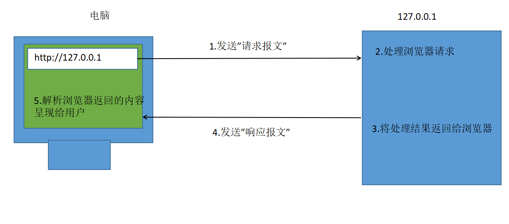

## PHP基础语法

```php
<?php
// 1.JS中有两种注释
// 1.1单行注释
// 1.2多行注释
//
/* */

// 2.JS中如何定义变量?
//var num = 10;
$num = 10;

// 3.JS中如何打印内容?
//console.log();
// 注意点: 后端编写的代码不能直接运行, 只能放到服务器对应的文件夹下, 通过服务器运行
// 如何通过服务器运行: 通过ip地址找到服务器对应的文件夹, 然后再找到对应的文件运行
echo $num;

// 4.JS中如何定义集合
// 4.1数组
// 4.2字典(对象)
//var arr = [1, 3, 5];
// arr[0];
$arr = array(1, 3, 5);
print_r($arr);
echo "<br>";
echo $arr[1];

//var dict = {"name":"lnj", "age":"33"};
// dict["name"];
$dict = array("name" => "lnj", "age" => "33");
print_r($dict);
echo "<br>";
echo $dict["name"];

// 5.JS中的分支循环语句
// if/switch/三目/for/while
$age = 16;
if ($age >= 18) {
    echo "成年人";
} 
else {
    echo "未成年人";
}

$res = ($age >= 18) ? "成年人" : "未成年人";
echo $res;

switch ($age) {
    case -1:
        echo "非人类";
        break;
    case 18:
        echo "成年人";
        break;
    default:
        echo "未成年人";
        break;
}

$arr = array(1, 3, 5);
for($i = 0; $i < count($arr); $i++){
    echo $arr[$i];
    echo "<br>";
}

$index = 0;
while ($index < count($arr)) {
    echo $arr[$index];
    echo "<br>";
    $index++;
}
?>
```

## get请求处理

## post请求处理

```html
<!DOCTYPE html>
<html lang="zh-CN">
<head>
    <meta charset="UTF-8">
    <title>02-get-post</title>
</head>
<body>
<!--
1.可以通过form标签的method属性指定发送请求的类型
2.如果是get请求会将提交的数据拼接到URL后面
?userName=lnj&userPwd=123456
3.如果是post请求会将提交的数据放到请求头中

4.GET请求和POST请求的异同
4.1相同点:
都是将数据提交到远程服务器
4.2不同点:
4.2.1提交数据存储的位置不同
GET请求会将数据放到URL后面
POST请求会将数据放到请求头中
4.2.2提交数据大小限制不同
GET请求对数据有大小限制
POST请求对数据没有大小限制

5.GET/POST请求应用场景
GET请求用于提交非敏感数据和小数据
POST请求用于提交敏感数据和大数据
-->
<form action="02-get-post.php" method="post">
    <input type="text" name="userName"><br>
    <input type="password" name="userPwd"><br>
    <input type="submit" value="提交"><br>
</form>
</body>
</html>
```

```php
<?php
//print_r($_GET);
//echo $_GET["userName"];
//echo $_GET["userPwd"];

print_r($_POST);
echo $_POST["userName"];
echo $_POST["userPwd"];
?>
```




## 文件上传

```html
<!DOCTYPE html>
<html lang="zh-CN">
<head>
    <meta charset="UTF-8">
    <title>03-post-file</title>
</head>
<body>
<!--
注意:
1.上传文件一般使用POST提交
2.上传文件必须设置enctype="multipart/form-data"

3.上传的文件在PHP中可以通过$_FILES获取
4.PHP中文件默认会上传到一个临时目录, 接收完毕之后会自动删除
-->
<!--
默认情况下服务器对上传文件的大小是有限制的, 如果想修改上传文件的限制可以修改php.ini文件
file_uploads = On   ; 是否允许上传文件 On/Off 默认是On
upload_max_filesize = 2048M       ; 上传文件的最大限制
post_max_size = 2048M             ; 通过Post提交的最多数据

max_execution_time = 30000      ; 脚本最长的执行时间 单位为秒
max_input_time = 30000          ; 接收提交的数据的时间限制 单位为秒
memory_limit = 2048M            ; 最大的内存消耗
-->
<form action="03-post-file.php" method="post" enctype="multipart/form-data">
    <input type="file" name="upFile"><br>
    <input type="submit" value="上传"><br>
</form>
</body>
</html>
```

```php
<?php

print_r($_FILES);
/*
 Array ( [upFile] => Array ( [name] => fb.pdf [type] => application/pdf 
 [tmp_name] => D:\wamp64\tmp\php449A.tmp [error] => 0 [size] => 81343 ) )
 */

// 1.获取上传文件对应的字典
$fileInfo = $_FILES["upFile"];
//print_r($fileInfo);
// 2.获取上传文件的名称
$fileName = $fileInfo["name"];
// 3.获取上传文件保存的临时路径
$filePath = $fileInfo["tmp_name"];

//echo $fileName;
//echo "<br>";
//echo $filePath;

// 4.移动文件
move_uploaded_file($filePath, "./source/" . $fileName);
?>
```

## Ajax-GET基本使用

```html
<!DOCTYPE html>
<html lang="zh-CN">
<head>
    <meta charset="UTF-8">
    <title>04-ajax-get</title>
    <!--
    1.什么是Ajax?
    AJAX 是与服务器交换数据并更新部分网页的艺术，在不重新加载整个页面的情况下。
    -->
    <script>
        window.onload = function (ev) {
            var oBtn = document.querySelector("button");
            oBtn.onclick = function (ev1) {
                // 1.创建一个异步对象
                var xmlhttp = new XMLHttpRequest();
                // 2.设置请求方式和请求地址
                /*
                method：请求的类型；GET 或 POST
                url：文件在服务器上的位置
                async：true（异步）或 false（同步）
                */
                xmlhttp.open("GET", "04-ajax-get.php", true);
                // 3.发送请求
                xmlhttp.send();
                // 4.监听状态的变化
                xmlhttp.onreadystatechange = function (ev2) {
                    /*
                    0: 请求未初始化
                    1: 服务器连接已建立
                    2: 请求已接收
                    3: 请求处理中
                    4: 请求已完成，且响应已就绪
                    */
                    if (xmlhttp.readyState === 4) {
                        // 判断是否请求成功
                        if (xmlhttp.status >= 200 && xmlhttp.status < 300 ||
                            xmlhttp.status === 304) {
                            // 5.处理返回的结果
                            console.log("接收到服务器返回的数据");
                        } 
                        else {
                            console.log("没有接收到服务器返回的数据");
                        }

                    }
                }
            }
        };
    </script>
</head>
<body>
<button>发送请求</button>
</body>
</html>
```

<a href="https://dwz.cn/83KkfY7g">状态码相关解释</a>

## Ajax-GET-IE兼容

```html
<!DOCTYPE html>
<html lang="zh-CN">
<head>
    <meta charset="UTF-8">
    <title>05-ajax-get</title>

    <script>
        window.onload = function (ev) {

            var oBtn = document.querySelector("button");
            oBtn.onclick = function (ev1) {
                // 所有现代浏览器均支持 XMLHttpRequest 对象（IE5 和 IE6 使用 ActiveXObject）。
                var xhr;
                if (window.XMLHttpRequest) {
                    // code for IE7+, Firefox, Chrome, Opera, Safari
                    xhr = new XMLHttpRequest();
                }
                else {
                    // code for IE6, IE5
                    xhr = new ActiveXObject("Microsoft.XMLHTTP");
                }
                // var xhr = new XMLHttpRequest();
                /*
                在IE浏览器中, 如果通过Ajax发送GET请求, 那么IE浏览器认为
                同一个URL只有一个结果，通过拼接保证URL不一样，这样IE也可以从服务器获的最新数据。
                console.log(Math.random());
                console.log(new Date().getTime());
                */
                xhr.open("GET", "05-ajax-get.txt?t=" + (new Date().getTime()), true);
                xhr.send();
                xhr.onreadystatechange = function (ev2) {
                    if (xhr.readyState === 4) {
                        if (xhr.status >= 200 && xhr.status < 300 ||
                            xhr.status === 304) {
                            // alert("请求成功");
                            alert(xhr.responseText);
                        } 
                        else {
                            alert("请求失败");
                        }
                    }
                };
            };
        };
    </script>
</head>
<body>
<button>发送请求</button>
</body>
</html>
```

## Ajax-GET封装上

myAjax.js

```javascript
function ajax(url, success, error) {
    // 1.创建一个异步对象
    var xmlhttp = new XMLHttpRequest();
    // 2.设置请求方式和请求地址
    /*
    method：请求的类型；GET 或 POST
    url：文件在服务器上的位置
    async：true（异步）或 false（同步）
    */
    xmlhttp.open("GET", url, true);
    // 3.发送请求
    xmlhttp.send();
    // 4.监听状态的变化
    xmlhttp.onreadystatechange = function (ev2) {
        /*
          0: 请求未初始化
          1: 服务器连接已建立
          2: 请求已接收
          3: 请求处理中
          4: 请求已完成，且响应已就绪
      */
        if (xmlhttp.readyState === 4) {
            // 判断是否请求成功
            if (xmlhttp.status >= 200 && xmlhttp.status < 300 ||
                xmlhttp.status === 304) {
                success(xmlhttp);
            } 
            else {
                error(xmlhttp);
            }
        }
    }
}
```

06-ajax-get.html

```html
<!DOCTYPE html>
<html lang="zh-CN">
<head>
    <meta charset="UTF-8">
    <title>05-ajax-get</title>
    <script src="myAjax.js"></script>
    <script>
        window.onload = function (ev) {
            var oBtn = document.querySelector("button");
            oBtn.onclick = function () {
                ajax("04-ajax-get.php", function (xhr) {
                    alert(xhr.responseText)
                }, function (xhr) {
                    alert("请求失败")
                })
            };
        };
    </script>

</head>
<body>
<button>发送请求</button>
</body>
</html>
```

04-ajax-get.php

```php
<?php
echo "ajax get page";
?>
```

## Ajax-GET封装下

06-ajax-get.html

```html
<!DOCTYPE html>
<html lang="zh-CN">
<head>
    <meta charset="UTF-8">
    <title>06-ajax-get</title>
    <script src="myAjax.js"></script>
    <script>
        window.onload = function (ev) {
            var oBtn = document.querySelector("button");
            // var res = encodeURIComponent("wd=张三");
            // console.log(res);
            oBtn.onclick = function (ev1) {
                // https://www.baidu.com/s?wd=%E5%BC%A0%E4%B8%89
                // url?key=value&key=value;
                ajax("04-ajax-get.php",
                    {
                        "userName": "lnj",
                        "userPwd": "123456"
                    },
                    3000,
                    function (xhr) {
                        alert(xhr.responseText);
                    },
                    function (xhr) {
                        alert("请求失败");
                    });
            }
        }
    </script>

</head>
<body>
<button>发送请求</button>
</body>
</html>
```

myAjax.js

```javascript
function obj2str(obj) {
    /*
    {
        "userName":"lnj",
        "userPwd":"123456",
        "t":"3712i9471329876498132"
    }
    */
    obj = obj || {}; // 如果没有传参, 为了添加随机因子，必须自己创建一个对象
    obj.t = new Date().getTime();
    var res = [];
    for (var key in obj) {
        // 在URL中是不可以出现中文的, 如果出现了中文需要转码
        // 可以调用encodeURIComponent方法
        // URL中只可以出现字母/数字/下划线/ASCII码
        res.push(encodeURIComponent(key) + "=" + encodeURIComponent(obj[key])); // [userName=lnj, userPwd=123456];
    }
    return res.join("&"); // userName=lnj&userPwd=123456
}

function ajax(url, obj, timeout, success, error) {
    // 0.将对象转换为字符串
    var str = obj2str(obj); // key=value&key=value;
    // 1.创建一个异步对象
    var xmlhttp, timer;
    if (window.XMLHttpRequest) {
        // code for IE7+, Firefox, Chrome, Opera, Safari
        xmlhttp = new XMLHttpRequest();
    }
    else {
        // code for IE6, IE5
        xmlhttp = new ActiveXObject("Microsoft.XMLHTTP");
    }
    // 2.设置请求方式和请求地址
    /*
    method：请求的类型；GET 或 POST
    url：文件在服务器上的位置
    async：true（异步）或 false（同步）
    */
    xmlhttp.open("GET", url + "?" + str, true);
    // 3.发送请求
    xmlhttp.send();
    // 4.监听状态的变化
    xmlhttp.onreadystatechange = function (ev2) {
        /*
        0: 请求未初始化
        1: 服务器连接已建立
        2: 请求已接收
        3: 请求处理中
        4: 请求已完成，且响应已就绪
        */
        if (xmlhttp.readyState === 4) {
            clearInterval(timer);
            // 判断是否请求成功
            if (xmlhttp.status >= 200 && xmlhttp.status < 300 ||
                xmlhttp.status === 304) {
                // 5.处理返回的结果
                // console.log("接收到服务器返回的数据");
                success(xmlhttp);
            }
            else {
                // console.log("没有接收到服务器返回的数据");
                error(xmlhttp);
            }
        }
    };
    // 判断外界是否传入了超时时间
    if (timeout) {
        timer = setInterval(function () {
            console.log("中断请求");
            xmlhttp.abort();
            clearInterval(timer);
        }, timeout);
    }
}
```

04-ajax-get.php

```php
<?php
//sleep(5);
//echo "ajax get page";
echo $_GET["userName"];
echo "<br>";
echo $_GET["userPwd"];
?>
```

## POST基本使用

```javascript
// 请求的类型为POST
xhr.open("POST", "08-ajax-post.php", true);
// 注意点: 以下代码必须放到open和send之间
xhr.setRequestHeader("Content-type", "application/x-www-form-urlencoded");
// 在send中传递参数
xhr.send("userName=zs&userPwd=321");
```

```php
<?php
//echo "ajax post page";
echo $_POST["userName"];
echo $_POST["userPwd"];
?>
```

## jQuery封装

html

```html
<!DOCTYPE html>
<html lang="zh-CN">
<head>
    <meta charset="UTF-8">
    <title>09-ajax-jquery</title>
    <!--<script src="js/jquery-1.12.4.js"></script>-->
    <script src="myAjax2.js"></script>
    <script>
        window.onload = function (ev) {
            var oBtn = document.querySelector("button");
            oBtn.onclick = function (ev1) {
                // $.ajax({
                //     url: "09-ajax-jquery.php",
                //     type: "get",
                //     data: "userName=lnj&userPwd=654321",
                //     success: function(msg){
                //         alert(msg );
                //     },
                //     error: function (xhr) {
                //         alert(xhr.status);
                //     }
                // });

                ajax({
                    url: "04-ajax-get.php",
                    data: {
                        "userName": "lnj",
                        "userPwd": "123456"
                    },
                    timeout: 3000,
                    type: "get",
                    success: function (xhr) {
                        alert(xhr.responseText);
                    },
                    error: function (xhr) {
                        alert("请求失败");
                    }
                });
            }
        }
    </script>
</head>
<body>
<button>发送请求</button>
</body>
</html>
```

myAjax2.js

```javascript
function obj2str(data) {
    /*
    {
        "userName":"lnj",
        "userPwd":"123456",
        "t":"3712i9471329876498132"
    }
    */
    data = data || {}; // 如果没有传参, 为了添加随机因子,必须自己创建一个对象
    data.t = new Date().getTime();
    var res = [];
    for (var key in data) {
        // 在URL中是不可以出现中文的, 如果出现了中文需要转码
        // 可以调用encodeURIComponent方法
        // URL中只可以出现字母/数字/下划线/ASCII码
        res.push(encodeURIComponent(key) + "=" + encodeURIComponent(data[key])); 
    }
    return res.join("&"); // userName=lnj&userPwd=123456
}

function ajax(option) {
    // 0.将对象转换为字符串
    var str = obj2str(option.data); // key=value&key=value;
    // 1.创建一个异步对象
    var xmlhttp, timer;
    if (window.XMLHttpRequest) {
        // code for IE7+, Firefox, Chrome, Opera, Safari
        xmlhttp = new XMLHttpRequest();
    } 
    else {
        // code for IE6, IE5
        xmlhttp = new ActiveXObject("Microsoft.XMLHTTP");
    }
    // 2.设置请求方式和请求地址
    /*
    method：请求的类型；GET 或 POST
    url：文件在服务器上的位置
    async：true（异步）或 false（同步）
    */
    if (option.type.toLowerCase() === "get") {
        xmlhttp.open(option.type, option.url + "?" + str, true);
        // 3.发送请求
        xmlhttp.send();
    } 
    else {
        xmlhttp.open(option.type, option.url, true);
        // 注意点: 以下代码必须放到open和send之间
        xmlhttp.setRequestHeader("Content-type", "application/x-www-form-urlencoded");
        xmlhttp.send(str);
    }

    // 4.监听状态的变化
    xmlhttp.onreadystatechange = function (ev2) {
        /*
        0: 请求未初始化
        1: 服务器连接已建立
        2: 请求已接收
        3: 请求处理中
        4: 请求已完成，且响应已就绪
        */
        if (xmlhttp.readyState === 4) {
            clearInterval(timer);
            // 判断是否请求成功
            if (xmlhttp.status >= 200 && xmlhttp.status < 300 ||
                xmlhttp.status === 304) {
                // 5.处理返回的结果
                // console.log("接收到服务器返回的数据");
                option.success(xmlhttp);
            } 
            else {
                // console.log("没有接收到服务器返回的数据");
                option.error(xmlhttp);
            }
        }
    }
    // 判断外界是否传入了超时时间
    if (option.timeout) {
        timer = setInterval(function () {
            console.log("中断请求");
            xmlhttp.abort();
            clearInterval(timer);
        }, option.timeout);
    }
}
```

04-ajax-get.php

```php
<?php
//sleep(5);
//echo "ajax get page";
echo $_GET["userName"];
echo "<br>";
echo $_GET["userPwd"];
?> 
```

## 练习

```html
<!DOCTYPE html>
<html lang="zh-CN">
<head>
    <meta charset="UTF-8">
    <title>10-ajax-test</title>
    <style>
        * {
            margin: 0;
            padding: 0;
        }

        div {
            width: 300px;
            height: 300px;
            border: 1px solid #000;
            margin: 50px auto;
            text-align: center;
            background: #ccc;
        }

        img {
            width: 200px;
            height: 200px;
            display: block;
            margin: 10px auto 10px;
            border: 1px solid #000;
        }

        p {
            text-align: center;
            background: pink;
        }
    </style>
    <script src="myAjax2.js"></script>
    <script>
        window.onload = function (ev) {
            // 1.获取需要设置的元素
            var oTitle = document.querySelector("#title");
            var oDes = document.querySelector("#des");
            var oImg = document.querySelector("img");
            // 2.获取所有按钮
            var oBtns = document.querySelectorAll("button");
            // 3.给按钮添加点击事件
            oBtns[0].onclick = function () {
                var self = this;
                // 4.发送Aajx请求到服务器
                ajax({
                    type: "get",
                    url: "10-ajax-test.php",
                    data: {"name": this.getAttribute("name")},
                    timeout: 3000,
                    success: function (xhr) {
                        // alert(xhr.responseText);
                        var res = xhr.responseText.split("|");
                        // console.log(res);
                        oTitle.innerHTML = res[0];
                        oDes.innerHTML = res[1];
                        oImg.setAttribute("src", res[2]);
                    },
                    error: function (xhr) {
                        alert(xhr.status);
                    }
                });
            };
            oBtns[1].onclick = function () {

            };
            oBtns[2].onclick = function () {

            }
        }
    </script>
</head>
<body>
<div>
    <p id="title">商品标题名称</p>
    
    <p id="des">商品描述信息</p>
    <button name="nz">女装</button>
    <button name="bb">包包</button>
    <button name="tx">拖鞋</button>
</div>
</body>
</html>
```

10-ajax-test.php

```php
<?php

// 1.定义字典保存商品信息
$products = array("nz" => array("title" => "甜美女装", "des" => "人见人爱,花间花开,甜美系列", "image" => "images/1.jpg"),
    "bb" => array("title" => "奢华驴包", "des" => "送女友,送情人,送学妹,一送一个准系列", "image" => "images/2.jpg"),
    "tx" => array("title" => "键盘拖鞋", "des" => "程序员专属拖鞋, 屌丝气息浓郁, 你值得拥有", "image" => "images/3.jpg"));
// 2.获取前端传递的参数
$name = $_GET["name"];
//echo $name;
// 3.根据前端传入的key,获取对应的字典
$product = $products[$name];
//print_r($product);
// 4.将小字典中的内容取出来返回给前端
echo $product["title"];
echo "|";
echo $product["des"];
echo "|";
echo $product["image"];
?> 
```

## xml

```html
<!DOCTYPE html>
<html lang="zh-CN">
<head>
    <meta charset="UTF-8">
    <title>11-ajax-xml</title>
    <script src="myAjax2.js"></script>
    <script>
        window.onload = function (ev) {

            var oBtn = document.querySelector("button");
            oBtn.onclick = function (ev1) {
                ajax({
                    type:"get",
                    url:"11-ajax-xml.php",
                    success: function (xhr) {
                        // console.log(xhr.responseXML);
                        // console.log(document);
                        var res = xhr.responseXML;
                        console.log(res.querySelector("name").innerHTML);
                        console.log(res.querySelector("age").innerHTML);
                    },
                    error: function (xhr) {
                        console.log(xhr.status);
                    }
                })
            }
        }
    </script>
</head>
<body>
<button>发送请求</button>
</body>
</html>
```

11-ajax-xml.php

```php
<?php
// 执行结果中有中文, 必须在php文件顶部设置
//header("content-type:text/html; charset=utf-8");
// 如果PHP中需要返回XML数据, 也必须在PHP文件顶部设置
header("content-type:text/xml; charset=utf-8");

echo file_get_contents("info.xml");
```

info.xml

```html
<?xml version="1.0" encoding="UTF-8" ?>
<person>
    <name>李南江</name>
    <age>33</age>
</person>
```

## ajax练习

10-ajax-test.xml

```xml
<?xml version="1.0" encoding="UTF-8" ?>
<products>
    <nz>
        <title>甜美|女装</title>
        <des>人见人爱,花间花开,甜美系列</des>
        <image>images/1.jpg</image>
    </nz>
    <bb>
        <title>奢华驴包</title>
        <des>送女友,送情人,送学妹,一送一个准系列</des>
        <image>images/2.jpg</image>
    </bb>
    <tx>
        <title>键盘拖鞋</title>
        <des>程序员专属拖鞋, 屌丝气息浓郁, 你值得拥有</des>
        <image>images/3.jpg</image>
    </tx>
</products>
```

10-ajax-test.php

```php
<?php
header("content-type:text/xml; charset=utf-8");

echo file_get_contents("10-ajax-test.xml");
```

```javascript
 <script>
        window.onload = function (ev) {
            // 1.获取需要设置的元素
            var oTitle = document.querySelector("#title");
            var oDes = document.querySelector("#des");
            var oImg = document.querySelector("img");
            // 2.获取所有按钮
            var oBtns = document.querySelectorAll("button");
            // 3.给按钮添加点击事件
            oBtns[0].onclick = function () {
                var self = this;
                // 4.发送Aajx请求到服务器
                ajax({
                    type: "get",
                    url: "10-ajax-test.php",
                    data: {"name": this.getAttribute("name")},
                    timeout: 3000,
                    success: function (xhr) {                        
                        var name = self.getAttribute("name");
                        var res = xhr.responseXML;
                        var title = res.querySelector(name+">title").innerHTML;
                        var des = res.querySelector(name+">des").innerHTML;
                        var image = res.querySelector(name+">image").innerHTML;
                        oTitle.innerHTML = title;
                        oDes.innerHTML = des;
                        oImg.setAttribute("src", image);
                    },
                    error: function (xhr) {
                        alert(xhr.status);
                    }
                });
            };
            oBtns[1].onclick = function () {

            };
            oBtns[2].onclick = function () {

            }
        }
    </script>
```

## JSON

<a href="https://github.com/douglascrockford/JSON-js/blob/master/json2.js">json2.js</a>

```html
<!DOCTYPE html>
<html lang="zh-CN">
<head>
    <meta charset="UTF-8">
    <title>12-ajax-json</title>
    <script src="myAjax2.js"></script>
    <script>
        window.onload = function (ev) {
            var oBtn = document.querySelector("button");
            oBtn.onclick = function (ev1) {
                ajax({
                    type:"get",
                    url:"12-ajax-json.php",
                    success: function (xhr) {
                        // console.log(xhr.responseText);
                        var str = xhr.responseText;
                        /*
                        在低版本的IE中, 不可以使用原生的JSON.parse方法,可以使用json2.js框架来兼容
                        */
                        var obj = JSON.parse(str);
                        // console.log(obj);
                        console.log(obj.name);
                        console.log(obj.age);
                    },
                    error: function (xhr) {
                        console.log(xhr.status);
                    }
                })
            }
        }
    </script>
</head>
<body>
<button>发送请求</button>
</body>
</html>
```

12-ajax-json.php

```php
<?php

echo file_get_contents("12-ajax-json.txt");
```

12-ajax-json.txt

```json
{
    "name":"lnj",
    "age":"33"
}
```

## JSON练习

10-ajax-test.txt

```json
{
    "nz":{
        "title":"甜美|女装",
        "des":"人见人爱,花间花开,甜美系列",
        "image":"images/1.jpg"
    },
    "bb":{
        "title":"奢华驴包",
        "des":"送女友,送情人,送学妹,一送一个准系列",
        "image":"images/2.jpg"
    },
    "tx":{
        "title":"键盘拖鞋",
        "des":"程序员专属拖鞋, 屌丝气息浓郁, 你值得拥有",
        "image":"images/3.jpg"
    }
}
```

```javascript
    <script>
        window.onload = function (ev) {
            // 1.获取需要设置的元素
            var oTitle = document.querySelector("#title");
            var oDes = document.querySelector("#des");
            var oImg = document.querySelector("img");
            // 2.获取所有按钮
            var oBtns = document.querySelectorAll("button");
            // 3.给按钮添加点击事件
            oBtns[0].onclick = function () {
                var self = this;
                // 4.发送Aajx请求到服务器
                ajax({
                    type: "get",
                    url: "10-ajax-test.php",
                    data: {"name": this.getAttribute("name")},
                    timeout: 3000,
                    success: function (xhr) {
                        var name = self.getAttribute("name");
                        var str = xhr.responseText;
                        var obj = JSON.parse(str);
                        // console.log(obj);
                        var subObj = obj[name];
                        // console.log(subObj);
                        oTitle.innerHTML = subObj.title;
                        oDes.innerHTML = subObj.des;
                        oImg.setAttribute("src", subObj.image);
                    },
                    error: function (xhr) {
                        alert(xhr.status);
                    }
                });
            };
            oBtns[1].onclick = function () {

            };
            oBtns[2].onclick = function () {

            }
        }
    </script>
```

```php
<?php
echo file_get_contents("10-ajax-test.txt");
```

## 

## Cookie

```html
<!DOCTYPE html>
<html lang="zh-CN">
<head>
    <meta charset="UTF-8">
    <title>14-cookie</title>
    <script>
        window.onload = function (ev) {
            /*
            cookie: 会话跟踪技术 客户端
            session: 会话跟踪技术 服务端

            cookie作用:
            将网页中的数据保存到浏览器中

            cookie生命周期:
            默认情况下生命周期是一次会话(浏览器被关闭)
            如果通过expires=设置了过期时间, 并且过期时间没有过期, 那么下次打开浏览器还是存在
            如果通过expires=设置了过期时间, 并且过期时间已经过期了,那么会立即删除保存的数据

            cookie注意点:
            cookie默认不会保存任何的数据
            cookie不能一次性保存多条数据, 要想保存多条数据,只能一条一条的设置
            cookie有大小和个数的限制
            个数限制: 20~50
            大小限制: 4KB左右

            cookie作用范围:
            同一个浏览器的同一个路径下访问
            如果在同一个浏览器中, 默认情况下下一级路径就可以访问
            如果在同一个浏览器中, 想让上一级目录也能访问保存的cookie, 那么需要添加一个path属性才可以;
            document.cookie = "name=zs;path=/;";

            
            例如:
            我们在www.it666.com下面保存了一个cookie,
            那么我们在edu.it666.com中是无法访问的
            如果想在edu.it666.com中也能访问, 那么我们需要再添加一个domain属性才可以;
            document.cookie = "name=zs;path=/;domain=it666.com;";
            */
            // alert(document.cookie);
            // var date = new Date();
            // date.setDate(date.getDate() - 1);
            // document.cookie = "age=33;expires="+date.toGMTString()+";";
            // alert(document.cookie);

            // document.cookie = "name=lnj;";
            // document.cookie = "age=33;";
            // alert(document.cookie);
            // document.cookie = "name=lnj;age=33;gender=male;";

            document.cookie = "name=zs;path=/;domain=127.0.0.1;";
            alert(document.cookie);
        }
    </script>
</head>
<body>

</body>
</html>
```

## Cookie封装

```html
<!DOCTYPE html>
<html lang="zh-CN">
<head>
    <meta charset="UTF-8">
    <title>16-cookie-封装</title>
    <script>
        window.onload = function (ev) {
            // document.cookie = "age=88;";
            // addCookie("gender", "male");
            // addCookie("score", "998", 1, "/", "127.0.0.1");
            function addCookie(key, value, day, path, domain) {
                // 1.处理默认保存的路径
                // if(!path){
                //     var index = window.location.pathname.lastIndexOf("/")
                //     var currentPath = window.location.pathname.slice(0, index);
                //     path = currentPath;
                // }
                var index = window.location.pathname.lastIndexOf("/");
                var currentPath = window.location.pathname.slice(0, index);
                path = path || currentPath;
                // 2.处理默认保存的domain
                domain = domain || document.domain;
                // 3.处理默认的过期时间
                if (!day) {
                    document.cookie = key + "=" + value + ";path=" + path + ";domain=" + domain 
                        + ";";
                }
                else {
                    var date = new Date();
                    date.setDate(date.getDate() + day);
                    document.cookie = key + "=" + value + ";expires=" + date.toGMTString() + 
                        ";path=" + path + ";domain=" + domain + ";";
                }
            }

            function getCookie(key) {
                // console.log(document.cookie);
                var res = document.cookie.split(";");
                // console.log(res);
                for (var i = 0; i < res.length; i++) {
                    // console.log(res[i]);
                    var temp = res[i].split("=");
                    // console.log(temp);
                    if (temp[0].trim() === key) {
                        return temp[1];
                    }
                }
            }

            // console.log(getCookie("name"));

            // 默认情况下只能删除默认路径中保存的cookie, 如果想删除指定路径保存的cookie, 那么必须在删
            // 除的时候指定路径才可以
            function delCookie(key, path) {
                addCookie(key, getCookie(key), -1, path);
            }

            // delCookie("name", "/");
        }
    </script>
</head>
<body>

</body>
</html>
```

jquery.cookie.js

```javascript
;(function ($, window) {
    $.extend({
        addCookie: function (key, value, day, path, domain) {
            // 1.处理默认保存的路径
            var index = window.location.pathname.lastIndexOf("/")
            var currentPath = window.location.pathname.slice(0, index);
            path = path || currentPath;
            // 2.处理默认保存的domain
            domain = domain || document.domain;
            // 3.处理默认的过期时间
            if (!day) {
                document.cookie = key + "=" + value + ";path=" + path + ";domain=" + domain + ";";
            } else {
                var date = new Date();
                date.setDate(date.getDate() + day);
                document.cookie = key + "=" + value + ";expires=" + date.toGMTString() + ";path=" + path + ";domain=" + domain + ";";
            }
        },
        getCookie: function (key) {
            // console.log(document.cookie);
            var res = document.cookie.split(";");
            // console.log(res);
            for (var i = 0; i < res.length; i++) {
                // console.log(res[i]);
                var temp = res[i].split("=");
                // console.log(temp);
                if (temp[0].trim() === key) {
                    return temp[1];
                }
            }
        },
        delCookie: function (key, path) {
            addCookie(key, getCookie(key), -1, path);
        }
    });
})(jQuery, window);
```

## hash

```html
<!DOCTYPE html>
<html lang="zh-CN">
<head>
    <meta charset="UTF-8">
    <title>17-hash</title>
    <script>
        // 种哈希
        window.location.hash = 3;
        // 获取哈希
        console.log(window.location.hash.substring(1));
    </script>
</head>
<body>

</body>
</html>
```

