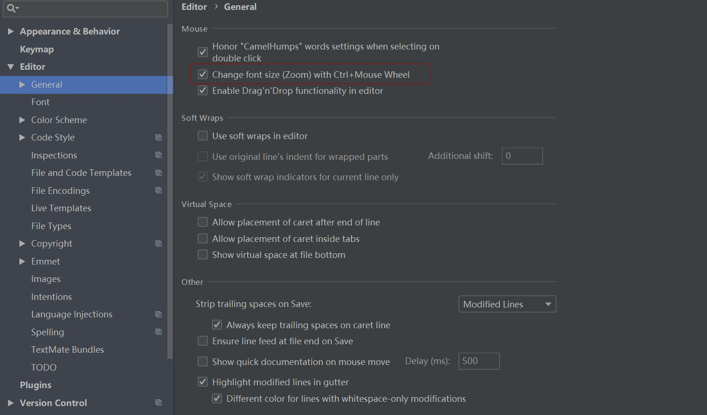
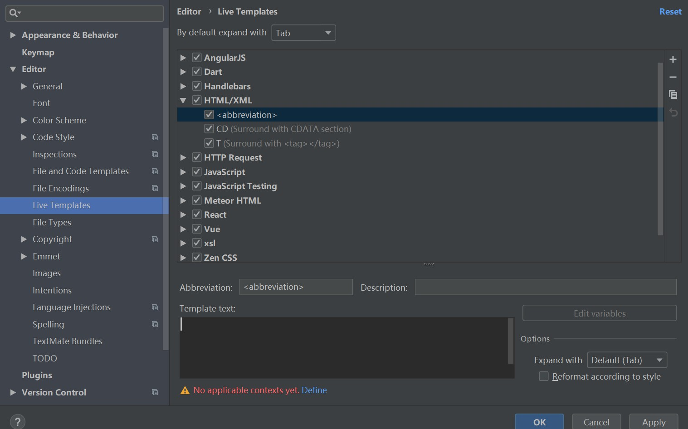
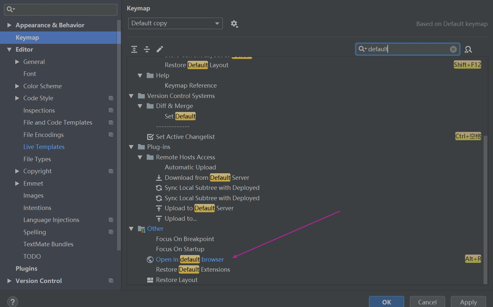
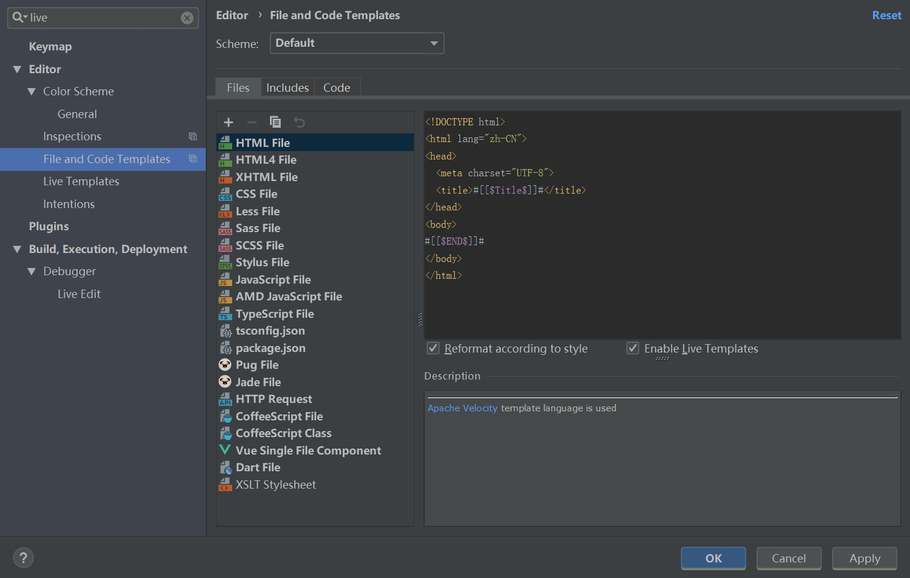

# jQuery


<a href="http://hemin.cn/jq/index.html">jQuery在线手册</a>

<a href="https://www.jianshu.com/p/73c48795060b">从零玩转jQuery-初识jQuery</a>

## **初识jQuery**

```html
<!DOCTYPE html>
<html lang="zh-CN">
<head>
    <meta charset="UTF-8">
    <title>01-初识jQuery</title>
    <style>
        * {
            margin: 0;
            padding: 0;
        }

        div {
            width: 100px;
            height: 100px;
            border: 1px solid #000;
        }
    </style>
    <script src="js/jquery-1.12.4.js"></script>
    <script>
        window.onload = function (ev) {
            // 1.利用原生的JS查找DOM元素
            var div1 = document.getElementsByTagName("div")[0];
            var div2 = document.getElementsByClassName("box1")[0];
            var div3 = document.getElementById("box2");
            // console.log(div1);
            // console.log(div2);
            // console.log(div3);
            // 2.利用原生的JS修改背景颜色
            // div1.style.backgroundColor = "red";
            // div2.style.backgroundColor = "blue";
            // div3.style.backgroundColor = "yellow";
        };
        // 利用jQuery查找DOM元素，修改样式
        $(function () {
            var $div1 = $("div");
            var $div2 = $(".box1");
            var $div3 = $("#box2");
            // console.log($div1);
            // console.log($div2);
            // console.log($div3);
            $div1.css({
                background: "red",
                width: "200px",
                height: "200px"
            });
            $div2.css({
                background: "blue"
            });
            $div3.css({
                background: "yellow"
            });
        });
    </script>

</head>
<body>
<div></div>
<div class="box1"></div>
<div id="box2"></div>
</body>
</html>
```

## jQuery-HelloWorld

```html
<!DOCTYPE html>
<html lang="zh-CN">
<head>
    <meta charset="UTF-8">
    <title>02-jQuery-HelloWorld</title>
    <script src="js/jquery-1.12.4.js"></script>
    <script>
        // 1.原生JS的固定写法
        window.onload = function (ev) {
        };

        // 2.jQuery的固定写法
        $(document).ready(function () {
            alert("hello World");
        });
    </script>
</head>
<body>

</body>
</html>
```

## jQuery和JS入口函数的区别

```html
<!DOCTYPE html>
<html lang="zh-CN">
<head>
    <meta charset="UTF-8">
    <title>03-jQuery和JS入口函数的区别</title>
    <script src="js/jquery-1.12.4.js"></script>
    <script>

        window.onload = function (ev) {
            // 1.通过原生的JS入口函数可以拿到DOM元素
            var image = document.getElementsByTagName("img")[0];
            console.log(image);
            // 2.通过原生的JS入口函数可以拿到DOM元素的宽高
            var width = window.getComputedStyle(image).width;
            console.log("onload", width);
        };


        /*
        * 1.原生JS和jQuery入口函数的加载模式不同
        * 原生JS会等到DOM元素加载完毕,并且图片也加载完毕才会执行
        * jQuery会等到DOM元素加载完毕,但不会等到图片也加载完毕就会执行
        * */

        $(document).ready(function () {
            // 1.通过jQuery入口函数可以拿到DOM元素
            var $img = $("img");
            console.log($img.length);
            // 2.通过jQuery入口函数不可以拿到DOM元素的宽高
            var $width = $img.width();
            console.log("ready", $width);
        });


        /*
        1.原生的JS如果编写了多个入口函数,后面编写的会覆盖前面编写的
        2.jQuery中编写多个入口函数,后面的不会覆盖前面的
        */
        // window.onload = function (ev) {
        //     alert("hello lnj1");
        // };
        // window.onload = function (ev) {
        //     alert("hello lnj2");
        // };

        // $(document).ready(function () {
        //     alert("hello lnj1");
        // });
        // $(document).ready(function () {
        //     alert("hello lnj2");
        // });
    </script>
</head>
<body>

</body>
</html>
```

## jQuery入口函数的其它写法

```javascript

// 1.第一种写法
$(document).ready(function () {
	alert("hello lnj1");
});

// 2.第二种写法
jQuery(document).ready(function () {
	alert("hello lnj2");
});

// 3.第三种写法(推荐)
$(function () {
	alert("hello lnj3");
});

// 4.第四种写法
jQuery(function () {
	alert("hello lnj4");
});

```

## jQuery冲突问题

```html
<!DOCTYPE html>
<html lang="zh-CN">
<head>
    <meta charset="UTF-8">
    <title>05-jQuery冲突问题</title>
    <script src="js/jquery-1.12.4.js"></script>
    <script src="js/test.js"></script>
    <script>
        // 1.释放$的使用权
        jQuery.noConflict();
        // 注意点: 释放操作必须在编写其它jQuery代码之前编写，释放之后就不能再使用$,改为使用jQuery

        // 2.自定义一个访问符号
        var nj = jQuery.noConflict();
        nj(function () {
            alert("hello lnj");
        });
    </script>
</head>
<body>

</body>
</html>
```

## jQuery核心函数

```html
<!DOCTYPE html>
<html lang="en">
<head>
    <meta charset="UTF-8">
    <title>06-jQuery核心函数</title>
    <script src="js/jquery-1.12.4.js"></script>
    <script>
        // $(); 就代表调用jQuery的核心函数

        // 1.接收一个函数
        $(function () {
            alert("hello lnj");
            // 2.接收一个字符串
            // 2.1接收一个字符串选择器
            // 返回一个jQuery对象, 对象中保存了找到的DOM元素
            var $box1 = $(".box1");
            var $box2 = $("#box2");
            console.log($box1);
            console.log($box2);
            // 2.2接收一个字符串代码片段
            // 返回一个jQuery对象, 对象中保存了创建的DOM元素
            var $p = $("<p>我是段落</p>");
            console.log($p);
            $box1.append($p);
            // 3.接收一个DOM元素
            // 会被包装成一个jQuery对象返回给我们
            var span = document.getElementsByTagName("span")[0];
            console.log(span);
            var $span = $(span);
            console.log($span);
        });
    </script>
</head>
<body>
<div class="box1"></div>
<div id="box2"></div>
<span>我是span</span>
</body>
</html>
```

## jQuery对象

```html
<!DOCTYPE html>
<html lang="zh-CN">
<head>
    <meta charset="UTF-8">
    <title>07-jQuery对象</title>
    <script src="js/jquery-1.12.4.js"></script>
    <script>
        $(function () {
            /*
            * 1.什么是jQuery对象
            * jQuery对象是一个伪数组
            *
            * 2.什么是伪数组?
            * 有0到length-1的属性, 并且有length属性
            */
            var $div = $("div");
            console.log($div);

            var arr = [1, 3, 5];
            console.log(arr);
        });
    </script>
</head>
<body>
<div>div1</div>
<div>div2</div>
<div>div3</div>
</body>
</html>
```

## 静态方法和实例方法

```html
<!DOCTYPE html>
<html lang="zh-CN">
<head>
    <meta charset="UTF-8">
    <title>08-静态方法和实例方法</title>
    <script>
        // 1.定义一个类
        function AClass() {
        }

        // 2.给这个类添加一个静态方法
        // 直接添加给类的就是静态方法
        AClass.staticMethod = function () {
            alert("staticMethod");
        };
        // 静态方法通过类名调用
        AClass.staticMethod();

        // 3.给这个类添加一个实例方法
        AClass.prototype.instanceMethod = function () {
            alert("instanceMethod");
        };
        // 实例方法通过类的实例调用
        // 创建一个实例(创建一个对象)
        var a = new AClass();
        // 通过实例调用实例方法
        a.instanceMethod();
    </script>
</head>
<body>

</body>
</html>
```

## 静态方法each方法

```html
<!DOCTYPE html>
<html lang="zh-CN">
<head>
    <meta charset="UTF-8">
    <title>09-静态方法each方法</title>
    <script src="js/jquery-1.12.4.js"></script>
    <script>
        var arr = [1, 3, 5, 7, 9];
        var obj = {0: 1, 1: 3, 2: 5, 3: 7, 4: 9, length: 5};
        /*
        第一个参数: 遍历到的元素
        第二个参数: 当前遍历到的索引
        注意点:
        原生的forEach方法只能遍历数组, 不能遍历伪数组
        */
        arr.forEach(function (value, index) {
            console.log(index, value);
        });
        // obj.forEach(function (value, index) {
        //     console.log(index, value);
        // });

        // 1.利用jQuery的each静态方法遍历数组
        /*
        第一个参数: 当前遍历到的索引
        第二个参数: 遍历到的元素
        注意点:
        jQuery的each方法是可以遍历伪数组的
        */
        $.each(arr, function (index, value) {
            console.log(index, value);
        });
        $.each(obj, function (index, value) {
            console.log(index, value);
        });
    </script>
</head>
<body>

</body>
</html>
```

## 静态方法map方法

```html
<!DOCTYPE html>
<html lang="zh-CN">
<head>
    <meta charset="UTF-8">
    <title>10-静态方法map方法</title>
    <script src="js/jquery-1.12.4.js"></script>
    <script>
        var arr = [1, 3, 5, 7, 9];
        var obj = {0:1, 1:3, 2:5, 3:7, 4:9, length:5};
        // 1.利用原生JS的map方法遍历
        /*
        第一个参数: 当前遍历到的元素
        第二个参数: 当前遍历到的索引
        第三个参数: 当前被遍历的数组
        注意点:
        和原生的forEach一样,不能遍历伪数组
        */
        // arr.map(function (value, index, array) {
        //     console.log(index, value, array);
        // });
        // obj.map(function (value, index, array) {
        //     console.log(index, value, array);
        // });
        /*
        第一个参数: 要遍历的数组
        第二个参数: 每遍历一个元素之后执行的回调函数
        回调函数的参数:
        第一个参数: 遍历到的元素
        第二个参数: 遍历到的索引
        注意点:
        和jQuery中的each静态方法一样, map静态方法也可以遍历伪数组
        */
        // $.map(arr, function (value, index) {
        //     console.log(index, value);
        // });
        var res = $.map(obj, function (value, index) {
            console.log(index, value);
            return value + index;
        });
        //
        var res2 = $.each(obj, function (index, value) {
            console.log(index, value);
            // return value + index;
        });

        /*
        jQuery中的each静态方法和map静态方法的区别:
        each静态方法默认的返回值是正在遍历的数组
        map静态方法默认的返回值是一个空数组

        each静态方法不支持在回调函数中对遍历的数组进行处理
        map静态方法可以在回调函数中通过return对遍历的数组进行处理, 然后生成一个新的数组返回
        */
        console.log(res);
        console.log(res2);
    </script>
</head>
<body>

</body>
</html>
```

## jQuery中的其它静态方法

```html
<!DOCTYPE html>
<html lang="zh-CN">
<head>
    <meta charset="UTF-8">
    <title>11-jQuery中的其它静态方法</title>
    <script src="js/jquery-1.12.4.js"></script>
    <script>
        /*
        $.trim();
        作用: 去除字符串两端的空格
        参数: 需要去除空格的字符串
        返回值: 去除空格之后的字符串
        */

        var str = "    lnj    ";
        var res = $.trim(str);
        console.log("---" + str + "---");
        console.log("---" + res + "---");


        // 真数组
        var arr = [1, 3, 5, 7, 9];
        // 伪数组
        var arrlike = {0: 1, 1: 3, 2: 5, 3: 7, 4: 9, length: 5};
        // 对象
        var obj = {"name": "lnj", age: "33"};
        // 函数
        var fn = function () {
        };
        // window对象
        var w = window;

        /*
        $.isWindow();
        作用: 判断传入的对象是否是window对象
        返回值: true/false
        */

        var res = $.isWindow(w);
        console.log(res);


        /*
        $.isArray();
        作用: 判断传入的对象是否是真数组
        返回值: true/false
        */

        var res = $.isArray(arrlike);
        console.log(res);

        /*
        $.isFunction();
        作用: 判断传入的对象是否是一个函数
        返回值: true/false
        注意点:
        jQuery框架本质上是一个函数
        (function( window, undefined ) {
         })( window );
        */
        var res = $.isFunction(jQuery);
        console.log(res);
    </script>
</head>
<body>

</body>
</html>
```

## 静态方法holdReady方法

```html
<!DOCTYPE html>
<html lang="zh-CN">
<head>
    <meta charset="UTF-8">
    <title>12-静态方法holdReady方法</title>
    <script src="js/jquery-1.12.4.js"></script>
    <script>
        // $.holdReady(true); 作用: 暂停ready执行
        $.holdReady(true);
        $(document).ready(function () {
            alert("ready");
        });
    </script>
</head>
<body>
<button>恢复ready事件</button>
<script>
    var btn = document.getElementsByTagName("button")[0];
    btn.onclick = function () {
        $.holdReady(false);
    }
</script>
</body>
</html>
```

## 快捷设置










## jQuery内容选择器

```html
<!DOCTYPE html>
<html lang="zh-CN">
<head>
    <meta charset="UTF-8">
    <title>14-jQuery内容选择器</title>
    <style>
        div {
            width: 50px;
            height: 100px;
            background: red;
            margin-top: 5px;
        }
    </style>
    <script src="js/jquery-1.12.4.js"></script>
    <script>
        $(function () {
            // 编写jQuery相关代码
            // :empty 作用:找到既没有文本内容也没有子元素的指定元素
            var $div = $("div:empty");
            console.log($div);

            // :parent 作用: 找到有文本内容或有子元素的指定元素
            var $div = $("div:parent");
            console.log($div);

            // :contains(text) 作用: 找到包含指定文本内容的指定元素
            var $div = $("div:contains('我是div')");
            console.log($div);

            // :has(selector) 作用: 找到包含指定子元素的指定元素
            var $div = $("div:has('span')");
            console.log($div);
        });
    </script>
</head>
<body>

<div></div>
<div>我是div</div>
<div>他们我是div123</div>
<div><span></span></div>
<div><p></p></div>

</body>
</html>
```

## 属性和属性节点

```html
<!DOCTYPE html>
<html lang="zh-CN">
<head>
    <meta charset="UTF-8">
    <title>15-属性和属性节点</title>
    <script src="js/jquery-1.12.4.js"></script>
    <script>
        $(function () {
            /*
            1.什么是属性?
            对象身上保存的变量就是属性
            2.如何操作属性?
            对象.属性名称 = 值;
            对象.属性名称;
            对象["属性名称"] = 值;
            对象["属性名称"];

            3.什么是属性节点?
            <span name = "it666"></span>
            在编写HTML代码时,在HTML标签中添加的属性就是属性节点
            在浏览器中找到span这个DOM元素之后, 展开看到的都是属性
            在attributes属性中保存的所有内容都是属性节点

            4.如何操作属性节点?
            DOM元素.setAttribute("属性名称", "值");
            DOM元素.getAttribute("属性名称");

            5.属性和属性节点有什么区别?
            任何对象都有属性, 但是只有DOM对象才有属性节点

            */


            function Person() {

            }

            var p = new Person();
            p.name = "lnj";
            p["name"] = "zs";
            console.log(p.name);
            console.log(p["name"]);


            var span = document.getElementsByTagName("span")[0];
            span.setAttribute("name", "lnj");
            console.log(span.getAttribute("name"));
        });
    </script>
</head>
<body>
<span name="it666"></span>
</body>
</html>
```

## jQuery的attr方法

```html
<!DOCTYPE html>
<html lang="zh-CN">
<head>
    <meta charset="UTF-8">
    <title>16-jQuery的attr方法</title>
    <script src="js/jquery-1.12.4.js"></script>
    <script>
        $(function () {
            /*
             1.attr(name|pro|key,val|fn)
             作用: 获取或者设置属性节点的值
             可以传递一个参数, 也可以传递两个参数
             如果传递一个参数, 代表获取属性节点的值
             如果传递两个参数, 代表设置属性节点的值

             注意点:
             如果是获取:无论找到多少个元素, 都只会返回第一个元素指定的属性节点的值
             如果是设置:找到多少个元素就会设置多少个元素
             如果是设置: 如果设置的属性节点不存在, 那么系统会自动新增

             2.removeAttr(name)
             删除属性节点

             注意点:
             会删除所有找到元素指定的属性节点

            */
            console.log($("span").attr("class"));
            $("span").attr("class", "box");
            $("span").attr("abc", "123");
			
            $("span").removeAttr("class name");
        });
    </script>
</head>
<body>
<span class="span1" name="it666"></span>
<span class="span2" name="lnj"></span>
</body>
</html>
```

## jQuery的prop方法

```html
<!DOCTYPE html>
<html lang="zh-CN">
<head>
    <meta charset="UTF-8">
    <title>17-jQuery的prop方法</title>
    <script src="js/jquery-1.12.4.js"></script>
    <script>
        $(function () {
            /*
            1.prop方法
            特点和attr方法一致
            2.removeProp方法
            特点和removeAttr方法一致
            */

            $("span").eq(0).prop("demo", "it666");
            $("span").eq(1).prop("demo", "lnj");
            console.log($("span").prop("demo"));

            $("span").removeProp("demo");


            /*
            注意点:
            prop方法不仅能够操作属性, 他还能操作属性节点
            官方推荐在操作属性节点时,具有 true 和 false 两个属性的属性节点，
            如 checked, selected 或者 disabled 使用prop()，其他的使用 attr()
            */
            console.log($("span").prop("class"));
            $("span").prop("class", "box");

            console.log($("input").prop("checked")); // true / false
            console.log($("input").attr("checked")); // checked / undefined

        });
    </script>
</head>
<body>
<span class="span1" name="it666"></span>
<span class="span2" name="lnj"></span>

<input type="checkbox">
</body>
</html>
```

## attr和prop方法练习

```html
<!DOCTYPE html>
<html lang="zh-CN">
<head>
    <meta charset="UTF-8">
    <title>18-attr和prop方法练习</title>
    <script src="js/jquery-1.12.4.js"></script>
    <script>
        $(function () {
            // 编写jQuery相关代码
            // 1.给按钮添加点击事件
            var btn = document.getElementsByTagName("button")[0];
            btn.onclick = function () {
                // 2.获取输入框输入的内容
                var input = document.getElementsByTagName("input")[0];
                var text = input.value;
                // 3.修改img的src属性节点的值
                $("img").attr("src", text);
                //$("img").prop("src", text);
            }
        });
    </script>
</head>
<body>
<input type="text">
<button>切换图片</button>
<br>

</body>
</html>
```

## jQuery操作类相关的方法

```html
<!DOCTYPE html>
<html lang="zh-CN">
<head>
    <meta charset="UTF-8">
    <title>19-jQuery操作类相关的方法</title>
    <style>
        * {
            margin: 0;
            padding: 0;
        }

        .class1 {
            width: 100px;
            height: 100px;
            background: red;
            margin-top: 10px;
        }

        .class2 {
            border: 1px solid green;
        }
    </style>
    <script src="js/jquery-1.12.4.js"></script>
    <script>
        $(function () {
            /*
            1.addClass(class|fn)
            作用: 添加一个类
            如果要添加多个, 多个类名之间用空格隔开即可

            2.removeClass([class|fn])
            作用: 删除一个类
            如果想删除多个, 多个类名之间用空格隔开即可

            3.toggleClass(class|fn[,sw])
            作用: 切换类
            有就删除, 没有就添加
            */
            var btns = document.getElementsByTagName("button");
            btns[0].onclick = function () {
                $("div").addClass("class1 class2");
            };
            btns[1].onclick = function () {
                // $("div").removeClass("class2");
                $("div").removeClass("class2 class1");
            };
            btns[2].onclick = function () {
                $("div").toggleClass("class2 class1");
            };
        });
    </script>
</head>
<body>
<button>添加类</button>
<button>删除类</button>
<button>切换类</button>
<br>
<div></div>
</body>
</html>
```

## jQuery文本值相关的方法

```html
<!DOCTYPE html>
<html lang="zh-CN">
<head>
    <meta charset="UTF-8">
    <title>20-jQuery文本值相关的方法</title>
    <style>
        * {
            margin: 0;
            padding: 0;
        }

        div {
            width: 100px;
            height: 100px;
            border: 1px solid #000;
        }
    </style>
    <script src="js/jquery-1.12.4.js"></script>
    <script>
        $(function () {
            /*
            1.html([val|fn])
            和原生JS中的innerHTML一模一样
            2.text([val|fn])
            和原生JS中的innerText一模一样
            3.val([val|fn|arr])
            参考原生JS中的value
            */
            var btns = document.getElementsByTagName("button");
            btns[0].onclick = function () {
                $("div").html("<p>我是段落<span>我是span</span></p>");
            };
            btns[1].onclick = function () {
                console.log($("div").html());
            };
            btns[2].onclick = function () {
                // $("div").text("<p>我是段落<span>我是span</span></p>");
                $("div").text("我是段落我是span");
            };
            btns[3].onclick = function () {
                console.log($("div").text());
            };
            btns[4].onclick = function () {
                $("input").val("请输入内容");
            };
            btns[5].onclick = function () {
                console.log($("input").val());

            };
        });
    </script>
</head>
<body>
<button>设置html</button>
<button>获取html</button>
<button>设置text</button>
<button>获取text</button>
<button>设置value</button>
<button>获取value</button>
<div></div>
<input type="text">
</body>
</html>
```

## jQuery操作CSS样式的方法

```html
<!DOCTYPE html>
<html lang="zh-CN">
<head>
    <meta charset="UTF-8">
    <title>21-jQuery操作CSS样式的方法</title>
    <script src="js/jquery-1.12.4.js"></script>
    <script>
        $(function () {
            // 编写jQuery相关代码
            // 1.逐个设置
            $("div").css("width", "100px");
            $("div").css("height", "100px");
            $("div").css("background", "red");

            // 2.链式设置
            // 注意点: 链式操作如果大于3步, 建议分开
            $("div").css("width", "200px").css("height", "200px").css("background", "blue");

            // 3.批量设置
            $("div").css({
                width: "300px",
                height: "300px",
                background: "green"
            });

            // 4.获取CSS样式值
            console.log($("div").css("background"));
        });
    </script>
</head>
<body>
<div></div>
</body>
</html>
```

## jQuery位置和尺寸操作的方法

```html
<!DOCTYPE html>
<html lang="zh-CN">
<head>
    <meta charset="UTF-8">
    <title>22-jQuery位置和尺寸操作的方法</title>
    <style>
        * {
            margin: 0;
            padding: 0;
        }

        .father {
            width: 200px;
            height: 200px;
            background: red;
            border: 50px solid darkslategray;
            margin-left: 50px;
            position: relative;
        }

        .son {
            width: 100px;
            height: 100px;
            background: blue;
            position: absolute;
            left: 50px;
            top: 50px;
        }
    </style>
    <script src="js/jquery-1.12.4.js"></script>
    <script>
        $(function () {
            // 编写jQuery相关代码
            var btns = document.getElementsByTagName("button");
            // 监听获取
            btns[0].onclick = function () {
                // 获取元素的宽度
                console.log($(".father").width());
                // offset([coordinates])
                // 作用: 获取元素距离窗口的偏移位
                console.log($(".son").offset().left);
                // position()
                // 作用: 获取元素距离定位元素的偏移位
                console.log($(".son").position().left);
            };
            // 监听设置
            btns[1].onclick = function () {
                // 设置元素的宽度
                $(".father").width("500px")
                // 设置
                $(".son").offset({
                    left: 10
                });

                // 注意点: position方法只能获取不能设置
                // $(".son").position({
                //     left: 10
                // });

                // $(".son").css({
                //     left: "10px"
                // });
            }
        });
    </script>
</head>
<body>
<div class="father">
    <div class="son"></div>
</div>
<br>
<button>获取</button>
<button>设置</button>
</body>
</html>
```


## jQuery的scrollTop方法

```javascript
<script src="js/jquery-1.12.4.js"></script>
<script>
    $(function () {
    // 编写jQuery相关代码
    var btns = document.getElementsByTagName("button");
    // 监听获取
    btns[0].onclick = function () {
        // 获取滚动的偏移位
        console.log($(".scroll").scrollTop());
        // 获取网页滚动的偏移位
        // 注意点: 为了保证浏览器的兼容, 获取网页滚动的偏移位需要按照如下写法
        console.log($("body").scrollTop() + $("html").scrollTop());
    };
    btns[1].onclick = function () {
        // 设置滚动的偏移位
        $(".scroll").scrollTop(300);
        // 设置网页滚动偏移位
        // 注意点: 为了保证浏览器的兼容, 设置网页滚动偏移位的时候必须按照如下写法
        $("html,body").scrollTop(300);
    };
});
</script>
```

## jQuery事件绑定

```html
<!DOCTYPE html>
<html lang="zh-CN">
<head>
    <meta charset="UTF-8">
    <title>24-jQuery事件绑定</title>
    <script src="js/jquery-1.12.4.js"></script>
    <script>
        $(function () {
            // 编写jQuery相关代码
            /*
            jQuery中有两种绑定事件方式
            1.eventName(fn);
            编码效率略高/ 部分事件jQuery没有实现,所以不能添加
            2.on(eventName, fn);
            编码效率略低/ 所有js事件都可以添加

            注意点:
            可以添加多个相同或者不同类型的事件,不会覆盖
            */
            $("button").click(function () {
                alert("hello lnj");
            });
            $("button").click(function () {
                alert("hello 123");
            });
            $("button").mouseleave(function () {
                alert("hello mouseleave");
            });
            $("button").mouseenter(function () {
                alert("hello mouseenter");
            });

            $("button").on("click", function () {
                alert("hello click1");
            });
            $("button").on("click", function () {
                alert("hello click2");
            });
            $("button").on("mouseleave", function () {
                alert("hello mouseleave");
            });
            $("button").on("mouseenter", function () {
                alert("hello mouseenter");
            });
        });
    </script>
</head>
<body>
<button>我是按钮</button>
</body>
</html>
```

## jQuery事件移除

```html
<!DOCTYPE html>
<html lang="zh-CN">
<head>
    <meta charset="UTF-8">
    <title>25-jQuery事件移除</title>
    <script src="js/jquery-1.12.4.js"></script>
    <script>
        $(function () {
            function test1() {
                alert("hello lnj");
            }

            function test2() {
                alert("hello 123");
            }

            // 编写jQuery相关代码
            $("button").click(test1);
            $("button").click(test2);
            $("button").mouseleave(function () {
                alert("hello mouseleave");
            });
            $("button").mouseenter(function () {
                alert("hello mouseenter");
            });

            // off方法如果不传递参数, 会移除所有的事件
            // $("button").off();
            // off方法如果传递一个参数, 会移除所有指定类型的事件
            $("button").off("click");
            // off方法如果传递两个参数, 会移除所有指定类型的指定事件
            // $("button").off("click", test1);
        });
    </script>
</head>
<body>
<button>我是按钮</button>
</body>
</html>
```

## jQuery事件冒泡和默行为

```html
<!DOCTYPE html>
<html lang="zh-CN">
<head>
    <meta charset="UTF-8">
    <title>26-jQuery事件冒泡和默行为</title>
    <style>
        *{
            margin: 0;
            padding: 0;
        }
        .father{
            width: 200px;
            height: 200px;
            background: red;
        }
        .son{
            width: 100px;
            height: 100px;
            background: blue;
        }
    </style>
    <script src="js/jquery-1.12.4.js"></script>
    <script>
        $(function () {
            // 编写jQuery相关代码
            /*
            1.什么是事件冒泡?
            2.如何阻止事件冒泡
            3.什么是默认行为?
            4.如何阻止默认行为
            */

            $(".son").click(function (event) {
                alert("son");
                // 阻止事件冒泡两种方式
                // return false;
                // event.stopPropagation();
            });
            $(".father").click(function () {
                alert("father");
            });

            $("a").click(function (event) {
                alert("弹出注册框");
                // 阻止事件默认行为两种方式
                // return false;
                // event.preventDefault();
            });
        });
    </script>
</head>
<body>
<div class="father">
    <div class="son"></div>
</div>
<a href="http://www.baidu.com">注册</a>
<form action="http://www.taobao.com">
    <input type="text">
    <input type="submit">
</form>
</body>
</html>
```

## jQuery事件自动触发

```html
<!DOCTYPE html>
<html lang="zh-CN">
<head>
    <meta charset="UTF-8">
    <title>27-jQuery事件自动触发</title>
    <style>
        * {
            margin: 0;
            padding: 0;
        }

        .father {
            width: 200px;
            height: 200px;
            background: red;
        }

        .son {
            width: 100px;
            height: 100px;
            background: blue;
        }
    </style>
    <script src="js/jquery-1.12.4.js"></script>
    <script>
        $(function () {
            // 编写jQuery相关代码
            $(".son").click(function (event) {
                alert("son");
            });

            $(".father").click(function () {
                alert("father");
            });
            // $(".father").trigger("click");
            // $(".father").triggerHandler("click");

            /*
            trigger: 如果利用trigger自动触发事件,会触发事件冒泡
            triggerHandler: 如果利用triggerHandler自动触发事件, 不会触发事件冒泡
            */
            // $(".son").trigger("click");
            // $(".son").triggerHandler("click");

            $("input[type='submit']").click(function () {
                alert("submit");
            });

            /*
            trigger: 如果利用trigger自动触发事件,会触发默认行为
            triggerHandler: 如果利用triggerHandler自动触发事件, 不会触发默认行为
            */
            // $("input[type='submit']").trigger("click");
            // $("input[type='submit']").triggerHandler("click");


            $("a").click(function () {
                alert("a");
            });
            // $("a").trigger("click");
            /*
            自动触发，但是没有跳转
             */

            $("span").click(function () {
                alert("a");
            });
            // $("span").trigger("click");
            /*
            自动触发包裹在a标签里面的span标签，会有跳转行为。
             */
        });
    </script>
</head>
<body>
<div class="father">
    <div class="son"></div>
</div>
<a href="http://www.baidu.com"><span>注册</span></a>
<form action="http://www.taobao.com">
    <input type="text">
    <input type="submit">
</form>
</body>
</html>
```

## jQuery自定义事件

```html
<!DOCTYPE html>
<html lang="zh-CN">
<head>
    <meta charset="UTF-8">
    <title>28-jQuery自定义事件</title>
    <style>
        * {
            margin: 0;
            padding: 0;
        }

        .father {
            width: 200px;
            height: 200px;
            background: red;
        }

        .son {
            width: 100px;
            height: 100px;
            background: blue;
        }
    </style>
    <script src="js/jquery-1.12.4.js"></script>
    <script>
        $(function () {
            // 编写jQuery相关代码
            // $(".son").myClick(function (event) {
            //     alert("son");
            // });
            /*
            想要自定义事件, 必须满足两个条件
            1.事件必须是通过on绑定的
            2.事件必须通过trigger或者triggerHandler来触发
            */
            $(".son").on("myClick", function () {
                alert("son");
            });
            $(".son").triggerHandler("myClick");
        });
    </script>
</head>
<body>
<div class="father">
    <div class="son"></div>
</div>
<a href="http://www.baidu.com"><span>注册</span></a>
<form action="http://www.taobao.com">
    <input type="text">
    <input type="submit">
</form>
</body>
</html>
```

## jQuery事件命名空间

```html
<!DOCTYPE html>
<html lang="zh-CN">
<head>
    <meta charset="UTF-8">
    <title>29-jQuery事件命名空间</title>
    <style>
        * {
            margin: 0;
            padding: 0;
        }

        .father {
            width: 200px;
            height: 200px;
            background: red;
        }

        .son {
            width: 100px;
            height: 100px;
            background: blue;
        }
    </style>
    <script src="js/jquery-1.12.4.js"></script>
    <script>
        $(function () {

            /*
            想要事件的命名空间有效,必须满足两个条件
            1.事件是通过on来绑定的
            2.通过trigger触发事件
            */
            $(".son").on("click.zs", function () {
                alert("click1");
            });
            $(".son").on("click.ls", function () {
                alert("click2");
            });
            // $(".son").trigger("click.zs");
            $(".son").trigger("click.ls");
            // $(".son").trigger("click");
        });
    </script>
</head>
<body>
<div class="father">
    <div class="son"></div>
</div>
<a href="http://www.baidu.com"><span>注册</span></a>
<form action="http://www.taobao.com">
    <input type="text">
    <input type="submit">
</form>
</body>
</html>
```

## jQuery命名空间面试题

```html
<!DOCTYPE html>
<html lang="zh-CN">
<head>
    <meta charset="UTF-8">
    <title>30-jQuery命名空间面试题</title>
    <style>
        * {
            margin: 0;
            padding: 0;
        }

        .father {
            width: 200px;
            height: 200px;
            background: red;
        }

        .son {
            width: 100px;
            height: 100px;
            background: blue;
        }
    </style>
    <script src="js/jquery-1.12.4.js"></script>
    <script>
        $(function () {

            $(".father").on("click.ls", function () {
                alert("father click1");
            });
            $(".father").on("click", function () {
                alert("father click2");
            });
            $(".son").on("click.ls", function () {
                alert("son click1");
            });
            /*
            利用trigger触发子元素带命名空间的事件,
            父元素带相同命名空间的事件也会被触发，而父元素没有命名空间的事件不会被触发
            利用trigger触发子元素不带命名空间的事件
            子元素所有相同类型的事件和父元素所有相同类型的事件都会被触发
            */
            // $(".son").trigger("click.ls");
            $(".son").trigger("click");
        });
    </script>
</head>
<body>
<div class="father">
    <div class="son"></div>
</div>
<a href="http://www.baidu.com"><span>注册</span></a>
<form action="http://www.taobao.com">
    <input type="text">
    <input type="submit">
</form>
</body>
</html>
```


## jQuery事件委托

```html
<!DOCTYPE html>
<html lang="zh-CN">
<head>
    <meta charset="UTF-8">
    <title>31-jQuery事件委托</title>
    <script src="js/jquery-1.12.4.js"></script>
    <script>
        $(function () {
            /*
            事件委托
            */
            $("button").click(function () {
                $("ul").append("<li>我是新增的li</li>");
            })

            /*
            在jQuery中,如果通过核心函数找到的元素不止一个,
            那么在添加事件的时候,jQuery会遍历所有找到的元素,给所有找到的元素添加事件
            */
            // $("ul>li").click(function () {
            //     console.log($(this).html());
            // });
            /*
            以下代码的含义, 让ul帮li监听click事件
            之所以能够监听, 是因为入口函数执行的时候ul就已经存在了, 所以能够添加事件
            之所以this是li,是因为我们点击的是li, 而li没有click事件,
            所以事件冒泡传递给了ul,ul响应了事件, 既然事件是从li传递过来的,所以this必然指向li
            */
            $("ul").delegate("li", "click", function () {
                console.log($(this).html());
            });
        });
    </script>
</head>
<body>
<ul>
    <li>我是第1个li</li>
    <li>我是第2个li</li>
    <li>我是第3个li</li>
</ul>
<button>新增一个li</button>
</body>
</html>
```

## jq固定代码

```javascript
<script src="js/jquery-1.12.4.js"></script>
    <script>
        $(function () {
            // 编写jQuery相关代码
       
        });
    </script>

// ul>li{我是第$个事件}*4
```

## jQuery事件委托练习

CSS

```css
    <style>
        * {
            margin: 0;
            padding: 0;
        }

        html, body {
            width: 100%;
            height: 100%;
        }

        .mask {
            width: 100%;
            height: 100%;
            background: rgba(0, 0, 0, 0.5);
            position: fixed;
            top: 0;
            left: 0;
        }

        .login {
            width: 522px;
            height: 290px;
            margin: 100px auto;
            position: relative;
        }

        .login > span {
            width: 50px;
            height: 50px;
            /*background: red;*/
            position: absolute;
            top: 0;
            right: 0;
        }
    </style>
```

JS

```javascript
    <script src="js/jquery-1.12.4.js"></script>
    <script>
        $(function () {
            // 编写jQuery相关代码
            $("a").click(function () {
                var $mask = $("<div class=\"mask\">\n" +
                    "    <div class=\"login\">\n" +
                    "        \n" +
                    "        <span></span>\n" +
                    "    </div>\n" +
                    "</div>");
                // 添加蒙版
                $("body").append($mask);
                $("body").delegate(".login>span", "click", function () {
                    // 移除蒙版
                    $mask.remove();
                });
                // 取消a链接默认跳转行为
                return false;
            });
        });
    </script>
```

## jQuery移入移出事件

```html
<!DOCTYPE html>
<html lang="en">
<head>
    <meta charset="UTF-8">
    <title>33-jQuery移入移出事件</title>
    <style>
        * {
            margin: 0;
            padding: 0;
        }

        .father {
            width: 200px;
            height: 200px;
            background: red;
        }

        .son {
            width: 100px;
            height: 100px;
            background: blue;
        }
    </style>
    <script src="js/jquery-1.12.4.js"></script>
    <script>
        $(function () {
            // 编写jQuery相关代码
            /*
            mouseover/mouseout事件, 子元素被移入移出也会触发父元素的事件
            */

            // $(".father").mouseover(function () {
            //     console.log("father被移入了");
            // });
            // $(".father").mouseout(function () {
            //     console.log("father被移出了");
            // });


            /*
            mouseenter/mouseleave事件, 子元素被移入移出不会触发父元素的事件
            推荐大家使用
            */

            // $(".father").mouseenter(function () {
            //     console.log("father被移入了");
            // });
            // $(".father").mouseleave(function () {
            //     console.log("father被移出了");
            // });


            /*
            hover事件，子元素被移入移出不会触发父元素的事件。
            hover事件，接收两个函数，第一个函数对应移入事件，第二个函数，对应移除事件。
            hover事件，接收一个函数，相应移入移出事件。
             */
            // $(".father").hover(function () {
            //     console.log("father被移入了");
            // },function () {
            //     console.log("father被移出了");
            // });


            $(".father").hover(function () {
                console.log("father被移入移出了");
            });
        });
    </script>
</head>
<body>
<div class="father">
    <div class="son"></div>
</div>
</body>
</html>
```

## 电影排行榜练习

CSS

```css
   <style>
        * {
            margin: 0;
            padding: 0;
        }

        .box {
            width: 300px;
            height: 450px;
            margin: 50px auto;
            border: 1px solid #000;
        }

        .box > h1 {
            font-size: 20px;
            line-height: 35px;
            color: deeppink;
            padding-left: 10px;
            border-bottom: 1px dashed #ccc;
        }

        ul > li {
            list-style: none;
            padding: 5px 10px;
            border: 1px dashed #ccc;
        }

        ul > li:nth-child(-n+3) span {
            background: deeppink;
        }

        ul > li > span {
            display: inline-block;
            width: 20px;
            height: 20px;
            background: #ccc;
            text-align: center;
            line-height: 20px;
            margin-right: 10px;
        }

        .content {
            overflow: hidden;
            margin-top: 5px;
            display: none;
        }

        .content > img {
            width: 80px;
            height: 120px;
            float: left;
        }

        .content > p {
            width: 180px;
            height: 120px;
            float: right;
            font-size: 12px;
            line-height: 20px;
        }

        .current .content {
            display: block;
        }
    </style>
```

JS

```javascript
    <script src="js/jquery-1.12.4.js"></script>
    <script>
        $(function () {
            // 编写jQuery相关代码
            /*
            // 1.监听li的移入事件
            $("li").mouseenter(function () {
                $(this).addClass("current");
            });
            // 2.监听li的移出事件
            $("li").mouseleave(function () {
                $(this).removeClass("current");
            });
            */
            $("li").hover(function () {
                $(this).addClass("current");
            }, function () {
                $(this).removeClass("current");
            });
        });
    </script>
```

## 选项卡

```html
<!DOCTYPE html>
<html lang="zh-CN">
<head>
    <meta charset="UTF-8">
    <title>38-TAB选项卡终极</title>
    <style>
        * {
            margin: 0;
            padding: 0;
        }

        .box {
            width: 440px;
            height: 298px;
            border: 1px solid #000;
            margin: 50px auto;
        }

        .nav > li {
            list-style: none;
            width: 110px;
            height: 50px;
            background: orange;
            text-align: center;
            line-height: 50px;
            float: left;
        }

        .nav > .current {
            background: #ccc;
        }

        .content > li {
            list-style: none;
            display: none;
        }

        .content > .show {
            display: block;
        }
    </style>
    <script src="js/jquery-1.12.4.js"></script>
    <script>
        $(function () {
            /*
            // 1.监听选项卡的移入事件
            $(".nav>li").mouseenter(function () {
                // 1.1修改被移入选项卡的背景颜色
                $(this).addClass("current");
                // 1.2获取当前移入选项卡的索引
                var index = $(this).index();
                // 1.3根据索引找到对应的图片
                var $li = $(".content>li").eq(index);
                // 1.4显示找到的图片
                $li.addClass("show");
            });
            // 1.监听选项卡的移出事件
            $(".nav>li").mouseleave(function () {
                // 1.1还原选项卡的背景颜色
                $(this).removeClass("current");
                // 1.2获取当前移出选项卡的索引
                var index = $(this).index();
                // 1.3根据索引找到对应的图片
                // eq返回的包装成jQuery对象 而get返回的是普通DOM元素
                var $li = $(".content>li").eq(index);
                // 1.4隐藏对应的图片
                $li.removeClass("show");
            });
            */
            
            // 1.监听选项卡的移入事件
            $(".nav>li").mouseenter(function () {
                // 1.1修改被移入选项卡的背景颜色
                $(this).addClass("current");
                // 1.2还原其它兄弟选项卡的背景颜色
                $(this).siblings().removeClass("current");
                // 1.3获取索引
                var index = $(this).index();
                // 1.4根据索引找到对应content部分的li
                var $li = $(".content>li").eq(index);
                // 1.5隐藏非当前的li
                $li.siblings().removeClass("show");
                // 1.6显示对应的li
                $li.addClass("show");
            });
        });
    </script>
</head>
<body>
<div class="box">
    <ul class="nav">
        <li class="current">H5+C3</li>
        <li>jQuery</li>
        <li>C语言</li>
        <li>Go语言</li>
    </ul>
    <ul class="content">
        <li class="show"></li>
        <li></li>
        <li></li>
        <li></li>
    </ul>
</div>
</body>
</html>
```

## jQuery显示和隐藏动画

```html
<!DOCTYPE html>
<html lang="zh-CN">
<head>
    <meta charset="UTF-8">
    <title>39-jQuery显示和隐藏动画</title>
    <style>
        * {
            margin: 0;
            padding: 0;
        }

        div {
            width: 200px;
            height: 200px;
            background: red;
            display: none;
        }
    </style>
    <script src="js/jquery-1.12.4.js"></script>
    <script>
        $(function () {
            // 编写jQuery相关代码
            $("button").eq(0).click(function () {
                // $("div").css("display", "block");
                // 注意: 这里的时间是毫秒
                $("div").show(1000, function () {
                    // 作用: 动画执行完毕之后调用
                    alert("显示动画执行完毕");
                });
            });
            $("button").eq(1).click(function () {
                // $("div").css("display", "none");
                $("div").hide(1000, function () {
                    alert("隐藏动画执行完毕");
                });
            });
            $("button").eq(2).click(function () {
                $("div").toggle(1000, function () {
                    alert("切换动画执行完毕");
                });
            });
        });
    </script>
</head>
<body>
<button>显示</button>
<button>隐藏</button>
<button>切换</button>
<div></div>
</body>
</html>
```

## 对联广告

```html
<!DOCTYPE html>
<html lang="zh-CN">
<head>
    <meta charset="UTF-8">
    <title>40-对联广告</title>
    <style>
        * {
            margin: 0;
            padding: 0;
        }

        .left {
            float: left;
            position: fixed;
            left: 0;
            top: 200px;
        }

        .right {
            float: right;
            position: fixed;
            right: 0;
            top: 200px;
        }

        img {
            display: none;
        }
    </style>
    <script src="js/jquery-1.12.4.js"></script>
    <script>
        $(function () {
            // 1.监听网页的滚动
            $(window).scroll(function () {
                // 1.1获取网页滚动的偏移位
                var offset = $("html,body").scrollTop();
                // 1.2判断网页是否滚动到了指定的位置
                if (offset >= 500) {
                    // 1.3显示广告
                    $("img").show(1000);
                } else {
                    // 1.4隐藏广告
                    $("img").hide(1000);
                }
            });

        });
    </script>
</head>
<body style="height: 3000px;">


</body>
</html>
```

## jQuery展开和收起动画

```html
<!DOCTYPE html>
<html lang="zh-CN">
<head>
    <meta charset="UTF-8">
    <title>41-jQuery展开和收起动画</title>
    <style>
        * {
            margin: 0;
            padding: 0;
        }

        div {
            width: 100px;
            height: 300px;
            background: red;
            display: none;
        }
    </style>
    <script src="js/jquery-1.12.4.js"></script>
    <script>
        $(function () {
            // 编写jQuery相关代码
            $("button").eq(0).click(function () {
                $("div").slideDown(1000, function () {
                    alert("展开完毕");
                });
            });
            $("button").eq(1).click(function () {
                $("div").slideUp(1000, function () {
                    alert("收起完毕");
                });
            });
            $("button").eq(2).click(function () {
                $("div").slideToggle(1000, function () {
                    alert("收起完毕");
                });
            });
        });
    </script>
</head>
<body>
<button>展开</button>
<button>收起</button>
<button>切换</button>
<div></div>
</body>
</html>
```

## 折叠菜单

```html
<!DOCTYPE html>
<html lang="zh-CN">
<head>
    <meta charset="UTF-8">
    <title>43-折叠菜单下</title>
    <style>
        * {
            margin: 0;
            padding: 0;
        }

        .nav {
            list-style: none;
            width: 300px;
            margin: 100px auto;
            /*border: 1px solid #000;*/
        }

        .nav > li {
            border: 1px solid #000;
            line-height: 35px;
            border-bottom: none;
            text-indent: 2em;
            position: relative;
        }

        .nav > li:last-child {
            border-bottom: 1px solid #000;
            border-bottom-right-radius: 10px;
            border-bottom-left-radius: 10px;
        }

        .nav > li:first-child {
            border-top-right-radius: 10px;
            border-top-left-radius: 10px;
        }

        .nav > li > span {
            background: url("images/arrow_right.png") no-repeat center center;
            display: inline-block;
            width: 32px;
            height: 32px;
            position: absolute;
            right: 10px;
            top: 5px;
        }

        .sub {
            display: none;
        }

        .sub > li {
            list-style: none;
            background: mediumpurple;
            border-bottom: 1px solid white;
        }

        .sub > li:hover {
            background: red;
        }

        .nav > .current > span {
            transform: rotate(90deg);
        }
    </style>
    <script src="js/jquery-1.12.4.js"></script>
    <script>
        $(function () {
            // 1.监听一级菜单的点击事件
            $(".nav>li").click(function () {
                // 1.1拿到二级菜单
                var $sub = $(this).children(".sub");
                // 1.2让二级菜单展开
                $sub.slideDown(1000);
                // 1.3拿到所有非当前的二级菜单
                var otherSub = $(this).siblings().children(".sub");
                // 1.4让所有非当前的二级菜单收起
                otherSub.slideUp(1000);
                // 1.5让被点击的一级菜单箭头旋转
                $(this).addClass("current");
                // 1.6让所有非被点击的一级菜单箭头还原
                $(this).siblings().removeClass("current");
            });
        });
    </script>
</head>
<body>
<ul class="nav">
    <li>一级菜单<span></span>
        <ul class="sub">
            <li>二级菜单</li>
            <li>二级菜单</li>
            <li>二级菜单</li>
            <li>二级菜单</li>
            <li>二级菜单</li>
        </ul>
    </li>
    <li>一级菜单<span></span>
        <ul class="sub">
            <li>二级菜单</li>
            <li>二级菜单</li>
            <li>二级菜单</li>
            <li>二级菜单</li>
            <li>二级菜单</li>
        </ul>
    </li>
    <li>一级菜单<span></span>
        <ul class="sub">
            <li>二级菜单</li>
            <li>二级菜单</li>
            <li>二级菜单</li>
            <li>二级菜单</li>
            <li>二级菜单</li>
        </ul>
    </li>
    <li>一级菜单<span></span>
        <ul class="sub">
            <li>二级菜单</li>
            <li>二级菜单</li>
            <li>二级菜单</li>
            <li>二级菜单</li>
            <li>二级菜单</li>
        </ul>
    </li>
    <li>一级菜单<span></span>
        <ul class="sub">
            <li>二级菜单</li>
            <li>二级菜单</li>
            <li>二级菜单</li>
            <li>二级菜单</li>
            <li>二级菜单</li>
        </ul>
    </li>
    <li>一级菜单<span></span>
        <ul class="sub">
            <li>二级菜单</li>
            <li>二级菜单</li>
            <li>二级菜单</li>
            <li>二级菜单</li>
            <li>二级菜单</li>
        </ul>
    </li>
    <li>一级菜单<span></span>
        <ul class="sub">
            <li>二级菜单</li>
            <li>二级菜单</li>
            <li>二级菜单</li>
            <li>二级菜单</li>
            <li>二级菜单</li>
        </ul>
    </li>
    <li>一级菜单<span></span>
        <ul class="sub">
            <li>二级菜单</li>
            <li>二级菜单</li>
            <li>二级菜单</li>
            <li>二级菜单</li>
            <li>二级菜单</li>
        </ul>
    </li>
</ul>
</body>
</html>
```

## 下拉菜单

```html
<!DOCTYPE html>
<html lang="zh-CN">
<head>
    <meta charset="UTF-8">
    <title>44-下拉菜单</title>
    <style>
        * {
            margin: 0;
            padding: 0;
        }

        .nav {
            list-style: none;
            width: 300px;
            height: 50px;
            background: red;
            margin: 100px auto;
        }

        .nav > li {
            width: 100px;
            height: 50px;
            line-height: 50px;
            text-align: center;
            float: left;
        }

        .sub {
            list-style: none;
            background: mediumpurple;
            display: none;
        }
    </style>
    <script src="js/jquery-1.12.4.js"></script>
    <script>
        $(function () {
            /*
            在jQuery中如果需要执行动画, 建议在执行动画之前先调用stop方法,然后再执行动画
            */
            // 1.监听一级菜单的移入事件
            $(".nav>li").mouseenter(function () {
                // 1.1拿到二级菜单
                var $sub = $(this).children(".sub");
                // 停止当前正在运行的动画：
                $sub.stop();
                // 1.2让二级菜单展开
                $sub.slideDown(1000);
            });
            // 2.监听一级菜单的移出事件
            $(".nav>li").mouseleave(function () {
                // 1.1拿到二级菜单
                var $sub = $(this).children(".sub");
                // 停止当前正在运行的动画：
                $sub.stop();
                // 1.2让二级菜单收起
                $sub.slideUp(1000);
            });

        });
    </script>
</head>
<body>
<ul class="nav">
    <li>一级菜单
        <ul class="sub">
            <li>二级菜单</li>
            <li>二级菜单</li>
            <li>二级菜单</li>
            <li>二级菜单</li>
            <li>二级菜单</li>
            <li>二级菜单</li>
            <li>二级菜单</li>
        </ul>
    </li>
    <li>一级菜单
        <ul class="sub">
            <li>二级菜单</li>
            <li>二级菜单</li>
            <li>二级菜单</li>
            <li>二级菜单</li>
            <li>二级菜单</li>
            <li>二级菜单</li>
            <li>二级菜单</li>
        </ul>
    </li>
    <li>一级菜单
        <ul class="sub">
            <li>二级菜单</li>
            <li>二级菜单</li>
            <li>二级菜单</li>
            <li>二级菜单</li>
            <li>二级菜单</li>
            <li>二级菜单</li>
            <li>二级菜单</li>
        </ul>
    </li>
</ul>
</body>
</html>
```

## jQuery淡入淡出动画

```html
<!DOCTYPE html>
<html lang="zh-CN">
<head>
    <meta charset="UTF-8">
    <title>45-jQuery淡入淡出动画</title>
    <style>
        * {
            margin: 0;
            padding: 0;
        }

        div {
            width: 300px;
            height: 300px;
            background: red;
            display: none;
        }
    </style>
    <script src="js/jquery-1.12.4.js"></script>
    <script>
        $(function () {
            // 编写jQuery相关代码
            $("button").eq(0).click(function () {
                $("div").fadeIn(1000, function () {
                    alert("淡入完毕");
                });
            });
            $("button").eq(1).click(function () {
                $("div").fadeOut(1000, function () {
                    alert("淡出完毕");
                });
            });
            $("button").eq(2).click(function () {
                $("div").fadeToggle(1000, function () {
                    alert("切换完毕");
                });
            });
            $("button").eq(3).click(function () {
                $("div").fadeTo(1000, 0.2, function () {
                    alert("淡入完毕");
                })
            });
        });
    </script>
</head>
<body>
<button>淡入</button>
<button>淡出</button>
<button>切换</button>
<button>淡入到</button>
<div></div>
</body>
</html>
```

## 弹窗广告

```html
<!DOCTYPE html>
<html lang="zh-CN">
<head>
    <meta charset="UTF-8">
    <title>46-弹窗广告</title>
    <style>
        * {
            margin: 0;
            padding: 0;
        }

        .ad {
            position: fixed;
            right: 0;
            bottom: 0;
            display: none;
        }

        .ad > span {
            display: inline-block;
            width: 30px;
            height: 30px;
            position: absolute;
            top: 0;
            right: 0;
        }
    </style>
    <script src="js/jquery-1.12.4.js"></script>
    <script>
        $(function () {
            // 1.监听span的点击事件
            $("span").click(function () {
                $(".ad").remove();
            });

            // 2.执行广告动画
            /*
            $(".ad").slideDown(1000, function () {
                $(".ad").fadeOut(1000, function () {
                    $(".ad").fadeIn(1000);
                });
            });
            */
            $(".ad").stop().slideDown(1000).fadeOut(1000).fadeIn(1000);

        });
    </script>
</head>
<body>
<div class="ad">
    
    <span></span>
</div>
</body>
</html>
```

## jQuery自定义动画

```html
<!DOCTYPE html>
<html lang="zh-CN">
<head>
    <meta charset="UTF-8">
    <title>47-jQuery自定义动画</title>
    <style>
        * {
            margin: 0;
            padding: 0;
        }

        div {
            width: 100px;
            height: 100px;
            margin-top: 10px;
            background: red;
        }

        .two {
            background: blue;
        }
    </style>
    <script src="js/jquery-1.12.4.js"></script>
    <script>
        $(function () {
            // 编写jQuery相关代码
            $("button").eq(0).click(function () {
                /*
                $(".one").animate({
                    width: 500
                }, 1000, function () {
                    alert("自定义动画执行完毕");
                });
                */
                $(".one").animate({
                    marginLeft: 500
                }, 5000, function () {
                    // alert("自定义动画执行完毕");
                });
                /*
                第一个参数: 接收一个对象, 可以在对象中修改属性
                第二个参数: 指定动画时长
                第三个参数: 指定动画节奏, 默认就是swing
                第四个参数: 动画执行完毕之后的回调函数
                */
                $(".two").animate({
                    marginLeft: 500
                }, 5000, "linear", function () {
                    // alert("自定义动画执行完毕");
                });
            });
            $("button").eq(1).click(function () {
                $(".one").animate({
                    width: "+=100"
                }, 1000, function () {
                    alert("自定义动画执行完毕");
                });
            });
            $("button").eq(2).click(function () {
                $(".one").animate({
                    // width: "hide"
                    width: "toggle"
                }, 1000, function () {
                    alert("自定义动画执行完毕");
                });
            })
        });
    </script>
</head>
<body>
<button>操作属性</button>
<button>累加属性</button>
<button>关键字</button>
<div class="one"></div>
<div class="two"></div>
</body>
</html>
```

## jQuery的stop和delay方法

```html
<!DOCTYPE html>
<html lang="zh-CN">
<head>
    <meta charset="UTF-8">
    <title>48-jQuery的stop和delay方法</title>
    <style>
        * {
            margin: 0;
            padding: 0;
        }

        .one {
            width: 100px;
            height: 100px;
            background: red;
        }

        .two {
            width: 500px;
            height: 10px;
            background: blue;
        }
    </style>
    <script src="js/jquery-1.12.4.js"></script>
    <script>
        $(function () {
            // 编写jQuery相关代码
            $("button").eq(0).click(function () {
                /*
                在jQuery的{}中可以同时修改多个属性, 多个属性的动画会同时执行
                分开写则会依次执行，而不是同时执行
                */

                // $(".one").animate({
                //     width: 500,
                //     height: 500
                // }, 1000);

                // $(".one").animate({
                //     width: 500
                // }, 1000);
                //
                // $(".one").animate({
                //     height: 500
                // }, 1000);

                /*
                链式写法，delay方法的作用就是用于告诉系统延迟时长
                */

                // $(".one").animate({
                //     width: 500
                // }, 1000).delay(2000).animate({
                //     height: 500
                // }, 1000);

                $(".one").animate({
                    width: 500
                }, 1000);
                $(".one").animate({
                    height: 500
                }, 1000);

                $(".one").animate({
                    width: 100
                }, 1000);
                $(".one").animate({
                    height: 100
                }, 1000);
            });
            $("button").eq(1).click(function () {
                // 立即停止当前动画, 继续执行后续的动画
                // $("div").stop();
                // $("div").stop(false);
                // $("div").stop(false, false);

                // 立即停止当前和后续所有的动画
                // $("div").stop(true);
                // $("div").stop(true, false);

                // 立即完成当前的, 继续执行后续动画
                // $("div").stop(false, true);

                // 立即完成当前的, 并且停止后续所有的
                $("div").stop(true, true);
            });
        });
    </script>
</head>
<body>
<button>开始动画</button>
<button>停止动画</button>
<div class="one"></div>
<div class="two"></div>
</body>
</html>
```

## 图标特效

```html
<!DOCTYPE html>
<html lang="zh-CN">
<head>
    <meta charset="UTF-8">
    <title>49-图标特效</title>
    <style>
        * {
            margin: 0;
            padding: 0;
        }

        ul {
            list-style: none;
            width: 400px;
            height: 250px;
            border: 1px solid #000;
            margin: 100px auto;
        }

        ul > li {
            width: 100px;
            height: 50px;
            margin-top: 50px;
            text-align: center;
            float: left;
            overflow: hidden;
        }

        ul > li > span {
            display: inline-block;
            width: 24px;
            height: 24px;
            background: url("images/bg.png") no-repeat 0 0;
            position: relative;
        }
    </style>
    <script src="js/jquery-1.12.4.js"></script>
    <script>
        $(function () {
            // 1.遍历所有的li
            $("li").each(function (index, ele) {
                // 1.1生成新的图片位置
                var $url = "url(\"images/bg.png\") no-repeat 0 " + (index * -24) + "px"
                // 1.2设置新的图片位置
                $(this).children("span").css("background", $url);
            });

            // 2.监听li移入事件
            $("li").mouseenter(function () {
                // 2.1将图标往上移动
                $(this).children("span").animate({
                    top: -50
                }, 1000, function () {
                    // 2.2将图片往下移动
                    // 不需要看到动画效果
                    $(this).css("top", "50px");
                    // 2.3将图片复位
                    // 1秒动画
                    $(this).animate({
                        top: 0
                    }, 1000);
                });
            });
        });
    </script>
</head>
<body>
<ul>
    <li><span></span>
        <p>百度</p></li>
    <li><span></span>
        <p>百度</p></li>
    <li><span></span>
        <p>百度</p></li>
    <li><span></span>
        <p>百度</p></li>
    <li><span></span>
        <p>百度</p></li>
    <li><span></span>
        <p>百度</p></li>
    <li><span></span>
        <p>百度</p></li>
    <li><span></span>
        <p>百度</p></li>
</ul>
</body>
</html>
```

## 无限循环滚动

```html
<!DOCTYPE html>
<html lang="zh-CN">
<head>
    <meta charset="UTF-8">
    <title>50-无限循环滚动</title>
    <style>
        * {
            margin: 0;
            padding: 0;
        }

        div {
            width: 600px;
            height: 161px;
            border: 1px solid #000;
            margin: 100px auto;
            overflow: hidden;
        }

        ul {
            list-style: none;
            width: 1800px;
            height: 161px;
            background: #000;
        }

        ul > li {
            float: left;
        }
    </style>
    <script src="js/jquery-1.12.4.js"></script>
    <script>
        $(function () {
            // 0.定义变量保存偏移位
            var offset = 0;
            // 1.让图片滚动起来
            var timer;

            function autoPlay() {
                timer = setInterval(function () {
                    offset += -10;
                    if (offset <= -1200) {
                        offset = 0;
                    }
                    $("ul").css("marginLeft", offset);
                }, 50);
            }

            autoPlay();

            // 2.监听li的移入和移出事件
            $("li").hover(function () {
                // 停止滚动
                clearInterval(timer);
                // 给非当前选中添加蒙版
                $(this).siblings().fadeTo(100, 0.5);
                // 去除当前选中的蒙版
                $(this).fadeTo(100, 1);
            }, function () {
                // 继续滚动
                autoPlay();
                // 去除所有的蒙版
                $("li").fadeTo(100, 1);
            });
        });
    </script>
</head>
<body>
<div>
    <ul>
        <li></li>
        <li></li>
        <li></li>
        <li></li>
        <li></li>
        <li></li>
    </ul>
</div>
</body>
</html>
```

## jQuery添加节点相关方法

```html
<!DOCTYPE html>
<html lang="zh-CN">
<head>
    <meta charset="UTF-8">
    <title>51-jQuery添加节点相关方法</title>
    <script src="js/jquery-1.12.4.js"></script>
    <script>
        $(function () {
            /*
            内部插入
            append(content|fn)
            appendTo(content)
            会将元素添加到指定元素内部的最后

            prepend(content|fn)
            prependTo(content)
            会将元素添加到指定元素内部的最前面


            外部插入
            after(content|fn)
            会将元素添加到指定元素外部的后面

            before(content|fn)
            会将元素添加到指定元素外部的前面

            insertAfter(content)
            insertBefore(content)
            */
            $("button").click(function () {
                // 1.创建一个节点
                var $li = $("<li>新增的li</li>");
                // 2.添加节点
                $("ul").append($li);
                $("ul").prepend($li);

                // $li.appendTo("ul");
                // $li.prependTo("ul");


                // $("ul").after($li);
                // $("ul").before($li);
                // $li.insertAfter("ul");
                // $li.insertBefore("ul");

            });
        });
    </script>
</head>
<body>
<button>添加节点</button>
<ul>
    <li>我是第1个li</li>
    <li>我是第2个li</li>
    <li>我是第3个li</li>
</ul>
<div>我是div</div>
</body>
</html>
```

## jQuery删除节点相关方法

```html
<!DOCTYPE html>
<html lang="zh-CN">
<head>
    <meta charset="UTF-8">
    <title>52-jQuery删除节点相关方法</title>
    <script src="js/jquery-1.12.4.js"></script>
    <script>
        $(function () {
            /*
            删除
            remove([expr])
            删除指定元素，元素自身会被删除
            empty()
            删除指定元素的内容和子元素, 指定元素自身不会被删除
            detach([expr])
            删除效果跟remove相同
            */
            $("button").click(function () {
                $("div").remove();
                // $("div").empty();
                $("li").remove(".item");
                // $("div").detach();


            });

        });
    </script>
</head>
<body>
<button>删除节点</button>
<ul>
    <li class="item">我是第1个li</li>
    <li>我是第2个li</li>
    <li class="item">我是第3个li</li>
    <li>我是第4个li</li>
    <li class="item">我是第5个li</li>
</ul>
<div>我是div
    <p>我是段落</p>
</div>
</body>
</html>
```

## jQuery替换节点相关方法

```html
<!DOCTYPE html>
<html lang="zh-CN">
<head>
    <meta charset="UTF-8">
    <title>53-jQuery替换节点相关方法</title>
    <script src="../jQuery基础/js/jquery-1.12.4.js"></script>
    <script>
        $(function () {
            /*
            替换
            replaceWith(content|fn)
            replaceAll(selector)
            替换所有匹配的元素为指定的元素
            */
            $("button").click(function () {
                // 1.新建一个元素
                var $h6 = $("<h6>我是标题6</h6>");
                // 2.替换元素
                $("h1").replaceWith($h6);
                // $h6.replaceAll("h1");
            });
        });
    </script>
</head>
<body>
<button>替换节点</button>
<h1>我是标题1</h1>
<h1>我是标题1</h1>
<p>我是段落</p>
</body>
</html>
```

## jQuery复制节点相关方法

```html
<!DOCTYPE html>
<html lang="zh-CN">
<head>
    <meta charset="UTF-8">
    <title>54-jQuery复制节点相关方法</title>
    <script src="js/jquery-1.12.4.js"></script>
    <script>
        $(function () {
            // clone([Even[,deepEven]])
            /*
            如果传入false就是浅复制, 如果传入true就是深复制
            浅复制只会复制元素, 不会复制元素的事件
            深复制会复制元素, 而且还会复制元素的事件
            */
            $("button").eq(0).click(function () {
                // 1.浅复制一个元素
                var $li = $("li:first").clone(false);
                // 2.将复制的元素添加到ul中
                $("ul").append($li);
            });
            $("button").eq(1).click(function () {
                // 1.深复制一个元素
                var $li = $("li:first").clone(true);
                // 2.将复制的元素添加到ul中
                $("ul").append($li);
            });

            $("li").click(function () {
                alert($(this).html());
            });
        });
    </script>
</head>
<body>
<button>浅复制节点</button>
<button>深复制节点</button>
<ul>
    <li>我是第1个li</li>
    <li>我是第2个li</li>
    <li>我是第3个li</li>
    <li>我是第4个li</li>
    <li>我是第5个li</li>
</ul>
</body>
</html>
```

