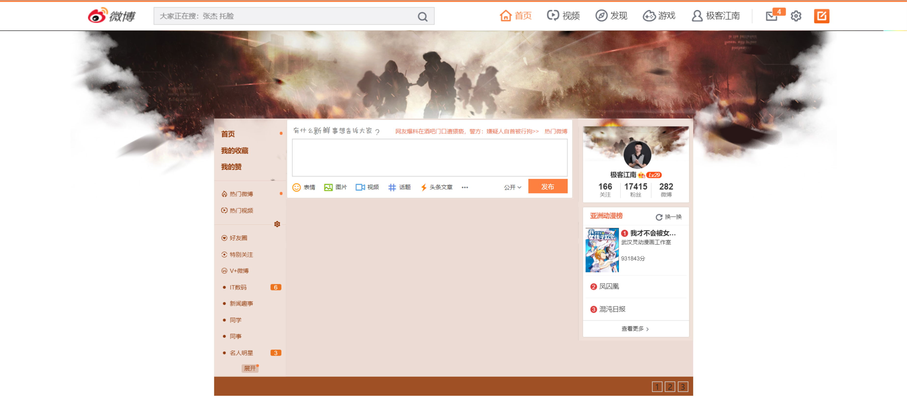
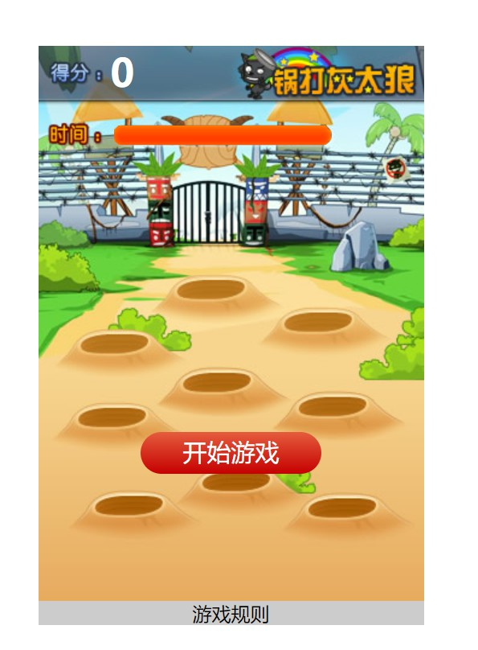

# jQuery

## 新浪微博




html

```html
<!DOCTYPE html>
<html lang="zh-CN">
<head>
    <meta charset="UTF-8">
    <title>新浪微博</title>
    <link rel="stylesheet" href="css/index.css">
    <script src="js/jquery-1.12.4.js"></script>
    <script src="js/index.js"></script>
</head>
<body>
<div class="nav">
    
</div>

<div class="content">
    
    <div class="center">
        <textarea class="comment"></textarea>
        <input type="button" value="发布" class="send" disabled>
    </div>
    
    <div class="messageList"></div>
</div>

<div class="page">
    <a href="javascript:;">1</a>
    <a href="javascript:;">2</a>
    <a href="javascript:;">3</a>
</div>

</body>
</html>
```

css

```css
* {
    margin: 0;
    padding: 0;
}

html, body {
    width: 100%;
    height: 100%;
}

body {
    background: url("../images/body_bg.jpg") no-repeat center 0;
}

.nav {
    width: 100%;
    height: 48px;
}

.nav > img {
    width: 100%;
}

.content {
    width: 1000px;
    height: auto;
    overflow: hidden;
    background: #ebdbd4;
    margin: 200px auto 0 auto;
}

.content > .left {
    float: left;
    width: 150px;
}

.content > .right {
    float: right;
    width: 240px;
}

.content > .center {
    float: left;
    width: 600px;
    height: 168px;
    background: url("../images/comment.png") no-repeat 0 0;
    background-size: 600px 168px;
}

.center > .comment {
    width: 570px;
    height: 73px;
    margin-top: 45px;
    margin-left: 15px;
    resize: none;
    border: none;
    outline: none;
}

.center > .send {
    width: 82px;
    height: 30px;
    margin-top: 4px;
    margin-left: 506px;
    border: none;
    background: #fd8040;
    color: white;
}

.content > .messageList {
    width: 600px;
    background: white;
    float: left;
}

.messageList > .info {
    padding: 10px 20px;

}

.info > .infoText {
    line-height: 25px;
    margin-bottom: 10px;
}

.info > .infoOperation {
    width: 100%;
    overflow: hidden;
}

.infoOperation > .infoTime {
    float: left;
    font-size: 13px;
    color: #ccc;
}

.infoOperation > .infoHandle {
    float: right;
    font-size: 13px;
}

.infoHandle > a {
    text-decoration: none;
    color: #ccc;
    background: url("../images/icons.png") no-repeat 0 0;
    padding-left: 25px;
    margin-left: 10px;
}

.infoHandle > a:nth-child(2) {
    background-position: 0 -17px;
}

.infoHandle > a:nth-child(3) {
    background-position: 0 -33px;
}

.page {
    width: 1000px;
    height: 40px;
    background: #9f5024;
    margin: 0 auto;
    text-align: right;
    padding: 10px;
    box-sizing: border-box;
}

.page > a {
    text-decoration: none;
    display: inline-block;
    width: 20px;
    height: 20px;
    border: 1px solid #ccc;
    text-align: center;
    line-height: 20px;
    color: #2b2b2b;
}
```

JS

```javascript
$(function () {
    // 0.监听内容的时时输入
    $("body").delegate(".comment", "propertychange input", function () {
        // 判断是否输入了内容
        if ($(this).val().length > 0) {
            // 让按钮可用
            $(".send").prop("disabled", false);
        } else {
            // 让按钮不可用
            $(".send").prop("disabled", true);
        }
    });
    // 1.监听发布按钮的点击
    $(".send").click(function () {
        // 拿到用户输入的内容
        var $text = $(".comment").val();
        // 根据内容创建节点
        var $weibo = createEle($text);
        // 插入微博
        $(".messageList").prepend($weibo);
    });

    // 2.监听顶点击
    $("body").delegate(".infoTop", "click", function () {
        $(this).text(parseInt($(this).text()) + 1);
    });
    // 3.监听踩点击
    $("body").delegate(".infoDown", "click", function () {
        $(this).text(parseInt($(this).text()) + 1);
    });
    // 4.监听删除点击
    $("body").delegate(".infoDel", "click", function () {
        $(this).parents(".info").remove();
    });

    // 创建节点方法
    function createEle(text) {
        var $weibo = $("<div class=\"info\">\n" +
            "            <p class=\"infoText\">" + text + "</p>\n" +
            "            <p class=\"infoOperation\">\n" +
            "                <span class=\"infoTime\">" + formartDate() + "</span>\n" +
            "                <span class=\"infoHandle\">\n" +
            "                    <a href=\"javascript:;\" class='infoTop'>0</a>\n" +
            "                    <a href=\"javascript:;\" class='infoDown'>0</a>\n" +
            "                    <a href=\"javascript:;\" class='infoDel'>删除</a>\n" +
            "                </span>\n" +
            "            </p>\n" +
            "        </div>");
        return $weibo;
    }

    // 生成时间方法
    function formartDate() {
        var date = new Date();
        // 2018-4-3 21:30:23
        var arr = [date.getFullYear() + "-",
            date.getMonth() + 1 + "-",
            date.getDate() + " ",
            date.getHours() + ":",
            date.getMinutes() + ":",
            date.getSeconds()];
        return arr.join("");

    }
});
```

## 狂拍灰太狼




HTML

```html
<!DOCTYPE html>
<html lang="zh-CN">
<head>
    <meta charset="UTF-8">
    <title>狂拍灰太狼</title>
    <link rel="stylesheet" href="css/index.css">
    <script src="js/jquery-1.12.4.js"></script>
    <script src="js/index.js"></script>
</head>
<body>
<div class="container">
    <h1 class="score">0</h1>
    <div class="progress"></div>
    <button class="start">开始游戏</button>
    <div class="rules">游戏规则</div>
    <div class="rule">
        <p>游戏规则:</p>
        <p>1.游戏时间:60s</p>
        <p>2.拼手速,殴打灰太狼+10分</p>
        <p>3.殴打小灰灰-10分</p>
        <a href="#" class="close">[关闭]</a>
    </div>
    <div class="mask">
        <h1>GAME OVER</h1>
        <button class="reStart">重新开始</button>
    </div>
</div>
</body>
</html>
```

CSS

```css
* {
    margin: 0;
    padding: 0;
}

.container {
    width: 320px;
    height: 480px;
    background: url("../images/game_bg.jpg") no-repeat 0 0;
    margin: 50px auto;
    position: relative;
}

.container > h1 {
    color: white;
    margin-left: 60px;
}

.container > .progress {
    width: 180px;
    height: 16px;
    position: absolute;
    background: url("../images/progress.png") no-repeat 0 0;
    top: 66px;
    left: 63px;
}

.container > .start {
    width: 150px;
    line-height: 35px;
    text-align: center;
    color: white;
    background: linear-gradient(#E55C3D, #C50000);
    border-radius: 20px;
    border: none;
    font-size: 20px;
    position: absolute;
    top: 320px;
    left: 50%;
    margin-left: -75px;
}

.container > .rules {
    width: 100%;
    height: 20px;
    background-color: #cccccc;
    position: absolute;
    left: 0;
    bottom: 0;
    text-align: center;
}

.container > .rule {
    width: 100%;
    height: 100%;
    background-color: rgba(0, 0, 0, 0.5);
    position: absolute;
    left: 0;
    top: 0;
    padding-top: 100px;
    box-sizing: border-box;
    text-align: center;
    display: none;
}

.rule > p {
    line-height: 50px;
    color: white;

}

.rule > a {
    color: red;
}

.container > .mask {
    width: 100%;
    height: 100%;
    background: rgba(0, 0, 0, 0.5);
    position: absolute;
    left: 0;
    top: 0;
    padding-top: 200px;
    box-sizing: border-box;
    text-align: center;
    display: none;
}

.mask > h1 {
    color: #ff4500;
    text-shadow: 3px 3px 0 #fff;
    font-size: 40px;
}


.mask > button {
    width: 150px;
    line-height: 35px;
    text-align: center;
    color: white;
    background: linear-gradient(#74ACCF, #007DDC);
    border-radius: 20px;
    border: none;
    font-size: 20px;
    position: absolute;
    top: 320px;
    left: 50%;
    margin-left: -75px;
}
```

JS

```javascript
$(function () {
    // 1.监听游戏规则的点击
    $(".rules").click(function () {
        $(".rule").stop().fadeIn(100);
    });
    // 2.监听关闭按钮的点击
    $(".close").click(function () {
        $(".rule").stop().fadeOut(100);
    });
	// 3.监听开始游戏按钮的点击
    $(".start").click(function () {
        $(this).stop().fadeOut(100);
		// 调用处理进度条的方法
        progressHandler();
        // 调用处理灰太狼动画的方法
        startWolfAnimation();
    });
    // 4.监听重新开始按钮的点击
    $(".reStart").click(function () {
        $(".mask").stop().fadeOut(100);
        // 调用处理进度条的方法
        progressHandler();
        // 调用处理灰太狼动画的方法
        startWolfAnimation();
    });
	
    // 定义一个专门处理进度条的方法
    function progressHandler() {
        // 重新设置进度条的宽度
        $(".progress").css({
            width: 180
        });
        // 开启定时器处理进度条
        var timer = setInterval(function () {
            // 拿到进度条当前的宽度
            var progressWidth = $(".progress").width();
            // 减少当前的宽度
            progressWidth -= 1;
            // 重新给进度条赋值宽度
            $(".progress").css({
                width: progressWidth
            });
            // 监听进度条是否走完
            if (progressWidth <= 0) {
                // 关闭定时器
                clearInterval(timer);
                // 显示重新开始界面
                $(".mask").stop().fadeIn(100);
                // 停止灰太狼的动画
                stopWolfAnimation();
            }
        }, 100);
    }

    var wolfTimer;
	// 定义一个专门处理灰太狼动画的方法	
    function startWolfAnimation() {
        // 1.定义两个数组保存所有灰太狼和小灰灰的图片
        var wolf_1 = ['./images/h0.png', './images/h1.png', './images/h2.png', './images/h3.png', './images/h4.png', './images/h5.png', './images/h6.png', './images/h7.png', './images/h8.png', './images/h9.png'];
        var wolf_2 = ['./images/x0.png', './images/x1.png', './images/x2.png', './images/x3.png', './images/x4.png', './images/x5.png', './images/x6.png', './images/x7.png', './images/x8.png', './images/x9.png'];
        // 2.定义一个数组保存所有可能出现的位置
        var arrPos = [
            {left: "100px", top: "115px"},
            {left: "20px", top: "160px"},
            {left: "190px", top: "142px"},
            {left: "105px", top: "193px"},
            {left: "19px", top: "221px"},
            {left: "202px", top: "212px"},
            {left: "120px", top: "275px"},
            {left: "30px", top: "295px"},
            {left: "209px", top: "297px"}
        ];
        // 3.创建一个图片
        var $wolfImage = $("");
        // 随机获取图片的位置
        var posIndex = Math.round(Math.random() * 8);
        // 4.设置图片显示的位置
        $wolfImage.css({
            position: "absolute",
            left: arrPos[posIndex].left,
            top: arrPos[posIndex].top
        });
        // 随机获取数组类型
        var wolfType = Math.round(Math.random()) == 0 ? wolf_1 : wolf_2;
        // 5.设置图片的内容
        window.wolfIndex = 0;
        window.wolfIndexEnd = 5;
        // 定时器
        wolfTimer = setInterval(function () {
            if (wolfIndex > wolfIndexEnd) {
                // 在显示到拍打前 删除图片 删除定时器 重新启动startWolfAnimation
                $wolfImage.remove();
                clearInterval(wolfTimer);
                startWolfAnimation();
            }
            // 设置图片
            $wolfImage.attr("src", wolfType[wolfIndex]);
            // 自增
            wolfIndex++;
        }, 300);
        // 6.将图片添加到界面上
        $(".container").append($wolfImage);
        // 7.调用处理游戏规则的方法
        gameRules($wolfImage);
    }

    function gameRules($wolfImage) {
        $wolfImage.one("click", function () {
            // 修改索引
            // 5-9 显示拍打效果
            window.wolfIndex = 5;
            window.wolfIndexEnd = 9;
            // 拿到当前点击图片的地址
            var $src = $(this).attr("src");
            // 根据图片地址判断是否是灰太狼
            var flag = $src.indexOf("h") >= 0;
            // 根据点击的图片类型增减分数
            if (flag) {
                // +10
                $(".score").text(parseInt($(".score").text()) + 10);
            } else {
                // -10
                // console.log("0");
                $(".score").text(parseInt($(".score").text()) - 10);
            }
        })
    }
	// 关闭动画
    function stopWolfAnimation() {
        // 删除照片 定时器
        $(".wolfImage").remove();
        clearInterval(wolfTimer);
    }
});
```


 


## QQ音乐播放器

html

```html
<!DOCTYPE html>
<html lang="zh-CN">
<head>
    <meta charset="UTF-8">
    <title>QQ音乐播放器 - NJ</title>
    <link rel="stylesheet" href="css/jquery.mCustomScrollbar.css">
    <link rel="stylesheet" href="css/index.css">
    <script src="js/jquery-1.12.4.js"></script>
    <script src="js/jquery.mCustomScrollbar.concat.min.js"></script>
    <script src="js/player.js"></script>
    <script src="js/progress.js"></script>
    <script src="js/lyric.js"></script>
    <script src="js/index.js"></script>

</head>
<body>
<div class="header">
    <h1 class="logo"><a href="#"></a></h1>
    <ul class="register">
        <li>登录</li>
        <li>设置</li>
    </ul>
</div>
<div class="content">
    <div class="content_in">
        <div class="content_left">
            <div class="content_toolbar">
                <span><i></i>收藏</span>
                <span><i></i>添加到</span>
                <span><i></i>下载</span>
                <span><i></i>删除</span>
                <span><i></i>清空列表</span>
            </div>
            <div class="content_list" data-mcs-theme="minimal-dark">
                <ul>
                    <li class="list_title">
                        <div class="list_check"><i></i></div>
                        <div class="list_number"></div>
                        <div class="list_name">歌曲</div>
                        <div class="list_singer">歌手</div>
                        <div class="list_time">时长</div>
                    </li>

                </ul>
            </div>
        </div>
        <div class="content_right">
            <div class="song_info">
                <a href="javascript:;" class="song_info_pic">
                    
                </a>
                <div class="song_info_name">歌曲名称
                    <a href="javascript:;">As long as you love me</a>
                </div>
                <div class="song_info_singer">歌手名
                    <a href="javascript:;">AOA</a>
                </div>
                <div class="song_info_album">专辑名
                    <a href="javascript:;">Hot</a>
                </div>

            </div>
            <div class="song_lyric_container">
                <ul class="song_lyric">
                    <!--<li class="cur">歌词</li>-->
                    <!--<li>歌词</li>-->
                </ul>
            </div>

        </div>
    </div>
</div>
<div class="footer">
    <div class="footer_in">
        <a href="javascript:;" class="music_pre"></a>
        <a href="javascript:;" class="music_play"></a>
        <a href="javascript:;" class="music_next"></a>
        <div class="music_progress_info">
            <div class="music_progress_top">
                <span class="music_progress_name">As long as you love me / AOA</span>
                <span class="music_progress_time">00:00 / 05:23</span>
            </div>
            <div class="music_progress_bar">
                <div class="music_progress_line">
                    <div class="music_progress_dot"></div>
                </div>
            </div>
        </div>
        <a href="javascript:;" class="music_mode music_mode3"></a>
        <a href="javascript:;" class="music_fav music_fav2"></a>
        <a href="javascript:;" class="music_down"></a>
        <a href="javascript:;" class="music_comment"></a>
        <a href="javascript:;" class="music_only music_only2"></a>
        <div class="music_voice_info">
            <a href="javascript:;" class="music_voice_icon"></a>
            <div class="music_voice_bar">
                <div class="music_voice_line">
                    <div class="music_voice_dot"></div>
                </div>
            </div>
        </div>
    </div>
</div>
<div class="mask_bg"></div>
<div class="mask"></div>
<audio src=""></audio>
</body>
</html>
```

index.css

```css
* {
    margin: 0;
    padding: 0
}

html, body {
    width: 100%;
    height: 100%;
    font-size: 14px;
}

.header {
    width: 100%;
    height: 45px;
    /*background-color: red;*/

}

.header .logo {
    float: left;
    margin-left: 20px;
    opacity: 0.5;
}

.header .logo:hover {
    opacity: 1;
}

.header .logo a {
    display: inline-block;
    height: 21px;
    width: 78px;
    background: url("../images/player_logo.png") no-repeat 0 0;
}

.header .register {
    float: right;
    line-height: 45px;
}

.header .register li {
    list-style: none;
    float: left;
    margin-right: 20px;
    color: #fff;
    opacity: 0.5;
}

.header .register li:hover {
    opacity: 1;
}

.content {
    width: 100%;
    height: 460px;
    /*background-color: blue;*/
}

.content .content_in {
    width: 1200px;
    height: 100%;
    /*background-color: deeppink;*/
    margin: 0 auto;
}


.content_in .content_left {
    float: left;
    width: 800px;
    height: 100%;
    /*background-color: pink;*/
}

.content_left .content_toolbar {
    width: 100%;
    height: 40px;
    /*background-color: #000;*/
}

.content_toolbar span {
    display: inline-block;
    width: 120px;
    height: 100%;
    line-height: 40px;
    text-align: center;
    border: 1px solid #ffffff;
    box-sizing: border-box;
    border-radius: 5px;
    color: #fff;
    opacity: 0.5;
}

.content_toolbar span:hover {
    opacity: 1;
}

.content_toolbar span i {
    display: inline-block;
    width: 18px;
    height: 18px;
    background: url("../images/icon_sprite.png") no-repeat 0 0;
    margin-right: 10px;
    vertical-align: -5px;
}

.content_toolbar span:nth-child(1) i {
    background-position: -60px -20px;
}

.content_toolbar span:nth-child(2) i {
    background-position: -20px -20px;
}

.content_toolbar span:nth-child(3) i {
    background-position: -40px -240px;
}

.content_toolbar span:nth-child(4) i {
    background-position: -100px -20px;
}

.content_toolbar span:nth-child(5) i {
    background-position: -40px -300px;
}

.content_left .content_list {
    width: 100%;
    height: 420px;
    /*background-color: purple;*/
    overflow: auto;
}

.content_list li {
    list-style: none;
    height: 50px;
    width: 100%;
    /*background: orangered;*/
    border-bottom: 1px solid rgba(255, 255, 255, 0.5);
    box-sizing: border-box;
    user-select: none;
}

.content_list li div {
    float: left;
    color: rgba(255, 255, 255, 0.5);
    line-height: 50px;
    /*opacity: 0.5;*/
}

.content_list .list_check {
    width: 50px;
    height: 100%;
    /*background: #000000;*/
    text-align: center;

}

.content_list .list_check i {
    display: inline-block;
    width: 14px;
    height: 14px;
    border: 1px solid #fff;
    opacity: 0.5;
}

.content_list .list_checked i {
    background: url("../images/icon_sprite.png") no-repeat -60px -80px;
    opacity: 1;
}

.content_list .list_number {
    width: 20px;
    height: 100%;
    /*background: green;*/
}

.content_list .list_number2 {
    color: transparent !important;
    background: url("../images/wave.gif") no-repeat 0 center;
}

.content_list .list_name {
    width: 50%;
    height: 100%;
}

.list_name .list_menu {
    margin-top: 5px;
    float: right;
    margin-right: 20px;
    display: none;
}

.list_menu a {
    display: inline-block;
    width: 36px;
    height: 36px;
    background: url("../images/icon_list_menu.png") no-repeat 0 0;
    opacity: 0.5;
    /*display: none;*/
}

.list_menu a:hover {
    opacity: 1;
}

.list_menu a:nth-child(1) {
    background-position: -120px 0;
}

.list_menu a:nth-child(2) {
    background-position: -120px -80px;
}

.list_menu a:nth-child(3) {
    background-position: -120px -120px;
}

.list_menu a:nth-child(4) {
    background-position: -120px -40px;
}

.list_menu .list_menu_play2 {
    background-position: -80px -200px !important;
}

.content_list .list_singer {
    width: 20%;
    height: 100%;
    /*background: #000;*/
}

.content_list .list_time a {
    display: inline-block;
    width: 36px;
    height: 36px;
    background: url("../images/icon_list_menu.png") no-repeat -120px -160px;
    float: left;
    margin-top: 5px;
    display: none;
    opacity: 0.5;
}

.content_list .list_time a:hover {
    opacity: 1;
}

.content_in .content_right {
    float: right;
    width: 400px;
    height: 100%;
    user-select: none;
    /*background-color: #ccc;*/
}

.content_right .song_info {
    text-align: center;
    color: rgba(255, 255, 255, 0.5);
}

.song_info .song_info_pic {
    display: inline-block;
    background: url("../images/album_cover_player.png") no-repeat 0 0;
    width: 201px;
    height: 180px;
    text-align: left;
}

.song_info_pic img {
    width: 180px;
    height: 180px;
}

.song_info div a {
    text-decoration: none;
    color: #fff;
    opacity: 0.5;
    line-height: 30px;
}

.song_info div a:hover {
    opacity: 1;
}

.content_right .song_lyric_container {
    margin-top: 30px;
    height: 150px;
    overflow: hidden;
    /*background: red;*/
}

.content_right .song_lyric {
    /*background: green;*/
    text-align: center;

    /*background: #cccccc;*/
}

.content_right .song_lyric li {
    list-style: none;
    line-height: 30px;
    color: rgba(255, 255, 255, 0.5);
    font-weight: bold;
}

.content_right .song_lyric .cur {
    color: #31c27c;
}

.footer {
    width: 100%;
    height: 80px;
    /*background-color: green;*/
    position: absolute;
    left: 0;
    bottom: 0;
}

.footer .footer_in {
    width: 1200px;
    height: 100%;
    /*background-color: plum;*/
    margin: 0 auto;
    user-select: none;
}

.footer_in a {
    display: inline-block;
    text-decoration: none;
    color: #fff;
    background: url("../images/player.png") no-repeat 0 0;
    margin-right: 20px;
}

.footer_in .music_pre {
    width: 19px;
    height: 20px;
    background-position: 0 -30px;
}

.footer_in .music_play {
    width: 21px;
    height: 29px;
    background-position: 0 0;
    vertical-align: -5px;
}

.footer_in .music_play2 {
    background-position: -30px 0;
}

.footer_in .music_next {
    width: 19px;
    height: 20px;
    background-position: 0 -52px;
}

.footer_in .music_progress_info {
    display: inline-block;
    width: 670px;
    height: 40px;
    /*background: red;*/
    position: relative;
    top: 10px;
}

.music_progress_info .music_progress_top {
    width: 100%;
    height: 30px;
    line-height: 30px;
    color: #fff;
    /*background: #000;*/
}

.music_progress_top .music_progress_name {
    float: left;
    opacity: 0.5;
}

.music_progress_top .music_progress_name:hover {
    opacity: 1;
}

.music_progress_top .music_progress_time {
    float: right;
    opacity: 0.5;
}

.music_progress_info .music_progress_bar {
    width: 100%;
    height: 4px;
    background: rgba(255, 255, 255, 0.5);
    margin-top: 5px;
    position: relative;
}

.music_progress_bar .music_progress_line {
    width: 0px;
    height: 100%;
    background: #fff;
}

.music_progress_line .music_progress_dot {
    width: 14px;
    height: 14px;
    border-radius: 50%;
    background: #fff;
    position: absolute;
    top: -5px;
    left: 0px;
}

.footer_in .music_mode {
    width: 26px;
    height: 25px;
    background-position: 0 -205px;
}

.footer_in .music_mode2 {
    width: 23px;
    height: 20px;
    background-position: 0 -260px;
}

.footer_in .music_mode3 {
    width: 25px;
    height: 19px;
    background-position: 0 -74px;
}

.footer_in .music_mode4 {
    width: 26px;
    height: 25px;
    background-position: 0 -232px
}

.footer_in .music_fav {
    width: 24px;
    height: 21px;
    background-position: 0 -96px;
}

.footer_in .music_fav2 {
    background-position: -30px -96px;
}

.footer_in .music_down {
    width: 22px;
    height: 21px;
    background-position: 0 -120px;
}

.footer_in .music_comment {
    width: 24px;
    height: 24px;
    background-position: 0 -400px;
}

.footer_in .music_only {
    width: 74px;
    height: 27px;
    background-position: 0 -281px;
}

.footer_in .music_only2 {
    background-position: 0 -310px;
}

.footer_in .music_play2 {
    background-position: -30px 0;
}

.footer_in .music_voice_info {
    display: inline-block;
    width: 100px;
    height: 40px;
    /*background: green;*/
    position: relative;
    top: 10px;
}

.music_voice_info .music_voice_icon {
    width: 26px;
    height: 21px;
    background-position: 0 -144px;
    position: absolute;
    left: 0;
    top: 10px;
}

.music_voice_info .music_voice_icon2 {
    background-position: 0 -182px;
}

.music_voice_info .music_voice_bar {
    width: 70px;
    height: 4px;
    background: rgba(255, 255, 255, 0.5);
    position: absolute;
    right: 0;
    top: 18px;
}

.music_voice_bar .music_voice_line {
    width: 70px;
    height: 100%;
    background: #fff;
}

.music_voice_line .music_voice_dot {
    width: 14px;
    height: 14px;
    border-radius: 50%;
    background: #fff;
    position: relative;
    top: -5px;
    left: 70px;
}

.mask_bg {
    position: absolute;
    left: 0;
    top: 0;
    z-index: -2;
    width: 100%;
    height: 100%;
    background: url("../images/lnj.jpg") no-repeat 0 0;
    background-size: cover;
    filter: blur(100px);
}

.mask {
    position: absolute;
    left: 0;
    top: 0;
    z-index: -1;
    width: 100%;
    height: 100%;
    background: rgba(0, 0, 0, 0.35);
}

._mCS_1 .mCSB_scrollTools .mCSB_dragger_bar {
    width: 8px;
}
```

index.js

```javascript
$(function () {

    // 0.自定义滚动条
    $(".content_list").mCustomScrollbar();

    var $audio = $("audio");
    var player = new Player($audio);
    var progress;
    var voiceProgress;
    var lyric;

    // 1.加载歌曲列表
    getPlayerList();

    function getPlayerList() {
        $.ajax({
            url: "./source/musiclist.json",
            dataType: "json",
            success: function (data) {
                player.musicList = data;
                // 3.1遍历获取到的数据, 创建每一条音乐
                var $musicList = $(".content_list ul");
                $.each(data, function (index, ele) {
                    var $item = crateMusicItem(index, ele);
                    $musicList.append($item);
                });
                initMusicInfo(data[0]);
                initMusicLyric(data[0]);
            },
            error: function (e) {
                console.log(e);
            }
        });
    }

    // 2.初始化歌曲信息
    function initMusicInfo(music) {
        // 获取对应的元素
        var $musicImage = $(".song_info_pic img");
        var $musicName = $(".song_info_name a");
        var $musicSinger = $(".song_info_singer a");
        var $musicAblum = $(".song_info_ablum a");
        var $musicProgressName = $(".music_progress_name");
        var $musicProgressTime = $(".music_progress_time");
        var $musicBg = $(".mask_bg");
        // var $musicImage = $(".song_info images");

        // 给获取到的元素赋值

        $musicImage.attr("src", music.cover);
        $musicName.text(music.name);
        $musicSinger.text(music.singer);
        $musicAblum.text(music.album);
        $musicProgressName.text(music.name + " / " + music.singer);
        $musicProgressTime.text("00:00 / " + music.time);
        $musicBg.css("background", "url('" + music.cover + "')");
    }

    // 3 初始化歌词信息
    function initMusicLyric(music) {
        lyric = new Lyric(music.link_lrc);
        var $lryicContainer = $(".song_lyric");
        // 清空上一首音乐的歌词
        $lryicContainer.html("");
        lyric.loadLyric(function () {
            // 创建歌词列表
            var $lryicContainer = $(".song_lyric");
            $.each(lyric.lyrics, function (index, ele) {
                var $item = $("<li>" + ele + "</li>");
                $lryicContainer.append($item);
            });
        });
    }

    // 3.初始化进度条
    initProgress();

    function initProgress() {
        var $progressBar = $(".music_progress_bar");
        var $progressLine = $(".music_progress_line");
        var $progressDot = $(".music_progress_dot");
        progress = Progress($progressBar, $progressLine, $progressDot);

        progress.progressClick(function (value) {
            player.musicSeekTo(value);
        });
        progress.progressMove(function (value) {
            player.musicSeekTo(value);
        });

        var $voiceBar = $(".music_voice_bar");
        var $voiceLine = $(".music_voice_line");
        var $voiceDot = $(".music_voice_dot");
        voiceProgress = Progress($voiceBar, $voiceLine, $voiceDot);
        voiceProgress.progressClick(function (value) {
            player.musicVoiceSeekTo(value);
        });
        voiceProgress.progressMove(function (value) {
            player.musicVoiceSeekTo(value);
        });
    }

    // 4.初始化事件监听
    ininEvents();

    function ininEvents() {
        // 1.监听歌曲的移入移出事件
        $(".content_list").delegate(".list_music", "mouseenter", function () {
            // 显示子菜单
            $(this).find(".list_menu").stop().fadeIn(100);
            $(this).find(".list_time a").stop().fadeIn(100);
            // 隐藏时长
            $(this).find(".list_time span").stop().fadeOut(100);
        });
        $(".content_list").delegate(".list_music", "mouseleave", function () {
            // 隐藏子菜单
            $(this).find(".list_menu").stop().fadeOut(100);
            $(this).find(".list_time a").stop().fadeOut(100);
            // 显示时长
            $(this).find(".list_time span").stop().fadeIn(100);
        });

        // 2.监听复选框的点击事件
        $(".content_list").delegate(".list_check", "click", function () {
            $(this).toggleClass("list_checked");
        });

        // 3.添加子菜单播放按钮的监听
        var $musicPlay = $(".music_play");

        $(".content_list").delegate(".list_menu_play", "click", function () {
            var $item = $(this).parents(".list_music");
            console.log($item.get(0).index);
            console.log($item.get(0).music);
            // 3.1切换播放图标
            $(this).toggleClass("list_menu_play2");
            // 3.2复原其它的播放图标
            $(this).parents(".list_music").siblings().find(".list_menu_play").removeClass("list_menu_play2");

            // 3.3同步底部播放按钮
            if ($(this).attr("class").indexOf("list_menu_play2") != -1) {
                // var $item = $(this).parents(".list_music");

                $musicPlay.addClass("music_play2");
                // 让文字高亮
                $item.find("div").css("color", "#fff");
                $item.siblings().find("div").css("color", "rgba(255,255,255,0.5)");
            } else {
                $musicPlay.removeClass("music_play2");
                // 让文字不高亮
                $item.find("div").css("color", "rgba(255,255,255,0.5)");
                $item.find("div").css("color", "rgba(255,255,255,0.5)");
            }
            //3.4 切换序号的状态
            $item.find(".list_number").toggleClass("list_number2");
            $item.siblings().find(".list_number").removeClass("list_number2");

            // 3.5播放音乐
            player.playMusic($item.get(0).index, $item.get(0).music);

            // 3.6切换歌曲信息
            initMusicInfo($item.get(0).music);
            initMusicLyric($item.get(0).music);
        });

        // 4.监听底部控制区域播放按钮的点击
        $musicPlay.click(function () {
            // 判断有没有播放过音乐
            if (player.currentIndex == -1) {
                // 没有播放过音乐
                $(".list_music").eq(0).find(".list_menu_play").trigger("click");
            } else {
                // 已经播放过音乐
                $(".list_music").eq(player.currentIndex).find(".list_menu_play").trigger("click");
            }
        });

        // 5.监听底部控制区域上一首按钮的点击
        $(".music_pre").click(function () {
            $(".list_music").eq(player.preIndex()).find(".list_menu_play").trigger("click");
        });

        // 6.监听底部控制区域下一首按钮的点击
        $(".music_next").click(function () {
            $(".list_music").eq(player.nextIndex()).find(".list_menu_play").trigger("click");
        });

        // 7.监听删除按钮的点击
        $(".content_list").delegate(".list_menu_del", "click", function () {
            // 找到被点击的音乐
            var $item = $(this).parents(".list_music");

            // 判断当前删除的是否是正在播放的
            if ($item.get(0).index == player.currentIndex) {
                $(".music_next").trigger("click");
            }

            $item.remove();
            player.changeMusic($item.get(0).index);

            // 重新排序
            $(".list_music").each(function (index, ele) {
                ele.index = index;
                $(ele).find(".list_number").text(index + 1);
            });

        });

        // 8.监听播放的进度
        player.musicTimeUpdate(function (duration, currentTime, timeStr) {
            // 同步时间
            $(".music_progress_time").text(timeStr);
            // 同步进度条
            // 计算播放比例
            var value = currentTime / duration * 100;
            progress.setProgress(value);
            // 实现歌词同步
            var index = lyric.currentIndex(currentTime);
            var $item = $(".song_lyric li").eq(index);
            $item.addClass("cur");
            $item.siblings().removeClass("cur");

            // 实现歌词滚动
            if (index <= 2) return;
            $(".song_lyric").css({
                marginTop: (-index + 2) * 30
            });
        });

        // 9.监听声音按钮的点击
        $(".music_voice_icon").click(function () {
            // 图标切换
            $(this).toggleClass("music_voice_icon2");
            if ($(this).hasClass("music_voice_icon2")) {
                // 变为没有声音
                player.musicVoiceSeekTo(0);
            } else {
                // 变为有声音
                player.musicVoiceSeekTo(1);
            }
        });

    }


    // 定义一个方法创建一条音乐
    function crateMusicItem(index, music) {
        var $item = $("" +
            "<li class=\"list_music\">\n" +
            "<div class=\"list_check\"><i></i></div>\n" +
            "<div class=\"list_number \">" + (index + 1) + "</div>\n" +
            "<div class=\"list_name\">" + music.name + "" +
            "     <div class=\"list_menu\">\n" +
            "          <a href=\"javascript:;\" title=\"播放\" class='list_menu_play'></a>\n" +
            "          <a href=\"javascript:;\" title=\"添加\"></a>\n" +
            "          <a href=\"javascript:;\" title=\"下载\"></a>\n" +
            "          <a href=\"javascript:;\" title=\"分享\"></a>\n" +
            "     </div>\n" +
            "</div>\n" +
            "<div class=\"list_singer\">" + music.singer + "</div>\n" +
            "<div class=\"list_time\">\n" +
            "     <span>" + music.time + "</span>\n" +
            "     <a href=\"javascript:;\" title=\"删除\" class='list_menu_del'></a>\n" +
            "</div>\n" +
            "</li>");

        $item.get(0).index = index;
        $item.get(0).music = music;

        return $item;
    }
});
```

lyric.js

```javascript
(function (window) {
    function Lyric(path) {
        return new Lyric.prototype.init(path);
    }

    Lyric.prototype = {
        constructor: Lyric,
        init: function (path) {
            this.path = path;
        },
        times: [],
        lyrics: [],
        index: -1,
        loadLyric: function (callBack) {
            var $this = this;
            $.ajax({
                url: $this.path,
                dataType: "text",
                success: function (data) {
                    // console.log(data);
                    $this.parseLyric(data);
                    callBack();
                },
                error: function (e) {
                    console.log(e);
                }
            });
        },
        parseLyric: function (data) {
            var $this = this;
            // 一定要清空上一首歌曲的歌词和时间
            $this.times = [];
            $this.lyrics = [];
            var array = data.split("\n");
            var timeReg = /\[(\d*:\d*\.\d*)\]/;
            // console.log(array);
            $.each(array, function (index, ele) {
                // 处理歌词
                var lrc = ele.split("]")[1];
                // 排除空字符串(没有歌词的)
                if (lrc.length == 1) return true;
                $this.lyrics.push(lrc);

                var res = timeReg.exec(ele);
                // console.log(res);
                if (res == null) return true;
                var timeStr = res[1]; // 00:00.92
                var res2 = timeStr.split(":");
                var min = parseInt(res2[0]) * 60;
                var sec = parseFloat(res2[1]);
                var time = parseFloat(Number(min + sec).toFixed(2));
                // console.log(time);
                $this.times.push(time);

                // var lrc = ele.split("]")[1];
                // // console.log(lrc);
                // $this.lyrics.push(lrc);
            });
            console.log($this.times);
            console.log($this.lyrics);
        },
        currentIndex: function (currentTime) {
            // console.log(currentTime);
            if (currentTime >= this.times[0]) {
                this.index++;
                this.times.shift();
            }
            return this.index;
        }

    };
    Lyric.prototype.init.prototype = Lyric.prototype;
    window.Lyric = Lyric;
})(window);
```

player.js

```javascript
(function (window) {
    function Player($audio) {
        return new Player.prototype.init($audio);
    }

    Player.prototype = {
        constructor: Player,
        musicList: [],
        init: function ($audio) {
            this.$audio = $audio;
            this.audio = $audio.get(0);
        },
        currentIndex: -1, // 4  3
        playMusic: function (index, music) {
            // 判断是否是同一首音乐
            if (this.currentIndex == index) {
                // 同一首音乐
                if (this.audio.paused) {
                    this.audio.play();
                } else {
                    this.audio.pause();
                }
            } else {
                // 不是同一首
                this.$audio.attr("src", music.link_url);
                this.audio.play();
                this.currentIndex = index;
            }
        },
        preIndex: function () {
            var index = this.currentIndex - 1;
            if (index < 0) {
                index = this.musicList.length - 1;
            }
            return index;
        },
        nextIndex: function () {
            var index = this.currentIndex + 1;
            if (index > this.musicList.length - 1) {
                index = 0;
            }
            return index;
        },
        changeMusic: function (index) {
            // 删除对应的数据
            this.musicList.splice(index, 1);

            // 判断当前删除的是否是正在播放音乐的前面的音乐
            if (index < this.currentIndex) {
                this.currentIndex = this.currentIndex - 1;
            }
        },

        musicTimeUpdate: function (callBack) {
            var $this = this;
            this.$audio.on("timeupdate", function () {
                // console.log("正在播放音乐");
                // console.log(player.getMusicDuration(),player.getMusicCurrentTime());
                var duration = $this.audio.duration;
                var currentTime = $this.audio.currentTime;
                var timeStr = $this.formatTime(currentTime, duration);
                // console.log(timeStr);
                // $(".music_progress_time").text(timeStr);
                callBack(duration, currentTime, timeStr);
            });
        },
        formatTime: function (currentTime, duration) {
            var endMin = parseInt(duration / 60);
            var endSec = parseInt(duration % 60);
            if (endMin < 10) {
                endMin = "0" + endMin;
            }
            if (endSec < 10) {
                endSec = "0" + endSec;
            }
            var startMin = parseInt(currentTime / 60);
            var startSec = parseInt(currentTime % 60);
            if (startMin < 10) {
                startMin = "0" + startMin;
            }
            if (startSec < 10) {
                startSec = "0" + startSec;
            }

            return startMin + ":" + startSec + "/" + endMin + ":" + endSec;
        },
        musicSeekTo: function (value) {
            if (isNaN(value)) return;
            this.audio.currentTime = this.audio.duration * value;
        },
        musicVoiceSeekTo: function (value) {
            if (isNaN(value)) return;
            if (value < 0 || value > 1) return;
            // 0~1
            this.audio.volume = value;
        }

    };
    Player.prototype.init.prototype = Player.prototype;
    window.Player = Player;
})(window);
```

progress.js

```javascript
(function (window) {
    function Progress($progressBar, $progressLine, $progressDot) {
        return new Progress.prototype.init($progressBar, $progressLine, $progressDot);
    }

    Progress.prototype = {
        constructor: Progress,
        init: function ($progressBar, $progressLine, $progressDot) {
            this.$progressBar = $progressBar;
            this.$progressLine = $progressLine;
            this.$progressDot = $progressDot;
        },
        isMove: false,
        progressClick: function (callBack) {
            var $this = this; // 此时此刻的this是progress
            this.$progressBar.click(function (event) {
                var normalLeft = $(this).offset().left;
                // console.log(normalLeft);
                var eventLeft = event.pageX;
                // console.log(eventLeft);
                $this.$progressLine.css("width", eventLeft - normalLeft);
                $this.$progressDot.css("left", eventLeft - normalLeft);
                // 计算进度条的比例
                var value = (eventLeft - normalLeft) / $(this).width();
                callBack(value);

            });
        },
        progressMove: function (callBack) {
            var $this = this;
            var normalLeft = this.$progressBar.offset().left;
            var barWidth = this.$progressBar.width();
            var eventLeft;
            // 1.监听鼠标的按下事件
            this.$progressBar.mousedown(function () {
                $this.isMove = true;
                // 2.监听鼠标的移动事件
                $(document).mousemove(function (event) {
                    eventLeft = event.pageX;
                    var offset = eventLeft - normalLeft;
                    if (offset >= 0 && offset <= barWidth) {
                        // console.log(eventLeft);
                        $this.$progressLine.css("width", eventLeft - normalLeft);
                        $this.$progressDot.css("left", eventLeft - normalLeft);
                    }


                });
            });
            // 3.监听鼠标的抬起事件
            $(document).mouseup(function () {
                $(document).off("mousemove");
                $this.isMove = false;
                // 计算进度条的比例
                var value = (eventLeft - normalLeft) / $this.$progressBar.width();
                callBack(value);
            });
        },
        setProgress: function (value) {
            if (this.isMove) return;
            if (value < 0 || value > 100) return;
            this.$progressLine.css({
                width: value + "%"
            });
            this.$progressDot.css({
                left: value + "%"
            });
        }
    };
    Progress.prototype.init.prototype = Progress.prototype;
    window.Progress = Progress;
})(window);
```

<a href="manos.malihu.gr/jquery-custom-content-scroller/">滚动条框架</a>

