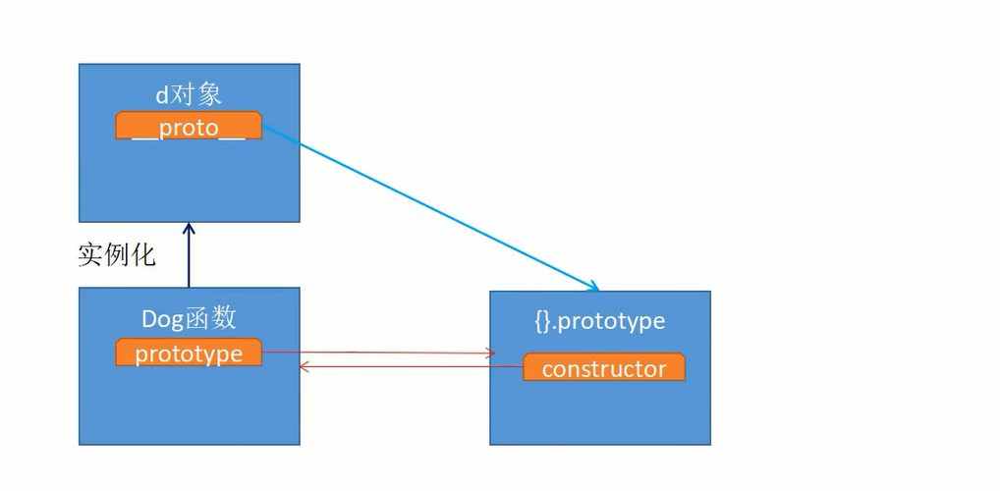
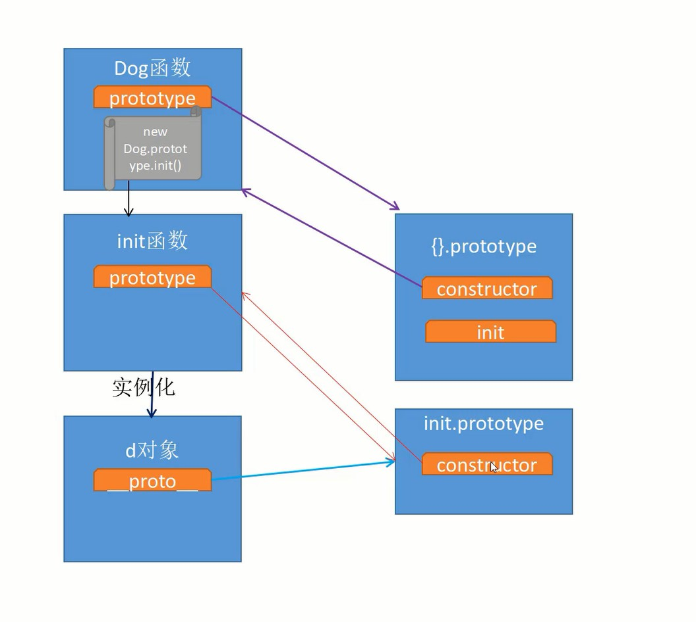
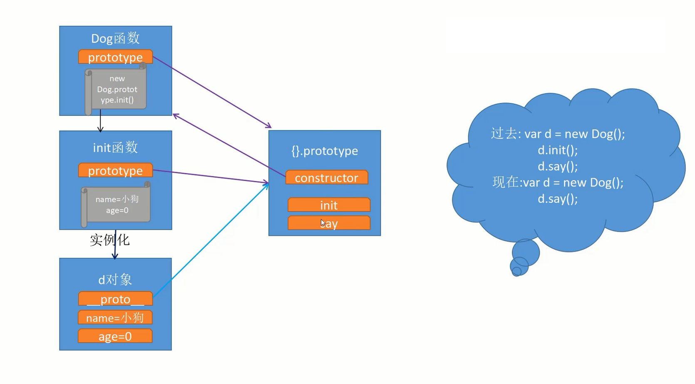
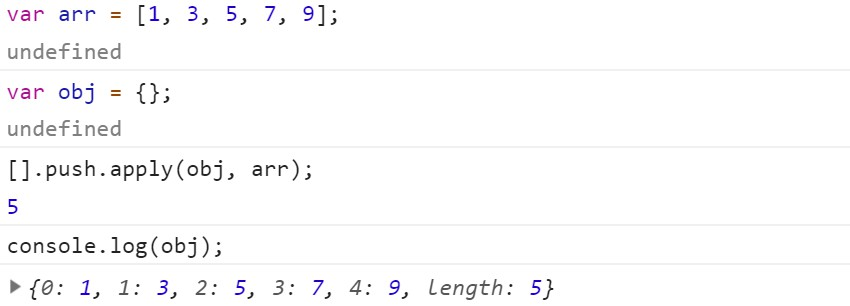
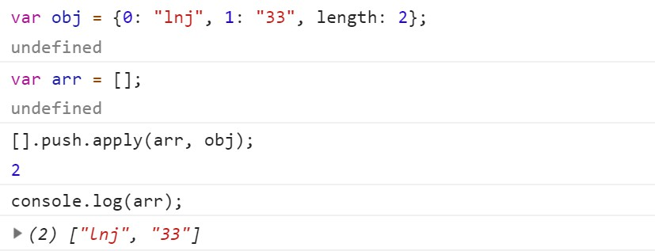
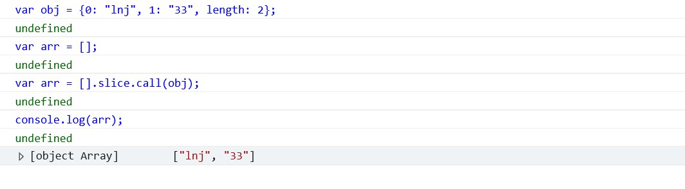
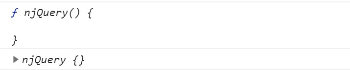
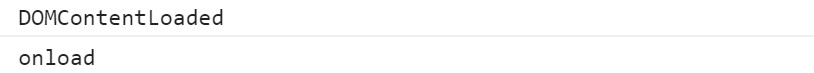
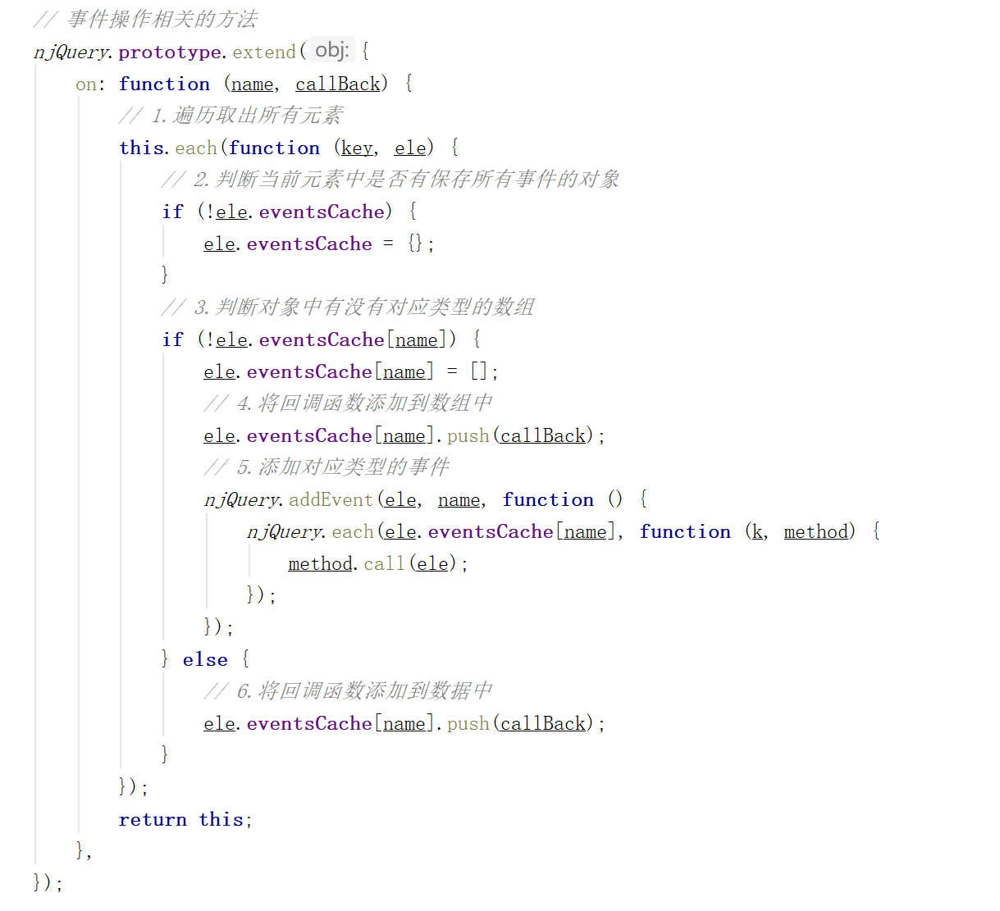

# jQuery原理

## 面向对象








```javascript
function Dog() {
    return new Dog.prototype.init();
}

Dog.prototype = {
    constructor: Dog,
    init: function () {
        this.name = "wc";
        this.age = 1;
    },
    say: function () {
        console.log(this.name, this.age);

    }
};

Dog.prototype.init.prototype = Dog.prototype;

var d = new Dog();
d.say();

// console.log(d.__proto__);
// console.log(Dog.prototype);
```


## jQuery的基本结构

```html
<!DOCTYPE html>
<html lang="zh-CN">
<head>
    <meta charset="UTF-8">
    <title>01-jQuery的基本结构</title>
    <script>
        /*
        1.jQuery的本质是一个闭包，立即执行函数
        2.jQuery为什么要使用闭包来实现?
          为了避免多个框架的冲突
        3.jQuery如何让外界访问内部定义的局部变量
          变成全局变量，window.xxx = xxx;
        4.jQuery为什么要给自己传递一个window参数?
          为了方便后期压缩代码，提升查找的效率
        5.jQuery为什么要给自己接收一个undefined参数?
          为了方便后期压缩代码
          IE9以下的浏览器undefined可以被修改, 为了保证内部使用的undefined不被修改, 
          所以需要接收一个正确的undefined。
        */
        (function (window, undefined) {
            var jQuery = function () {
                return new jQuery.prototype.init();
            }
            jQuery.prototype = {
                constructor: jQuery
            }
            jQuery.prototype.init.prototype = jQuery.prototype;
            window.jQuery = window.$ = jQuery;
        })(window);

        
        (function f1() {
            var num = 10;
            window.num = num;
        })();
        (function f2() {
            var num = 20;
        })();
        console.log(num);

        var value = 20;

        function f3() {
            // var value = 10;
            console.log(value);
        }

        f3();

        undefined = 998;
        console.log(undefined);
    </script>
</head>
<body>

</body>
</html>
```

## jQuery入口函数测试

```html
<!DOCTYPE html>
<html lang="zh-CN">
<head>
    <meta charset="UTF-8">
    <title>02-jQuery入口函数测试</title>
    <script src="js/jquery-1.12.4.js"></script>
    <script>
        $(function () {
            /*
             jQ入口函数传入不同参数得到的实例
          */
            //  1.传入 '' null undefined NaN 0 false
            //  会返回一个空的jQuery对象给我们
            console.log($());
            console.log($(''));
            console.log($(null));
            console.log($(undefined));
            console.log($(NaN));
            console.log($(0));
            console.log($(false));

            // 2.传入html片段
            // 会将创建好的DOM元素存储到jQuery对象中返回
            console.log($('<p>1</p><p>2</p><p>3</p>'));
            console.log($('    <div><p>1</p></div><div><p>2</p></div>    '));

            // 3.传入选择器
            // 会将找到的所有元素存储到jQuery对象中返回
            console.log($('li'));

            // 4.传入数组
            // 会将数组中存储的元素依次存储到jQuery对象中立返回
            var arr = [1, 2, 3, 4, 5, 6];
            console.log($(arr));

            // 5.传入伪数组
            // 会将数组中存储的元素依次存储到jQuery对象中立返回
            var likeArr = {0: "lnj", 1: "33", 2: "male", length: 3};
            console.log($(likeArr));

            // 6.传入对象
            // 会将传入的对象存储到jQuery对象中返回
            function Person() {
            }

            console.log($(new Person()));

            // 7.传入DOM元素
            // 会将传入的DOM元素存储到jQuery对象中返回
            console.log($(document.createElement('div')));

            // 8.传入基本数据类型
            // 会将传入的基本数据类型存储到jQuery对象中返回
            console.log($(123));
            console.log($(true));

            /*
             1.传入 '' null undefined NaN  0  false, 返回空的jQuery对象
             2.字符串:
             代码片段:会将创建好的DOM元素存储到jQuery对象中返回
             选择器: 会将找到的所有元素存储到jQuery对象中返回
             3.数组:
             会将数组中存储的元素依次存储到jQuery对象中立返回
             4.除上述类型以外的:
             会将传入的数据存储到jQuery对象中返回
            */
        })


    </script>
</head>
<body>
<ul>
    <li class="item">ul中的li1</li>
    <li class="item">ul中的li2</li>
    <li class="item">ul中的li3</li>
</ul>
</body>
</html>
```

```html
<!DOCTYPE html>
<html lang="zh-CN">
<head>
    <meta charset="UTF-8">
    <title>02-jQuery入口函数测试</title>
    <script src="js/njQuery-1.0.0.js"></script>
    <script>
        window.onload = function (ev) {
            /*
            jQ入口函数传入不同参数得到的实例
             */
            //  1.传入 '' null undefined NaN  0  false
            // 会返回一个空的jQuery对象给我们
            console.log($());
            console.log($(''));
            console.log($(null));
            console.log($(undefined));
            console.log($(NaN));
            console.log($(0));
            console.log($(false));

            // 2.传入html片段
            // 会将创建好的DOM元素存储到jQuery对象中返回
            console.log($('<p>1</p><p>2</p><p>3</p>'));
            // console.log($('    <div><p>1</p></div><div><p>2</p></div>    '));

            // 3.传入选择器
            // 会将找到的所有元素存储到jQuery对象中返回
            console.log($('li'));

            // 4.传入数组
            // 会将数组中存储的元素依次存储到jQuery对象中立返回
            var arr = [1, 2, 3, 4, 5, 6];
            console.log($(arr));

            // 5.传入伪数组
            // 会将数组中存储的元素依次存储到jQuery对象中立返回
            var likeArr = {0: "lnj", 1: "33", 2: "male", length: 3};
            console.log($(likeArr));

            // 6.传入对象
            // 会将传入的对象存储到jQuery对象中返回
            function Person() {
            }

            console.log($(new Person()));

            // 7.传入DOM元素
            // 会将传入的DOM元素存储到jQuery对象中返回
            console.log($(document.createElement('div')));

            // 8.传入基本数据类型
            // 会将传入的基本数据类型存储到jQuery对象中返回
            console.log($(123));
            console.log($(true));

            /*
             1.传入 '' null undefined NaN  0  false, 返回空的jQuery对象
             2.字符串:
             代码片段:会将创建好的DOM元素存储到jQuery对象中返回
             选择器: 会将找到的所有元素存储到jQuery对象中返回
             3.数组:
             会将数组中存储的元素依次存储到jQuery对象中立返回
             4.除上述类型以外的:
             会将传入的数据存储到jQuery对象中返回
            */
        }
    </script>
</head>
<body>
<ul>
    <li class="item">ul中的li1</li>
    <li class="item">ul中的li2</li>
    <li class="item">ul中的li3</li>
</ul>
</body>
</html>
```


## apply和call方法

```html
<!DOCTYPE html>
<html lang="zh-CN">
<head>
    <meta charset="UTF-8">
    <title>03-apply和call方法</title>
    <script>
        /*
        apply和call方法的作用:
        专门用于修改方法内部的this

        格式:
        call(对象, 参数1, 参数2, ...);
        apply(对象, [数组]);
        */

        function test() {
            console.log(this);
        }

        test();
        window.test();

        var obj = {"name": "lnj2"};

        /*
        1.通过window.test找到test方法
        2.通过apply(obj)将找到的test方法内部的this修改为自定义的对象
        */

        window.test.apply(obj);
        window.test.call(obj);

        function sum(a, b) {
            console.log(this);
            console.log(a + b);
        }

        window.sum.call(obj, 1, 2);

        /*
        1.通过window.sum找到sum方法
        2.通过apply(obj)将找到的sum方法内部的this修改为自定义的对象
        3.将传入数组中的元素依次取出, 传递给形参
        */

        window.sum.apply(obj, [3, 5]);


        // 真数组转换伪数组的一个过程
        var arr = [1, 3, 5, 7, 9];
        var obj = {};

        /*
        1.通过[].push找到数组中的push方法
        2.通过apply(obj)将找到的push方法内部的this修改为自定义的对象obj
        3.将传入数组中的元素依次取出, 传递给形参
        */

        [].push.apply(obj, arr);
        console.log(obj);

        // 伪数组转换真数组
        window.onload = function (ev) {

            // 系统自带的伪数组
            var res = document.querySelectorAll("div");

            // 自定义的伪数组
            var obj = {0: "lnj", 1: "33", length: 2};

            // 这种方式IE9以下浏览器不支持
            var arr = [];
            [].push.apply(arr, obj);
            console.log(arr);


            // 兼容方式
            var arr = [].slice.call(obj);
            
            // 如果slice方法什么参数都没有传递, 会将数组中的元素放到一个新的数组中原样返回
            // var arr2 = [1, 3, 5, 7, 9];
            // var res2 = arr2.slice();
          
        }
    </script>
</head>
<body>
<div>我是div</div>
<div>我是div</div>
<div>我是div</div>
</body>
</html>
```









## jQuery的extend方法

```javascript
function njQuery() {

}

njQuery.extend = njQuery.prototype.extend = function (obj) {
    // for (var key in obj) {
    //     this[key] = obj[key];
    // }
    console.log(this);
};
njQuery.extend({});
var q = new njQuery();
q.extend({});
```




```javascript
function njQuery() {

}

njQuery.extend = njQuery.prototype.extend = function (obj) {
    for (var key in obj) {
        this[key] = obj[key];
    }
};

var q = new njQuery();
q.extend({});
```

## jQuery监听DOM加载

onload事件会等到DOM元素加载完毕，并且还会等到资源也加载完毕才会执行。

DOMContentLoaded事件，只会等到DOM元素加载完毕就会执行回调。

```javascript
        window.onload = function (ev) {
            console.log("onload");
        };

        document.addEventListener("DOMContentLoaded", function () {
            console.log("DOMContentLoaded");
        });
```



IE8 及更早IE版本不支持 addEventListener方法，对于这些不支持该函数的浏览器，可以使用attachEvent方法来添加事件句柄。

onreadystatechange事件就是专门用于监听document.readyState属性的改变的。

document.readyState属性有如下的状态

- uninitialized - 还未开始载入
- loading - 载入中
- interactive - 已加载，文档与用户可以开始交互
- complete - 载入完成

```javascript
       document.attachEvent("onreadystatechange", function () {
            if(document.readyState == "complete"){
                console.log("onreadystatechange");
            }
        });
```

## jQuery原型上的属性和方法

```html
<!DOCTYPE html>
<html lang="zh-CN">
<head>
    <meta charset="UTF-8">
    <title>06-jQuery原型上的属性和方法</title>
    <!--<script src="js/jquery-1.12.4.js"></script>-->
    <script src="js/njQuery-1.1.0.js"></script>
    <script>
        $(function () {
            /*
             jQ原型上的核心方法和属性：
             1、jquery 获取jQ版本号
             2、selector 实例默认的选择器取值
             3、length 实例默认的长度
             3、push 给实例添加新元素
             4、sort 对实例中的元素进行排序
             5、splice 按照指定下标指定数量删除元素，也可以替换删除的元素

             6、toArray 把实例转换为数组返回
             7、get  获取指定下标的元素，获取的是原生DOM

             6、eq 获取指定下标的元素，获取的是jQuery类型的实例对象
             7、first 获取实例中的第一个元素，是jQuery类型的实例对象
             8、last 获取实例中的最后一个元素，是jQuery类型的实例对象

             9、each 遍历实例，把遍历到的数据传给回调使用
             10、map 遍历实例，把遍历到的数据传给回调使用，把回调的返回值收集起来组成一个新的数组返回
            */
            // console.log($().jquery);


            // var res = $("div");
            // console.log(res);
            // var res2 = res.toArray();
            // console.log(res2);


            // var res = $("div");
            // console.log(res);
            // get方法如果不传递参数, 相当于调用toArray()
            // console.log(res.get());
            // console.log(res.get(0));
            // console.log(res.get(1));
            // console.log(res.get(-1)); // (3 + -1) = 2
            // console.log(res.get(-2)); // (3 + -2) = 1


            // var res = $("div");
            // console.log(res.eq());
            // console.log(res.eq(0));
            // console.log(res.eq(-1));

            // console.log(res.first());
            // console.log(res.last());


            // var arr = [1, 3, 5, 7, 9];
            // var obj1 = {0: "lnj", 1: "333", 2: "male", length: 3};
            // var obj2 = {"name": "lnj", "age": "33"};

            // njQuery.each(arr, function (key, value) {
            // if(key === 2){
            //     return false;
            // }
            // console.log(key, value);
            //     console.log(this);
            // });
            // jQuery.each(arr, function (key, value) {
            //     // console.log(key, value);
            //     console.log(this);
            // });

            // $(obj1).each(function (key, value) {
            // console.log(key, value);
            //     console.log(this);
            // });


            var arr = [1, 3, 5, 7, 9];
            var obj1 = {0: "lnj", 1: "333", 2: "male", length: 3};
            var obj2 = {"name": "lnj", "age": "33"};
            var res = njQuery.map(arr, function (value, key) {
                // console.log(value, key);
                if (key === 2) {
                    return value;
                }
            });
            console.log(res);
        });
    </script>
</head>
<body>
<div id="box1"></div>
<div id="box2"></div>
<div id="box3"></div>
</body>
</html>
```

## jQueryDOM操作相关方法

```html
<!DOCTYPE html>
<html lang="zh-CN">
<head>
    <meta charset="UTF-8">
    <title>07-jQueryDOM操作相关方法</title>
    <!--<script src="js/jquery-1.12.4.js"></script>-->
    <script src="js/njQuery-1.2.0.js"></script>
    <script>
        $(function () {
            /*
             DOM 操作:
             1、empty ==> 清空指定元素中的所有内容
             2、remove ==> 删除所有的元素或指定元素
             */
            var btn = document.getElementsByTagName("button")[0];
            btn.onclick = function () {
                // $("div").empty();
                // console.log($("div").empty());

                // $("div").remove();
                // console.log($("div").remove());
                $("div").remove(".box");

            }
        });
    </script>
</head>
<body>
<button>调用remove</button>
<div>
    我是div
    <p>我是段落</p>
</div>
<div class="box">
    我是div
    <p>我是段落</p>
</div>
<p class="box"></p>
</body>
</html>
```

```html
<!DOCTYPE html>
<html lang="zh-CN">
<head>
    <meta charset="UTF-8">
    <title>08-jQueryDOM操作相关方法</title>
    <!--<script src="js/jquery-1.12.4.js"></script>-->
    <script src="js/njQuery-1.2.0.js"></script>
    <script>
        $(function () {
            /*
             DOM 操作:
             3、html ==> 设置所有元素的内容，获取第一个元素的内容
             4、text ==> 设置所有元素的文本内容，获取所有元素的文本内容
             */
            var btn = document.getElementsByTagName("button")[0];
            btn.onclick = function () {
                var $div = $("div");
                // console.log($div.html());
                // $div.html("123");
                // $div.html("<div><span>我是span</span></div>");

                // console.log($div.text());
                // $div.text("123");
                $div.text("<div><span>我是span</span></div>");
                
            }
        });
    </script>
</head>
<body>
<button>调用text</button>
<div>
    我是div1
    <p>我是段落1</p>
</div>
<div class="box">
    我是div2
    <p>我是段落2</p>
</div>
</body>
</html>
```

## appendTo方法

```html
<!DOCTYPE html>
<html lang="zh-CN">
<head>
    <meta charset="UTF-8">
    <title>09-jQueryDOM操作相关方法</title>
    <!--<script src="js/jquery-1.12.4.js"></script>-->
    <!--<script src="js/njQuery-1.2.0.js"></script>-->
    <script>
        // $(function () {
        /*
         DOM 操作:
         5、元素.appendTo.指定元素 ==> 将元素添加到指定元素内部的最后
         */
        window.onload = function () {
            function appendTo(source, target) {
                // target.appendChild(source);
                // 1.遍历取出所有指定的元素
                for (var i = 0; i < target.length; i++) {
                    var targetEle = target[i];
                    // 2.遍历取出所有的元素
                    for (var j = 0; j < source.length; j++) {
                        var sourceEle = source[j];

                        // 3.判断当前是否是第0个指定的元素
                        if (i === 0) {
                            // 直接添加
                            targetEle.appendChild(sourceEle);
                        } else {
                            // 先拷贝再添加
                            var temp = sourceEle.cloneNode(true);
                            targetEle.appendChild(temp);
                        }
                    }
                }
            }

            var ps = document.querySelectorAll("p");
            var divs = document.querySelectorAll("div");
            appendTo(ps, divs);

            // console.log(p.cloneNode(true));
            // console.log(p.cloneNode(false));
            // });
        };

    </script>
</head>
<body>
<button>调用appendTo</button>
<p>我是段落</p>
<p>我是段落</p>
<div class="item">
    <li>1我是第1个li</li>
    <li>1我是第2个li</li>
    <li>1我是第3个li</li>
</div>
<div class="item">
    <li>1我是第1个li</li>
    <li>1我是第2个li</li>
    <li>1我是第3个li</li>
</div>
</body>
</html>
```

```html
<!DOCTYPE html>
<html lang="zh-CN">
<head>
    <meta charset="UTF-8">
    <title>09-jQueryDOM操作相关方法</title>
    <!--<script src="js/jquery-1.12.4.js"></script>-->
    <script src="js/njQuery-1.2.0.js"></script>
    <script>
        $(function () {
            /*
             DOM 操作:
             5、元素.appendTo.指定元素 ==> 将元素添加到指定元素内部的最后
             */
            var btn = document.getElementsByTagName("button")[0];
            btn.onclick = function () {
                /*
                特点:
                1.如果指定元素有多个,会将元素拷贝多份添加到指定元素中
                2.给appendTo方法传递字符串, 会根据字符串找到所有对应元素后再添加
                3.给appendTo方法传递jQuery对象,会将元素添加到jQuery对象保存的所有指定元素中
                4.给appendTo方法传递DOM元素, 会将元素添加到所有指定DOM元素中
                */
                // 接收一个字符串 $(".item"); ==> jQuery
                // $("p").appendTo(".item");

                // 接收一个jQuery对象  $($("div")); ==> jQuery
                // $("p").appendTo($("div"));

                // 接收一个DOM元素 $(divs);  ==> jQuery
                // var divs = document.querySelectorAll("div");
                // $("p").appendTo(divs);

                console.log($("p").appendTo(".item"));
            };
        });
    </script>
</head>
<body>
<button>调用appendTo</button>
<p>我是段落</p>
<p>我是段落</p>
<div class="item">
    <li>1我是第1个li</li>
    <li>1我是第2个li</li>
    <li>1我是第3个li</li>
</div>
<div class="item">
    <li>1我是第1个li</li>
    <li>1我是第2个li</li>
    <li>1我是第3个li</li>
</div>
</body>
</html>
```

## prependTo方法

```html
<!DOCTYPE html>
<html lang="zh-CN">
<head>
    <meta charset="UTF-8">
    <title>10-jQueryDOM操作相关方法</title>
    <!--<script src="js/jquery-1.12.4.js"></script>-->
    <script src="js/njQuery-1.2.0.js"></script>
    <script>
        $(function () {
            /*
             DOM 操作:
             7、元素.prependTo.指定元素 ==> 将元素添加到指定元素内部的最前面
             */
            var btn = document.getElementsByTagName("button")[0];
            btn.onclick = function () {
                // 接收一个字符串 $(".item"); ==> jQuery
                $("p").prependTo(".item");

                // 接收一个jQuery对象  $($("div")); ==> jQuery
                // $("p").prependTo($("div"));

                // 接收一个DOM元素 $(divs);  ==> jQuery
                // var divs = document.querySelectorAll("div");
                // $("p").prependTo(divs);

                // console.log($("p").prependTo(".item"));
            };
            function prependTo(source, target) {
                /*
                调用者.insertBefore(插入的元素, 参考的元素);
                insertBefore方法, 调用者是谁就会将元素插入到谁里面
                */
                target.insertBefore(source, target.firstChild);
            }
            var p = document.querySelector("p");
            var div = document.querySelector("div");
            // prependTo(p, div);
        });
    </script>
</head>
<body>
<button>调用prependTo</button>
<p>我是段落</p>
<p>我是段落</p>
<div class="item">
    <li>1我是第1个li</li>
    <li>1我是第2个li</li>
    <li>1我是第3个li</li>
</div>
<div class="item">
    <li>1我是第1个li</li>
    <li>1我是第2个li</li>
    <li>1我是第3个li</li>
</div>
</body>
</html>
```

## append方法

append方法跟appendTo方法不同点：

1.参数跟调用者顺序不同。

2.对参数字符串的处理不同。

appendTo方法会把字符串当作选择器处理，append方法会把字符串当作文本内容添加进去。

3.返回值不同。

appendTo方法会把所有添加的内容添加到数组再包装成jQuery对象返回，append方法返回调用者。

```html
<!DOCTYPE html>
<html lang="zh-CN">
<head>
    <meta charset="UTF-8">
    <title>11-jQueryDOM操作相关方法</title>
    <!--<script src="js/jquery-1.12.4.js"></script>-->
    <script src="js/njQuery-1.2.0.js"></script>
    <script>
        $(function () {
            /*
             DOM 操作:
             6、指定元素.append.元素 ==> 将元素添加到指定元素内部的最后
             */
            var btn = document.getElementsByTagName("button")[0];
            btn.onclick = function () {
                // 接收一个字符串
                // $("p").appendTo(".item");
                // $(".item").append("p");
                // $(".item").append("<span>我是span</span>");
                // console.log($(".item").append("p"));

                // 接收一个jQuery对象  $($("div")); ==> jQuery
                // $("div").append($("p"));

                // 接收一个DOM元素 $(divs);  ==> jQuery
                var divs = document.querySelectorAll("div");
                var ps = document.querySelectorAll("p");
                $(divs).append(ps);
            }
        });
    </script>
</head>
<body>
<button>调用append</button>
<p>我是段落</p>
<p>我是段落</p>
<div class="item">
    <li>1我是第1个li</li>
    <li>1我是第2个li</li>
    <li>1我是第3个li</li>
</div>
<div class="item">
    <li>1我是第1个li</li>
    <li>1我是第2个li</li>
    <li>1我是第3个li</li>
</div>
</body>
</html>
```

## prepend方法

```html
<!DOCTYPE html>
<html lang="zh-CN">
<head>
    <meta charset="UTF-8">
    <title>12-jQueryDOM操作相关方法</title>
    <!--<script src="js/jquery-1.12.4.js"></script>-->
    <script src="js/njQuery-1.2.0.js"></script>
    <script>
        $(function () {
            /*
             DOM 操作:
             8、指定元素.prepend.元素 ==> 将元素添加到指定元素内部的最前面
             */
            var btn = document.getElementsByTagName("button")[0];
            btn.onclick = function () {
                // 接收一个字符串
                // $("p").prependTo(".item");
                // $(".item").prepend("p");
                // $(".item").prepend("<span>我是span</span>");
                // console.log($(".item").prepend("p"));

                // 接收一个jQuery对象  $($("div")); ==> jQuery
                // $("div").prepend($("p"));

                // 接收一个DOM元素 $(divs);  ==> jQuery
                var divs = document.querySelectorAll("div");
                var ps = document.querySelectorAll("p");
                $(divs).prepend(ps);
            }
        });
    </script>
</head>
<body>
<button>调用prepend</button>
<p>我是段落</p>
<p>我是段落</p>
<div class="item">
    <li>1我是第1个li</li>
    <li>1我是第2个li</li>
    <li>1我是第3个li</li>
</div>
<div class="item">
    <li>1我是第1个li</li>
    <li>1我是第2个li</li>
    <li>1我是第3个li</li>
</div>
</body>
</html>
```

## insertBefore方法

```html
<!DOCTYPE html>
<html lang="zh-CN">
<head>
    <meta charset="UTF-8">
    <title>13-jQueryDOM操作相关方法</title>
    <!--<script src="js/jquery-1.12.4.js"></script>-->
    <script src="js/njQuery-1.2.0.js"></script>
    <script>
        $(function () {
            /*
             DOM 操作:
             元素.insertBefore.指定元素  ==>将元素添加到指定元素外部的前面
             */
            var btn = document.getElementsByTagName("button")[0];
            btn.onclick = function () {
                // 接收一个字符串 $(".item"); ==> jQuery
                // $("p").prependTo(".item");
                $("p").insertBefore(".item");

                // 接收一个jQuery对象  $($("div")); ==> jQuery
                // $("p").insertBefore($("div"));

                // 接收一个DOM元素 $(divs);  ==> jQuery
                // var divs = document.querySelectorAll("div");
                // $("p").insertBefore(divs);

                // console.log($("p").insertBefore(".item"));
            };
            function insertBefore(source, target) {
                /*
                调用者.insertBefore(插入的元素, 参考的元素);
                insertBefore方法, 调用者是谁就会将元素插入到谁里面
                */
                // 1.拿到指定元素的父元素
                var parent = target.parentNode;
                // 2.利用指定元素的父元素来调用insertBefore方法
                parent.insertBefore(source, target);
            }
            var p = document.querySelector("p");
            var div = document.querySelector("div");
            // insertBefore(p, div);
        });
    </script>
</head>
<body>
<button>调用insertBefore</button>
<div class="item">
    <p>我是段落</p>
    <li>1我是第1个li</li>
    <li>1我是第2个li</li>
    <li>1我是第3个li</li>
</div>
</body>
</html>
```

## replaceAll方法

```html
<!DOCTYPE html>
<html lang="zh-CN">
<head>
    <meta charset="UTF-8">
    <title>14-jQueryDOM操作相关方法</title>
    <script src="js/jquery-1.12.4.js"></script>
    <!--<script src="js/njQuery-1.2.0.js"></script>-->
    <script>
        $(function () {
            /*
             DOM 操作:
             // 提示这两个方法内部需要用到nextSibling和previousSibling属性
             (作业)next([expr]) 获取紧邻的后面同辈元素的元素
             (作业)prev([expr]) 获取元素紧邻的前一个同辈元素
             // 提示: 实现insertAfter需要用到原生JavaScript的nextSibling属性
             (作业)元素.insertAfter.指定元素  ==>将元素添加到指定元素外部的后面
             (作业)指定元素.after.元素  ==>将元素添加到指定元素外部的后面

             元素.insertBefore.指定元素  ==>将元素添加到指定元素外部的前面
             (作业)指定元素.before.元素  ==>将元素添加到指定元素外部的前面

             13、元素.replaceAll.指定元素 ==> 替换所有指定元素
             (作业)指定元素.replaceWith.元素 ==> 替换所有指定元素

             15、clone ==> 复制节点(true深复制,false浅复制)
             */
            var btn = document.getElementsByTagName("button")[0];
            btn.onclick = function () {
                // 接收一个字符串 $(".item"); ==> jQuery
                // $("p").replaceAll("li");

                // 接收一个jQuery对象  $($("div")); ==> jQuery
                // $("p").replaceAll($("li"));

                // 接收一个DOM元素 $(divs);  ==> jQuery
                // var divs = document.querySelectorAll("div");
                // $("p").replaceAll(divs);

                console.log($("p").replaceAll("li"));
            };

            function replaceAll(source, target) {
                // 1.将元素插入到指定元素的前面
                $(source).insertBefore(target);
                // 2.将指定元素删除
                $(target).remove();
            }

            var p = document.querySelector("p");
            var li = document.querySelector("li");
            // replaceAll(p, li);
        });
    </script>
</head>
<body>
<button>调用replaceAll</button>
<p>我是段落</p>
<div class="item">
    <li>1我是li</li>
    <li>1我是li</li>
    <li>1我是li</li>
</div>
</body>
</html>
```

## 属性操作相关方法

## attr方法

```html
<!DOCTYPE html>
<html lang="zh-CN">
<head>
    <meta charset="UTF-8">
    <title>15-jQuery属性操作相关方法</title>
    <!--<script src="js/jquery-1.12.4.js"></script>-->
    <script src="js/njQuery-1.3.0.js"></script>
    <script>
        $(function () {
            /*
                1.attr(): 设置或者获取元素的属性节点值
            */

            // 传递一个参数, 返回第一个元素属性节点的值
            // console.log($("span").attr("class"));

            // 传递两个参数, 代表设置所有元素属性节点的值
            // 并且返回值就是方法调用者
            // console.log($("span").attr("class", "abc"));

            // 传递一个对象, 代表批量设置所有元素属性节点的值
            $("span").attr({
                "class": "123",
                "name": "888"
            });
        });
    </script>
</head>
<body>
<span class="span1" name="it666"></span>
<span class="span2" name="lnj"></span>
</body>
</html>
```

## prop方法

```html
<!DOCTYPE html>
<html lang="zh-CN">
<head>
    <meta charset="UTF-8">
    <title>16-jQuery属性操作相关方法</title>
    <!--<script src="js/jquery-1.12.4.js"></script>-->
    <script src="js/njQuery-1.3.0.js"></script>
    <script>
        $(function () {
            /*
                2.prop(): 设置或者获取元素的属性值
            */

            // 传递两个参数, 代表设置所有元素属性节点的值
            // 并且返回值就是方法调用者
            console.log($("span").prop("abc", "lnj"));

            // 传递一个参数, 返回第一个元素属性节点的值
            console.log($("span").prop("abc"));

            // 传递一个对象, 代表批量设置所有元素属性节点的值
            $("span").prop({
                "aaa": "111",
                "bbb": "222"
            });
        });
    </script>
</head>
<body>
<span class="span1" name="it666"></span>
<span class="span2" name="lnj"></span>
</body>
</html>
```

## css方法

```html
<!DOCTYPE html>
<html lang="zh-CN">
<head>
    <meta charset="UTF-8">
    <title>17-jQuery属性操作相关方法</title>
    <!--<script src="../jQuery原理/js/jquery-1.12.4.js"></script>-->
    <script src="js/njQuery-1.3.0.js"></script>
    <style>
        * {
            margin: 0;
            padding: 0;
        }

        .box1 {
            width: 100px;
            height: 100px;
            background: red;
            margin-bottom: 10px;
        }

        .box2 {
            width: 200px;
            height: 200px;
            background: blue;
            margin-bottom: 10px;
        }
    </style>
    <script>
        $(function () {
            /*
                3.css(): 设置获取样式
            */
            // 传递一个参数, 返回第一个元素指定的样式
            // console.log($('div').css('height'));

            // 传递两个参数, 代表设置所有元素样式
            // 并且返回值就是方法调用者
            // console.log($('div').css('height', '50px'));

            // 传递一个对象, 代表批量设置所有元素样式
            $('div').css({
                height: '50px',
                backgroundColor: 'pink'
            });

            // 获取样式
            // var div = document.querySelector("div");
            // console.log(window.getComputedStyle(div)["height"]);
            // console.log(div.currentStyle["height"]);

            // 设置样式
            // div.style["height"] = "200px";
        });
    </script>
</head>
<body>
<div class="box1">div1</div>
<div class="box2">div2</div>
</body>
</html>
```

## val方法

```html
<!DOCTYPE html>
<html lang="zh-CN">
<head>
    <meta charset="UTF-8">
    <title>18-jQuery属性操作相关方法</title>
    <!--<script src="../jQuery原理/js/jquery-1.12.4.js"></script>-->
    <script src="js/njQuery-1.3.0.js"></script>
    <script>
        $(function () {
            /*
                4.val(): 获取设置value的值
            */
            // 不传递参数, 返回第一个元素指定的样式
            // console.log($('input').val());

            // 传递两个参数, 代表设置所有元素样式
            // 并且返回值就是方法调用者
            // console.log($('input').val( '新设置的' ));

            // value属性可以获取用户输入的值，属性节点中value拿到的值始终是默认值
            // var input = document.querySelector("input");
            // input.setAttribute("value", "123456");
            // var btn = document.querySelector("button");
            // btn.onclick = function (ev) {
            //     console.log(input.getAttribute("value"));
            //     console.log($('input').val());
            //     console.log(input.value);
            // }

        });
    </script>
</head>
<body>
<button>获取</button>
<input type="text" value="默认值1"/>
<input type="text" value="默认值2"/>
</body>
</html>
```

## hasClass方法

```html
<!DOCTYPE html>
<html lang="zh-CN">
<head>
    <meta charset="UTF-8">
    <title>19-jQuery属性操作相关方法</title>
    <!--<script src="../jQuery原理/js/jquery-1.12.4.js"></script>-->
    <script src="js/njQuery-1.3.0.js"></script>
    <script>
        $(function () {
            /*
                5.hasClass(): 判断元素中是否包含指定类
            */

            // 传递参数, 只要调用者其中一个包含指定类就返回true,否则返回false
            // console.log($("div").hasClass("cc"));
            // console.log($("div").hasClass("abc"));

            // 没有传递参数, 返回false
            // console.log($("div").hasClass());


            // var div = document.querySelector("div");
            // console.log(div.getAttribute("class"));
            // console.log(div.className);
            // 1.获取元素中class保存的值
            // var className = " "+div.className+" ";
            // 2.通过indexOf判断是否包含指定的字符串
            // console.log(className.indexOf("abc") != -1);
            // console.log(className.indexOf("bb"));
            // console.log(className.indexOf(" "+"bb"+" "));
            // console.log(className.indexOf(" "+"dd"+" "));

        });
    </script>
</head>
<body>
<div class="aabb cc dd"></div>
<div class="aabb bb"></div>
</body>
</html>
```

## addClass方法

```html
<!DOCTYPE html>
<html lang="zh-CN">
<head>
    <meta charset="UTF-8">
    <title>20-jQuery属性操作相关方法</title>
    <!--<script src="../jQuery原理/js/jquery-1.12.4.js"></script>-->
    <script src="js/njQuery-1.3.0.js"></script>
    <script>
        $(function () {
            /*
                6.addClass(): 给元素添加一个或多个指定的类
            */

            // 传递参数, 如果元素中没有指定类就添加, 有就不添加
            // 会返回this方便链式编程
            // console.log($("div").addClass("abc"));
            // console.log($("div").addClass("abc def"));

            // 没有传递参数,不做任何操作,返回this
            // console.log($("div").addClass());

            // "aabb" + " " + "abc" = "aabb abc"
        });
    </script>
</head>
<body>
<div class="aabb abc"></div>
<div class="aabb"></div>
</body>
</html>
```

## removeClass方法

```html
<!DOCTYPE html>
<html lang="zh-CN">
<head>
    <meta charset="UTF-8">
    <title>21-jQuery属性操作相关方法</title>
    <!--<script src="../jQuery原理/js/jquery-1.12.4.js"></script>-->
    <script src="js/njQuery-1.3.0.js"></script>
    <script>
        $(function () {
            /*
                7.removeClass(): 删除元素中一个或多个指定的类
            */

            // 传递参数, 如果元素中有指定类就删除
            // 会返回this方便链式编程
            // console.log($("div").removeClass("aabb"));
            // console.log($("div").removeClass("aabb abc"));

            // 没有传递参数, 删除所有类
            // console.log($("div").removeClass());
        });
    </script>
</head>
<body>
<div class="aabb abc"></div>
<div class="abc"></div>
</body>
</html>
```

## toggleClass方法

```html
<!DOCTYPE html>
<html lang="zh-CN">
<head>
    <meta charset="UTF-8">
    <title>22-jQuery属性操作相关方法</title>
    <!--<script src="../jQuery原理/js/jquery-1.12.4.js"></script>-->
    <script src="js/njQuery-1.3.0.js"></script>
    <script>
        $(function () {
            /*
                8.toggleClass(): 没有则添加,有则删除
            */

            // 传递参数, 如果元素中没有指定类就添加, 有就不添加
            // 会返回this方便链式编程
            // console.log($("div").toggleClass("abc def"));
            // console.log($("div").toggleClass("aabb abc"));

            // 没有传递参数, 删除所有类
            // console.log($("div").toggleClass());
        });
    </script>
</head>
<body>
<div class="aabb abc"></div>
<div class="aabb abc"></div>
</body>
</html>
```

## 事件操作相关方法

## on方法上

```html
<!DOCTYPE html>
<html lang="zh-CN">
<head>
    <meta charset="UTF-8">
    <title>23-jQuery事件操作相关方法</title>
    <!--<script src="../jQuery原理/js/jquery-1.12.4.js"></script>-->
    <script src="js/njQuery-1.4.0.js"></script>
    <script>
        $(function () {
            /*
                1.on(type, callback): 注册事件
                2.off(type, callback): 移出事件
            */
            /*
            1.注册多个相同类型事件, 后注册的不会覆盖先注册的
            2.注册多个不同类型事件, 后注册的不会覆盖先注册的
            */

            $("button").on("click", function () {
                alert("hello click1");
            });

            $("button").on("click", function () {
                alert("hello click2");
            });

            $("button").on("mouseenter", function () {
                alert("hello mouseenter");
            });

            $("button").on("mouseleave", function () {
                alert("hello mouseleave");
            });

   
            // var btn = document.querySelector("button");
            
            // btn.addEventListener("click", function (ev) {
            //     alert("click1");
            // });
            // btn.attachEvent("onclick", function () {
            //     alert("click1");
            // });

            // function addEvent(dom, name, callBack) {
            //     if(dom.addEventListener){
            //         dom.addEventListener(name, callBack);
            //     }
            //     else{
            //         dom.attachEvent("on"+name, callBack);
            //     }
            // }
            // addEvent(btn, "click", function () {
            //     alert("click1");
            // })
         
        });
    </script>
</head>
<body>
<button>我是按钮1</button>
<button>我是按钮2</button>
</body>
</html>
```

## on方法中

```html
<!DOCTYPE html>
<html lang="zh-CN">
<head>
    <meta charset="UTF-8">
    <title>24-jQuery事件操作相关方法</title>
    <!--<script src="../jQuery原理/js/jquery-1.12.4.js"></script>-->
    <script src="js/njQuery-1.4.0.js"></script>
    <script>
        $(function () {

            var btn = document.querySelector("button");

            function addEvent(dom, name, callBack) {
                // btn, "click", test1
                // btn, "click", test2
                // btn, "mouseenter", test3
                // btn, "mouseleave", test4
                if (!dom.eventsCache) {
                    dom.eventsCache = {}; //btn.eventsCache = {}
                }
                if (!dom.eventsCache[name]) {
                    /*
                    btn.eventsCache = {
                        click: [test1, test2],
                        mouseenter: [test3],
                        mouseleave: [test4]
                    }
                    */
                    dom.eventsCache[name] = [];
                    dom.eventsCache[name].push(callBack);
                    if (dom.addEventListener) {
                        // 1. click  3.mouseenter 4.mouseleave
                        dom.addEventListener(name, function () {
                            for (var i = 0; i < dom.eventsCache[name].length; i++) {
                                dom.eventsCache[name][i]();
                            }
                        });
                    }
                    else {
                        dom.attachEvent("on" + name, function () {
                            for (var i = 0; i < dom.eventsCache[name].length; i++) {
                                dom.eventsCache[name][i]();
                            }
                        });
                    }
                }
                else {
                    dom.eventsCache[name].push(callBack);
                }
            }

            function test1() {
                alert("click1");
            }

            function test2() {
                alert("click2");
            }

            function test3() {
                alert("mouseenter");
            }

            function test4() {
                alert("mouseleave");
            }

            addEvent(btn, "click", test1);
            addEvent(btn, "click", test2);
            addEvent(btn, "mouseenter", test3);
            addEvent(btn, "mouseleave", test4);
        });
    </script>
</head>
<body>
<button>我是按钮1</button>
<button>我是按钮2</button>
</body>
</html>
```

## on方法下



```html
<!DOCTYPE html>
<html lang="zh-CN">
<head>
    <meta charset="UTF-8">
    <title>25-jQuery事件操作相关方法</title>
    <script src="../jQuery原理/js/jquery-1.12.4.js"></script>
    <!--<script src="js/njQuery-1.4.0.js"></script>-->
    <script>
        $(function () {

            $("button").on("click", function () {
                alert("hello click1");
            });

            $("button").on("click", function () {
                alert("hello click2");
            });

            $("button").on("mouseenter", function () {
                alert("hello mouseenter");
            });

            $("button").on("mouseleave", function () {
                alert("hello mouseleave");
            });
        });
    </script>
</head>
<body>
<button>我是按钮1</button>
<button>我是按钮2</button>
</body>
</html>
```

## off方法

```html
<!DOCTYPE html>
<html lang="zh-CN">
<head>
    <meta charset="UTF-8">
    <title>26-jQuery事件操作相关方法</title>
    <!--<script src="../jQuery原理/js/jquery-1.12.4.js"></script>-->
    <script src="js/njQuery-1.4.0.js"></script>
    <script>
        $(function () {
            /*
                1.on(type, callback): 注册事件
                2.off(type, callback): 移出事件
            */
            function test1() {
                alert("hello click1");
            }
            function test2() {
                alert("hello click2");
            }
            function test3() {
                alert("hello mouseenter");
            }
            $("button").on("click", test1);
            $("button").on("click", test2);
            $("button").on("mouseenter", test3);

            /*
            btn.eventsCache = {
                click: [test1, test2],
                mouseenter: [test3]
            }
            */
            // 1.不传参, 会移除所有事件
            // $("button").off();
            // 2.传递一个参数, 会移除对应类型所有事件
            // $("button").off("click");
            // 3.传递两个参数, 会移除对应类型对应事件
            $("button").off("click", test1);
        });
    </script>
</head>
<body>
<button>我是按钮1</button>
<button>我是按钮2</button>
</body>
</html>
```

```javascript
       off: function (name, callBack) {
            // 1.判断是否没有传入参数
            if (arguments.length === 0) {
                this.each(function (key, ele) {
                    ele.eventsCache = {};
                });
            }
            // 2.判断是否传入了一个参数
            else if (arguments.length === 1) {
                this.each(function (key, ele) {
                    ele.eventsCache[name] = [];
                });
            }
            // 3.判断是否传入了两个参数
            else if (arguments.length === 2) {
                this.each(function (key, ele) {
                    njQuery.each(ele.eventsCache[name], function (index, method) {
                        // 判断当前遍历到的方法和传入的方法是否相同
                        if (method === callBack) {
                            ele.eventsCache[name].splice(index, 1);
                        }
                    });
                });
            }
            return this;
        }
```

## clone方法

```javascript
clone: function (deep) {
            var res = [];
            // 判断是否是深复制
            if (deep) {
                // 深复制
                this.each(function (key, ele) {
                    var temp = ele.cloneNode(true);
                    // 遍历元素中的eventsCache对象
                    njQuery.each(ele.eventsCache, function (name, array) {
                        // 遍历事件对应的数组
                        njQuery.each(array, function (index, method) {
                            // 给复制的元素添加事件
                            $(temp).on(name, method);
                        });
                    });
                    res.push(temp);
                });
                return $(res);
            } 
            else {
                // 浅复制
                this.each(function (key, ele) {
                    var temp = ele.cloneNode(true);
                    res.push(temp);
                });
                return $(res);
            }
        }
```

```html
<!DOCTYPE html>
<html lang="zh-CN">
<head>
    <meta charset="UTF-8">
    <title>27-jQueryDOM操作相关方法</title>
    <!--<script src="../jQuery原理/js/jquery-1.12.4.js"></script>-->
    <script src="js/njQuery-1.4.0.js"></script>
    <script>
        $(function () {
            /*
                1.clone: 复制一个元素
            */
            $("button").eq(0).on("click", function () {
                // 1.浅复制一个元素
                var $li = $("li").clone(false);
                console.log($li);
                // 2.将复制的元素添加到ul中
                $("ul").append($li);
            });

            $("button").eq(1).on("click", function () {
                // 1.深复制一个元素
                var $li = $("li").clone(true);
                // 2.将复制的元素添加到ul中
                $("ul").append($li);
            });

            /*
            li.eventsCache = {
                click: [];
            };
            */
            $("li").on("click", function () {
                alert($(this).html());
            });

        });
    </script>
</head>
<body>
<button>浅复制节点</button>
<button>深复制节点</button>
<ul>
    <li>我是第1个li</li>
    <li>我是第2个li</li>
</ul>
</body>
</html>
```


## 重写jQuery框架

```javascript
(function( window, undefined ) {
    var njQuery = function(selector) {
        return new njQuery.prototype.init(selector);
    }
    njQuery.prototype = {
        constructor: njQuery,
        init: function (selector) {
            // 0.去除字符串两端的空格
            selector = njQuery.trim(selector);
            // 1.传入 '' null undefined NaN  0  false, 返回空的jQuery对象
            if(!selector){
                return this;
            }
            // 2.方法处理
            else if(njQuery.isFunction(selector)){
                njQuery.ready(selector);
            }
            // 3.字符串
            else if(njQuery.isString(selector)){
                // 2.1判断是否是代码片段 <a>
                if(njQuery.isHTML(selector)){
                    // 1.根据代码片段创建所有的元素
                    var temp = document.createElement("div");
                    temp.innerHTML = selector;
                    // 2.将创建好的一级元素添加到jQuery当中
                    [].push.apply(this, temp.children);
                }
                // 2.2判断是否是选择器
                else{
                    // 1.根据传入的选择器找到对应的元素
                    var res = document.querySelectorAll(selector);
                    // 2.将找到的元素添加到njQuery上
                    [].push.apply(this, res);
                }
            }
            // 4.数组
            else if(njQuery.isArray(selector)){
                // 转换为真数组
                var arr = [].slice.call(selector);
                // 将真数组数据添加到njQuery上
                [].push.apply(this, arr);
            }
            // 5.除上述类型以外
            else{
                this[0] = selector;
                this.length = 1;
            }
            // 返回njQuery
            return this;
        },
        jquery: "1.1.0",
        selector: "",
        length: 0,
        push: [].push,
        sort: [].sort,
        splice: [].splice,
        toArray: function () {
            return [].slice.call(this);
        },
        get: function (num) {
            // 没有传递参数
            if(arguments.length === 0){
                return this.toArray();
            }
            // 传递不是负数
            else if(num >= 0){
                return this[num];
            }
            // 传递负数
            else{
                return this[this.length + num];
            }
        },
        eq: function (num) {
            // 没有传递参数
            if(arguments.length === 0){
                return new njQuery();
            }else{
                return njQuery(this.get(num));
            }
        },
        first: function () {
            return this.eq(0);
        },
        last: function () {
            return this.eq(-1);
        },
        each: function (fn) {
            return njQuery.each(this, fn);
        }
    }
    njQuery.extend = njQuery.prototype.extend = function (obj) {
        for(var key in obj){
            this[key] = obj[key];
        }
    }
    // 工具方法
    njQuery.extend({
        isString : function(str){
            return typeof str === "string"
        },
        isHTML : function(str){
            return str.charAt(0) === "<" &&
                str.charAt(str.length - 1) === ">" &&
                str.length >= 3;
        },
        trim : function(str){
            if(!njQuery.isString(str)){
                return str;
            }
            // 判断是否支持trim方法
            if(str.trim){
                return str.trim();
            }else{
                return str.replace(/^\s+|\s+$/g, "");
            }
        },
        isObject : function(sele){
            return typeof sele === "object"
        },
        isWindow : function(sele){
            return sele === window;
        },
        isArray : function(sele){
            if(njQuery.isObject(sele) &&
                !njQuery.isWindow(sele) &&
                "length" in sele){
                return true;
            }
            return false;
        },
        isFunction : function(sele){
            return typeof sele === "function";
        },
        ready: function (fn) {
            // 如果已经加载过了, 那么直接调用回调
            if(document.readyState == "complete"){
                fn();
            }
            // 如果没有加载过,判断是否支持addEventListener方法, 支持就使用addEventListener方法监听DOM加载
            else if(document.addEventListener){
                document.addEventListener("DOMContentLoaded", function () {
                    fn();
                });
            }
            // 如果不支持addEventListener方法, 就使用attachEvent方法监听
            else{
                document.attachEvent("onreadystatechange", function () {
                    if(document.readyState == "complete"){
                       fn();
                    }
                });
            }
        },
        each: function (obj, fn) {
            // 1.判断是否是数组
            if(njQuery.isArray(obj)){
                for(var i = 0; i < obj.length; i++){
                   // var res = fn(i, obj[i]);
                   var res = fn.call(obj[i], i, obj[i]);
                   if(res === true){
                       continue;
                   }else if(res === false){
                       break;
                   }
                }
            }
            // 2.判断是否是对象
            else if(njQuery.isObject(obj)){
                for(var key in obj){
                    // var res = fn(key, obj[key]);
                    var res = fn.call(obj[key], key, obj[key]);
                    if(res === true){
                        continue;
                    }else if(res === false){
                        break;
                    }
                }
            }
            return obj;
        },
        map: function (obj, fn) {
            var res = [];
            // 1.判断是否是数组
            if(njQuery.isArray(obj)){
                for(var i = 0; i < obj.length; i++){
                    var temp = fn(obj[i], i);
                    if(temp){
                        res.push(temp);
                    }
                }
            }
            // 2.判断是否是对象
            else if(njQuery.isObject(obj)){
                for(var key in obj){
                    var temp =fn(obj[key], key);
                    if(temp){
                        res.push(temp);
                    }
                }
            }
            return res;
        },
        // 来源: http://www.w3school.com.cn/xmldom/prop_node_nextsibling.asp
        get_nextsibling: function (n) {
            var x = n.nextSibling;
            while (x != null && x.nodeType!=1)
            {
                x=x.nextSibling;
            }
            return x;
        },
        get_previoussibling: function (n) {
            var x=n.previousSibling;
            while (x != null && x.nodeType!=1)
            {
                x=x.previousSibling;
            }
            return x;
        },
        getStyle: function (dom, styleName) {
            if(window.getComputedStyle){
                return window.getComputedStyle(dom)[styleName];
            }else{
                return dom.currentStyle[styleName];
            }
        },
        addEvent: function(dom, name, callBack) {
            if(dom.addEventListener){
                dom.addEventListener(name, callBack);
            }else{
                dom.attachEvent("on"+name, callBack);
            }
        }
    });
    // DOM操作相关方法
    njQuery.prototype.extend({
        empty: function () {
            // 1.遍历指定的元素
            this.each(function (key, value) {
                value.innerHTML = "";
            });
            // 2.方便链式编程
            return this;
        },
        remove: function (sele) {
            if(arguments.length === 0){
                // 1.遍历指定的元素
                this.each(function (key, value) {
                    // 根据遍历到的元素找到对应的父元素
                    var parent = value.parentNode;
                    // 通过父元素删除指定的元素
                    parent.removeChild(value);
                });
            }else{
                var $this = this;
                // 1.根据传入的选择器找到对应的元素
                $(sele).each(function (key, value) {
                    // 2.遍历找到的元素, 获取对应的类型
                    var type = value.tagName;
                    // 3.遍历指定的元素
                    $this.each(function (k, v) {
                        // 4.获取指定元素的类型
                        var t = v.tagName;
                        // 5.判断找到元素的类型和指定元素的类型
                        if(t === type){
                            // 根据遍历到的元素找到对应的父元素
                            var parent = value.parentNode;
                            // 通过父元素删除指定的元素
                            parent.removeChild(value);
                        }
                    });
                })
            }
            return this;
        },
        html: function (content) {
            if(arguments.length === 0){
                return this[0].innerHTML;
            }else{
                this.each(function (key, value) {
                    value.innerHTML = content;
                })
            }
        },
        text: function (content) {
            if(arguments.length === 0){
                var res = "";
                this.each(function (key, value) {
                    res += value.innerText;
                });
                return res;
            }else{
                this.each(function (key, value) {
                    value.innerText = content;
                });
            }
        },
        appendTo: function (sele) {
            // 1.统一的将传入的数据转换为jQuery对象
            var $target = $(sele);
            var $this = this;
            var res = [];
            // 2.遍历取出所有指定的元素
            $.each($target, function (key, value) {
                // 2.遍历取出所有的元素
                $this.each(function (k, v) {
                    // 3.判断当前是否是第0个指定的元素
                    if(key === 0){
                        // 直接添加
                        value.appendChild(v);
                        res.push(v);
                    }else{
                        // 先拷贝再添加
                        var temp = v.cloneNode(true);
                        value.appendChild(temp);
                        res.push(temp);
                    }
                });
            });
            // 3.返回所有添加的元素
            return $(res);
        },
        prependTo: function (sele) {
            // 1.统一的将传入的数据转换为jQuery对象
            var $target = $(sele);
            var $this = this;
            var res = [];
            // 2.遍历取出所有指定的元素
            $.each($target, function (key, value) {
                // 2.遍历取出所有的元素
                $this.each(function (k, v) {
                    // 3.判断当前是否是第0个指定的元素
                    if(key === 0){
                        // 直接添加
                        value.insertBefore(v, value.firstChild);
                        res.push(v);
                    }else{
                        // 先拷贝再添加
                        var temp = v.cloneNode(true);
                        value.insertBefore(temp, value.firstChild);
                        res.push(temp);
                    }
                });
            });
            // 3.返回所有添加的元素
            return $(res);
        },
        append: function (sele) {
            // 判断传入的参数是否是字符串
            if(njQuery.isString(sele)){
                this[0].innerHTML += sele;
            }else{
                $(sele).appendTo(this);
            }
            return this;
        },
        prepend: function (sele) {
            // 判断传入的参数是否是字符串
            if(njQuery.isString(sele)){
                this[0].innerHTML = sele + this[0].innerHTML;
            }else{
                $(sele).prependTo(this);
            }
            return this;
        },
        insertBefore: function (sele) {
            // 1.统一的将传入的数据转换为jQuery对象
            var $target = $(sele);
            var $this = this;
            var res = [];
            // 2.遍历取出所有指定的元素
            $.each($target, function (key, value) {
                var parent = value.parentNode;
                // 2.遍历取出所有的元素
                $this.each(function (k, v) {
                    // 3.判断当前是否是第0个指定的元素
                    if(key === 0){
                        // 直接添加
                        parent.insertBefore(v, value);
                        res.push(v);
                    }else{
                        // 先拷贝再添加
                        var temp = v.cloneNode(true);
                        parent.insertBefore(temp, value);
                        res.push(temp);
                    }
                });
            });
            // 3.返回所有添加的元素
            return $(res);
        },
        insertAfter: function (sele) {
            // 1.统一的将传入的数据转换为jQuery对象
            var $target = $(sele);
            var $this = this;
            var res = [];
            // 2.遍历取出所有指定的元素
            $.each($target, function (key, value) {
                var parent = value.parentNode;
                var nextNode = $.get_nextsibling(value);
                // 2.遍历取出所有的元素
                $this.each(function (k, v) {
                    // 3.判断当前是否是第0个指定的元素
                    if(key === 0){
                        // 直接添加
                        parent.insertBefore(v, nextNode);
                        res.push(v);
                    }else{
                        // 先拷贝再添加
                        var temp = v.cloneNode(true);
                        parent.insertBefore(temp, nextNode);
                        res.push(temp);
                    }
                });
            });
            // 3.返回所有添加的元素
            return $(res);
        },
        replaceAll: function (sele) {
            // 1.统一的将传入的数据转换为jQuery对象
            var $target = $(sele);
            var $this = this;
            var res = [];
            // 2.遍历取出所有指定的元素
            $.each($target, function (key, value) {
                var parent = value.parentNode;
                // 2.遍历取出所有的元素
                $this.each(function (k, v) {
                    // 3.判断当前是否是第0个指定的元素
                    if(key === 0){
                        // 1.将元素插入到指定元素的前面
                        $(v).insertBefore(value);
                        // 2.将指定元素删除
                        $(value).remove();
                        res.push(v);
                    }else{
                        // 先拷贝再添加
                        var temp = v.cloneNode(true);
                        // 1.将元素插入到指定元素的前面
                        $(temp).insertBefore(value);
                        // 2.将指定元素删除
                        $(value).remove();
                        res.push(temp);
                    }
                });
            });
            // 3.返回所有添加的元素
            return $(res);
        },
        clone: function (deep) {
            var res = [];
            // 判断是否是深复制
            if(deep){
                // 深复制
                this.each(function (key, ele) {
                    var temp = ele.cloneNode(true);
                    // 遍历元素中的eventsCache对象
                    njQuery.each(ele.eventsCache, function (name, array) {
                        // 遍历事件对应的数组
                        njQuery.each(array, function (index, method) {
                            // 给复制的元素添加事件
                            $(temp).on(name, method);
                        });
                    });
                    res.push(temp);
                });
                return $(res);
            }else{
                // 浅复制
                this.each(function (key, ele) {
                    var temp = ele.cloneNode(true);
                    res.push(temp);
                });
                return $(res);
            }
        }
    });
    // 筛选相关方法
    njQuery.prototype.extend({
        next: function (sele) {
            var res = [];
            if(arguments.length === 0){
                // 返回所有找到的
                this.each(function (key, value) {
                    var temp = njQuery.get_nextsibling(value);
                    if(temp != null){
                        res.push(temp);
                    }
                });
            }else{
                // 返回指定找到的
                this.each(function (key, value) {
                    var temp = njQuery.get_nextsibling(value)
                    $(sele).each(function (k, v) {
                        if(v == null || v !== temp) return true;
                        res.push(v);
                    });
                });
            }
            return $(res);
        },
        prev: function (sele) {
            var res = [];
            if(arguments.length === 0){
                this.each(function (key, value) {
                    var temp = njQuery.get_previoussibling(value);
                    if(temp == null) return true;
                    res.push(temp);
                });
            }else{
                this.each(function (key, value) {
                    var temp = njQuery.get_previoussibling(value);
                    $(sele).each(function (k, v) {
                        if(v == null || temp !== v) return true;
                        res.push(v);
                    })
                });
            }
            return $(res);
        }
    });
    // 属性操作相关的方法
    njQuery.prototype.extend({
        attr: function (attr, value) {
            // 1.判断是否是字符串
            if(njQuery.isString(attr)){
                // 判断是一个字符串还是两个字符串
                if(arguments.length === 1){
                    return this[0].getAttribute(attr);
                }else{
                    this.each(function (key, ele) {
                        ele.setAttribute(attr, value);
                    });
                }
            }
            // 2.判断是否是对象
            else if(njQuery.isObject(attr)){
                var $this = this;
                // 遍历取出所有属性节点的名称和对应的值
                $.each(attr, function (key, value) {
                    // 遍历取出所有的元素
                    $this.each(function (k, ele) {
                        ele.setAttribute(key, value);
                    });
                });
            }
            return this;
        },
        prop: function (attr, value) {
            // 1.判断是否是字符串
            if(njQuery.isString(attr)){
                // 判断是一个字符串还是两个字符串
                if(arguments.length === 1){
                    return this[0][attr];
                }else{
                    this.each(function (key, ele) {
                        ele[attr] = value;
                    });
                }
            }
            // 2.判断是否是对象
            else if(njQuery.isObject(attr)){
                var $this = this;
                // 遍历取出所有属性节点的名称和对应的值
                $.each(attr, function (key, value) {
                    // 遍历取出所有的元素
                    $this.each(function (k, ele) {
                        ele[key] = value;
                    });
                });
            }
            return this;
        },
        css: function (attr, value) {
            // 1.判断是否是字符串
            if(njQuery.isString(attr)){
                // 判断是一个字符串还是两个字符串
                if(arguments.length === 1){
                    return njQuery.getStyle(this[0], attr);
                }else{
                    this.each(function (key, ele) {
                        ele.style[attr] = value;
                    });
                }
            }
            // 2.判断是否是对象
            else if(njQuery.isObject(attr)){
                var $this = this;
                // 遍历取出所有属性节点的名称和对应的值
                $.each(attr, function (key, value) {
                    // 遍历取出所有的元素
                    $this.each(function (k, ele) {
                        ele.style[key] = value;
                    });
                });
            }
            return this;
        },
        val: function (content) {
            if(arguments.length === 0){
                return this[0].value;
            }else{
                this.each(function (key, ele) {
                    ele.value = content;
                });
                return this;
            }
        },
        hasClass: function (name) {
            var flag = false;
            if(arguments.length === 0){
                return flag;
            }else{
                this.each(function (key, ele) {
                    // 1.获取元素中class保存的值
                    var className = " "+ele.className+" ";
                    // 2.给指定字符串的前后也加上空格
                    name = " "+name+" ";
                    // 3.通过indexOf判断是否包含指定的字符串
                    if(className.indexOf(name) != -1){
                        flag = true;
                        return false;
                    }
                });
                return flag;
            }
        },
        addClass: function (name) {
            if(arguments.length === 0) return this;

            // 1.对传入的类名进行切割
            var names = name.split(" ");
            // 2.遍历取出所有的元素
            this.each(function (key, ele) {
                // 3.遍历数组取出每一个类名
                $.each(names, function (k, value) {
                    // 4.判断指定元素中是否包含指定的类名
                    if(!$(ele).hasClass(value)){
                        ele.className = ele.className + " " + value;
                    }
                });
            });
            return this;
        },
        removeClass: function (name) {
            if(arguments.length === 0){
                this.each(function (key, ele) {
                    ele.className = "";
                });
            }else{
                // 1.对传入的类名进行切割
                var names = name.split(" ");
                // 2.遍历取出所有的元素
                this.each(function (key, ele) {
                    // 3.遍历数组取出每一个类名
                    $.each(names, function (k, value) {
                        // 4.判断指定元素中是否包含指定的类名
                        if($(ele).hasClass(value)){
                            ele.className = (" "+ele.className+" ").replace(" "+value+" ", "");
                        }
                    });
                });
            }
            return this;
        },
        toggleClass: function (name) {
            if(arguments.length === 0){
                this.removeClass();
            }else{
                // 1.对传入的类名进行切割
                var names = name.split(" ");
                // 2.遍历取出所有的元素
                this.each(function (key, ele) {
                    // 3.遍历数组取出每一个类名
                    $.each(names, function (k, value) {
                        // 4.判断指定元素中是否包含指定的类名
                        if($(ele).hasClass(value)){
                            // 删除
                            $(ele).removeClass(value);
                        }else{
                            // 添加
                            $(ele).addClass(value);
                        }
                    });
                });
            }
            return this;
        }
    });
    // 事件操作相关的方法
    njQuery.prototype.extend({
        on: function (name, callBack) {
            // 1.遍历取出所有元素
            this.each(function (key, ele) {
                // 2.判断当前元素中是否有保存所有事件的对象
                if(!ele.eventsCache){
                    ele.eventsCache = {};
                }
                // 3.判断对象中有没有对应类型的数组
                if(!ele.eventsCache[name]){
                    ele.eventsCache[name] = [];
                    // 4.将回调函数添加到数据中
                    ele.eventsCache[name].push(callBack);
                    // 5.添加对应类型的事件
                    njQuery.addEvent(ele, name, function () {
                        njQuery.each(ele.eventsCache[name], function (k, method) {
                            method.call(ele);
                        });
                    });
                }else{
                    // 6.将回调函数添加到数据中
                    ele.eventsCache[name].push(callBack);
                }
            });
            return this;
        },
        off: function (name, callBack) {
            // 1.判断是否没有传入参数
            if(arguments.length === 0){
                this.each(function (key, ele) {
                    ele.eventsCache = {};
                });
            }
            // 2.判断是否传入了一个参数
            else if(arguments.length === 1){
                this.each(function (key, ele) {
                    ele.eventsCache[name] = [];
                });
            }
            // 3.判断是否传入了两个参数
            else if(arguments.length === 2){
                this.each(function (key, ele) {
                    njQuery.each(ele.eventsCache[name], function (index, method) {
                        // 判断当前遍历到的方法和传入的方法是否相同
                        if(method === callBack){
                            ele.eventsCache[name].splice(index,  1);
                        }
                    });
                });
            }
            return this;
        }
    });
    njQuery.prototype.init.prototype = njQuery.prototype;
    window.njQuery = window.$ = njQuery;
})( window );
```

